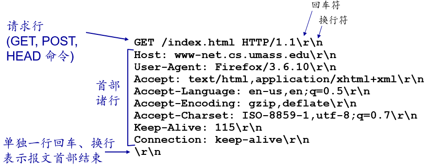
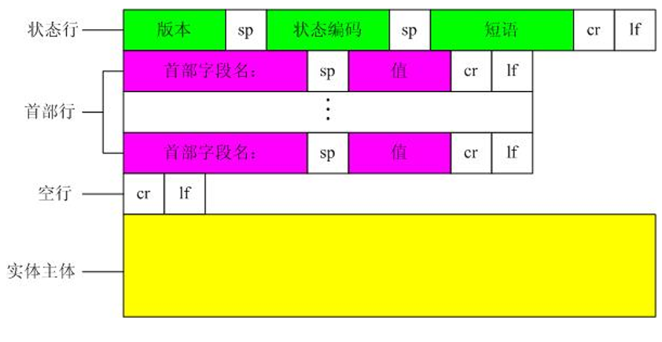
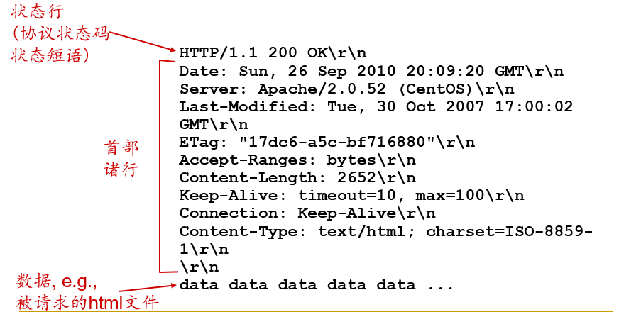
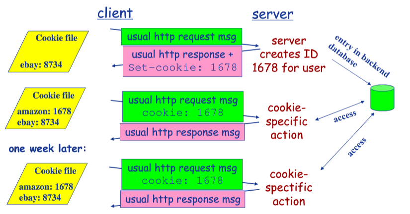
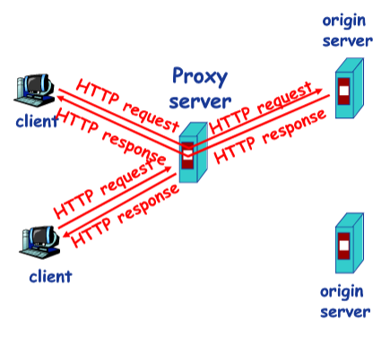
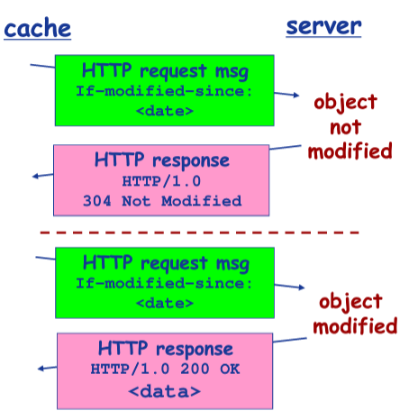

# WEB和HTTP
## 1 HTTP概况

### 概述

* Web的应用层协议是超文本传输协议（HTTP），它是 Web 的核心。
* HTTP 由两个程序实现：一个客户程序和一个服务器程序。客户程序和服务器程序运行在不同的端系统中，通过交换 HTTP 报文进行会话。
* URL地址由两部分组成：存放对象的服务器主机名和对象的路径名
* HTTP使用TCP作为它的支撑运输协议。客户首先发起一个与服务器的 TCP 连接。一旦该连接建立，该浏览器和服务器进程就可以通过套接字接口访问 TCP。
* HTTP是一个无状态协议（stateless protocol）。服务器向客户发送被请求的文件，而不存储 任何该客户的状态信息。
* Web使用了客户-服务器应用程序体系结构。

### 主要特点

* 支持C/S（客户/服务器）模式
* 简单快速：客户向服务器请求服务时，只需传送请求方法和路径。请求方法常用的有GET、HEAD、POST，每种方法规定了客户与服务器联系的类型不同。由于HTTP协议简单，使得HTTP服务器的程序规模小，因而通信速度很快。
* 灵活：HTTP允许传输任意类型的数据对象。正在传输的类型由Content-Type加以标记。
* 无连接：无连接的含义是限制每次连接只处理一个请求。服务器处理完客户的请求，并收到客户应答后，即断开连接。采用这种方式可以节省传输时间。
* 无状态：HTTP协议是无状态协议，无状态是指协议对于事务处理没有记忆能力。缺少状态意味着如果后续处理需要前面的信息，则它必须重传，这样可能导致每次连接传送的数据量增大；而另一方面，在服务器不需要先前信息时它的应答速度比较快。

## 2 持续连接和非持续连接

### 采用非持续连接的HTTP

* 应用程序在采用非持续连接的情况下，客户的每个请求都要建立一个单独的TCP 连接
* 从客户请求HTML文件到客户收到文件为止所花费的时间为两个 RTT 加上服务器传输 HTML文件的时间

### 采用持续连接的 HTTP

* 服务器发送响应后保持该TCP 连接打开，经过一定时间间隔（超时）未被使用，HTTP服务器关闭该连接
* 为每一个请求的对象建立和维护一个全新的连接，需要分配TCP 缓冲区和保持 TCP 变量
* 每一个对象经受两倍 RTT 的交付时延，一个RTT用来创建TCP，另一个RTT用于请求和接受一个对象

## 3 HTTP报文格式
### 请求报文
```
POST /index.html HTTP/1.1
HOST: www.XXX.com
Connection:close
User-Agent: Mozilla/5.0(Windows NT 6.1;rv:15.0) Firefox/15.0
Username=admin&password=admin
```

### 请求报文格式


### 请求实例


### 响应报文
```
HTTP/1.1 200 OK
Connection: close
Date: Tue, 09 Aug 2011 15:44:04 GMT
Server: Apache/2.2.3 (CentOS)
Last-Modified: Tue, 09 Aug 2011 15:11:03 GMT
Content-Length: 6821
Content-Type: text/html

(data data data data data.....)
```

### 响应报文格式



### 响应实例



### 请求方法

|请求方式|	作用|
|-|-|
|GET	|请求获取Request-URI所标识的资源|
|POST	|在Request-URI所标识的资源后附加新的数据|
|HEAD	|请求获取由Request-URI所标识的资源的响应消息报头|
|PUT	|请求服务器存储一个资源，并用Request-URI作为其标识|
|DELETE	|请求服务器删除Request-URI所标识的资源|
|TRACE	|请求服务器会送收到的请求信息，主要用于测试和诊断|
|CONNECT	|HTTP 1.1协议中预留给能够将连接改为管道方式的代|理服务器
|OPTIONS	|请求查询服务器的性能，或者查询与资源相关的选项和需求|

### 状态码

|取值	|说明|
|-|-|
|100 ~ 199|	指示信息，收到请求，需要请求者继续执行操作|
|200 ~ 299|	请求成功，请求已被成功接收并处理|
|300 ~ 399|	重定向，要求完成请求必须进行更进一步的操作|
|400 ~ 499|	客户端错误，请求有语法错误或请求无法实现|
|500 ~ 599|	服务端错误，服务器不能实现合法的请求|

常见状态码：

* 200 OK：客户端请求成功。
* 400 Bad Request：客户端请求有语法错误，服务器无法理解。
* 401 Unauthorized：请求未经授权，这个状态码必须和WWW-Authenticate报头域一起使用。
* 403 Forbidden:服务器收到请求，但是拒绝提供服务。
* 500 Internal Server Error：服务器内部错误，无法完成请求。
* 503 Server Unavailable：服务器当前不能处理客户端的请求，一段时间后可能恢复正常。

### content-type

Content-Type 标头告诉客户端实际返回的内容的内容类型。

text格式
* text/html ： HTML格式
* text/plain ：纯文本格式
* text/xml ： XML格式

image
* image/gif ：gif图片格式
* image/jpeg ：jpg图片格式
* image/png：png图片格式

application
* application/xhtml+xml ：XHTML格式
* application/xml： XML数据格式
* application/atom+xml ：Atom XML聚合格式
* application/json： JSON数据格式
* application/pdf：pdf格式
* application/msword ： Word文档格式
* application/octet-stream ： 二进制流数据（如常见的文件下载）
## 4 cookie

HTTP 是无状态的，但是 Web 站点通常希望能够识别用户，为此，HTTP 使用了 cookie，它允许站点对用户进行跟踪。

### cookie技术组件：

* 在 HTTP 响应报文中的一个 cookie 首部行；
* 在 HTTP 请求报文中的一个 cookie 首部行；
* 在用户端系统中保留有一个 cookie 文件，并由用户的浏览器进行管理；
* 位于 Web 站点的一个后端数据库。

### cookie工作流程



## 5 web缓存Cache
### 原理
* Web缓存器也叫代理服务器，是能够代表 Web 服务器来满足 HTTP请求的网络实体。
* Web 服务器有自己的磁盘存储空间，并在存储空间中保存着最近存储过的对象的副本。
* 可以配置用户的浏览器，使得用户所有的 HTTP 请求首先指向 Web 缓存器。
* 客户与 Web 缓存器之间的速度通常比较快，所以可以提高访问的速度，降低时延。
* 客户通过Web缓存器请求对象，Web缓存器能够大大减少一个机构接入链接到因特网的通信量



### 条件get方法

条件get方法：解决缓存服务器和初始服务器中的数据一致性问题，即：缓存中有最新的数据，则不需要想初始服务器发送请求，否则在请求消息中声明自己所持有的旧版本的数据的日期。初始服务器对缓存服务器的数据进行判断，如果缓存中的数据是最新的，则响应消息中不包含对象。


