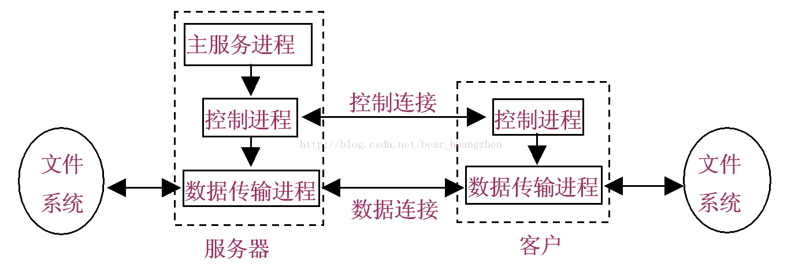
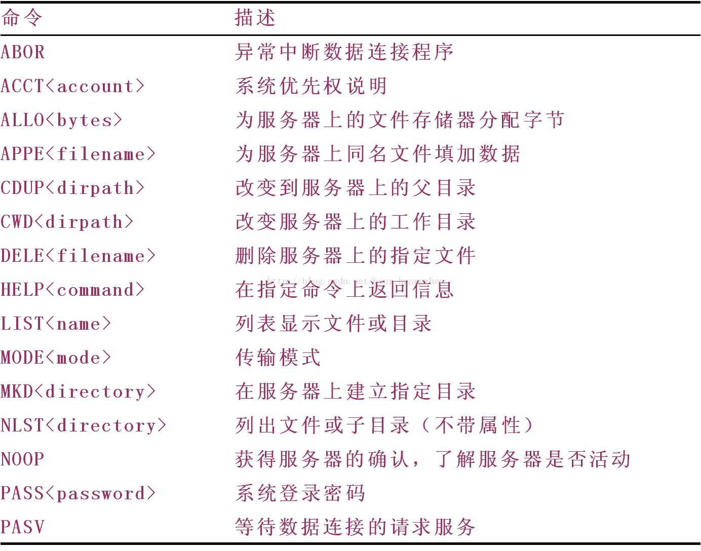
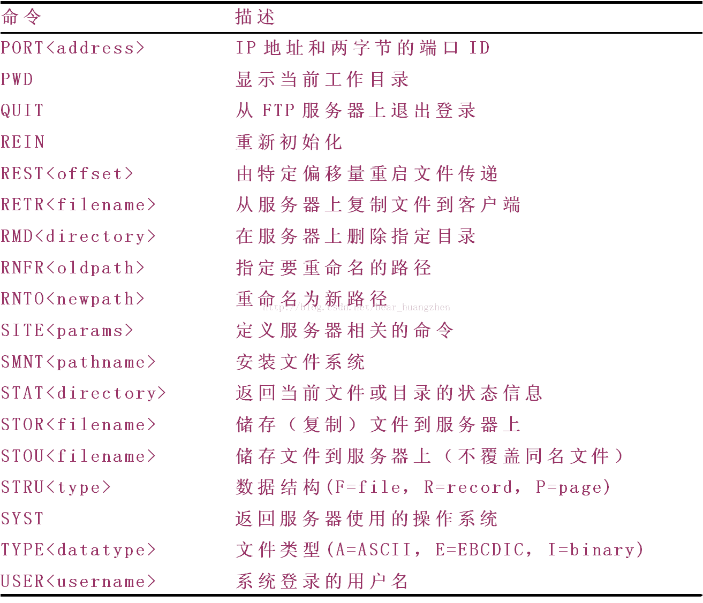
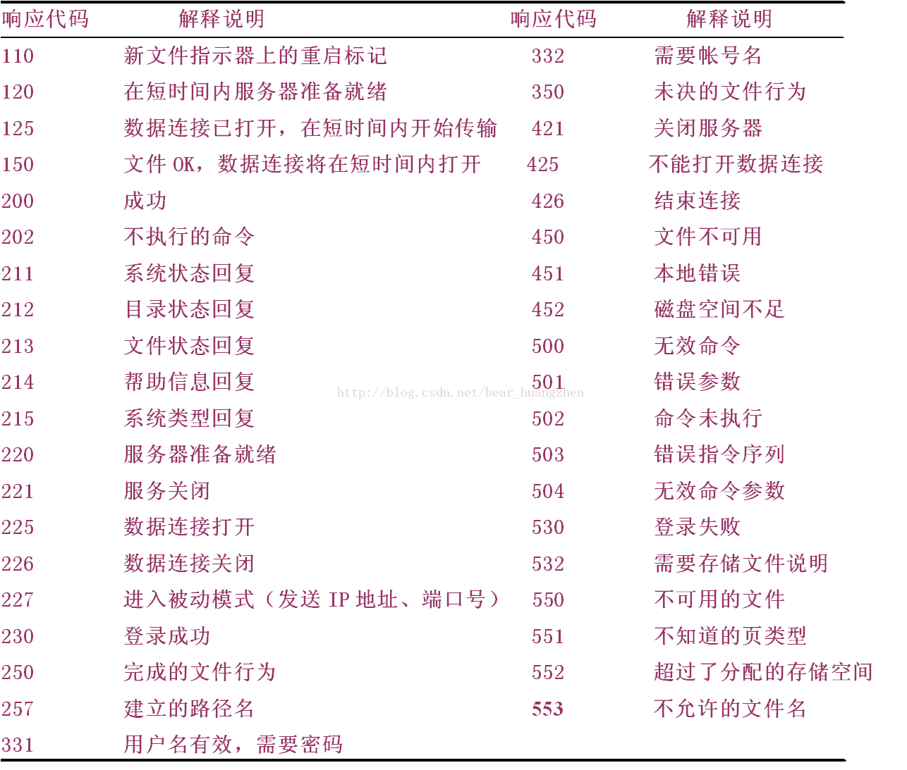

# FTP文件传输协议

> * [FTP协议讲解](https://blog.csdn.net/zhubao124/article/details/81662775)
> * [FTP文件传输协议](https://blog.csdn.net/andrewniu/article/details/81181696)

## 1 概述

### 工作方式
* 用户通过一个 FTP 客户进程建立一个到远程主机 FTP 服务器进程的 TCP 连接。
* 用户接着提供用户标识和口令，作为 FTP 命令的一部分在该 TCP 连接上传送
* FTP 使用了两个并行的 TCP 连接来传输文件，一个是控制连接，一个是数据连接。
* FTP 使用 2 个端口，一个数据端口和一个命令端口（也叫做控制端口）。这两个端口一般是21 （命令端口）和 20 （数据端口）。控制 Socket 用来传送命令，数据 Socket 是用于传送数据。每一个 FTP 命令发送之后，FTP 服务器都会返回一个字符串，其中包括一个响应代码和一些说明信息。其中的返回码主要是用于判断命令是否被成功执行了。
* 控制连接用于在两主机之间传输控制信息。数据连接用于实际发送一个文件。控制连接贯穿了整个用户会话期间，但是对会话的每一次文件传输都需要建立一个新的数据连接。
* FTP 服务器必须对整个会话期间保留用户的状态（state）
* 使用Telnet协议进行控制连接。

### 主要特征

1. 控制连接是建立在客户协议解释器和服务器协议解释器之间用于交换命令与应答的通信链路。

2. 数据连接是传输数据的全双工连接。传输数据可以发生在服务器数据传输过程DTP和客户DTP之间，也可以发生在两个服务器的DTP之间。

### 文件类型：

1. ASCII码文件类型（默认选择），以NVT ASCII码形式通过数据连接传输；

2. EBCDIC文件类型。该文本文件传输方式要求两端都是EBCDIC系统；

3. 图像文件类型（也成为二进制文件类型），数据发送形式呈现为一个连续的比特流。

### 数据结构

1. 文件结构（File Structure）字节流，无结构；

2. 记录结构（Record Structure）文件被划分为记录，用于文本文件；

3. 页结构（Page Structure）文件被划分为页，每页有页号和页头。可以进行随机存取或顺序存取。

### 传输方式

1. 流模式：数据以字节流的形式传送

2. 块模式：文件以块的形式传送，块带有自己的头部分。头字节包括16位计数域和8位描述子代码

3. 压缩模式：压缩模式中，因为数据是压缩过的，对于增加带宽有很多好处。

## 2 原理

### 主动模式 (PORT)

主动模式下，客户端随机打开一个大于 1024 的端口向服务器的命令端口 P，即 21 端口，发起连接，同时开放N +1 端口监听，并向服务器发出 “port N+1” 命令，由服务器从它自己的数据端口 (20) 主动连接到客户端指定的数据端口 (N+1)。

FTP 的客户端只是告诉服务器自己的端口号，让服务器来连接客户端指定的端口。对于客户端的防火墙来说，这是从外部到内部的连接，可能会被阻塞。

### 被动模式 (PASV)
为了解决服务器发起到客户的连接问题，有了另一种 FTP 连接方式，即被动方式。命令连接和数据连接都由客户端发起，这样就解决了从服务器到客户端的数据端口的连接被防火墙过滤的问题。

被动模式下，当开启一个 FTP 连接时，客户端打开两个任意的本地端口 (N > 1024 和 N+1) 。

第一个端口连接服务器的 21 端口，提交 PASV 命令。然后，服务器会开启一个任意的端口 (P > 1024 )，返回已经打开的端口，客户端收到命令后会请求连接数据端口，传输数据。

### 原理图

在开始的参考网站中给出了一个实现FTP的socket编程实例。非常详细地讲解了FTP的工作过程，日后如果需要可以学习。

## 3 FTP命令

FTP 每个命令都有 3 到 4 个字母组成，命令后面跟参数，用空格分开。每个命令都以 "\r\n"结束。

要下载或上传一个文件，首先要登入 FTP 服务器，然后发送命令，最后退出。这个过程中，主要用到的命令有 USER、PASS、SIZE、REST、CWD、RETR、PASV、PORT、QUIT。

* USER: 指定用户名。通常是控制连接后第一个发出的命令。“USER gaoleyi\r\n”： 用户名为gaoleyi 登录。

* PASS: 指定用户密码。该命令紧跟 USER 命令后。“PASS gaoleyi\r\n”：密码为 gaoleyi。

* SIZE: 从服务器上返回指定文件的大小。“SIZE file.txt\r\n”：如果 file.txt 文件存在，则返回该文件的大小。

* CWD: 改变工作目录。如：“CWD dirname\r\n”。

* PASV: 让服务器在数据端口监听，进入被动模式。如：“PASV\r\n”。

* PORT: 告诉 FTP 服务器客户端监听的端口号，让 FTP 服务器采用主动模式连接客户端。如：“PORT h1,h2,h3,h4,p1,p2”。

* RETR: 下载文件。“RETR file.txt \r\n”：下载文件 file.txt。

* STOR: 上传文件。“STOR file.txt\r\n”：上传文件 file.txt。

* REST: 该命令并不传送文件，而是略过指定点后的数据。此命令后应该跟其它要求文件传输的 FTP 命令。“REST 100\r\n”：重新指定文件传送的偏移量为 100 字节。

* QUIT: 关闭与服务器的连接。

## 4 FTP响应码

### 响应码说明
客户端发送 FTP 命令后，服务器返回响应码。

响应码用三位数字编码表示：
* 第一个数字给出了命令状态的一般性指示，比如响应成功、失败或不完整。

* 第二个数字是响应类型的分类，如 2 代表跟连接有关的响应，3 代表用户认证。

* 第三个数字提供了更加详细的信息。

### 响应码举例

第一个数字的含义如下：

1 表示服务器正确接收信息，还未处理。

2 表示服务器已经正确处理信息。

3 表示服务器正确接收信息，正在处理。

4 表示信息暂时错误。

5 表示信息永久错误。

第二个数字的含义如下：

0 表示语法。

1 表示系统状态和信息。

2 表示连接状态。

3 表示与用户认证有关的信息。

4 表示未定义。

5 表示与文件系统有关的信息。

### 响应码图
