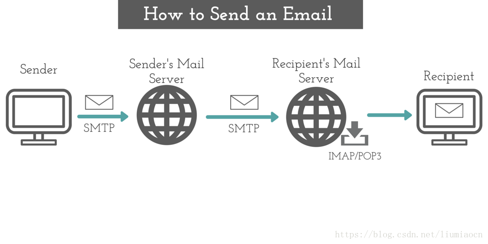
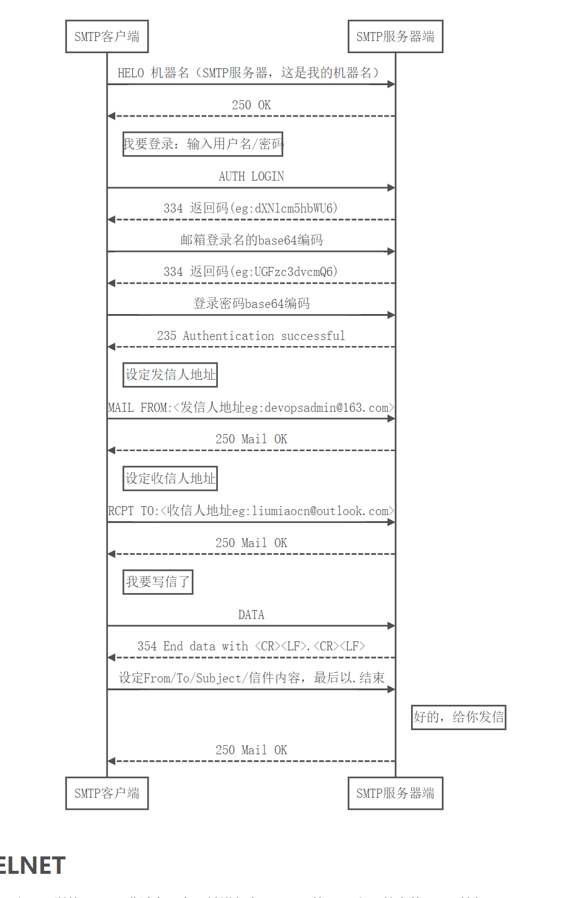
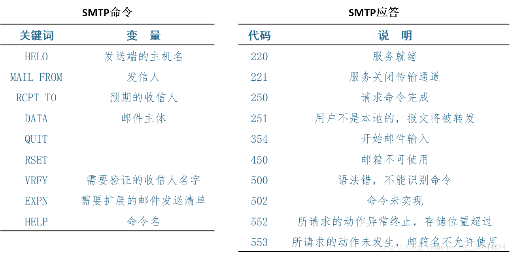

# 邮件协议

> * [协议基础：SMTP](https://blog.csdn.net/liumiaocn/article/details/81131420)
> * [SMTP协议介绍](https://blog.csdn.net/qq_36136497/article/details/82689878)

## 1 SMTP协议

### 概述
Simple Mail Transfer Protocol 简单邮件传输协议

SMTP 由两部分：运行在发送方邮件服务器的客户端和运行在接收方邮件服务器的服务器端。每台邮件服务器上既运行 SMTP 的客户端也运行 SMTP 的服务器端程序

SMTP 一般不使用中间服务器发送邮件。如若接收方的邮件服务器没开，TCP 连接报文会保留在发送方的邮件服务器上，等待新的尝试，如若长时间都失败，那么发送方服务器就会删掉该报文并以邮件的形式通知发送方

SMTP 限制所有的邮件报文只能采用简单的 7 比特 ASCII 表示。

### 与HTTP的对比

相同点：
* 都从一台主机向另一台主机传送文件，持续的 HTTP 和 SMTP 都是用持续连接

不同点：
* HTTP 是一个 拉协议，TCP 连接是由想要接收文件的机器发起的。SMTP 是一个 推协议，TCP 连接是由想要发送文件的机器发起的。
* SMTP 要求报文必须按照 7 比特 ASCII 码进行编码。HTTP 则没有这种限制。
* 在处理包含多种不同类型的文档时。HTTP把每个对象封装到它自己的不同的HTTP响应报文中，SMTP则把所有报文对象放在一个报文中.

### SMTP模型

### SMTP交互过程

连接建立

SMTP客户和SMTP服务器首先要建立TCP连接。
 
1. 从客户端使用熟知端口号25建立与服务器的TCP连接，SMTP服务器向该客户送回应答码220，并且还为客户端提供了服务器的域名
2. 客户端收到应答码后，发送HELO命令，启动客户端和服务器之间的SMTP会话。该客户端发送的HELO用来向服务器提供客户端的标识信息
3. 服务器端回应应答码250，通知客户端：请求建立邮件服务会话已经实现

报文发送

在SMTP客户与SMTP服务器之间的连接建立之后，发信的用户就可以与一个或多个收信人交换邮件报文了。
 
1. 客户用“MAIL ＦＲＯＭ”向服务器报告发信人的邮箱与域名
2. 服务器向客户回应应答码“250”，代表请求命令完成
3. 客户用“RCPT TO”命令向服务器报告收信人的邮箱与域名
4. 服务器向客户回应应答码“250”，代表请求命令完成
5. 客户用“DTAT”命令对报文的传送进行初始化
6. 服务器回应“354”，表示可以进行邮件输入了
7. 客户用连续的行向服务器传送报文的内容，每行以两字符的行结束标识（CR与LF）终止。报文以只有一个“.”的行结束
8. 服务器向客户回应应答码“250”，代表请求命令完成

连接终止

报文发送完毕后终止本次SMTP会话。
1. 客户端发送“QUIT”命令
2. 服务器收到命令后，回应应答码“221”，并结束会话

### SMTP命令和应答

### SMTP协议扩展MIME

MIME不属于一个邮件传输协议，它只是对SMTP的一个扩展，不能替代SMTP协议，至于为啥要替换SMTP了。主要是因为SMTP协议在传输报文时，只能够传输7位的ASCII格式的报文，不支持那些不使用7位ASCII格式的语种，同时它也不支持语音和视频数据的传输，因此我们需要一个辅助性协议帮忙传输报文，它就是MIME。

MIME协议定义了5种头部，用来加在原始的STMP头部，以便定义参数的转换。他们分别是：

 
1. MIME-Version：MIME版本
2. Content-Type：内容类型
3. Content-Tansfer-Encoding：内容传输编码
4. Content-ID：内容标识
5. Content-Description：内容描述

## 2 POP3协议

Post Office Protocol Version 3 第三版邮件传输协议

### 概述

负责将邮件从接收方的邮件服务器发送到接收方的用户代理

* 特许阶段： 用户代理发送（以明文形式）用户名和口令以鉴别用户
* 事务处理阶段：用户代理取回报文，同时可以删除报文标记，取消报文删除标记获取邮件的统计信息
* 更新阶段，客户发出 quit 命令。结束该 POP3 会话，邮件服务器删除标记为删除的报文

### 原理

1. 用户运行用户代理（如Foxmail, Outlook Express）。

2. 用户代理（以下简称客户端）与邮件服务器（以下简称服务器端）的110端口建立TCP连 接。

3.  客户端向服务器端发出各种命令，来请求各种服务（如查询邮箱信息，下载某封邮件等）。

4. 服务端解析用户的命令，做出相应动作并返回给客户端一个响应。

5. 3）和4)交替进行，直到接收完所有邮件转到步骤6)，或两者的连接被意外中断而直接退出。

6. 用户代理解析从服务器端获得的邮件，以适当地形式（如可读）的形式呈现给用户。

### POP3命令

|POP3命令格式	|说明|
|-|-|
|user<SP>username<CRLF>	  |    user 命令是POP3客户端程序与POP3邮件服务器建立连接后通常发送的第一条命令，参数 username 表示收件人的帐户名称。
|pass<SP>password<CRLF>	   |   pass 命令是在user命令成功通过后，POP3客户端程序接着发送的命令，它用于传递帐户的密码，参数 password 表示帐户的密码。
|apop<SP>name,digest<CRLF>	  |    apop 命令用于替代user和pass命令，它以MD5 数字摘要的形式向POP3邮件服务器提交帐户密码。
|stat<CRLF>	 |    stat 命令用于查询邮箱中的统计信息，例如：邮箱中的邮件数量和邮件占用的字节大小等。
|uidl<SP>msg#<CRLF>	|     uidl 命令用于查询某封邮件的唯一标志符，参数msg#表示邮件的序号，是一个从1开始编号的数字。
|list<SP>[MSG#]<CRLF>	|     list 命令用于列出邮箱中的邮件信息，参数 msg#是一个可选参数，表示邮件的序号。当不指定参数时，POP3服务器列出邮箱中所有的邮件信息；当指定参数msg#时，POP3服务器只返回序号对应的邮件信息。
|retr<SP>msg#<CRLF>	 |   retr 命令用于获取某封邮件的内容，参数 msg#表示邮件的序号。
|dele<SP>msg#<CRLF>	 |   dele 命令用于在某封邮件上设置删除标记，参数msg#表示邮件的序号。POP3服务器执行dele命令时，只是为邮件设置了删除标记，并没有真正把邮件删除掉，只有POP3客户端发出quit命令后，POP3服务器才会真正删除所有设置了删除标记的邮件。
|rest<CRLF>	   | rest 命令用于清除所有邮件的删除标记。
|top<SP>msg#<SP>n<CRLF>	|    top 命令用于获取某封邮件的邮件头和邮件体中的前n行内容，参数msg#表示邮件的序号，参数n表示要返回邮件的前几行内容。使用这条命令以提高 Web Mail系统（通过Web站点上收发邮件）中的邮件列表显示的处理效率，因为这种情况下不需要获取每封邮件的完整内容，而是仅仅需要获取每封邮件的邮件头信息。
|noop<CRLF>	 |   noop 命令用于检测POP3客户端与POP3服务器的连接情况。
|quit<CRLF>	  |  quit 命令表示要结束邮件接收过程，POP3服务器接收到此命令后，将删除所有设置了删除标记的邮件，并关闭与POP3客户端程序的网络连接。
## 3 IMAP协议

### 概述

* 把每个报文与一个文件夹联系起来
* 允许用户代理获取报文组件的命令
* IMAP 维护了 IMAP 会话的用户状态信息

### 主要功能

* IMAP具有摘要浏览功能，可以让用户在读完所有邮件的主题、发件人、大小等信息后，再由用户做出是否下载或直接在服务器上删除的决定。
* IMAP可以让用户有选择性地下载邮件附件。例如一封邮件包含3个附件，如果用户确定其中只有2个附件对自已有用，就可只下载这2个附件，而不必下载整封邮件，从而节省了下载时间。
* IMAP可以让用户在邮件服务器上创建自己的邮件夹，分类保存各个邮件。

### 工作原理

1. IMAP4协议适用于C/S构架中,IMAP4协议对于提供邮件访问服务且使用广泛的POP3协议的另一种选择，基本上两者都是规定个人计算机如何连 接到互联网上的邮件服务器进行收发邮件。IMAP4协议支持对服务器上的邮件进行扩展性操作，IMAP4也支持ASCII码明文传输密码。
2. 与POP3不同的是，IMAP4能支持离线和在线两种模式来传输数据，①在离线方式中，客户端程序会不间断的连接服务器下载未阅读过的邮件到本地磁盘，当客户端需要接受或者发送邮件时才会于服务器建立连接，这就是离线访问模式。POP3典型地以离线方式工作。②在 线模式中，一直都是由客户端程序来操作服务器上的邮件，不需要像离线模式那样把邮件下载到本地才能阅读，（即使用户把邮件下载到本地，服务器上也会存一份 副本，而不会像POP协议那样把邮件删除）。用户可以通过客户端程序或者Wed在线浏览邮件（IMAP4提供的浏览功能可以让你在阅读完所有的邮件到达时 间、主题、发件人、大小等信息，同时还可以享受选择性下载附件的服务）。一些POP3服务器也提供了在线功能，但是，它们没有达到IMAP4的浏览功能的 级别。
3. IMAP4是分布式存储邮件方式，本地磁盘上的邮件状态和服务器上的邮件状态，可能和以后再连接时不一样。此时，IMAP4的分布式存储机制解决了这 个问题。IMAP4邮件的客户端软件能够记录用户在本地的操作，当他们连上网络后会把这些操作传送给服务器。当用户离线的时候服务器端发生的事件，服务器 也会告诉客户端软件，比如有新邮件到达等，以保持服务器和客户端的同步。
4. IMAP4协议处理线程都处于4种处理状态的其中一种。大部分的IMAP4命令都只会在某种处理状态下才有效。如果IMAP4客户端软件企图在不恰当的状态下发送命令，则服务器将返回协议错误的失败信息，如BAD或NO等等。