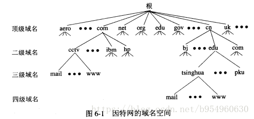
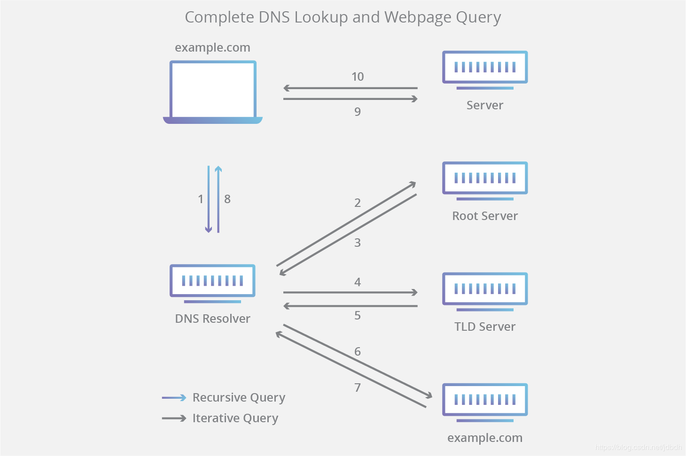
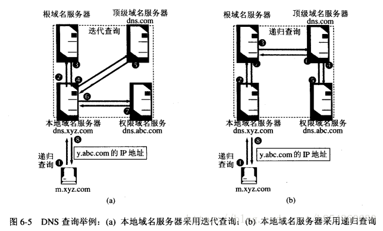

# DNS 域名解析

## 1 概述

Domain Name System 域名系统

### DNS功能
* DNS 提供从主机名到IP地址的目录服务。一个由分层的 DNS 服务器实现的分布式数据库。一个使得主机能够查询分布式数据库的应用层协议。
* DNS协议运行在UDP上，使用 53 端口。
* DNS通常是由其他应用层协议所使用的，包括 HTTP，SMTP 和 FTP，将用户的主机名解析为 IP 地址。
* DNS其他服务：主机别名，邮件服务器别名，负载分配

### 域名解析方式
主机名到IP地址的映射有两种方式：

1. 静态映射，每台设备上都配置主机到IP地址的映射，各设备独立维护自己的映射表，而且只供本设备使用；
2. 动态映射，建立一套域名解析系统（DNS），只在专门的DNS服务器上配置主机到IP地址的映射，网络上需要使用主机名通信的设备，首先需要到DNS服务器查询主机所对应的IP地址。

通过主机名，最终得到该主机名对应的IP地址的过程叫做域名解析。在解析域名时，可以首先采用静态域名解析的方法，如果静态域名解析不成功，再采用动态域名解析的方法。可以将一些常用的域名放入静态域名解析表中，这样可以大大提高域名解析效率。

### DNS服务器

域名服务器从高到低分为四类

* 根域名服务器(root name server)：最高层次,同时也是最重要的域名服务器。任何一个根域名服务器都知道所有的顶级域名服务器的域名和IP地址。  
本地域名服务器将 域名转换为IP地址 的过程中，只要自己无法转换，就要首先求助于根域名服务器。假定所有的根域名服务器都挂了，那么整个互联网中的DNS系统就都挂了。  
根域名服务器并不直接把待查询的域名直接转换成IP地址(根域名服务器也没有这种信息)，而是告诉本地域名服务器下一步应当找哪一个顶级域名服务器进行查询。

* 顶级域名服务器(TLD服务器)：负责管理在该顶级域名服务器注册的所有二级域名。当收到DNS查询请求时，就给出相应的回答(可能是最后结果，也可能是下一步应当找的域名服务器的IP地址)。
* 权限域名服务器：从理论上讲，可以让每一级的域名都有一个相对应的域名服务器，使所有的域名服务器构成和 图6-1 相对应的“域名服务器树”的结构，但这样做会使域名服务器数量太多，使其运行效率降低，因此DNS采用划分区的方法来解决这个问题。  
一个服务器所负责管辖的（或有权限的）范围叫做区。各单位根据自己情况来划分区的范围，每个区设置相应的 权限域名服务器，用来保存该区中所有主机的域名到IP地址的映射。
* 本地域名服务器(local name server)：当一个主机发出DNS查询请求时，这个查询请求报文就发给本地域名服务器。每个互联网提供商ISP，或一个大学，甚至一个大学里的系，都可以拥有本地域名服务器。本地域名服务器离用户较近，一般不超过几个路由器的距离。当所要查询的主机也属于同一个本地ISP时，该本地域名服务器立即就能将所查询的主机名转换为IP地址，而不需要再访问其他域名服务器。

### DNS记录

DNS常用的资源记录类型
* A：地址 此记录列出特定主机名的 IP 地址。这是名称解析的重要记录。
* CNAME：标准名称 此记录指定标准主机名的别名。
* MX：邮件交换器此记录列出了负责接收发到域中的电子邮件的主机。
* NS：名称服务器此记录指定负责给定区域的名称服务器。
* SOA record:Stores admin information about a domain. Learn more about the SOA record.
* SRV record:Specifies a port for specific services. Learn more about the SRV record.
* PTR record:Provides a domain name in reverse-lookups. Learn more about the PTR record.

## 2 DNS解析过程

递归查询与迭代查询：

* 主机向本地域名服务器的查询一般都是采用递归查询(recursive query)。如果主机所询问的本地域名服务器不知道被查询域名的IP地址时，本地域名服务器就以DNS客户的身份向其他根域名服务器继续发送查询请求报文(即替该主机继续查询)，而不是让该主机自己进行下一步的查询。
* 本地域名服务器向根域名服务器的查询通常是采用迭代查询(iterative query)。当根域名服务器收到本地域名服务器发出的迭代查询请求报文时，要么给出所要查询的IP地址，要么告诉本地域名服务器下一步应当向哪一个域名服务器进行查询，然后让本地域名服务器进行后续的查询。逐步按照域树的路径向下走直到叶节点，得到了所要解析的域名的IP地址，然后把这个结果返回给发起查询的主机。当然本地域名服务器也可以采用递归查询，这取决于最初的查询请求报文的设置是要使用哪一种查询方式。

## 3 DNS缓存

### 缓存的作用
为了提高DNS查询效率，并减轻服务器的负荷和减少因特网上的DNS查询报文数量，在域名服务器中广泛使用了高速缓存，用来存放最近查询过的域名以及从何处获得域名映射信息的记录。
例如，在上面的查询过程中，如果在m.xyz.com的主机上不久前已经有用户查询过y.abc.com的IP地址，那么本地域名服务器就不必向根域名服务器重新查询y.abc.com的IP地址，而是直接把高速缓存中存放的上次查询结果返回(即y.abc.com的IP地址)给用户。
假定本地域名服务器的缓存中并没有y.abc.com的IP地址，而是存放着顶级域名服务器dns.com的IP地址，那么本地域名服务器也可以不向根域名服务器进行查询，而是直接向com顶级域名服务器 发送查询请求报文。这样能大大减轻根域名服务器的负荷。

由于名字到地址的绑定并不经常改变，为保持告诉缓存中的内容正确，域名服务器应为每项内容设置计时器并删除超过合理时间的项(例如每个项目两天)。当域名服务器已从缓存中删去某项信息后又被请求查询该项信息，就必须重新到授权管理该项的域名服务器绑定信息。当权限服务器回答一个查询请求时，在响应中都指明绑定有效存在的时间值。增加此时间值可减少网络开销，而减少此时间值可提高域名解析的正确性。

不仅在本地域名服务器中需要高速缓存，在主机中也需要。许多主机在启动时从本地服务器下载名字和地址的全部数据库，维护存放自己最近使用的域名的高速缓存，并且只在从缓存中找不到名字时才使用域名服务器。维护本地域名服务器数据库的主机应当定期地检查域名服务器以获取新的映射信息，而且主机必须从缓存中删除无效的项。由于域名改动并不频繁，大多数网点不需花精力就能维护数据库的一致性。

### 使用缓存的解析过程

如果还用上面的例子，且加上主机中的缓存，客户端在浏览器的URL中输入y.abc.com，即想要解析获取y.abc.com的IP地址。会发生一下动作：

（1）浏览器 会首先搜索浏览器自身的DNS缓存（缓存时间比较短，大概只有1分钟，且只能容纳1000条缓存），看自身的缓存中是否有y.abc.com 对应的条目，而且没有过期，如果有且没有过期则解析到此结束。
（2）如果浏览器自身的缓存里面没有找到对应的条目，那么浏览器会搜索操作系统自身的DNS缓存,如果找到且没有过期则停止搜索解析到此结束。
（3）如果在操作系统（eg:Windows系统）的DNS缓存中也没有找到，那么尝试读取hosts文件（位于C:\Windows\System32\drivers\etc），看看这里面有没有该域名对应的IP地址，如果有则解析成功。
（4）如果在hosts文件中也没有找到对应的条目，浏览器就会发起一个DNS的系统调用，就会向 本地域名服务器 发起域名解析请求
（5）之后的操作就一样了，同上···· 即：上面 本地域名服务器 递归查询或迭代查询 的过程。

## 4 DNS安全性
* DDoS（分布式拒绝服务）带宽泛洪攻击：向处理如.com域的域名服务器发送大量DNS请求，使得大部分合法请求无法获得响应

* DNS毒害（污染）：给你返回假的或不能用的IP地址。比如中国的『墙』。所以如果你能拿到google的当前IP地址（百度搜的到），手动在hosts里配置，是可以做到直接访问谷歌服务器的。说到翻墙，一般大家都是用某种方法配置一台海外服务器当做中转（国家一般不墙这种个人服务器），来访问墙外服务器的，比如shadowsocks，shadowrocket之类的软件可以用来配置中转服务器。

* DNS反射攻击：请求中冒充目标主机源地址，大量请求DNS服务器，DNS就大量向源地址主机发送回答，淹没目标主机。