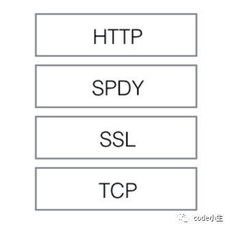
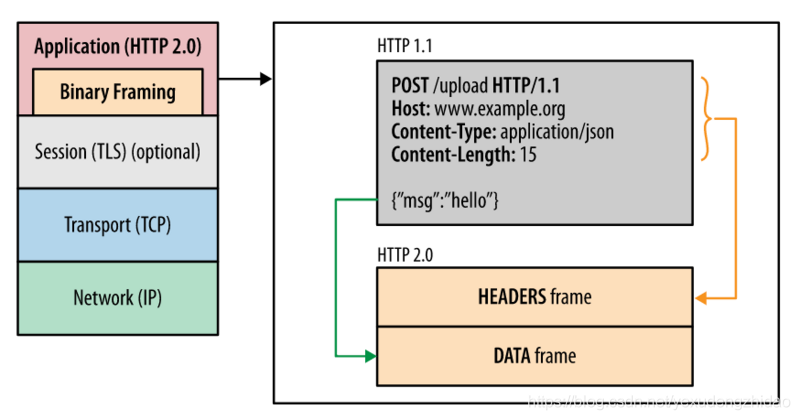
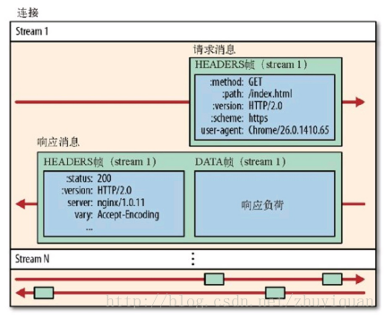
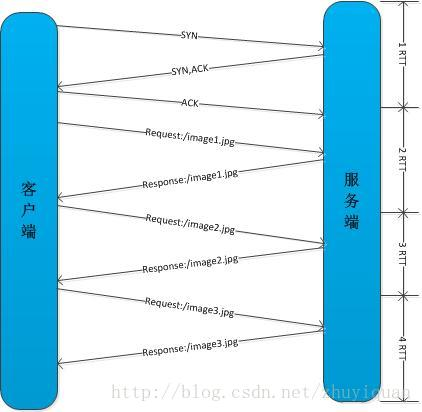
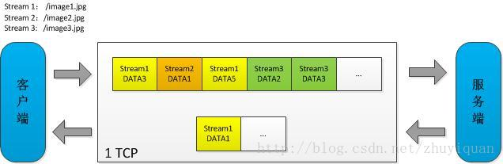
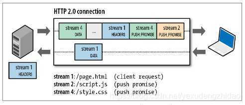
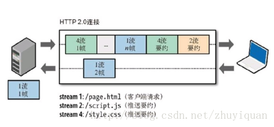

## 0 概述

HTTP 2.0是在SPDY（An experimental protocol for a faster web, The Chromium Projects）基础上形成的下一代互联网通信协议。HTTP/2 的目的是通过支持请求与响应的多路复用来较少延迟，通过压缩HTTPS首部字段将协议开销降低，同时增加请求优先级和服务器端推送的支持。


2012年google如一声惊雷提出了SPDY的方案，优化了HTTP1.X的请求延迟，解决了HTTP1.X的安全性，具体如下：

1. 降低延迟，针对HTTP高延迟的问题，SPDY优雅的采取了多路复用（multiplexing）。多路复用通过多个请求stream共享一个tcp连接的方式，解决了HOL blocking的问题，降低了延迟同时提高了带宽的利用率。
2. 请求优先级（request prioritization）。多路复用带来一个新的问题是，在连接共享的基础之上有可能会导致关键请求被阻塞。SPDY允许给每个request设置优先级，这样重要的请求就会优先得到响应。比如浏览器加载首页，首页的html内容应该优先展示，之后才是各种静态资源文件，脚本文件等加载，这样可以保证用户能第一时间看到网页内容。
3. header压缩。前面提到HTTP1.x的header很多时候都是重复多余的。选择合适的压缩算法可以减小包的大小和数量。
4. 基于HTTPS的加密协议传输，大大提高了传输数据的可靠性。
5. 服务端推送（server push），采用了SPDY的网页，例如我的网页有一个sytle.css的请求，在客户端收到sytle.css数据的同时，服务端会将sytle.js的文件推送给客户端，当客户端再次尝试获取sytle.js时就可以直接从缓存中获取到，不用再发请求了。SPDY构成图：



SPDY位于HTTP之下，TCP和SSL之上，这样可以轻松兼容老版本的HTTP协议(将HTTP1.x的内容封装成一种新的frame格式)，同时可以使用已有的SSL功能。


## 1 首部压缩

HTTP每次通讯（请求或响应）都会携带首部信息用于描述资源属性。

在HTTP1.0中，我们使用文本的形式传输header，在header中携带cookie的话，每次都需要重复传输几百到几千的字节，这着实是一笔不小的开销。

在HTTP2.0中，我们使用了HPACK（HTTP2头部压缩算法）压缩格式对传输的header进行编码，减少了header的大小。并在两端维护了索引表，用于记录出现过的header，后面在传输过程中就可以传输已经记录过的header的键名，对端收到数据后就可以通过键名找到对应的值。


## 2 二进制分帧
在不改变HTTP1.x的语义、方法、状态码、URL以及首部字段的情况下，HTTP2.0是怎样突破HTTP1.1的性能限制，改进传输性能，实现低延迟高吞吐量的呢？关键之一就是在应用层（HTTP）和传输层（TCP）之间增加一个二进制分帧层。

在整理二进制分帧及其作用的时候我们先来铺垫一点关于帧的知识：

* 帧：HTTP2.0通信的最小单位，所有帧都共享一个8字节的首部，其中包含帧的长度、类型、标志、还有一个保留位，并且至少有标识出当前帧所属的流的标识符，帧承载着特定类型的数据，如HTTP首部、负荷、等等。
* 消息：比帧大的通讯单位，是指逻辑上的HTTP消息，比如请求、响应等。由一个或多个帧组成
* 流：比消息大的通讯单位。是TCP连接中的一个虚拟通道，可以承载双向的消息。每个流都有一个唯一的整数标识符。所有HTTP 2. 0 通信都在一个TCP连接上完成，这个连接可以承载任意数量的双向数据流Stream。相应地， 每个数据流以 消息的形式发送， 而消息由一或多个帧组成， 这些帧可以乱序发送，然后根据每个帧首部的流标识符重新组装。

HTTP2.0中所有加强性能的核心是二进制传输，在HTTP1.x中，我们是通过文本的方式传输数据。基于文本的方式传输数据存在很多缺陷，文本的表现形式有多样性，因此要做到健壮性考虑的场景必然有很多，但是二进制则不同，只有0和1的组合，因此选择了二进制传输，实现方便且健壮。
在HTTP2.0中引入了新的编码机制，所有传输的数据都会被分割，并采用二进制格式编码。




二进制分帧层保留了HTTP的语义不受影响，包括首部、方法等，在应用层来看，和HTTP 1.x没有差别。同时，所有同主机的通信能够在一个TCP连接上完成。

## 3 多路复用共享连接

基于二进制分帧层，HTTP 2.0可以在共享TCP连接的基础上，同时发送请求和响应。HTTP消息被分解为独立的帧，而不破坏消息本身的语义，交错发送出去，最后在另一端根据流ID和首部将它们重新组合起来。 

### http1.x
我们来对比下HTTP 1.x和HTTP 2.0，假设不考虑1.x的pipeline机制，双方四层都是一个TCP连接。客户端向服务发起三个图请求/image1.jpg，/image2.jpg，/image3.jpg。 HTTP 1.x发起请求是串行的，image1返回后才能再发起image2，image2返回后才能再发起image3。



### http2.0


HTTP 2.0建立一条TCP连接后，并行传输着3个数据流，客户端向服务端乱序发送stream1~3的一系列的DATA帧，与此同时，服务端已经在返回stream 1的DATA帧 。



性能对比，高下立见。HTTP 2.0成功解决了HTTP 1.x的队首阻塞问题（TCP层的阻塞仍无法解决），同时，也不需要通过pipeline机制多条TCP连接来实现并行请求与响应。减少了TCP连接数对服务器性能也有很大的提升。


## 4 服务器推送

HTTP2.0新增的一个强大的新功能，就是服务器可以对一个客户端请求发送多个响应。服务器向客户端推送资源无需客户端明确的请求。

服务端根据客户端的请求，提前返回多个响应，推送额外的资源给客户端。如下图，客户端请求stream 1(/page.html)。服务端在返回stream 1的消息的同时推送了stream 2(/script.js)和stream 4(/style.css)



服务端推送是一种在客户端请求之前发送数据的机制。在HTTP2.0中，服务器可以对一个客户端的请求发送多个响应。如果一个请求是由你的主页发送的，服务器可能会响应主页内容、logo以及样式表，因为他知道客户端会用到这些东西。这样不但减轻了数据传送冗余步骤，也加快了页面响应的速度，提高了用户体验。

推送的缺点：所有推送的资源都必须遵守同源策略。换句话说，服务器不能随便将第三方资源推送给客户端，而必须是经过双方的确认才行。




PUSH_PROMISE帧是服务端向客户端有意推送资源的信号。

如果客户端不需要服务端Push，可在SETTINGS帧中设定服务端流的值为0，禁用此功能
PUSH_PROMISE帧中只包含预推送资源的首部。如果客户端对PUSH_PROMISE帧没有意见，服务端在PUSH_PROMISE帧后发送响应的DATA帧开始推送资源。如果客户端已经缓存该资源，不需要再推送，可以选择拒绝PUSH_PROMISE帧。
PUSH_PROMISE必须遵循请求-响应原则，只能借着对请求的响应推送资源。 目前，Apache的mod_http2能够开启 H2Push on服务端推送Push。Nginx的ngx_http_v2_module还不支持服务端Push。

```
Apache mod_headers example
<Location /index.html>
    Header add Link "</css/site.css>;rel=preload"
    Header add Link "</images/logo.jpg>;rel=preload"
</Location>
```
## 5 请求优先级

把HTTP消息分为很多独立帧之后，就可以通过优化这些帧的交错和传输顺序进一步优化性能。


流可以带有一个31bit的优先级：

* 0：表示最高优先级
* 231-1：表示最低优先级

客户端明确指定优先级，服务端可以根据这个优先级作为依据交互数据，比如客户端优先级设置为.css>.js>.jpg（具体可参见《高性能网站建设指南》）， 服务端按优先级返回结果有利于高效利用底层连接，提高用户体验。