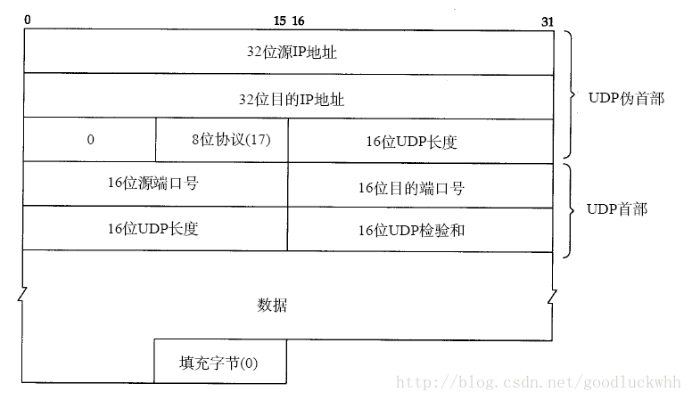

# UDP

## 1 概述
UDP是一个简单的面向数据报的传输层协议：进程的每个输出操作都正好产生一个UDP数据报，并组装成一份待发送的IP数据报。因此如果应用程序使用UDP来实现，则应用程序几乎是直接与IP打交道，UDP只在网络层之上提供了非常有限的服务：进程间数据交付和差错检测。

## 2 UDP的多路复用和多路分解

### 原理
传输层通过socket来提供多路分解和多路复用，并且：
* 每个socket都由唯一的一个标识符
* 每个报文段由特殊的字段来指示该报文段所要交付的套接字，源端口号和目的端口号就是这种目的的特殊字段

端口号是16比特的数字，其大小在0到65536之间。0到1023之间的端口号是知名端口号，其使用是受限制的（指的是不能随意使用）。

### 过程
1. 主机上的进程创建一个socket，并为之申请一个端口号，假设主机host1上进程A创建了一个socket并申请到端口号10000，主机host2上的进程B创建了一个socket并申请到端口号20000
2. 主机host1上的进程A想和主机host2上的进程B通信，因而它从其与之关联的socket中发送一个数据报，并将源端口设置为10000，目的端口设置为20000，然后将数据报提交给网络层由网络层发送给主机B。
3. 主机B的网络层收到报文后，将传输层数据提交给传输层，之后传输层根据报文信息查找对应的socket（最简单的查找是根据报文的目地地址和端口号进行查找），然后就通过找到的socket将数据体积高给了进程B。

具有相同的目的IP和目的端口，那么它们就将通过相同的socket被提交给相同的进程。

## 3 UDP的数据报格式

### UDP数据报格式

* 端口号用于标识发送进程和接收进程。
* UDP长度字段指的是UDP首部和UDP数据的字节长度。
* UDP检验和覆盖UDP首部和UDP数据。

### UDP校验过程
UDP设置伪首部，用来完成校验过程：
  * 首先，UDP数据报的长度可以为奇数字节，但是检验和算法是把若干个16bit字相加。解决方法是必要时在最后增加填充字节0，这只是为了检验和的计算（可能增加的填充字节不被传送）。
  * 其次，UDP数据报包含一个12字节长的伪首部，它是为了计算检验和而设置的。伪首部包含IP首部一些字段。其目的是让UDP两次检查数据是否已经正确到达目的地。UDP数据报中的伪首部格式如图所示：
  
  * UDP检验和是一个端到端的检验和。它由发送端计算，然后由接收端验证。其目的是为了发现UDP首部和数据在发送端到接收端之间发生的任何改动。这就是UDP所提供的差错检测服务，也是UDP提供的两个服务之一。

