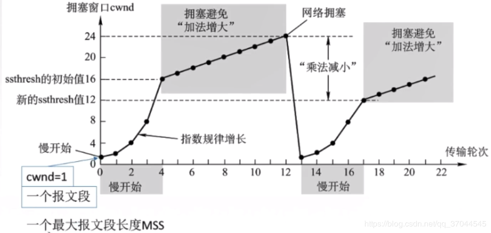
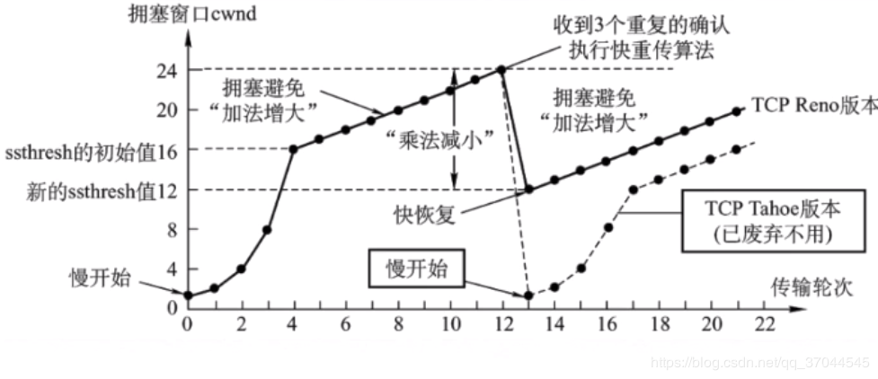

# 拥塞控制
> 参考文献
> * [TCP协议](https://blog.csdn.net/qq_37044545/article/details/89325768)
## 1 概述
当网络拥塞时数据报不能及时被转，在分组转发网络中，数据报就会被排队，甚至出现丢包因此说网络拥塞会带来网络开销：
* 引入大的排队时延
* 当数据报被丢失时发送方必须重传，因此引入了重传开销
* 当数据报被丢失时，丢失路由器的上游路由器做的工作都变成了无用功

因此必须采取技术来尽可能避免拥塞。由于IP层不提供网络是否拥塞的信息，因而TCP必须自己来判断网络是否出现了拥塞。

TCP将丢包（可能是超时也可能是收到了三个冗余的ACK）看做是网络拥塞的线索，将RTT增加看做是网络拥塞程度加重的线索。

TCP让连接双方根据自己所判断的网络拥塞的程度来限制其发往网络的流量。TCP在连接的每一端都增加了一个变量cong_win，它表示拥塞窗口，用于限制一端可以向网络发送的数据。TCP连接的每一端都保证它所已经发送的未被确认的报文段的总大小不会超过拥塞窗口和对方通告的窗口大小中的较小的那一个。

TCP通过ACK到达的情况（即是否到达，到达的速率）来调整拥塞窗口的大小。

### 主要技术

* 慢启动
* 拥塞避免
* 快重传
* 快恢复

## 2 慢启动
在建立TCP连接时，拥塞窗口被初始化为 min (4*SMSS, max (2*SMSS, 4380 bytes)) 。但是TCP不是以线性的方式增大拥塞窗口，而是以指数的方式增加的，即：
* 初始设置cwnd=1个 min (4*SMSS, max (2*SMSS, 4380 bytes)) ，发送一个报文，在RFC5861中有更新，但是总体就是一个较小的值（SMSS：SENDER MAXIMUM SEGMENT SIZE : The SMSS is the size of the largest segment that the sender can transmit）。(对于SCTP，cwnd初始值为min(4*MTU)。
* 收到对该报文的ack，则cwnd被设置为2个MSS，可以发送两个报文
* 收到对2个报文的确认后，cwnd更新为4个MSS，可以发送四个报文，一依次类推。

该过程会一直持续直到遇到一个丢包事件为止（或者等于ssthresh时，ssthresh事实上是用于区分是进行的拥塞避免还是慢启动，初始化时它被设置为65536），事实上该算法相当于每收到对一个MSS的确认就将cwnd增大一个MSS（cwnd决定了当前可以发送cwnd/MSS个报文，当这个cwnd/MSS个报文段都被确认后，就将cwdn增大了cwnd/MSS × MSS即cwnd）。发送方取拥塞窗口与对端通告窗口中的最小值作为发送上限。由于初始的拥塞窗口很小的值，因为该启动方式被称为慢启动。

但是对于SCTP，它只有在满足三个条件时才增大cwnd，min(上次发送的所有数据的大小，MTU)：
* cwnd已经被用完
* 累积确认被更新了
* 当前不处于快速恢复模式

## 3 拥塞避免（加性增，乘性减）

当遇到一个丢包事件时，TCP会将其拥塞窗口降低为原来值的一半，同时将ssthresh设置为 max (FlightSize / 2, 2*SMSS) （FlightSize：The amount of data that has been sent but not yet acknowledged.）（对于SCTP为：max(cwnd/2, 4*MTU），总体而言，SCTP和TCP的拥塞控制、避免算法是一致的，用MTU替换掉MSS即可。另外SCTP只在有大于等于cwnd的数据正在被发送时（onflight）才更新cwnd) 。其目的是通过降低发送速率来缓解、避免拥塞。但是拥塞窗口大小至少为1个MMS。

在非启动期间，当TCP探测到没有拥塞时，即当连接的一端收到了对它已经发送但未被确认的报文段的确认时，它就会增大拥塞窗口，增大的方式是每收到一个ACK将拥塞窗口大小增大MSS×MSS/cwnd，因此在该算法下，经过一个RTT，cwnd最多增大一个MSS。

因此TCP的拥塞控制方式又称为加性增，乘性减。拥塞窗口的增加受惠的只是自己，而拥塞窗口减少受益的是大家，当出现拥塞时，通过乘性减虽然损害了自己，但是可以让更多的其它网络参与者受益，这也证实TCP拥塞控制中的公平性的核心所在。

## 4 快重传（超时处理）

虽然超时和收到三个冗余ACK（SCTP中不存在三个冗余ACK，对应的事件是三个SACK都不包含都某个报文段的确认，则认为该报文段丢失需要重传）都被认为是丢包事件，但是TCP在二者的处理上并不全相同。当收到三个冗余ACK时，TCP的处理就是“加性增，乘性减”。但是如果是超时事件，则TCP会更新ssthresh的值为max (FlightSize / 2, 2*SMSS)（对于SCTP，max(cwnd/2, 4*MTU)），然后进入“慢启动”过程，即将拥塞窗口设置为一个MSS，然后指数增加拥塞窗口大小。此时“慢启动”会持续到遇到一个丢包事件或者拥塞窗口被增大到了ssthresh，如果是增大到了ssthresh则进入“拥塞避免”的模式，即开始加性增。

因此对于丢包事件来说，只要发生了丢包，则ssthresh都会更新max (FlightSize / 2, 2*SMSS)（对于SCTP，max(cwnd/2, 4*MTU)）。如果是超时，cwnd被设置为一个MSS（对于SCTP，1个MTU ）；如果是冗余ACK，则cwnd被更新为更新后的ssthresh。随后cwnd的更新方式取决于它和ssthresh之间的大小关系，如果cwdn小于或等于ssthresh，则就是在执行慢启动，否则就是在执行拥塞避免。

对超时时间和三个冗余ACK处理方式上存在区别的原因在于，收到冗余ACK表明了网络时可以交付报文段的，是可用的，而超时则就是明确的丢包。而收到冗余ACK至少表明网络还是可用的，只是出现了丢包，事实上，在出现三个丢包的时候，采用的是快速恢复+快速重传+拥塞避免。

## 5 快速恢复

快速恢复一般和快速重传一起实现，其算法为：
* 当收到第3个重复的ACK时（对于SCTP，有三个SACK都不包含某个报文的确认时。具体规则：1.只有报文TSN小于当前SACK中新被确认的最大TSN的被丢失的报文的丢失计数才会增加，2.如果已经处于快速重传模式，并且当前的SACK会更新累积确认点，则所有丢失的报文的丢失计数都会增加（这一点将保证报文会被尽快快速重传，从而使得尽快退出快速重传模式）。），把ssthresh设置为max (FlightSize / 2, 2*SMSS)（对于SCTP，max(cwnd/2, 4*MTU)），把cwnd设置为ssthresh的值加3个SMSS（对于SCTP，不增加）。然后重传丢失的报文段。因为收到3个重复的ACK表明有三个报文已经离开网络到达了接收断，被且被接收端给接收了。（同时，对于SCTP，还会将当前已经发出的最大的报文序号（TSN）作为退出快速恢复的序列号）
* 收到另外的重复的ACK时，cwnd增加一个MSS。
* 当收到确认新数据包的ACK时，把cwnd设置为第一步中的ssthresh的值。此时就重新进入到了第一步丢包时本应进入的拥塞避免。（对于SCTP，如果收到的SACK的累积确认确认了步骤1中的退出快速恢复的序列号，则退出快速恢复）

快速恢复意在通过快速重传丢失的报文，使得接收端可以将累积确认的最后一个报文和乱序到达的报文之间的“间隙”填充起来，从而尽快进行新的确认。在这个过程中，每当接收断收到一个新的乱序的报文ACK时，发送端就将自己的cwnd增大一个MSS，使得发送端可以尽快填充接收端的“间隙”，直到累积确认的报文段之后有新的连续的报文段被接收端接收到了，这个时候接收端会更新一个新的ACK，发送端在收到该ACK后就退出快速恢复并进入拥塞避免。

需要注意的是无论是拥塞避免还是慢启动，SCTP规定，如果某个地址不用于发送数据，则每个RTO都要对cwnd做一次调整，调整后的值为max(cwnd/2, 4*MTU).