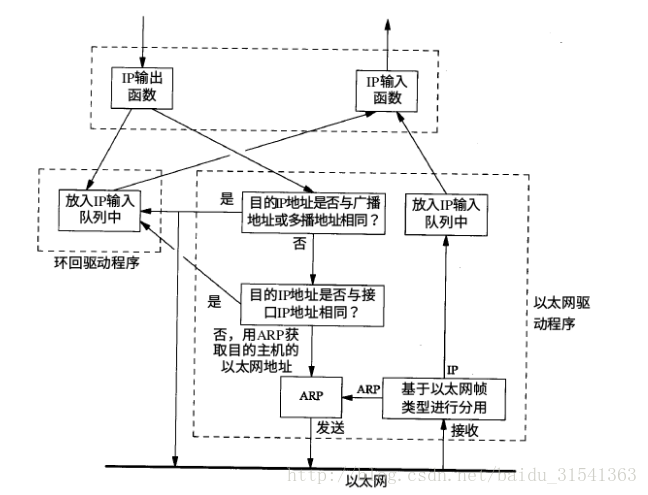

# 网络层-基本原理

## 1 基本功能

网络层建立在链路层之上，它的最主要的功能是使得网络中的各个主机之间可以互相通信。在因特网中，IP层是TCP/IP协议族中最为核心的协议，也是最复杂的层次之一。网络层的功能是要将分组从一个主机移动到另一个主机从而使得主机之间可以互相通信。为此需要网络层提供两种功能：

### 存储转发

路由器（三层交换机）将进入其某个输入链路的分组转发到其某个输出链路。它是将分组从一个输入链路移动到一个输出链路，是一个路由器的本地动作。

### 路由选择

在分组从一个主机流向另一个主机的过程中，网络层必须决定分组所走过的路径。计算这个路径信息的算法就是路由算法。它是一个网络范围的动作，决定分组从其源到目的应该走的路径

### 连接建立

在有些计算机网络中，连接建立也是网络层的重要功能。比如ATM，它要求从源到目的地沿着所选择的路径彼此握手，以便在源和目的之间建立起状态。

## 2 服务特点
* 确保服务：确保能最终到达目的地
* 时延上界：不仅确保交付，而且确保在时上界内交付
* 有序分组交付：确保分组按照它们被发送的顺序到达目的地
* 确保最小带宽：只要发送主机以低于特定比特率的速录传输，分组就不会丢失
* 确保最大时延抖动：发送方发送两个连续分组的时间间隔和接收方接收它们的时间间隔之间的差值在一定范围内
* 安全性服务：使用仅仅发送方和接收方所知晓的密钥通信。但是因特网的网络层提供的是无连接的不可靠的服务，尽力而为的服务，其含义是：
* 不可靠：IP层不保证IP数据报能成功到达目的地。如果需要保证可靠传输，则需要使用其它协议，比如TCP。
* 无连接：IP不维护任何关于后续数据报状态的信息，每个数据报的处理是相互独立的。因此两个IP之间的多个报文可能乱序到达，可能走不同的路径。


## 3 网络类型

### 虚电路

### 数据报网络

在因特网中，每当一个主机要发送一个分组时， 它就为该分组加上目的主机的地址，然后将该分组发送出去。
当分组在网络中向目的地传输时，它会经过一系列路由器。每个路由器都使用该分组的目的地址来转发给分组。每台路由器都由一个将目的地址映射到链路接口的转发表，每当分组到达时，路由器就利用分组的目的地址在转发表中查找一个合适的输出链路接口，然后路由器将分组从该输出链路接口发送出去。
在因特网中，路由器的转发表可以由选路算法或者管理员更新。由于转发表的修改可能发生在任意时刻，因而两个主机之间的分组在不同的时刻走的可能是不同的网络路径，并可能无序到达。

### 最长前缀匹配规则

网络前缀：是网络地址的前边某些连续比特。比如对于地址 11101111 11011110 1000000 00000001，其对应的8比特前缀为11101111 ， 16比特前缀为11101111 11011110
在该规则下，路由器的转发表中记录的是网络前缀和输出链路接口之间的对应关系。当查转发表时，仍然利用目的地址来进行匹配，但是可能会有很多歌匹配，这个时候取匹配到的比特数目最多的表象作为命中表项，并根据它来转发分组。


## 4 路由器构成（硬件）


路由器在网络层是一个极其重要的设备，每台路由器都由一张**路由转发表**。

路由器检查到达分组首部中的一个字段的值，然后利用该值在路由器的转发表中进行查询，以决定该如何转发该分组。

查询的结果是分组将被转发的路由器的链路接口。

### 输入端口

它接入输入的物理链路，和链路远端的数据链路层交互，并完成查找和转发功能，以使得输入分组能够进入到合适输出链路接口。对于控制分组，它则会进入选路处理器。

确定一个到达的分组经交换结构转发给哪个输出端口。输出端口的选择是取决于转发表中的信息，转发表是由选路处理器计算的，每个输入端口都会有一份转发表的影子拷贝，并且会被及时更新。被阻塞的分组需要在输入端口排队。


需要对转发表的组织和查询进行优化，常见的方式有：
* 以树形结构存储转发表，树的每一级对应目的地址中的一个比特，如果地址比特位0则搜索其左子树，否则搜索右子树。采用这种结构，N比特的目的地址可以在N步之内找到相应的转发表项。

* 内容可寻址内存CAM，CAM允许将一个IP地址交给CAM，由CAM在常数时间内返回该地址对应的转发表项的内容。

* 将最近访问的转发表保存在高速缓存。


### 交换结构


它将路由器的输入接口连接到它的输出接口。


在这种由纵横式交换机构成的互联网络中任意两个端口之间都有自己的专用总线，因而可以克服单一、共享式总线的带宽限制。使用这种网络时，往往把长度变化的IP分组分片成固定尺寸的信元，加上标签通过互联网络进行交换，这些信元在输出接口再被装配成初始分组。这种方式能够极大的简化并加快通过互联网络的分组交换。

### 输出端口

存储经过交换结构发送给它的分组，并将分组发送出去。


### 选路处理器

执行选路协议，维护选路信息和转发表。


## 5 排队
在输入端口和输出端口都可能出现排队。缓存大小设置的经验方法是：缓存量=平均往返时延*链路的容量。

### 分组调度

输出端口出现排队，分组调度：
* 先来先服务FCFS
* 加权公平队列


### 队列管理

主动队列管理算法AQM。

### HOL
如果交换结构不能快得使所有分组都能无时延的通过它传送，则在输入端口也将出现分组排队。输入队列按照FCFS工作
<<<<<<< HEAD


## 6 路由器环回接口

### Loopback接口简介（环回接口）

Loopback接口是虚拟接口，是一种纯软件性质的虚拟接口。任何送到该接口的网络数据报文都会被认为是送往设备自身的。大多数平台都支持使用这种接口来模拟真正的接口。这样做的好处是虚拟接口不会像物理接口那样因为各种因素的影响而导致接口被关闭。事实上，将Loopback接口和其他物理接口相比较，可以发现Loopback接口有以下几条优点：
1. Loopback接口状态永远是up的，即使没有配置地址。这是它的一个非常重要的特性。
2. Loopback接口可以配置地址，而且可以配置全1的掩码,可以节省宝贵的地址空间。
3. Loopback接口不能封装任何链路层协议。

对于目的地址不是loopback接口，下一跳接口是loopback口的报文，路由器会将其丢弃。对于CISCO路由器来说，可以配置[no] ip unreachable命令，来设置是[否]发送icmp不可达报文，对于VRP来说，没有这条命令，缺省不发送icmp不可达报文 。


### Loopback接口的应用
基于以上所述，决定了Loopback接口可以广泛应用在各个方面。其中最主要的应用就是：路由器使用loopback接口地址作为该路由器产生的所有IP包的源地址，这样使过滤通信量变得非常简单。

1. 在Router ID中的应用  

如果loopback接口存在、有IP地址，在路由协议中就会将其用作Router ID，这样比较稳定--loopback接口一直都是up的。
如果loopback接口不存在、或者没有IP地址，Router ID就是最高的IP地址，这样就比较危险--只要是物理地址就有可能down掉。

对于CISCO来说，Router ID是不能配置的，对于VRP来说，Router ID可以配置，那麽我们也可以将Loopback接口地址配成Router ID。
配置BGP。在IBGP配置中使用loopback接口，可以使会话一直进行，即使通往外部的接口关闭了也不会停止。配置举例：
```
interface loopback 0
ip address 215.17.1.34 255.255.255.255
router bgp 200
neighbor 215.17.1.35 remote-as 200
neighbor update-source loopback 0
```

2. 在远程访问中的应用  

使用telnet实现远程访问。配置telnet，使从该路由器始发的报文使用的源地址是loopback地址。配置命令如下：
```
ip telnet source-interface Loopback0
```
使用RCMD实现远程访问。
配置RCMD，使从该路由器始发的报文使用的源地址是loopback地址。配置命令如下：
```
ip rcmd source-interface Loopback0
```

3. 在安全方面的应用  

在TACACS+中的应用。配置TACACS+，使从该路由器始发的报文使用的源地址是loopback地址。配置命令如下：
```
ip tacacs source-interface Loopback0
tacacs-server host 215.17.1.1
```
可以通过过滤来保护TACACS+服务器--只允许从LOOPBACK地址访问TACACS+端口，从而使读/写日志变得简单，TACACS+日志纪录中只有loopback口的地址，而没有出接口的地址。


4. 在RADIUS用户验证中的应用  

配置RADIUS， 使从该路由器始发的报文使用的源地址是loopback地址。配置命令如下：
```
ip radius source-interface Loopback0
radius-server host 215.17.1.1
auth-port 1645 acct-port 1646
```
这样配置是从服务器的安全角度考虑的，可以通过过滤来保护 RADIUS服务器和代理--只允许从LOOPBACK地址访问RADIUS端口，从而使读/写日志变得简单，RADIUS日志纪录中只有loopback口的地址，而没有出接口的地址。


5. 在纪录信息方面的应用，输出网络流量纪录。  

配置网络流量输出，使从该路由器始发的报文使用的源地址是loopback地址。配置命令如下：
```
ip flow-export source Loopback0
Exporting NetFlow records Exporting NetFlow 
```

这样配置是从服务器的安全角度考虑的，可以通过过滤来保护 网络流量收集--只允许从LOOPBACK地址访问指定的流量端口。


6. 在日志信息方面的应用  

发送日志信息到Unix或者Windows SYSLOG 服务器。路由器发出的日志报文源地址是loopback接口，配置命令如下：
```
logging source-interface loopback0
```
这样配置是从服务器的安全角度考虑的，可以通过过滤来保护 SYSLOG服务器和代理--只允许从LOOPBACK地址访问syslog端口，从而使读/写日志变得简单，SYSLOG日志纪录中只有loopback口的地址作为源地址，而不是出接口的地址。


7. 在NTP中的应用  

用NTP（网络时间协议）使所有设备的时间取得同步，所有源于该路由器的NTP包都把Loopback地址作为源地址。配置如下：
```
ntp source loopback0
ntp server 169.223.1.1 source loopback 1
```
这样做是从NTP的安全角度着想，可以通过过滤来保护NTP系统--只允许从loopback地址来访问NTP端口。NTP将Loopback接口地址作为源地址，而不是出口地址。


8. 在SNMP中的应用  

如果使用SNMP（简单网络管理协议），发送traps时将loopback地址作为源地址。配置命令：
```
snmp-server trap-source Loopback0
snmp-server host 169.223.1.1 community
```
这样做是为了保障服务器的安全，可以通过过滤来保护SNMP的管理系统--只允许从Loopback接口来访问SNMP端口。从而使得读/写trap信息变得简单。SNMPtraps将loopback接口地址作为源地址，而不是出口地址。


9. 在Core Dumps中的应用  

如果系统崩溃，有Core dump特性的路由器能够将内存的映像上传到指定的FTP服务器。配置Core dumps使用loopback地址作为源地址。配置命令如下：
```
ip ftp source-interface loopback 0
exception protocol ftp
exception dump 169.223.32.1
```
这样的做的好处是保证了Core Dump FTP 服务器的安全，通过过滤能够保护用于core dumps的FTP服务器--只允许从loopback地址访问FTP端口。
这个FTP服务器必须是不可见的。


10. 在TFTP中的应用  

通过TFTP从TFTP服务器配置路由器，可以将路由器的配置保存在TFTP服务器，配置TFTP，将loopback地址作为源于该路由器的包的源地址。配置命令如下：
```
ip tftp source-interface Loopback0
```
这样做对TFTP服务器的安全是很有好处的：通过过滤来保护存储配置和IOS映像的TFTP服务器--只允许从loopback地址来访问TFTP端口，TFTP服务器必须是不可见的。


11. 在IP unnumbered中的应用  

应用IP Unnumbered在点到点链路上就不需要再配置地址了。配置举例：
```
interface loopback 0
ip address 215.17.3.1 255.255.255.255
interface Serial 5/0
ip unnumbered loopback 0
ip route 215.34.10.0 255.255.252.0 Serial 5/0
```

### 主机环回接口原理

环回接口（Loopback Interface），允许运行在同一台主机上的客户程序和服务器程序通过TCP/IP进行通信。A类网络号127就是为环回接口预留的。根据惯例，大多数系统把IP地址127.0.0.1分配给这个接口，并命名为localhost。一个传给环回接口的IP数据报不能在任何网络上出现。



1. 当网络层的IP输出函数发现目的地址为环回地址，则交给环回驱动程序，环回驱动程序把该IP数据包放入IP输入队列中。否则则交给以太网驱动程序。

2. 在太网网驱动程序中，如果发现目的地址为广播或多播地址，如果必要，会复制一份数据给环回驱动程序，然后送到以太网。

3. 如果发现目的地址与接口地址相同，也会交给环回驱动程序。

需要指出图中的关键点是：

1. 传给环回地址（一般是127.0.0.1 ）的任何数据均作为IP输入。

2. 传给广播地址或多播地址的数据报复制一份传给环回接口，然后送到以太网上。这是因为广播传送和多播传送的定义（第12章）包含主机本身。

3. 任何传给该主机IP地址的数据均送到环回接口。

看上去用传输层和IP层的方法来处理环回数据似乎效率不高，但它简化了设计，因为环回接口可以被看作是网络层下面的另一个链路层。网络层把一份数据报传送给环回接口，就像传给其他链路层一样，只不过环回接口把它返回到IP的输入队列中。

另一个隐含的意思是送给主机本身IP地址的IP数据报一般不出现在相应的网络上。例如，在一个以太网上，分组一般不被传出去然后读回来。某些BSD以太网的设备驱动程序的
