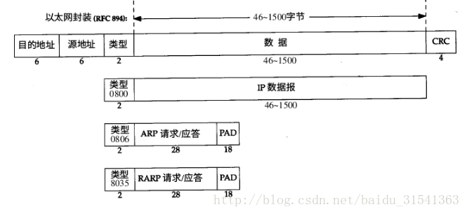
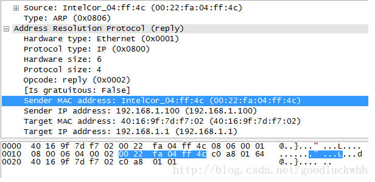

# 交换局域网

主要讲了使用交换机和以太网协议构建局域网

虚拟局域网跨越通过一个单一的物理局域网基础设施定义多个虚拟局域网。
## 1 链路层寻址（ARP）

### MAC地址

并不是主机或路由器具有链路层地址，而是它们的适配器（即网络接口）具有链路层地址。因此，具有多个网络接口的主机或路由器将具有与之相关联的多个链路层地址，就像他也具有多个与之相关联的IP地址一样。重要的是链路层交换机并不具有于它们的接口相关联的链路层地址。

链路层地址被称为MAC地址。MAC地址长度为6字节，有2的48次方可能的地址。通过软件改变一块适配器 的MAC地址现在是可能的。适配器的MAC地址具有扁平结构，而且不论适配器到哪里用都不会变化。带有以太网接口的便携机其总具有相同的MAC地址。

当适配器发送一个帧时，发送适配器会将目的适配器的MAC地址插入到该帧当中，并将该帧发送到局域网上。当适配器收到一个帧时，将检查该帧中的目的MAC地址和自己的MAC地址是否匹配。若匹配，则取出数据向上传递，否则丢弃该帧。

### 内网地址解析协议
当适配器要向某个目的适配器发送帧时，将目的适配器的MAC地址插入帧中，发到局域网上。然而如何进行IP地址与MAC地址的转换呢？ARP协议，即地址解析协议实现了这个功能。

先考虑在子网以内的情况。三台子网内的主机之间通过一个链路层交换机相连。假设主机A、B、C的IP分别为222.222.222.1，,222.222.222.2，222.222.222.3，A要向B发送数据报，则A不仅要提供B的IP地址，还要提供B的MAC地址，然后发送适配器将构造一个包含目的MAC地址的链路层帧并发送到局域网。发送主机A使用ARP协议获取B的MAC地址。每台主机或者路由器中具有一个ARP表，包含了IP地址到MAC地址的映射关系。如果在主机上的ARP表存在222.222.222.2→88-AB-CD-EF-AA-BB(假设),则ARP模块将返回88-AB-CD-EF-AA-BB给主机A写入帧中。然而如果ARP表中没有该项呢？发送方A将构造一个ARP分组，指示支配器应该用MAC广播地址（FF-FF-FF-FF-FF-FF）作为目的地址，该帧将被子网中所有其他适配器接收到，所有主机的ARP模块都检测自身的IP地址是否与ARP查询分组中的目的IP地址相符合，匹配到的主机B则构造一个ARP响应分组返回给主机A，其中含有对应的MAC地址。A则更新自身的ARP表。从这个过程我们也可以发现，ARP表是可以自动建立的，它不需要系统管理员来配置。

### 外网数据报

广播地址只针对子网内所有主机，如果目的适配器在子网以外呢？我们知道，每台主机仅有一个IP地址和一个MAC地址，路由器上有n个接口，所以有n个IP地址，n个ARP模块和n个适配器，每个适配器有自己的MAC地址。还是刚刚那个例子。假如主机A要像另外一个子网下的111.111.111.1/24主机D发送数据。IP地址我们根据DNS协议可以知道，那么MAC地址呢？为了发送数据到子网外，我们首先要将数据发送到网关路由器，因此最初的MAC地址应该是网关路由器接口的MAC地址。路由器通过查询转发表来向111.111.111.1/24子网的网关路由器转发，网关路由器得到数据报，因为已经跟D在同一个子网下，所以通过ARP协议得到目的地D的MAC地址并向其转发帧。这便是发送目的在子网外的情况。

## 2 以太网协议-帧

### 以太网帧格式

* 数据字段（46~1500字节）。承载了IP数据报。

* 目的地址（6字节） 目的适配器的MAC地址。

* 源地址（6字节）源适配器的MAC地址。

* 类型字段（2字节）适配器需要知道它应该将数据字段传递给哪个网络层协议，便是通过类型字段。类型字段标识了网络层协议。

* CRC（4字节）：循环冗余检测字段，检测是否引入了差错。

* 前同步码（8字节）。前7个字节都是10101010，最后一字节是10101011，该字段的作用是同步发送方与接收方的时钟，通常适配器不会以精确的额定速率传输帧，这时接收适配器只需要通过锁定前同步码的前7字节比特就能锁定时钟，第8个字节的最后两个比特都为1，警示接收方重要的内容即将到来。

### MTU
为了提供足够快的响应时间，以太网和 IEEE802.3 对数据帧长度都有限制，其最大值分别为 1500 字节和 1492 字节，链路层的这个特性称作 MTU ，即 最大传输单元 。

当网络层传下来一个 IP 数据报，并且其长度比链路层的 MTU 大，那么网络层就需要对数据报进行分片，使每一片都小于 MTU。

MTU 分为接口 MTU 和路径 MTU：接口 MTU 是所指定的接口所允许发送的最大数据长度；路径 MTU 指两台通信主机路径中最小的 MTU 值。路径 MTU 是不对称的，它在两个方向上不一定一致。

## 3 链路层交换机（二层交换机）

交换机对于对于子网中的主机和路由器是透明的，这就是说，某主机，路由器向另一个主机路由器寻址一个帧，顺利的将该镇发送进局域网，并不知道该交换机会接收该帧并将它转发到另一个节点。交换机的过滤和转发借助于交换机表，交换机表中一个表项应包括——一个MAC地址，通向该MAC地址的交换机接口，表项存储的时间。交换机转发分组是通过MAC地址而不是IP地址。若表中不存在相应MAC地址，则广播该帧的副本。交换机是自学习的。对于每个进入交换机的入帧，交换机在表中存储——该帧的源地址字段中MAC地址，该帧到达的接口，当前时间。交换机是即插即用的，但是对于广播风暴没有任何保护措施。

今天广为使用的以太网是基于交换机的星型拓扑，采用的是存储转发分组交换，交换机协调其传输，在任何时候绝不会向相同接口转发超过一个帧。此外，现代交换机是全双工的，使得一台交换机和一个结点能在同时向对方发送帧而没有干扰。

交换机的任务是接收入链路层帧并转发到出链路。交换机具有两个功能，过滤和转发。过滤决定一个帧应该转发到某个接口还是将其丢弃。转发决定一个帧该被导向哪个接口。这两个功能借助于交换机表来完成。交换机表的表项包含一个MAC地址，通向该MAC地址的接口 以及放置时间。

假定目的地址为11-11-11-11-11-11（简写为x）的一个链路层帧从接口A到达，此时有几种情况。第一种情况下，表中没有关于x的表项，交换机广播该帧。第二种情况，表中有一个表项将x和A联系起来，这种情况下丢弃该帧执行过滤功能。因为从接口A过来的表项，不可能再从A出口回去，可能是经过了某种循环。第三种情况，表中有一个表项将x和除了A之外其他接口B联系起来，则将该帧转发到接口B完成转发功能。

交换机是自学习的，它通过将接收到的每个入帧的源地址和该帧到达的接口以及当前时间存为表项，那么以后发往该MAC地址的帧都通过该接口。因此交换机是即插即用设备，不需要网络管理员配置，同时，任何交换机接口是全双工的，它能够同时发送和接收。

## 4 虚拟局域网（VLAN）

现代机构的局域网通常是配置为等级结构的，也就是说，某些政府网站可能希望自己的流量可以隔离出来，不被其他网络所访问。这可以通过一个支持虚拟局域网（Virtual Local Network,VPN）的链路层交换机来实现。它允许单一的物理局域网基础设施定义多个虚拟局域网，在一个VLAN中的主机彼此通信，仿佛它们与交换机连接。假如有16个端口，我将2到8划分给计算机系，9到15划分为电子工程系，那么从2发出的广播只转发到3到8端口，不会发到9到15。这时又有新的问题，电子工程系与计算机系之间如何进行通信呢？我们可以通过将一个端口配置为属于两者，并将其与一个外部路由器连接。由路由器负责转发。交换机厂商已经通过将VLAN交换机和路由器合并为单一设备方便网络管理员的配置。

## 5 虚拟专用网（VPN）

多协议标签转换（MPLS）：

虚电路网络领域的一个关键概念，固定长度标签。对于基于固定长度标签和虚电路的技术，在不放弃基于目的IP数据报转发的基础设施的前提下，当可能时通过选择性地标识数据报并允许路由器基于固定长度的标签而不是目的IP地址来转发数据报。MPLS首部增加到网络层与链路层之间，然而这种加强版的帧只能在两个均为MPLS使能的路由器之间发送。一个MPLS使能的路由器常被称为标签交换路由器，它通过在转发表中查找MPLS标签，然后立即将数据报传递给适当的输出接口来转发。我们知道IP路由选择协议指定单一最小费用路径，然而MPLS提供了沿着多条路由转发分组的能力，这是使用MPLS的一种简单形式的流量工程。MPLS能够被用于实现所谓虚拟专用网（Virtual Private Network,VPN）,ISP使用它的MPLS使能网络将用户的各种网络连接在一起，MPLS能被用于将资源和用户的VPN使用的寻址方式相隔离，其他用户利用该VPN跨越该ISP网络。

VPN属于远程访问技术，简单地说就是利用公用网络架设专用网络。例如某公司员工出差到外地，他想访问企业内网的服务器资源，这种访问就属于远程访问。

让外地员工访问到内网资源，利用VPN的解决方法就是在内网中架设一台VPN服务器。外地员工在当地连上互联网后，通过互联网连接VPN服务器，然后通过VPN服务器进入企业内网。为了保证数据安全，VPN服务器和客户机之间的通讯数据都进行了加密处理。有了数据加密，就可以认为数据是在一条专用的数据链路上进行安全传输，就如同专门架设了一个专用网络一样，但实际上VPN使用的是互联网上的公用链路，因此VPN称为虚拟专用网络，其实质上就是利用加密技术在公网上封装出一个数据通讯隧道。有了VPN技术，用户无论是在外地出差还是在家中办公，只要能上互联网就能利用VPN访问内网资源，这就是VPN在企业中应用得如此广泛的原因。

## 6 ARP地址解析协议

ARP address resolution protocol

地址解析协议。实现MAC地址到IP地址的映射。工作在网络层，服务于链路层寻址。

网络层用于在因特网中标识主机，并为主机之间提供选路和转发功能，但是物理上一个接口能否接收报文则取决于它的链路层地址。ARP为IP地址和对应的硬件地址之间提供了动态映射。

### 多播地址的MAC地址
IPv4中多播地址与MAC地址的对应关系如图：

即MAC地址的高25比特固定为00000001 00000000 01011110 0，低23比特取自IP多播地址的低23比特。由于除了作为前缀的4个比特之外，还有5个比特未进入MAC地址，因而一个MAC多播地址对应了32个IP多播地址。

IPv6中多播地址与MAC地址的对应关系如图：

即MAC地址的高16比特固定为3333，低32比特取自IP多播地址的低32比特。

### ARP报文

* 以太网报头中的前两个字段是以太网的源地址和目的地址。目的地址为全1的特殊地址是广播地址。电缆上的所有以太网接口都要接收广播的数据帧。
* 两个字节长的以太网帧类型表示后面数据的类型。对于ARP请求或应答来说，该字段的值为0x0806。
* 形容词hardware(硬件)和protocol(协议)用来描述ARP分组中的各个字段。例如，一个ARP请求分组询问协议地址（这里是IP地址）对应的硬件地址（这里是以太网地址）。
* 硬件类型字段表示硬件地址的类型。它的值为1即表示以太网地址。协议类型字段表示要映射的协议地址类型。它的值为0x0800即表示IP地址。它的值与包含IP数据报的以太网数据帧中的类型字段的值相同。
* 接下来的两个1字节的字段，硬件地址长度和协议地址长度分别指出硬件地址和协议地址的长度，以字节为单位。对于以太网上IP地址的ARP请求或应答来说，它们的值分别为6和4。
* 操作字段指出四种操作类型，它们是ARP请求（值为1）、ARP应答（值为2）、RARP请求（值为3）和RARP应答（值为4）（我们在第5章讨论RARP）。这个字段必需的，因为ARP请求和ARP应答的帧类型字段值是相同的。

* 接下来的四个字段是发送端的硬件地址（在本例中是以太网地址）、发送端的协议地址（IP地址）、目的端的硬件地址和目的端的协议地址。注意，这里有一些重复信息：在以太网的数据帧报头中和ARP请求数据帧中都有发送端的硬件地址。
* 对于一个ARP请求来说，除目的端硬件地址外的所有其他的字段都有填充值。当系统收到一份目的端为本机的ARP请求报文后，它就把硬件地址填进去，然后用两个目的端地址分别替换两个发送端地址，并把操作字段置为2，最后把它发送回去。

### ARP原理
当一台主机需要和另一台主机通信时，它会首先查找路由表来获得下一跳的信息，如果下一跳信息中不包含MAC地址，它就需要解析下一跳的MAC地址，这时它就发送一个ARP请求到下一跳，而下一跳收到该请求后，就会发送一个ARP应答报文来告诉请求者它的MAC地址。在获得这个MAC地址之后，主机就可以继续自己的通信过程了。
ARP请求报文是一个广播报文，目的MAC地址为全F，而源MAC地址为自己的MAC地址。负载中的信息包含了发送者的IP地址和MAC地址，以及目的IP地址，目的MAC地址为全0，一个例子如图：

ARP响应报文是一个单播报文，只会被发送给请求者。一个例子如图：

### ARP代理
如果ARP请求是从一个网络的主机发往另一个网络上的主机，那么连接这两个网络的路由器就可以回答该请求，这个过程称作委托ARP或ARP代理(ProxyARP)。这样可以欺骗发起ARP请求的发送端，使它误以为路由器就是目的主机，而事实上目的主机是在路由器的“另一边”。路由器的功能相当于目的主机的代理，把分组从其他主机转发给它。

### 免费ARP
一个ARP特性称作免费ARP(gratuitousARP)。它是指主机发送ARP查找自己的IP地址。通常，它发生在系统引导期间进行接口配置的时候。
免费ARP可以有两个方面的作用：
一个主机可以通过它来确定另一个主机是否设置了相同的IP地址。
如果发送免费ARP的主机正好改变了硬件地址（很可能是主机关机了，并换了一块接口卡，然后重新启动），那么这个分组就可以使其他主机高速缓存中旧的硬件地址进行相应的更新。一个比较著名的ARP协议事实[Plummer1982]是，如果主机收到某个IP地址的ARP请求，而且它已经在接收者的高速缓存中，那么就要用ARP请求中的发送端硬件地址（如以太网地址）对高速缓存中相应的内容进行更新。主机接收到任何ARP请求都要完成这个操作（ARP请求是在网上广播的，因此每次发送ARP请求时网络上的所有主机都要这样做）。
5.IPv6的地址解析
IPv6不适用ARP协议，而是使用ICMPv6协议中的ND(neighbor discover)来完成对应的解析过程。
