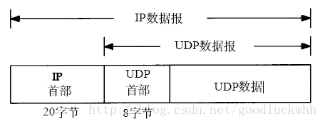
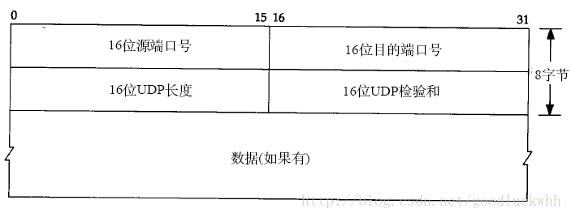

http://blog.csdn.net/goodluckwhh/article/details/9904159

传输层位于网络层和应用层之间，它的目的是为运行在不同主机上的进程之间的通信提供支持。传输层将网络层提供的不同主机之间的通信服务扩展到了运行在不同主机上的进程之间。

一、传输层

传输层协议为运行在不同主机上的应用之间提供了逻辑通信功能，而网络层则是提供了主机之间的逻辑通信服务。。传输层运行在主机上即端系统上。其基本通信过程为

-   发送方：传输层接收到来自应用进程的报文，并将其转换为传输层分组，因特网中称为传输层报文段，然后传输层将分组交给网络层，网络层将其交付到目的主机。

-   接收方：网络层从数据中提取传输层报文段，并将其提交给传输层。

1.和网络层的关系

传输层建立在网路层之上，因而传输层所能提供的服务要受到网络层提供服务的限制，比如假如网络层不能提供带宽和时延保证，那么传输层也无法提供该服务。但是传输层仍能够提供网络层所不能提供的服务，比如IP层是不可靠地服务，但是传输层仍能提供可靠服务。

2.传输层概述

TCP/IP提供了三种传输层协议：

1.  UDP：用户数据报协议，它为应用程序提供了一种不可靠的无连接的服务

2.  TCP：传输控制协议，它为应用程序提供了可靠地面向连接的服务

3.  SCTP：流控制传输协议，它为应用程序提供了可靠地面向连接的服务。它在两个端点之间提供稳定、有序的数据传递服务（非常类似于
    TCP），并且可以保护数据消息边界（例如 UDP）。然而，与 TCP 和 UDP 不同，SCTP
    支持多宿主（Multi-homing）和多流（Multi-streaming） 。

运输层的基本任务是将网络层提供的不同主机之间的通信服务扩展到运行在不同主机上的进程之间。这种扩展称为运输层的多路复用和多路分解。运输层通过socket来提供这种多路复用和多路分解。

二、UDP

UDP是一个简单的面向数据报的传输层协议：进程的每个输出操作都正好产生一个UDP数据报，并组装成一份待发送的IP数据报。因此如果应用程序使用UDP来实现，则应用程序几乎是直接与IP打交道，UDP只在网络层之上提供了非常有限的服务：进程间数据交付和差错检测。

1.UDP的多路复用和多路分解

传输层通过socket来提供多路分解和多路复用，并且：

-   每个socket都由唯一的一个标识符

-   每个报文段由特殊的字段来指示该报文段所要交付的套接字，源端口号和目的端口号就是这种目的的特殊字段

端口号是16比特的数字，其大小在0到65536之间。0到1023之间的端口号是知名端口号，其使用是受限制的（指的是不能随意使用）。

传输层的多路复用和多路分解的基本过程是：

1.  主机上的进程创建一个socket，并为之申请一个端口号，假设主机host1上进程A创建了一个socket并申请到端口号10000，主机host2上的进程B创建了一个socket并申请到端口号20000

2.  主机host1上的进程A想和主机host2上的进程B通信，因而它从其与之关联的socket中发送一个数据报，并将源端口设置为10000，目的端口设置为20000，然后将数据报提交给网络层由网络层发送给主机B。

3.  主机B的网络层收到报文后，将传输层数据提交给传输层，之后传输层根据报文信息查找对应的socket（最简单的查找是根据报文的目地地址和端口号进行查找），然后就通过找到的socket将数据体积高给了进程B。

UDP基本上就按照这种模式工作，因而可以说UDP只提供了传输层所需的最基本的服务。从上可知，端口号对于传输层的工作具有极其重要的地位，在实际中典型的情况是客户机让运输层自动分配端口号，而服务器则使用知名端口号，这也是0到1023的端口号被保留的重要要因，这样知名服务的端口号就是固定的了。

还需要注意的是对于UDP来说，UDP套接字由目的IP和目的端口号的二元组标识。因而如果两个UDP数据报具有不同的源IP和源端口，但是具有相同的目的IP和目的端口，那么它们就将通过相同的socket被提交给相同的进程。

在UDP中，源端口的目的在于：它将成为“返回地址”的一部分。典型的在客户机和服务器模型中，由于客户机的端口号是预先不可知的，因而服务器必须从客户机发送给服务器的数据报中获取客户机的端口号，这个端口号将用于服务器发送数据报给客户机时的目的端口域。

2.UDP的数据报格式

UDP报文的格式非常简单，如图所示：

UDP头部格式如下：

-   端口号用于标识发送进程和接收进程。

-   UDP长度字段指的是UDP首部和UDP数据的字节长度。

-   UDP检验和覆盖UDP首部和UDP数据。

UDP的检验和是可选的，尽管是可选的，但是它们应该总是被使用。UDP校验和需要注意的是：

1.  首先，UDP数据报的长度可以为奇数字节，但是检验和算法是把若干个16bit字相加。解决方法是必要时在最后增加填充字节0，这只是为了检验和的计算（可能增加的填充字节不被传送）。

2.  其次，UDP数据报包含一个12字节长的伪首部，它是为了计算检验和而设置的。伪首部包含IP首部一些字段。其目的是让UDP两次检查数据是否已经正确到达目的地。UDP数据报中的伪首部格式如图所示：

UDP数据报的长度在检验和计算过程中出现两次。如果检验和的计算结果为0，则存入的值为全1（65535）。如果传送的检验和为0，说明发送端没有计算检验和。

UDP检验和是一个端到端的检验和。它由发送端计算，然后由接收端验证。其目的是为了发现UDP首部和数据在发送端到接收端之间发生的任何改动。这就是UDP所提供的差错检测服务，也是UDP提供的两个服务之一。
