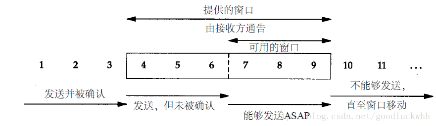

TCP提供了可靠的传输服务，这是通过下列方式提供的：

-   应用数据被分割成TCP认为最适合发送的数据块。由TCP传递给IP的信息单位称为报文段或段（segment）

-   当TCP发出一个段后，它启动一个定时器，等待目的端确认收到这个报文段。如果不能及时收到一个确认，将重发这个报文段。

-   当TCP收到发自TCP连接另一端的数据，它将发送一个确认。这个确认不是立即发送，通常将推迟几分之一秒

-   TCP将保持它首部和数据的检验和。这是一个端到端的检验和，目的是检测数据在传输过程中的任何变化。如果收到段的检验和有差错，TCP将丢弃这个报文段和不确认收到此报文段（希望发端超时并重发）。

-   由于IP数据报的到达可能会失序，因此TCP报文段的到达也可能会失序。如果必要，TCP将对收到的数据进行重新排序，将收到的数据以正确的顺序交给应用层。

-   IP数据报会发生重复，TCP的接收端必须丢弃重复的数据。

-   TCP还能提供流量控制。TCP连接的每一方都有固定大小的缓冲空间。TCP的接收端只允许另一端发送接收端缓冲区所能接纳的数据。这将防止较快主机致使较慢主机的缓冲区溢出。

一、可靠传输的原理

由于网络环境的复杂性，网络上的数据可能丢失、发生错误，因而可靠传输是网络传输中的最基本的问题。只要涉及到网络就逃避不开这个问题。

1.可靠数据传输协议

1.完全可信信道上的可靠传输

如果信道完全可靠，那么可靠传输就不成问题了，此时的可靠传输非常简单。发送方只需要将数据放到信道上它就可以可靠的到达接收方，并由接收方接收。但是这种信道是完全理想化的，不存在的。

2.会出现比特错误的信道上的可靠传输

更现实一点的信道是会发生比特错误的，假设现在需要在除了会出现比特错误之外，其它的特性和完全可靠信道一样的信道上进行可靠传输。则由于会出现比特错误，因而为了进行信息传输：

-   接收方：需要确认信息是否就是发送方所发送的，并且需要反馈是否有错误给发送方

-   发送方：需要在发送的信息中添加额外信息以使得接收方可以对接收到的信息是否有错误进行判断，并且需要接收接收方的反馈，如果有错误发生就要进行重传

因而在这种信道上进行传输需要三种功能：

-   差错检测：发送方提供额外信息供接收方进行校验，接收方进行校验以判断是否有错误发生。网络协议一般采用校验和来完成该任务

-   接收方反馈：接收方需要将是否有错误发生的信息反馈给发送方，这就是网络协议中最常见的ACK（确认）/NAK（否定的确认）机制

-   发送方重传：在出现错误时，发送方需要重传出错的分组。重传也是网络协议中极常见的机制。

上述机制还有问题，它没有考虑接收方的反馈出现比特错误即反馈受损的情形。采用上述机制，在反馈受损时，发送方可以了解到这个反馈信息出现了错误，但是它无法知道反馈的是什么样的信息，因此也就无法知道自己该怎么应对，这可以有两种解决办法：

-   发送方提供足够多的信息，使得接收方不仅可以检测比特错误，而且可以恢复比特错误。这在仅会发生比特错误的信道上是理论可行的，代价是需要大量额外的信息。

-   如果收到了受损的反馈，则都认为是出现了错误，就进行重传。但是这时就可能引入冗余的分组，因为被重传的分组可能已经正确的被接收了。

网络协议中广泛采用的是第2种解决方案，冗余分组可以通过一种简单的机制来解决，这就是分组序列号。被发送的每个分组都有一个序列号，接收方只需要检测该序列号就可以知道分组是否是冗余的。

在引入序列号后，该机制已经可以在这种信道上工作了。不过它还可以做一点变化，有些网络协议中并不会产生否定的确认（即报告发送方出现了错误），它采用的是继续为已经为之发送过ACK的最后一个正确接收的分组发送ACK。当发送方收到冗余的ACK时就知道跟在被冗余ACK确认的分组之后的分组没有被正确接收，这就达到了NAK所要的效果。

3.会出现比特错误并且会丢包的信道上的可靠传输

这种信道是更常见的信道。比特错误的问题已经被校验和、序号、ACK和重传解决了。现在需要引入新的机制来解决丢包的问题。

丢包问题的解决很简单，对于发送方来说只要在一定时内没有收到分组的ACK就认为分组丢失了，就进行重传即可。当然这可能引入冗余的分组，但是序列号是可以解决冗余分组的问题，因而唯一需要确定的就是所谓的一定的时间内的时间长度。很显然时间长度至少要为“往返时延+分组处理时间”。由于网络环境的复杂性，该值的估算往往也是每个网络协议中的很重要的一部分。

2 流水线/可靠数据传输协议

上述可靠传输协议是一个停止等待协议，它的性能很差。任意时刻信道内只有一个分组（或者数据分组或者确认分组）。这就极大的浪费了带宽。发送方的利用率是：

>   (分组长度/传输速率) / (RTT +分组长度/传输速率)

传输速率即信道的速率。这个利用率是很低的。解决利用率低的问题的很完美的一个现实参考模型就是工厂流水线。为了模拟流水线，对可靠传输协议的一个修改是：不采用停止等待协议，而是允许发送方发送多个分组而无需等待确认。具体的修改包括：

-   增加分组序号范围，因为每个传输的分组需要有一个唯一的序号，而且同时存在多个未确认的分组

-   协议的发送方和接收方需要缓存多个分组，发送方至少需要缓存已发送但未确认的分组

所需分组序号的范围和对缓存分组的要求取决于如何解决分组丢失、出错或者超时的问题。流水线的差错恢复有两种手段：回退N步（GBN）和选择重传。

1.GBN

该协议中，流水线中未被确认的分组数目不能超过N。
GBN协议中发送方两个重要的序号为：

-   基序号(send_base)：最早未被确认的序号

-   下一个序号(nextseqnum)：最小未使用的序号

发送方看到的序号被分为几部分：

-   [0, send_base - 1]：已发送并且收到确认了的序列号

-   [send_base, nextseqnum - 1]：已发送但未收到确认了的序列号

-   [nextseqnum, send_base + N - 1]：可被用于发送新分组的序列号

-   大于等于send_base + N：不能使用的序列号

本协议中，已发送但未被确认的分组数目不能超过N。因此N可以看做是从第一个已发送但未被确认的序号开始的长为N的序号窗口，也称为发送窗口。随着分组被确认，该窗口逐渐滑动，send_base增加，但是其大小不变，因此该协议也称为滑动窗口协议。假设序号空间总大小为X，所有的序号计算都要对X取模。

1）在GBN协议中，发送方需要处理以下事件：

-   上层调用进行发送：当发送数据时，首先判断发送窗口是否已满，只有不满时才会启动发送，如果满了则不能发送或者缓存或者通知调用者，这取决于实现，

-   收到ACK：如果收到了分组n的ACK，并且分组n的序号在[send_base, nextseqnum -
    1]之间，则更新send_base。GBN协议采用累积确认，含义是如果发送方接收到了对分组n的确认，则表明分组n之前的所有分组都已经被接收。

-   超时事件：GBN协议名字来自该协议对分组丢失或超时事件的处理。如果分组丢失或者指定的时间内仍未收到对已发送但是未收到确认的分组的确认，则发送方重传[send_base,
    nextseqnum-1]之间的所有分组。实现中可以只为序号为send_base的分组启动一个定时器，如果send_base被更新就重启send_base相关的定时器，如果没有已经被发送但未被确认的分组，则关闭定时器。

2）GBN协议中，接收方的行为：

接收方接收到分组n时，如果n是按序接收的，即分组n之前的所有分组都已经到达，则发送一个对分组n的确认，并将分组提交给上层。所有其它情况，接收方都丢弃分组，并重传对最后一个按序接收的分组的确认。这种设计简化了接收方接收缓存的设计，同时被丢弃的分组早晚都会被重传，因而可靠性也是有保证的。

GBN协议的接收方只维护了一个期望收到的下一个序号的信息，并保存在expectedseqnum中，在expectedseqnum之前的所有分组都已经被正确接收并提交给了上层。接收方具体的行为如下：

-   如果收到的分组的序号与expectedseqnum相同，则将分组提交给上层，并更新它的值为下一个期望收到的序号。

-   如果收到的分组的序号大于expectedseqnum，就丢弃分组。

-   如果收到的分组的序号小于expectedseqnum，就重传对最后一个按序接收的分组的确认。由于GBN是累积确认的，因此该确认可以确保发送窗口可以向前移动。

2\. 选择重传

GBN协议存在缺陷，在超时或者分组丢失时它会重传所有的在[send_base,
nextseqnum-1]之间的分组，而接收方也会丢弃非按序到达的分组，这也浪费了带宽。

1）发送方

选择重传协议通过让发送方仅重传那些它怀疑在发送方出错的分组来避免不必要的重传。

该协议中发送方看到的序号空间与GBN协议完全相同，唯一不同的在于序号空间[send_base,
nextseqnum - 1]中的分组包含了一些已经被接收方确认了的分组。

发送行为：

-   上层调用进行发送：当发送数据时，首先判断发送窗口是否已满，只有不满时才会启动发送，如果满了则不能发送或者缓存或者通知调用者，这取决于实现，

-   收到ACK：如果收到分组n的ACK，并且n的序号在[send_base, nextseqnum -
    1]之间，则将分组n状态更新为已确认，如果n的序号等于send_base，则更新send_base到下一个已发送但未被确认的分组的序号处。

-   超时事件：该协议使用选择重传，因此每个分组都有一个定时器，如果某个分组的定时器到期了就重传该分组。

2）接收方

该协议中，接收方也需要维护一个长度为N的接收缓存，并且需要维护一个变量rcv_base，它表示接收方期望收到的下一个分组的序号。接收方看到序号空间被划分为：

-   [0, rcv_base - 1]：已经正确接收并且被确认了的序号空间

-   [rcv_base, rcv_base + N -1]：期望接收的序号空间

-   大于rcv_base + N ：不可用的序号空间

接收行为：

-   收到了序号在[rcv_base – N , rcv_base
    \-1]之间的分组：产生一个ACK，这是必须的，因为发送方重传了该分组就说明它没有收到对它的ACK，如果不发送ACK，发送方的窗口将不会移动。假设N=5，考虑以下场景

    -   发送方发送了序号为5,6,7,8,9的分组，因此send_base=5

    -   接收方接收了这些分组并且为所有分组都发送了ACK，因此rcv_base=10

    -   所有ACK都丢失

    -   发送方重传分组5

    -   接收方必须发送ACK，否则发送方窗口将不会被更新

-   收到了序号在[rcv_base, rcv_base + N
    \-1]之间的分组：发送ACK给发送方。如果该分组以前未接收，则缓存它，如果该分组的序号等于rcv_base，则将从rcv_base开始的序号连续的被缓存的接收到的分组提交给上层，同时更新rcv_base为有序接收到的最后一个分组的序号的下一个序号。

-   接收到其它分组：丢弃分组

注意到接收方必须可以处理序号范围在[rcv_base, rcv_base + N -1]和[rcv_base – N ,
rcv_base
\-1]之间的分组，这两个区间的总长度为2N。因此这就意味着序号空间至少要有2N个可用序号值，即序号空间的大小至少要为2N，否则接收方就无法区分一个分组是新的分组还是一个重传。

二、TCP数据传输

当TCP连接建立之后，应用程序即可使用该连接进行数据收发。应用程序将数据提交给TCP，TCP将数据放入自己的缓存，并且在其认为合适的时候将数据发送出去。在TCP中，数据会被当做字节流并按照MSS的大小进行分段，然后加上TCP头部并提交给网络层。之后数据就会被网络层提交给目地主机，目地主机的IP层会将分组提交给TCP，TCP根据报文段的头部信息找到相应的socket，并将报文段提交给该socket，socket是和应用关联的，也就提交给了应用。

1.TCP的可靠传输

IP提供的服务是尽力交付的服务，也是不可靠的服务。但是TCP在IP之上提供了可靠度传输服务。TCP采用了流水线下的可靠数据传输协议，但是在差错恢复时，并没有简单的采取GBN协议或者选择重传协议，而是将二者结合了起来。

TCP采用了累积确认的方式，这类似于GBN，即如果TCP发送了对某个序号N的确认，则表明在N之前的所有字节流都已经被正确接收。但是另一方面，TCP又不会像GBN协议那样简单丢弃失序到达的报文段，而是会将它们缓存起来，但是这些被缓存的报文段不会逐个被确认。当发生超时时，TCP只会重传发生超时的那一个报文段。

TCP还允许接收方选择性的确认失序到达的分组，而不是累积的对最后一个确认最后一个正确到达的分组，将它与TCP所采取的选择重传结合起来看就很想选择重传协议的工作机制。因此说TCP的差错恢复结合了GBN和选择重传。

选择重传中每个报文段都有自己的超时值，TCP采用了RFC2988建议的机制用一个单一定时器来完成该功能。RFC2988定义的原则：

1.  发送TCP分段时，如果还没有重传定时器开启，那么开启它。

2.  发送TCP分段时，如果已经有重传定时器开启，不再开启它。

3.  收到一个非冗余ACK时，如果有数据在传输中，重新开启重传定时器。

4.  收到一个非冗余ACK时，如果没有数据在传输中，则关闭重传定时器。

1.基本工作过程

发送，ACK，重传共同保证了TCP的可靠传输，其基本工作过程（考虑累积确认的情形）如下：

1.发送分组

TCP会为发送的每一个分组分配一个唯一的序号，该序号和ISN以及该报文段在字节流中的位置有关。序号被填入TCP头部的序号字段。如果重传定时器还没有运行，则会启动重传定时器。

2.接收到ACK

由于是累积确认的，因此如果收到的ACK是合法的，即是对已发送但未被确认的报文段的确认，则更新send_base，并且如果还有未被确认的已发送的报文段，则重启重传定时器。

3.超时

重传引起超时的报文段，并重启定时器。TCP的重传不一定是重传引起超时的报文段本身，TCP可能重新进行分组然后重传，唯一被保证的是所有数据都会被传输。

4.产生ACK

每个TCP报文段的TCP头部都固定包含了ACK域，如果在传输中，为了确认一个报文段而单独发送一个ACK，则该ACK就是一个数据部分长度为0的特殊TCP报文段，如果这样的分段太多，网络的利用率就会下降。为此，TCP采取了延迟确认的机制。其工作过程：

-   如果收到的报文段的序号等于rcv_base，并且所有在rvc_base之前的报文段的确认都已经被发送，则只更新rcv_base，但是延迟该报文段的ACK的发送，最多延迟500ms。延迟的ACK可能会在接收端有数据要发送给发送端时被发送或者在接收端有多个ACK需要被发送给发送端时被发送。

-   如果收到的报文段的序号等于rcv_base，并且有延迟的ACK待发送，则更新rcv_base，并发送累积的ACK以确认这两个按序报文段

-   如果收到的报文段的序号大于rcv_base，则发送冗余的ACK，即重传对已经确认过的最后一个按序到达的报文段的ACK

2.往返时延的估算与超时

TCP协议定义了RTT来代表一个TCP分段的往返时间。然而由于IP网络是尽力而为的，并且路由是动态的，且路由器可能缓存或者丢弃IP数据报，因此一个TCP连接的RTT是动态变化的，因而也需要动态测量。样本RTT(SampleRTT)是报文段被发出到报文段的确认被收到的时间间隔。TCP不会为每一个发动的报文段测量一个SampleRTT，而是仅为已发送但是未被确认的分组测量SampleRTT。这样做是为了产生一个近似于RTT的SampleRTT。TCP不会为重传的报文段测量SampleRTT。

得到多个SampleRTT后，TCP会尝试使用这些信息来尽可能得到一个较为准确的RTT，为此TCP采用了经常被采用的收到即使用一个滤波器来对多个SampleRTT进行计算。TCP使用如下的滤波器来计算一个EstimateRTT：

>   EstimateRTT= （1- α） \* EstimateRTT +α \* SampleRTT

RFC2988给出的α参考值为1/8。EstimateRTT 是一个平滑后的RTT。

除此之外，TCP还将RTT的变化率也应该考虑在内，如果变化率过大，则通过以变化率为自变量的函数为主计算RTT(如果陡然增大，则取值为比较大的正数，如果陡然减小，则取值为比较小的负数，然后和平均值加权求和)，反之如果变化率很小，则取测量平均值。TCP计算了一个DevRTT。它用于估量SampleRTT偏离EstimateRTT的程度。其公式为：

>   DevRTT= （1-β）\* DevRTT + β\* \|SampleRTT - EstimateRTT \|

β的参考值为1/4。

之后重传定时器的值会被设置为EstimateRTT + 4 \* DevRTT

3.倍数增加的重传间隔

在发生超时重传时，TCP不是以固定的时间间隔来重传的，而是会再每次重传时都将下一次重传的间隔设置为上次重传间隔的2倍，因此重传间隔是倍数增加的。直到收到确认或者彻底失败。由于正常发送报文段时，重传定时器的超时值为EstimateRTT
\+ 4 \* DevRTT，因此第一重传时会将下一次的超时时间设置为2倍的该值，依次类推。

4.快速重传

倍数增加的重传间隔会增大端到端的时延，使得发送端可能不得不等待很长时间才能重传报文段。冗余ACK使得TCP可以得到分组丢失的线索。TCP基于冗余ACK提供了一种快速重传机制。其原理是：如果收到了对相同数据的三个冗余的ACK，发送端就认为跟在这个被确认了三次的报文段之后的报文段丢失了，因此重传它，而不是等待它的超时定时器到期。这就是快速重传。

5.流量控制

在TCP中，连接双都为该连接设置了接收缓存，当报文段被连接的一端接收时，它会进入该接收缓存，被接收的数据并不一定立即被提交给应用程序。因为应用可能由于各种而没能及时读取缓存中的数据。如果发送方发送的数据太快，而应用没有及时读取被缓存的数据，缓存就会变满，此时为了防止缓存溢出，就要丢弃报文段，显然丢弃已经正确接收的报文段是对网络资源的浪费。为了解决该问题，TCP需要提供一种机制来防止接收缓存溢出。

TCP提供了流量控制功能，来防止发送方发送过快而导致接收方缓存溢出的情形出现。这是通过让接收方通告一个接收窗口大小来实现的。接收窗口的大小包含在TCP头部的窗口大小字段中。其工作原理为：

接收方通过窗口大小通告本地可以接收的报文段的总大小。发送方将根据该信息来判断自己可以发送多少数据。发送方保证自己发送的未被确认的报文段的总大小不超过接收方通告的窗口大小。对应到我们所描述的GBN和选择重传协议中，就是发送方会用接收方通告的窗口大小更新本地的窗口大小N的值。一个可视化的描述如下图：

但是TCP连接的一端可能通告一个大小为0的窗口，这时候接收到对端通告大小为0的窗口的一端并不会停止发送，而是会启动一个定时器来发送窗口探测报文段，该报文段只包含一个字节，该报文段会被接收方确认，该定时器会一直重启自身来发送窗口探测包直到对端通告了一个大小不为0的窗口为止。定时器的超时值会逐渐增大到一个最大值，然后固定以该值重发窗口探测包。

2.SWS(糊涂窗口综合症)

糊涂窗口综合症是指在发送端应用进程产生数据很慢、或接收端应用进程处理接收缓冲区数据很慢，或二者都存在时，通过TCP连接传输的报文段会很小，这会导致有效载荷很小。极端情况下，有效载荷可能只有1个字节；而传输开销有40字节(20字节的IP头+20字节的TCP头)
这种现象就叫糊涂窗口综合症。

1.发送端引起的SWS

如果TCP发送端的应用是产生数据很慢的应用程序(比如telnet)，它可能一次只产生一个字节。这种应用程序一次只往TCP提交一个字节的数据，如果没有特殊的处理，这就会导致TCP每次都产生一个只有一个有效载荷的报文段。最终导致网络的有效利用率非常低。解决办法是防止TCP发送过小的报文段，如果应用提交的数据较短，就等待足够的数据来组成一个较大的报文段再发送，为了防止长时间等待导致时延过大，可以加入一个等待时间限制，如果时间到期还没等到足够的数据就直接发送不再等待。Nagle算法就是这样的一种算法。

2.接收端引起的SWS

如果TCP接收端的应用处理数据的速度很慢，一次只从TCP缓存取走很小数量的数据，比如一个字节，而发送方发送的速度较快，这就会导致接收方的缓存被填满，然后接收方每次在应用取走一个字节的数据后都通告一个大小为1的窗口，这就限制发送方每次只能发送包含一个字节的有效载荷的报文段。

对于这种糊涂窗口综合症，即应用程序消耗数据比到达的慢，有两种建议的解决方法：

1.  Clark解决方法
    Clark解决方法是只要有数据到达就发送确认，但通告的窗口大小为零，这个过程持续到缓存空间已能放入具有最大长度的报文段或者缓存空间的一半已经空了。

2.  延迟确认
    第二个解决方法是延迟一段时间后再发送确认。这时接收方不立即确认收到的报文段。接收方在确认收到的报文段之前一直等待，直到入缓存有足够的空间为止。该方法阻止了发送端滑动其窗口，当发送端发送完其数据后，它就停下来了。这样就防止了这种症状。延迟的确认还减少了通信量。接收端不需要确认每一个报文段。但它有可能使发送端重传其未被确认的报文段。可以给延迟的确认加一个时间限制来降低该方法缺点的影响。

3.Nagle算法

Nagle算法的核心思想是任意时刻，最多只能有一个未被确认的小段。
所谓“小段”，指的是小于MSS尺寸的数据块。Nagle算法的规则：

1.  如果包长度达到MSS，则允许发送；

2.  如果该包含有FIN，则允许发送；

3.  设置了TCP_NODELAY选项，则允许发送；

4.  未设置TCP_CORK选项时，若所有发出去的小数据包（包长度小于MSS）均被确认，则允许发送；

5.  上述条件都未满足，但发生了超时（一般为200ms），则立即发送。

Nagle算法在任意时刻只允许存在一个未被确认的报文段，但他它并不关心报文段的大小，因此它事实上就是一个扩展的停止等待协议，只不过它是基于报文段的而不是基于字节的。Nagle算法完全由TCP协议的ACK机制决定，因此也有一些缺点，比如如果对端ACK回复很快的话，Nagle事实上不会拼接太多的数据包，虽然避免了网络拥塞，网络总体的利用率依然很低。

在某些时刻也可能会需要关闭该算法，尤其是交互式的TCP应用，因为这种应用期望及时收到响应。这可以通过打开TCP_NODELAY选项来实现。

4.TCP_CORK 选项

设置该选项后，内核会尽力把小数据包拼接成一个大的数据包（一个MTU）再发送出去，当然若一定时间后（一般为200ms，该值尚待确认），内核仍然没有组合成一个MTU时也必须发送现有的数据。

5.Nagle算法与CORK算法区别

Nagle算法和CORK算法非常类似，但是它们也有区别：

1.  它们的目地不同。Nagle算法主要避免网络因为有太多的小报文段而拥塞，而CORK算法则是为了提高网络的利用率，使得总体上协议头占用的比例尽可能的小。

2.  用户通过TCP_NODELAY来启用或禁用Nagle算法而通过TCP_CORK来启用或禁用CORK算法。

3.  Nagle算法关心的是网络拥塞问题，只要有ACK回来则发包，而CORK算法关心的是报文段大小，在前后数据发送间隔很短的前提下，即使你是分散发送多个小数据包，你也可以通过使能CORK算法将这些内容拼接在一个包内，如果此时用Nagle算法的话，则可能做不到这一点。

3.拥塞控制

当网络拥塞时数据报不能及时被转，在分组转发网络中，数据报就会被排队，甚至出现丢包因此说网络拥塞会带来网络销：

-   引入大的排队时延

-   当数据报被丢失时发送方必须重传，因此引入了重传开销

-   当数据报被丢失时，丢失路由器的上游路由器做的工作都变成了无用功

因此必须采取技术来尽可能避免拥塞。由于IP层不提供网络是否拥塞的信息，因而TCP必须自己来判断网络是否出现了拥塞。

TCP将丢包（可能是超时也可能是收到了三个冗余的ACK）看做是网络拥塞的线索，将RTT增加看做是网络拥塞程度加重的线索。

TCP让连接双方根据自己所判断的网络拥塞的程度来限制其发往网络的流量。TCP在连接的每一端都增加了一个变量cong_win，它表示拥塞窗口，用于限制一端可以向网络发送的数据。TCP连接的每一端都保证它所已经发送的未被确认的报文段的总大小不会超过拥塞窗口和对方通告的窗口大小中的较小的那一个。

TCP通过ACK到达的情况（即是否到达，到达的速率）来调整拥塞窗口的大小。

1.慢启动

在建立TCP连接时，拥塞窗口被初始化为 min (4\*SMSS, max (2\*SMSS, 4380 bytes))
。但是TCP不是以线性的方式增大拥塞窗口，而是以指数的方式增加的，即：

1.  初始设置cwnd=1个 min (4\*SMSS, max (2\*SMSS, 4380 bytes))
    ，发送一个报文，在RFC5861中有更新，但是总体就是一个较小的值（SMSS：SENDER
    MAXIMUM SEGMENT SIZE : The SMSS is the size of the largest segment that the
    sender can transmit）。(对于SCTP，cwnd初始值为min(4\*MTU)。

2.  收到对该报文的ack，则cwnd被设置为2个MSS，可以发送两个报文

3.  收到对2个报文的确认后，cwnd更新为4个MSS，可以发送四个报文，一依次类推。

该过程会一直持续直到遇到一个丢包事件为止（或者等于ssthresh时，ssthresh事实上是用于区分是进行的拥塞避免还是慢启动，初始化时它被设置为65536），事实上该算法相当于每收到对一个MSS的确认就将cwnd增大一个MSS（cwnd决定了当前可以发送cwnd/MSS个报文，当这个cwnd/MSS个报文段都被确认后，就将cwdn增大了cwnd/MSS
×
MSS即cwnd）。发送方取拥塞窗口与对端通告窗口中的最小值作为发送上限。由于初始的拥塞窗口很小的值，因为该启动方式被称为慢启动。

但是对于SCTP，它只有在满足三个条件时才增大cwnd，min(上次发送的所有数据的大小，MTU)：

1.  cwnd已经被用完

2.  累积确认被更新了

3.  当前不处于快速恢复模式

2.拥塞避免（加性增，乘性减）

当遇到一个丢包事件时，TCP会将其拥塞窗口降低为原来值的一半，同时将ssthresh设置为
max (FlightSize / 2, 2\*SMSS) （FlightSize：The amount of data that has been
sent but not yet acknowledged.）（对于SCTP为：max(cwnd/2,
4\*MTU），总体而言，SCTP和TCP的拥塞控制、避免算法是一致的，用MTU替换掉MSS即可。另外SCTP只在有大于等于cwnd的数据正在被发送时（onflight）才更新cwnd)
。其目的是通过降低发送速率来缓解、避免拥塞。但是拥塞窗口大小至少为1个MMS。

在非启动期间，当TCP探测到没有拥塞时，即当连接的一端收到了对它已经发送但未被确认的报文段的确认时，它就会增大拥塞窗口，增大的方式是每收到一个ACK将拥塞窗口大小增大MSS×MSS/cwnd，因此在该算法下，经过一个RTT，cwnd最多增大一个MSS。

因此TCP的拥塞控制方式又称为加性增，乘性减。拥塞窗口的增加受惠的只是自己，而拥塞窗口减少受益的是大家，当出现拥塞时，通过乘性减虽然损害了自己，但是可以让更多的其它网络参与者受益，这也证实TCP拥塞控制中的公平性的核心所在。

3.对超时事件的处理

虽然超时和收到三个冗余ACK（SCTP中不存在三个冗余ACK，对应的事件是三个SACK都不包含都某个报文段的确认，则认为该报文段丢失需要重传）都被认为是丢包事件，但是TCP在二者的处理上并不全相同。当收到三个冗余ACK时，TCP的处理就是“加性增，乘性减”。但是如果是超时事件，则TCP会更新ssthresh的值为max
(FlightSize / 2, 2\*SMSS)（对于SCTP，max(cwnd/2,
4\*MTU)），然后进入“慢启动”过程，即将拥塞窗口设置为一个MSS，然后指数增加拥塞窗口大小。此时“慢启动”会持续到遇到一个丢包事件或者拥塞窗口被增大到了ssthresh，如果是增大到了ssthresh则进入“拥塞避免”的模式，即开始加性增。

因此对于丢包事件来说，只要发生了丢包，则ssthresh都会更新max (FlightSize / 2,
2\*SMSS)（对于SCTP，max(cwnd/2,
4\*MTU)）。如果是超时，cwnd被设置为一个MSS（对于SCTP，1个MTU
）；如果是冗余ACK，则cwnd被更新为更新后的ssthresh。随后cwnd的更新方式取决于它和ssthresh之间的大小关系，如果cwdn小于或等于ssthresh，则就是在执行慢启动，否则就是在执行拥塞避免。

对超时时间和三个冗余ACK处理方式上存在区别的原因在于，收到冗余ACK表明了网络时可以交付报文段的，是可用的，而超时则就是明确的丢包。而收到冗余ACK至少表明网络还是可用的，只是出现了丢包，事实上，在出现三个丢包的时候，采用的是快速恢复+快速重传+拥塞避免。

4\. 快速恢复

快速恢复一般和快速重传一起实现，其算法为：

1.  当收到第3个重复的ACK时（对于SCTP，有三个SACK都不包含某个报文的确认时。具体规则：1.只有报文TSN小于当前SACK中新被确认的最大TSN的被丢失的报文的丢失计数才会增加，2.如果已经处于快速重传模式，并且当前的SACK会更新累积确认点，则所有丢失的报文的丢失计数都会增加（这一点将保证报文会被尽快快速重传，从而使得尽快退出快速重传模式）。），把ssthresh设置为max
    (FlightSize / 2, 2\*SMSS)（对于SCTP，max(cwnd/2,
    4\*MTU)），把cwnd设置为ssthresh的值加3个SMSS（对于SCTP，不增加）。然后重传丢失的报文段。因为收到3个重复的ACK表明有三个报文已经离开网络到达了接收断，被且被接收端给接收了。（同时，对于SCTP，还会将当前已经发出的最大的报文序号（TSN）作为退出快速恢复的序列号）

2.  收到另外的重复的ACK时，cwnd增加一个MSS。

3.  当收到确认新数据包的ACK时，把cwnd设置为第一步中的ssthresh的值。此时就重新进入到了第一步丢包时本应进入的拥塞避免。（对于SCTP，如果收到的SACK的累积确认确认了步骤1中的退出快速恢复的序列号，则退出快速恢复）

快速恢复意在通过快速重传丢失的报文，使得接收端可以将累积确认的最后一个报文和乱序到达的报文之间的“间隙”填充起来，从而尽快进行新的确认。在这个过程中，每当接收断收到一个新的乱序的报文ACK时，发送端就将自己的cwnd增大一个MSS，使得发送端可以尽快填充接收端的“间隙”，直到累积确认的报文段之后有新的连续的报文段被接收端接收到了，这个时候接收端会更新一个新的ACK，发送端在收到该ACK后就退出快速恢复并进入拥塞避免。

需要注意的是无论是拥塞避免还是慢启动，SCTP规定，如果某个地址不用于发送数据，则每个RTO都要对cwnd做一次调整，调整后的值为max(cwnd/2,
4\*MTU).

三、紧急方式

TCP提供了“紧急方式(urgentmode)”，它使连接的一端可以告诉另连接的一端有些
“紧急数据”已经被放置在数据流中。紧急数据的处理方式由接收方决定。

要发送紧急数据需要设置TCP首部中的两个字段来。URG比特被置1，并且要将16bit的紧急指针设置为一个正的偏移量，该偏移量必须与TCP首部中的序号字段相加，以便得出紧急数据的最后一个字节的序号。

TCP必须通知接收进程，何时已接收到一个紧急数据指针以及何时某个紧急数据指针还不在此连接上，或者紧急指针是否在数据流中向前移动。接着接收进程可以读取数据流，并必须能够被告知何时碰到了紧急数据指针。只要从接收方当前读取位置到紧急数据指针之间有数据存在，就认为应用程序处于“紧急方式”。在紧急指针通过之后，应用程序便转回到正常方式。

没有办法指明紧急数据从数据流的何处开始。TCP通过连接传送的唯一信息就是紧急方式已经开始（TCP首部中的URG比特）和指向紧急数据最后一个字节的指针。其他的事情留给应用程序去处理。
