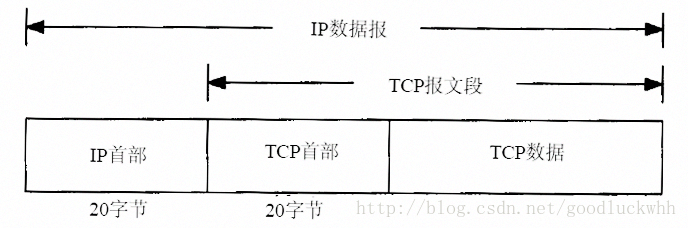
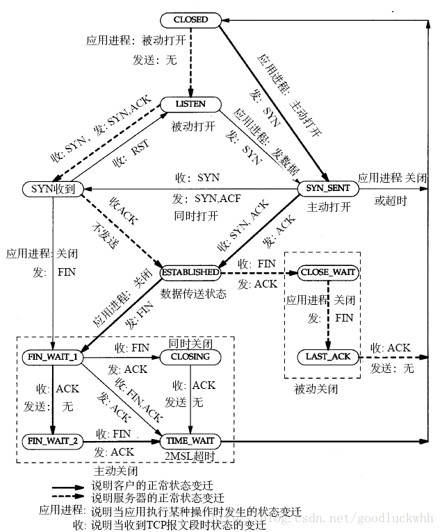
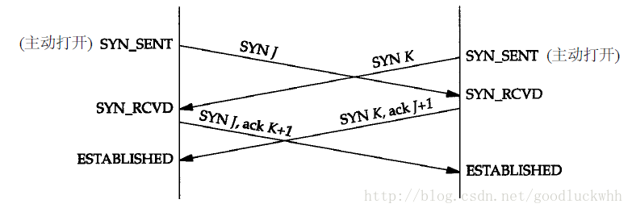
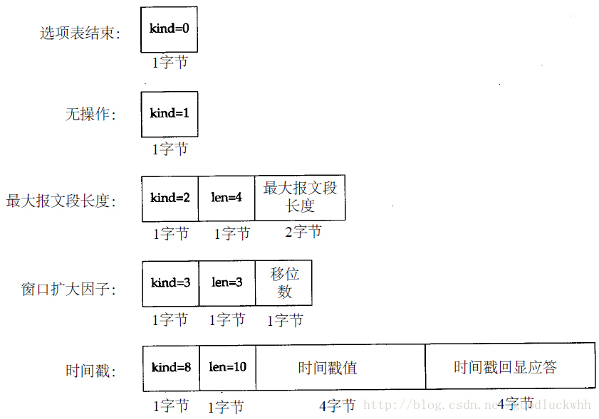

TCP是一种极为重要的传输层服务（要不也不会称为TCP/IP协议族了：）），它提供了与UDP完全不同的服务。TCP提供的是一种面向连接的、可靠的字节流服务。

-   面向连接：使用TCP的两端在彼此交换数据之前必须先建立一个TCP连接。TCP连接是点对点的，在一个TCP连接中，仅有两方可以彼此通信，TCP不使用广播和多播。TCP的连接和电话网络的连接不同，它对中间的转发设备即路由器、交换机是透明的，连接的信息只存在于连接的两个端系统之上。

-   可靠：TCP保证数据传输的可靠性，TCP通过下列方式来提供可靠性：

-   字节流：两个应用程序通过TCP连接交换8bit字节构成的字节流。TCP不在字节流中插入记录标识符。字节流服务中，接收方无法了解发方每次发送了多少字节，可以确保的是一端将字节流放到TCP连接上，同样的字节流将出现在TCP连接的另一端。另外，TCP对字节流的内容不作任何解释。TCP不知道传输的数据字节流是二进制数据，还是ASCII字符、EBCDIC字符或者其他类型数据。对字节流的解释由TCP连接双方的应用层解释。

和UDP相同，TCP提供的是全双工的服务。

一、TCP首部

TCP数据被封装在一个IP数据报中，如图所示：

下图是TCP首部，它通常是20个字节。

-   源端和目的端的端口号：用于TCP的多路复用和多路分解，即标识发端和收端应用进程。

-   序号：标识字节流。TCP用序号对字节流中的每个字节进行计数，一个报文段的序号被设置为该报文段中第一个数据字节的计数值。序号是32bit的无符号数，序号到达232－1后又从0开始。当建立一个新的连接时，SYN标志变1。序号字段包含由这个主机选择的该连接的初始序号ISN（InitialSequenceNumber）。该主机要发送数据的第一个字节序号为这个ISN加1，因为SYN标志消耗了一个序号。由于TCP提供的是全双工的服务即连接双方可以同时独立地发送数据，因此连接的每一端必须保持每个方向上的传输数据序号。

-   确认序号：确认序号包含发送确认的一端所期望收到的下一个序号。因此，确认序号应当是上次已成功收到数据字节序号加1。只有ACK标志1时确认序号字段才有效。发送ACK无需任何代价，因为32bit的确认序号字段和ACK标志一样，总是TCP首部的一部分。因此一旦一个连接建立起来，这个字段总是被设置，ACK标志也总是被设置为1。

-   首部长度：首部中32bit字的数目。这个字段占4bit，因此TCP最多有60字节的首部。正常的长度是20字节。

-   6个标志比特：

    -   URG紧急指针有效。

    -   ACK确认序号有效。

    -   PSH接收方应该尽快将这个报文段交给应用层。

    -   RST重建连接。

    -   SYN同步序号用来发起一个连接。

    -   FIN发端完成发送任务。

-   窗口大小：通告给对端的本段窗口大小。用于流量控制。

-   检验和：整个TCP报文段的校验和，覆盖了TCP首部和TCP数据。必须给出，由发送端设置，接收端验证。类似于UDP的校验和，校验和计算是用了和UDP相同的一个伪首部。

-   紧急指针：只有当URG标志置1时紧急指针才有效。紧急指针是一个正的偏移量，和序号字段中的值相加表示紧急数据最后一个字节的序号。

-   选项：包括TCP所支持的一些选项。最常见的可选字段是最长报文大小，又称为MSS(MaximumSegmentSize)。每个连接方通常都在通信的第一个报文段（为建立连接而设置SYN标志的那个段）中指明这个选项。它指明本端所能接收的最大长度的报文段。

二、TCP的多路复用和解复用

由于TCP是面向连接的，因而传输层的基本多路复用和解复用的过程不足以支持TCP的多路复用和解复用。为了标识一个连接的信息，像UDP那样用目地IP+目地端口号的二元组是不足以在TCP中工作的。因为UDP是无连接的，因而它向应用提交信息时，是不考虑源IP和源端口的，只需要考虑目地IP和目地端口即可，但是TCP是面向连接的，因而它不仅需要目地端口和目地IP，而且需要源IP和源端口，只有提供了这4个信息才足以提供连接两端的足够的信息。因而TCP使用源IP+源端口+目地IP+目地端口的四元组来标志一个socket。

在TCP工作时，无论发送端还是接收端，都必须首先建立连接，在连接建立完成后，socket即拥有了它所需的四元组的信息，之后的收发都经过socket进行。

三、TCP的状态迁移图

TCP的状态迁移图如图所示：

图中粗的实线箭头表示正常的客户端状态变迁，粗的虚线箭头表示正常的服务器状态变迁。

-   两个导致进入ESTABLISHED状态的变迁对应打开一个连接。

-   两个导致从ESTABLISHED状态离开的变迁对应关闭一个连接。ESTABLISHED状态是连接双方能够进行双向数据传递的状态。

-   图中左下角放在一个虚线框内的4个状态标为“主动关闭”。

-   状态CLOSE_WAIT和LAST_ACK也用虚线框住，并标为“被动关闭”。

-   CLOSED状态不是一个真正的状态，而是这个状态图的假想起点和终点。

-   只有当SYN_RCVD状态是从LISTEN状态（正常情况）进入，而不是从SYN_SENT状态（同时打开）进入时，从SYN_RCVD回到LISTEN的状态变迁才是有效的。这意味着如果我们执行被动关闭（进入LISTEN），收到一个SYN，发送一个带ACK的SYN（进入SYN_RCVD），然后收到一个RST，而不是一个ACK，便又回到LISTEN状态并等待另一个连接请求的到来。

1\. 2MSL等待状态

TCP中有一个报文段最大生存（MSL，MaximumSegmentLifetime）时间的概念。RFC793[Postel1981c]指定MSL为2分钟。然而，实现中的常用值是30秒，1分钟，或2分钟。

TIME_WAIT状态也称为2MSL等待状态。它是指：当TCP连接的一方执行主动关闭时，在它方完最后一个ACK（即对对端FIN的ACK）后，该连接必须在TIME_WAIT状态停留的时间为2倍的MSL。这样的目的是可以让TCP再次发送最后的ACK以防这个ACK丢失（另一端超时并重发最后的FIN）。

假设没有TIME_WAIT状态，考虑主机A和主机B之间有一个TCP连接。

1.  主机A执行主动关闭，并且收到了主机B的FIN报文，由于不存在TIME_WAIT状态，因而主机A一端的该TCP连接进入关闭状态。

2.  由于某种原因，
    主机B没有收到主机A对其FIN的确认，因而其超时并重传了最后的FIN。

3.  主机A以与步骤1中关闭的TCP相同的四元组与主机B重新建立了一个TCP连接。

4.  主机A收到了主机B针对第一步中被关闭的TCP连接的FIN。这个FIN有可能导致步骤3中刚建立的TCP连接被关闭（因为每个TCP连接的ISN是随机选取的，因而即便在这种场景下，大部分时候FIN也会由于序列号不匹配而被丢失，但是无论如何总是存在旧的FIN将新的连接关闭的危险）。

2MSL等待导致当一个TCP连接处于该状态时，该连接的socket使用的四元组不能被重新使用，即不可能在这个时间段内再重建具有相同四元组的socket。实现中这种限制甚至更为严重--该socket的所使用的本地端口将不能被重新使用。

在连接处于2MSL等待时，任何迟到的报文段将被丢弃。

需要注意的是只有主动关闭的一端会进入该状态，被动关闭的一端不会进入该状态。由于这个特性，所以应该尽量让客户端执行主动关闭，服务器执行被动关闭。因为客户端的端口是可以随意选取的，而服务器必须使用为客户端所知道的端口，因而该状态对客户端影响很小，但是如果是服务器进入了该状态就会影响较大。

2.平静时间

2MSL等待状态可以防止将来自一个连接较早实例(即四元组相同的连接)的迟到的报文段解释为新连接的一部分。

但如果进入2MSL等待状态的主机由于故障重启了并且在MSL内完成重启，并使用相同的信息建立了一个应该处于2MLS等待状态的连接。这时在故障前从这个连接发出的迟到的报文段会被错误地当作属于重启后新连接的报文段。无论如何选择重启后新连接的初始序号，都会发生这种情况。

为了防止这种情况，RFC793指出TCP在重启动后的MSL秒内不能建立任何连接。这就称为平静时间(quiettime)。只有极少的实现版遵守这一原则，因为大多数主机重启动的时间都比MSL秒要长。

3.FIN_WAIT_2状态

FINWAIT2状态中本端已经发出了FIN，并且另一端也已对它进行确认。如果是半关闭，则到这一步就可以结束了，但是如果不是半关闭，则会等待对端发送FIN来关闭另一个方向的数据传输，此时对端处于CLOSEWATI状态。但是如果对端不发送FIN，本端就一直处于FINWAIT2状态，而对端也将处于CLOSEWAIT状态，并一直保持直到对端决定进行关闭。

linux实现通过shutdown来支持半关闭，而close则用来执行一个全关闭（即期望对端也关闭其在另一个方向的发送）。而在在linux实现中，如果执行的是全关闭，则会设置一个超时间来防止连接在FIN_WAIT_2状态一直等待(这个实现来自于伯克利系统，并且注视表明其是违反RFC的)。

四、TCP的连接管理

1.建立连接

TCP通过三次握手完成建立连接的工作：

1.  连接发起者发送一个SYN段指明自己期望连接的对端的端口，以及初始序号。这个SYN段为报文段1。

2.  对端发回包含对端的初始序号的SYN报文段（报文段2）作为应答。同时，将确认序号设置为连接发起者的ISN加1以对连接发起者的SYN报文段进行确认。一个SYN将占用一个序号。

3.  连接发起者必须将确认序号设置为对端的ISN加1以对对端的SYN报文段进行确认（报文段3）。

这三个报文段完成连接的建立。这个过程也称为三次握手（three-wayhandshake）。

发送第一个SYN的一端将执行主动打开（activeopen）。接收这个SYN并发回下一个SYN的另一端执行被动打开（passiveopen）。

发送SYN时需要指定ISN。ISN是随时间而变化的，因此每个连接都将具有不同的ISN。这样选择序号的目的在于防止在网络中被延迟的分组在以后又被传送，而导致某个连接的一方对它作错误的解释。

建立连接时，当两端的SYN都被确认时，TCP连接的双方就可以确认对端已经同意与自己建立连接，并且使用自己SYN报文中携带的信息建立连接，因而在收到SYN的确认后，每一端都可以安全的为连接分配所需的所有资源。两端都发送SYN并收到SYN的确认经过三个报文的交互已经足以完成，因而TCP使用三次握手来建立连接。

2.终止连接

TCP是全双工的，因而每个方向的传输都必须单独进行关闭。TCP允许一个方向的传输被关闭，而另一个方向的传输不关闭，这就是TCP的半关闭。由于TCP支持半关闭，因而关闭一个连接需要4次握手。

当连接的一端完成它的数据发送任务后它就可以发送一个FIN来终止这个方向的连接，这意味着本端将不会再向对端发送数据。当一端收到一个FIN后，它必须通知应用层另一端已经终止了那个方向的数据传送，但是这一端仍能发送数据。程序这样做。正常关闭过程：

1.  首先进行关闭的一方（即发送第一个FIN）将执行主动关闭

2.  而另一方（收到这个FIN）执行被动关闭。通常一方完成主动关闭而另一方完成被动关闭。

和SYN一样，一个FIN将占用一个序号。通常情况下，TCP连接都由客户端发起和终止。

3.连接建立的超时

由于各种原因，连接可能会无法建立。在连接无法建立时，TCP不是立即返回失败，而是会尝试重新建立连接，因为连接无法建立的原因可能是建立连接的请求被丢弃了，所以重新尝试是很有必要的。

当建立连接失败时，在TCP放弃重试之前它会尝试多次。重试通过定时器实现，并且采用了指数后退的方式来确定重试的时间，但同时也定义了一个最大的时间限制，在这个时间点还没成功的话就会放弃。RFC2988定义的初始重试间隔为1秒，因此其重传时间为1,2,4,8…直到达到了重传的最大时间限制。

4.同时打开

极少数情况下会出现两个应用程序同时执行主动打开的情况。对于同时打开有一个要求，即双方都需要使用为对方所知的端口作为本地端口，否则就无法实现同时打开。TCP可以支持同时打开，并且对于同时打开其最终建立的是一条连接而不是两条，同时打开的状态迁移图如下图所示：

-   两端几乎在同时发送SYN，并进入SYNSENT状态

-   当每一端收到SYN时，状态变为SYNRCVD，同时它们都再发SYN并对收到的SYN进行确认

-   当双方都收到SYN及相应的ACK时，状态都变迁为ESTABLISHED

同时打开需要连接双方交换4个报文段，比正常的三次握手多一个。

5.同时关闭

连接的双发也可能在同一时间发送第一个FIN来执行主动关闭。TCP支持同时关闭，同时关闭的状态迁移图如下图所示：

-   应用层发出关闭命令，连接双发各发送一个FIN，并均从ESTABLISHED变为FIN_WAIT_1。

-   连接双方收到对端的FIN后，状态由FIN_WAIT_1变迁到CLOSING，并发送最后的ACK。

-   当收到最后的ACK时，状态变化为TIMEWAIT

同时关闭与正常关闭使用的段交换数目相同。

五、复位报文段

RST标志表示复位，用来复位连接。它可用于多种场景。

1.异常情形

TCP会在自己认为的异常时刻发送RST报文段复位连接。一种常见情况是当连接请求到达时，目的端口没有进程正在听。另一种场景是尝试在半打开的连接上发送数据。

半打开连接：如果TCP的一方已经关闭或异常终止连接而另一方却还不知道，则这样的TCP连接称为半打开（Half-Open）的。

2.终止一个连接

终止一个连接的正常方式是一方发送FIN，这种方式被称为有序释放。在这种方式中，FIN在所有排队数据都发送后才会被发送，一般不会有任何数据丢失。但是连接的一方也可以选择通过RST来释放一个连接，这被称为异常释放。异常终止一个连接对应用程序来说有两个优点：

1.  直接丢弃任何待发数据并立即发送复位报文段，无需ACK对RST报文段进行确认。

2.  RST的接收方会区分另一端执行的是异常关闭还是正常关闭。并可以通知应用程序。

六、TCP选项

TCP支持选项字段，TCP支持的选项包括：MSS选项，选项表结束选项，无操作选项，窗口大小选项，时间戳选项。其格式如图所示：

每个选项的开始是1字节kind字段，说明选项的类型。kind字段为0和1的选项仅占1个字节。其他的选项采用的是TLV的格式，在kind字节后还有len字节。它说明的长度是指总长度，包括kind字节和len字节。

无操作选项的可用于发方将报文段填充为4字节的倍数。

1.最大报文段长度

最大报文段长度（MSS）表示TCP传往另一端的最大块数据的长度。当一个连接建立时，连接的双方都要通告各自的MSS。当建立一个连接时，每一方都有用于通告它期望接收的MSS选项（MSS选项只能出现在SYN报文段中）。如果一方不接收来自另一方的MSS值，则MSS就定为默认值536字节（这个默认值允许20字节的IP首部和20字节的TCP首部以适合576字节IP数据报)。

MSS越大对于IP和TCP来说网络利用率越高（因为头部占的开销比例就下降了）。因此如果可以确保不发生分片，则MSS越大越好。但MSS也并不是越大越好：

-   MSS越大单个报文段的错误造成的影响也越大，TCP会进行重传，如果一个报文段发生了错误，则它会重传该报文段，而如果使用的是较小的MSS，则重传的报文段就更小，因而相比而言大的MSS的重传浪费的带宽更多

-   因特网中路由器采用的是存储转发方式，因而大的MSS会导致单点处理单个报文的时间变长。TCP采用了滑动窗口机制，可以认为是一种流水线工作方式。假设要使用TCP连接传输的数据长度为leng字节，单个报文段到达目的地需要a+1个路由器处理时间，连接之间的速率都为v。则

    该流水线中路由器单点处理时间为：(MSS + 40 )/v

    所有数据都到达目的所需要经过的路由器处理时间个数为：(length/MSS +
    a)，因为根据流水线的性质，处理一个报文段需要x个处理间隔的话，处理n个需要x +
    n -1个处理间隔。

    则这些数据全部到达目的地需要的总时间为：（(MSS + 40 )/v） \* （(length/MSS +
    a)），增大MSS到MSS+x，则需要的时间为（(MSS + x + 40 )/v） \* （(length/（MSS
    \+x）+ a)）。让具有较小MSS的总时间减去较大MSS的，则可得到

    （(MSS + 40 )/v） \* （(length/MSS + a)） - （(MSS + x + 40 )/v） \*
    （(length/（MSS +x）+ a)）=( (len \* 40) / v ) \* (x / (MSS \* (MSS +x))) –
    x \* a / v

    考察该式子和0的关系，由于这些假设的变量里没有为0的，因而我们可以提出公因子v并忽略它，然后可以得到式子：

    ( (len \* 40) - a \* MSS \* MSS – a \* MSS \* x ) \* x / (MSS \* MSS + MSS
    \*x)

    进一步忽略正直x / (MSS \* MSS + MSS \*x)，只需要考察

    (len \* 40) - a \* MSS \* MSS – a \* MSS \* x与0的大小即可。因此当

-   x小于(len \* 40) / (a \* MSS) – MSS时，表达式大于0，增大x处理时间变短

-   x等于(len \* 40) / (a \* MSS) – MSS时，处理时间不变

-   x大于(len \* 40) / (a \* MSS) – MSS时，表达式小于0，增大x处理时间变长

    显然，这里的a和len是变量，几种可能都有，因此从理论上来说MSS并不是越大越好。

MSS让主机限制另一端发送数据报的长度，而主机也能控制它发送数据报的长度，因此主机可以使用该方式来尽可能避免分段，但是这不足以避免分段，因为连接双发都无法知道连接路径上经过的路由器的MTU限制，使用路径MTU发现机制才可以发现路径的MTU从而获得一个可以避免被分片的MSS值，这也是IPv6使用的方法。
