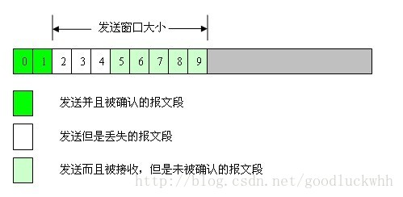
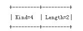
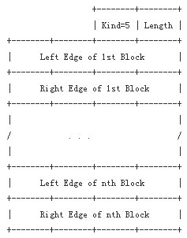

一、SACK选项

默认情况下TCP采取的是累积确认机制，这时如果发生了报文乱序到达，接收方只会重复确认最后一个按序到达的报文段，为此发送方的处理只能是重复按序到达接收方的报文段之后的那个报文段，因而它无法准确知道哪些报文段到达了，哪些没有到达。

考虑以下情景，发送方的窗口状态如下：

如上图所示，主机A通过TCP发送10个长度都为100字节的报文段给主机B，其序号分别为0,100,200,300,400,500,600,00,800,900（图中以数字0-9代替）。主机B收到了序号为0和序号为100的报文段，但是序号为200,300,400的丢失了。之后主机B又收到了报文段500,600,700,800,900。当收到后续这些分组时，主机B只能对报文段100继续进行确认，即发送确认号为200的ACK。主机A收到这样的确认时，能重传的唯一报文段就是报文段200，在报文段200的确认被收到之前发送窗口是无法移动的，这时状况就会很糟糕，发送方每重传一个丢失的报文段，接收方就确认一个（由于是累积确认的，所以情况可能更糟，接收方每次都在等待一段时间后才发送确认），然后发送窗口向前移动一个，这个过程一直持续到报文段200,300,400都被接收方到。显然这种工作方式效率很低，降低了吞吐量。

SACK是TCP选项，它使得接收方能告诉发送方哪些报文段丢失，哪些报文段重传了，哪些报文段已经提前收到等信息。根据这些信息TCP就可以只重传哪些真正丢失的报文段。

需要注意的是只有收到失序的分组时才会可能会发送SACK，TCP的ACK还是建立在累积确认的基础上的。也就是说如果收到的报文段与期望收到的报文段的序号相同就会发送累积的ACK，SACK只是针对失序到达的报文段的。

SACK包括了两个TCP选项，一个选项用于标识是否支持SACK，是在TCP连接建立时时发送；另一种选项则包含了具体的SACK信息。

1.SACK允许选项

该选项格式如下所示：

它的工作机制类似于窗口扩大选项和事件戳选项，只能应用于SYN报文段，在连接建立阶段，主动发起连接的一方在它的SYN中指定选项。只有在它从另一方的SYN中收到了这个选项之后，FAK机制才会被使能。

2.SACK选项

SACK选项的格式如下图所示：

该选项长度可变，但由于整个TCP选项长度不超过40字节，所以实际最多不超过4组边界值。

该选项参数告诉发送哪些报文段是已经接收到并缓存的不连续的报文段，发送方可根据此信息检查究竟是哪个块丢失，从而发送相应的报文段。

1.  LeftEdgeofBlock：不连续块的第一个报文段的序列号

2.  RightEdgeofBlock：不连续块的最后一个报文段的序列号之后的序列号。

3.SACK的产生

SACK由接收方产生并通告给发送方，其产生有以下几种情形：

3.1中间有丢包或延迟时的SACK

如果接收方接收到的报文段序号大于所期待的序号，说明有报文段被丢弃或者出现了大的延迟，此时可以发送SACK通知发送方。

为反映接收方的接收缓存和网络传输情况，SACK中的第一个块必须描述是那个报文段触发了该SACK的发送，接收方应该尽可能地在SACK选项部分中填写尽可能多的块信息，让发送方能了解当前网络传输情况的最新信息。

3.2对重复发送包的SACK(D-SACK)

RFC2883中对SACK进行了扩展。SACK中的信息描述的是收到的报文段，这些报文段可能是正常接收的，也可能是重复接收的，通过对SACK进行扩展，D-SACK可以在SACK选项中描述它重复收到的报文段。但是需要注意的是D-SACK只用于报告接收端收到的最后一个报文与已经接收了的报文的重复部分，比如（来自RFC）：

Transmitted Received ACK Sent

Segment Segment (Including SACK Blocks)

500-999 500-999 1000

1000-1499 (data packet dropped)

1500-1999 (delayed)

2000-2499 (data packet dropped)

2500-2999 (delayed)

3000-3499 (data packet dropped)

3500-3999 3500-3999 1000, SACK=3500-4000

1000-1499 (data packet dropped)

1500-2999 1500-1999 1000, SACK=1500-2000, 3500-4000

2000-2499 1000, SACK=2000-2500, 1500-2000, 3500-4000

1500-2999 1000, SACK=1500-2000, 1500-3000, 3500-4000

可以看出最后一个SACK的第一个块是一个D-SACK，它包含的范围是1500-2000，而不是1500-2500。

在D-SACK使用了SACK同样的工作过程，它只是SACK的一个协议扩展。当使用D-SACK时，选项中的第一个字段的含义是“重复收到的报文段的序号”。其规则：

-   length后的第一个block（也就是第一个4字节）将包含重复收到的报文段的序号。

-   如果D-SACK报告的报文段的序号在累积确认的报文段之后（并且不是期望收到的报文段，因为这是SACK工作的基础，也是D-SACK的基础），则在这个SACK选项中跟在D-SACK之后的第一个非D-SACK块将按照SACK的格式描述该报文段（被D-SACK确认的报文段，但是它所报告的可能比D-SACK报告的大，比如例子中的最后一个S-ACK）

-   跟在D-SACK之后的SACK将按照SACK的方式工作。

-   如果有多个被重复接收的报文段，则D-SACK只包含其中第一个。

如果收到了D-SACK，就表明接收方接收到了重复的报文段，这可能意味着网络中出现了复制或者是发送方过早重传了，或者是ACK丢失导致了不必要的重传。

4.发送方对SACK的响应

TCP的发送方（实际上也就是连接的双方，因为TCP是全双工的）需要维护一个未被确认的重传报文段队列，报文段未被确认前是不能释放的。重传送队列中的每个报文段都有一个标志位“SACKed”标识该报文段是否被SACK过，对于已经被SACK过的块，在重传时将被跳过。

发送方根据接收到的SACK的信息设置重传队列中的报文段的sacked标记。

当支持D-SACK时，发送方通过如下方式来判断是一个SACK还是一个D-SACK：

-   如果SACK中的第一个block指定的序列号小于被累积确认的最后一个序列号，则是一个D-SACK

-   如果SACK中的第一个block指定的序列号落在了其后的block描述的某个范围之内（因为SACK的格式是用两个值描述一个报文段的序号范围），则就是一个D-SACK。

二、F-RTO（ForwardRTORecovery）

根据TCP采取的拥塞控制机制，如果出现了超时，则就会进入拥塞避免算法，而且对于超时的情形会执行“慢启动”，这会极大的降低TCP的吞吐量。

但是由于TCP是建立在IP之上的，IP是无连接的，不同的IP数据报可能走不同的路径，因而属于一个TCP连接的不同的报文段可能走的是不同的路径，这意味着它们可能乱序到达。因此超时可能是因为报文段在IP中走了一条低速路径，并不是真的出现了丢包。考虑以下情景，两个主机A和B之间进行TCP通信，A要发送TCP报文段a,b,c,d,e到B：

1.  A发送报文段a，这时候IP网络选择的路径是path1，它是一个“正常”的路径

2.  IP网络路由发生变化，A和B之间的路径变成了path2，它是一个“低速”路径

3.  A发送报文段b，这时候IP网络使用新的“低速”路径path2

4.  IP网络路由发生变化，A和B之间的路径又变回了path1，它是一个“正常”路径

5.  A发送报文段c，这时候IP网络选择的路径是path1

6.  B收到报文段a，并对它进行确认

7.  A发送报文段d，并使用路径path1

8.  A发送报文段e，并使用路径path1

9.  B收到报文段c，报文乱序，不进行确认

10. A发现报文段b超时，并开始执行拥塞算法

11. B收到报文段b，并对报文段b和c进行确认

12. B收到报文段d，并对它进行确认

13. B收到报文段e，并对它进行确认

这个简单的场景中，很明显报文不是丢弃了，只是因为IP网络的路由变动出现了延时抖动，从而出现了一个虚假的超时。在实际网络中，延时抖动是不可避免的，因而应该要避免这种抖动导致TCP执行拥塞避免算法。TCP采用了F-RTO来解决该问题。

F-RTO的基本思想是判断RTO是否正常，从而决定是否执行拥塞避免算法。方法是观察RTO之后的两个ACK。如果ACK不是冗余ACK，并且确认的包不是重传的，会认为RTO是虚假的就不执行拥塞避免算法。
