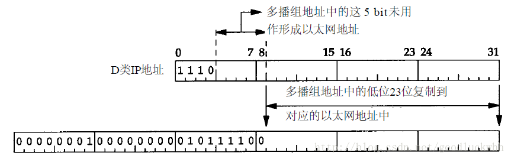
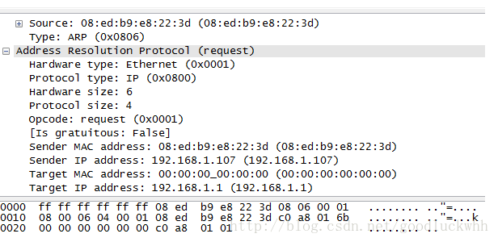

一、RIP

在因特网中，AS即自制系统内部使用的两个选路协议是RIP（路由信息协议，Routing
information Protocol）和OSPF（Open Shortcut Path First）。

RIP是一种距离向量协议，运行方式和理想化的DV算法相似。在RIP中，DV算法中的费用采用的是跳数，即从源路由器到目的路由器的最短路径上的路由器数。RIP中一条路径的最大跳数被限制为15，因此RIP被限制用在网络直径不超过15的自制系统内。DV算法需要在路由器之间发送每个路由器的距离向量信息，RIP通过RIP通告（也称为RIP响应报文）来完成这个功能，RIP通告大约30秒相互交换一次。RIP通告包含了选路更新信息。

每台路由器都维护有一张选路表，它包含了路由器的距离向量个该路由器的转发表。

运行RIP协议的路由器每隔30秒就会发送RIP通告，如果一台路由器超过180秒还没收到邻居的RIP通告，它就认为邻居不再可达。此时它会更新自己的距离向量，并向相邻路由器通告该信息。

RIP也允许路由器主动发送请求报文请求某个邻居更新其路由信息，这是通过发送RIP请求报文实现的。RIP协议使用了DUP协议并使用端口520。

二、OSPF

OSPF也用于自制系统内部，但是它通常被应用于较顶层的ISP中，而RIP一般用于较底层的ISP和企业网内。

OSPF的核心是使用洪泛链路状态信息的链路状态协议和一个Dijkstra最低费用路径算法。使用OSPF时，每台路由器都有一副关于整个自制系统的链路状态的完整拓扑图。每台路由器在本地运行Dijkstra算法，以确定一颗以自己为根节点的到所有子网的最短路径。

在OSPF中各条链路的费用是由管理员设置的，这样管理员就可以影响最短路径的选择，比如管理员可以采用将链路权重值按与链路容量成反比的方式来设置，这样在选路时，有限被选择的就是高带宽链路。OSPF没有强制的链路权值设置策略，它只提供了为给定链路权值确定最低费用路径的机制。

在OSPF中，路由器向自治系统内部的所有其它路由器广播选路信息。每当一条链路状态变化时，路由器就会广播链路状态信息。即使链路状态没有变化，OSPF也要周期性地广播链路状态（至少每隔30分钟）。

OSPF通告包括在OSPF报文中，OSPF报文直接运行在IP之上，它的协议号是89。

OSPF的优点：

-   安全：OSPF对路由器之间的OSPF报文进行了保护。

-   多路径：OSPF允许到达某个目的地有多条费用相同的路径。（这可以通过为不同的IP服务类型创建不同的路由来实现。）

-   支持单播和多播：MOSPF是对OSPF的扩展，它提供了多播选路。

-   支持在单个选路域内的层次结构：OSPF具有按层次结构构造一个自制系统的能力。

一个OSPF自制系统可以配置成多个区域，每个区域都运行自己的OSPF算法，一个区域内的每台路由器都向该区域内的所有其它路由器广播其链路状态。在一个区域内，一台或多台区域边界路由器负责为发送到该区域以外的分组选路。

在OSPF层次结构中，一个区域被配置成主干区域，它包含了AS内所有区域的区域边界路由器以及一些不在任何其它区域内的路由器，该区域的目的是为AS内其它区域之间的流量选路。

三、BGP

BGP是因特网中使用的自制系统间的选路协议，它极其复杂。

四、广播和多播选路

广播选路指的是网络层提供的从一个源节点到网络中所有其它节点的分组选路服务。

多播选路指的是网络层提供的从一个源节点到网络中一组节点的分组选路服务。

1.广播选路

最直接的实现广播选路的方法是由发送节点向所有目的地发送分组的拷贝，这种方法看起来很简单，但是它有一些缺点使得它实用：

-   效率低下，一个分组变成了N个分组，极大的浪费了带宽

-   无法知道所有潜在目的地的地址，除非设计新的协议用于该目的，但是这无疑加大了其难度

-   链路状态协议使用了广播来更新链路状态信息，在这种情况下，广播的目的是产生和更新单播路由，因而如果再反过来用单播来实现广播就变得不明智了

因而必须采用其它方式来实现广播选路。

1.无控制泛洪

实现广播最显而易见的方式是使用泛洪，即所有节点都向除了它接收分组的那个邻居之外的所有邻居转发分组。只要网络是连通的，分组必然可以到达所有节点，但是根据最简单的图论知识也可以知道，分组将在整个网络内不受限制的被复制，直到它们的生存时间到期。这将形成广播风暴，导致网络变得不可用。

2.受控泛洪

避免广播风暴的关键在于：每个节点可以选择泛洪分组的时机。有两种方案可以解决广播风暴的问题：

1.  序号控制泛洪：源节点将其地址以及广播序号放入广播分组，再向网络泛洪分组。每个节点维护它收到的、复制的和转发的每个广播分组的序号列表，每当它收到一个广播分组时，都检查该表，如果已经存在就不泛洪，否则泛洪，并将新的信息更新到该表中。

2.  反向路径转发（RPF）：当一台路由器接收到具有给定源地址的广播分组时，仅当该分组到达的链路正好是位于它自己到其源的最短单播路径上时，它才泛洪分组。否则它丢弃分组。

3.生成树广播

受控泛洪解决了广播风暴的问题，但是网络中还是会存在冗余的广播分组。生成树方案可以解决该问题。

生成树：包含网络中的所有节点的，并使用网络中的链路所连接起来的连通图。

最小生成树：每段链路的费用之和在所有生成树中最小的生成树。

生成树广播指的是首先先对网络节点狗仔一棵生成树，当一个节点要发送一个广播分组时，它向所有属于该生成树的特定链路发送分组。该方案的复杂性在于生成树的生成和维护。

实际中，OSPF使用了序号控制方法。

2.多播选路

多播用于将分组交付给网络节点的一个子集。

多播通信中，有两个问题，一是怎样标识多播分组的接收方，怎么为多播分组的接收方编址。解决方案是使用简介地址编址，即用一个标识来标识一组接收方，寻址到该组的分组会被交付给与该分组相关的多播接收方。IPv4使用D类地址用于该目的，IPv6也有自己的多播地址格式。与一个多播地址关联的接收方组称为多播组。

1.IGMP

在有了多播地址后，如果一个主机想要接收多播分组，就必须在多播地址和它自己之间建立关联关系，这是通过IGMP协议来实现的，主机通过该协议来通知主机的默认路由器“我要加入到某个多播组或者退出某个多播组”，路由器根据该信息来决定是否转发多播分组到主机。

2.多播选路

多播选路的目的是发现一颗链路树，该树连接了所有属于该多播组的主机相连的路由器。之后多播分组就可以沿着该树从发送方路由到所有属于该多播组的主机。选路树的构建有两种方法：

使用一颗组共享树进行多播选路：该方法基于一棵构建的树，该树包括了所有具有该多播组相连主机的路由器。该多播组的分组基于该树转发

基于一棵基于源的树进行多播
选路：该方法为多播组中的每个源构建一颗多播选路数。实际中采用了RPF算法来构建该树，同时使用剪枝算法来修正该树。剪枝算法是指：如果一台路由器接收到了娿一个多播分组，而它无加入到该分组的主机，就向其上游发送一个剪枝报文，收到该剪枝报文的路由器将不会向该路由器转发该多播组的分组；如果一台路由器的每个下游路由器都向它发送了剪枝报文，它就向其上游发送一个剪枝报文。

因特网中使用的多播选路算法有DVMRP（Distance Vector Multicast Routing
Protocol）和PIM（Protocol-Independent Multicast）。

五、MAC地址到IP地址的映射

网络层用于在因特网中标识主机，并为主机之间提供选路和转发功能，但是物理上一个接口能否接收报文则取决于它的链路层地址（不考虑混杂模式，混杂模式下接口网卡会接收所有报文）。对于广播和组播，IP地址和链路层地址之间的关系是有固定算法的，所以很容易由IP地址得到链路层地址，但是对于单播，就必须有一种方法来将IP地址和链路层地址关联起来，在IPv4中这是通过地址解析协议ARP来实现的。ARP为IP地址和对应的硬件地址之间提供了动态映射。

1.多播地址的MAC地址

IPv4中多播地址与MAC地址的对应关系如图：

即MAC地址的高25比特固定为00000001 00000000 01011110
0，低23比特取自IP多播地址的低23比特。由于除了作为前缀的4个比特之外，还有5个比特未进入MAC地址，因而一个MAC多播地址对应了32个IP多播地址。

IPv6中多播地址与MAC地址的对应关系如图：

即MAC地址的高16比特固定为3333，低32比特取自IP多播地址的低32比特。

2.ARP的报文格式为：

-   以太网报头中的前两个字段是以太网的源地址和目的地址。目的地址为全1的特殊地址是广播地址。电缆上的所有以太网接口都要接收广播的数据帧。

-   两个字节长的以太网帧类型表示后面数据的类型。对于ARP请求或应答来说，该字段的值为0x0806。

-   形容词hardware(硬件)和protocol(协议)用来描述ARP分组中的各个字段。例如，一个ARP请求分组询问协议地址（这里是IP地址）对应的硬件地址（这里是以太网地址）。

-   硬件类型字段表示硬件地址的类型。它的值为1即表示以太网地址。协议类型字段表示要映射的协议地址类型。它的值为0x0800即表示IP地址。它的值与包含IP数据报的以太网数据帧中的类型字段的值相同。

-   接下来的两个1字节的字段，硬件地址长度和协议地址长度分别指出硬件地址和协议地址的长度，以字节为单位。对于以太网上IP地址的ARP请求或应答来说，它们的值分别为6和4。

-   操作字段指出四种操作类型，它们是ARP请求（值为1）、ARP应答（值为2）、RARP请求（值为3）和RARP应答（值为4）（我们在第5章讨论RARP）。这个字段必需的，因为ARP请求

-   和ARP应答的帧类型字段值是相同的。

-   接下来的四个字段是发送端的硬件地址（在本例中是以太网地址）、发送端的协议地址（IP地址）、目的端的硬件地址和目的端的协议地址。注意，这里有一些重复信息：在以太网的数据帧报头中和ARP请求数据帧中都有发送端的硬件地址。

-   对于一个ARP请求来说，除目的端硬件地址外的所有其他的字段都有填充值。当系统收到一份目的端为本机的ARP请求报文后，它就把硬件地址填进去，然后用两个目的端地址分别替换两个发送端地址，并把操作字段置为2，最后把它发送回去。

3.ARP的简单工作过程

当一台主机需要和另一台主机通信时，它会首先查找路由表来获得下一跳的信息，如果下一跳信息中不包含MAC地址，它就需要解析下一跳的MAC地址，这时它就发送一个ARP请求到下一跳，而下一跳收到该请求后，就会发送一个ARP应答报文来告诉请求者它的MAC地址。在获得这个MAC地址之后，主机就可以继续自己的通信过程了。

ARP请求报文是一个广播报文，目的MAC地址为全F，而源MAC地址为自己的MAC地址。负载中的信息包含了发送者的IP地址和MAC地址，以及目的IP地址，目的MAC地址为全0，一个例子如图：

ARP响应报文是一个单播报文，只会被发送给请求者。一个例子如图：

4.ARP代理

如果ARP请求是从一个网络的主机发往另一个网络上的主机，那么连接这两个网络的路由器就可以回答该请求，这个过程称作委托ARP或ARP代理(ProxyARP)。这样可以欺骗发起ARP请求的发送端，使它误以为路由器就是目的主机，而事实上目的主机是在路由器的“另一边”。路由器的功能相当于目的主机的代理，把分组从其他主机转发给它。

5.免费ARP

一个ARP特性称作免费ARP(gratuitousARP)。它是指主机发送ARP查找自己的IP地址。通常，它发生在系统引导期间进行接口配置的时候。

免费ARP可以有两个方面的作用：

1.  一个主机可以通过它来确定另一个主机是否设置了相同的IP地址。

2.  如果发送免费ARP的主机正好改变了硬件地址（很可能是主机关机了，并换了一块接口卡，然后重新启动），那么这个分组就可以使其他主机高速缓存中旧的硬件地址进行相应的更新。一个比较著名的ARP协议事实[Plummer1982]是，如果主机收到某个IP地址的ARP请求，而且它已经在接收者的高速缓存中，那么就要用ARP请求中的发送端硬件地址（如以太网地址）对高速缓存中相应的内容进行更新。主机接收到任何ARP请求都要完成这个操作（ARP请求是在网上广播的，因此每次发送ARP请求时网络上的所有主机都要这样做）。

5.IPv6的地址解析

IPv6不适用ARP协议，而是使用ICMPv6协议中的ND(neighbor
discover)来完成对应的解析过程。
