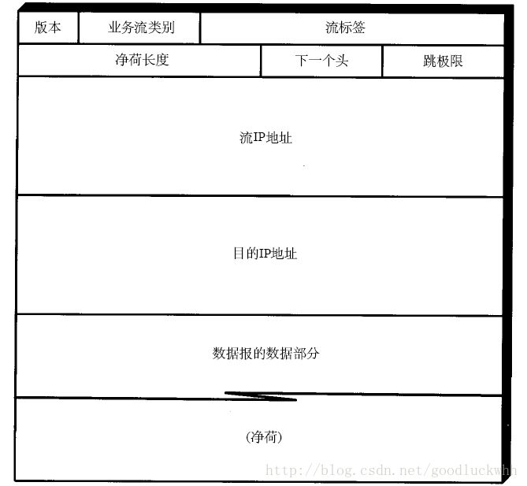
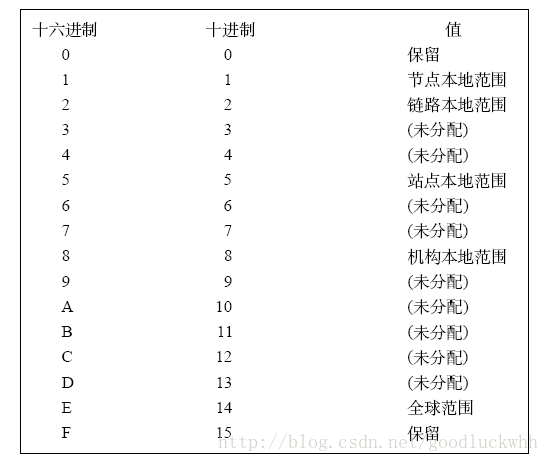

IP(internet
protocol)协议是TCP/IP协议族的核心协议，是因特网的网络层。当前的版本号是4，也称为IPv4，下一代IP协议的版本号为6即IPv6。正如描述的网络层功能一样，IP层为因特网提供了选路和转发的功能。接入因特网的主机之间可以通过IP层而互相通信，在IP层，IP地址用于标识接入网络的接口，进而标识一台主机。当信息在TCP/IP协议栈中传递时，每层都会添加其自己的控制信息，即协议头，IP地址被添加在IP头中。IP头提供了IP协议以及数据报的信息。

一、IPv4数据报格式

当接入网络的两台设备通过IP层互相通讯时，交互的信息会被封装成网络层分组，网络层分组又被称为数据报。IPv4的数据报格式如下：

其各个字段的含义如下：

-   版本号：协议版本号，IPv4为4，IPv6则为6（当然IPv6的头部不完全是这样，但是4个比特含义一致）

-   首部长度：首部长度指的是首部占32
    bit字的数目，包括任何选项。因此IPv4首部最长为60个字节

-   服务类型：服务类型（TOS）字段包括一个3 bit的优先权子字段（现在已被忽略），4
    bit的TOS子字段和1 bit未用位但必须置0。4 bit的TO
    S分别代表：最小时延、最大吞吐量、最高可靠性和最小费用

-   数据报长度：以字节为单位的整个IP数据报的长度（包括首部）。

-   标识、标志、片偏移：标识用来唯一确定主机发送的每一个IP数据报。标志和片偏移用来支持IP分片，当然它们必须和标识一起使用。IPv6则不允许在路由器分片，在IPv6中，分片和重组必须在源和目的进行

-   生存时间：数据报可以经过的路由器数，这使得IP数据报早晚会在网络中消失，即要么被消失，要么由于生存时间达到而“死亡”

-   协议：标识IP层承载的上一层协议类型，比如UDP/TCP/SCTP。

-   首部校验和：首部检验和字段是根据I
    P首部计算的检验和码。IPv6首部中不再包含首部校验和。

-   源、目的地址：源的IP地址和目的的IP地址

-   选项：最后一个字段是任选项，是数据报中的一个可变长的可选信息。主要包括：

    -   安全和处理限制

    -   记录路径（让每个路由器都记下它的I P地址）

    -   时间戳（让每个路由器都记下它的I P地址和时间）

    -   宽松的源站选路（为数据报指定一系列必须经过的I P地址）

    -   严格的源站选路（与宽松的源站选路类似，但是要求只能经过指定的这些地址，不能经过其他的地址）。

1.IP分片

数据链路层一般要限制每次发送数据帧的最大长度。任何时候IP层接收到一份要发送的IP数据报时，它要判断向本地哪个接口发送数据（选路），并查询该接口获得其MTU。IP把MTU与数据报长度进行比较，如果需要则进行分片。分片可以发生在原始发送端主机上，也可以发生在中间路由器上。但是分片报文只有到了最终目的地才会被重组。重新组装由目的地的IP层来完成，其目的是使分片和重新组装过程对运输层（比如TCP）是透明的。

IP头部包含一个由数据报原始发送者设置的标识字段，它在由该发送者发送的IP数据报中是唯一的。该值在数据报分片时被复制到每个片中。标志字段用其中一个比特来表示“更多的片”。除了最后一片外，其他每个组成数据报的片都要把该比特置1。片偏移字段指的是该片偏移原始数据报开始处的位置。另外，当数据报被分片后，每个片的总长度值要改为该片的长度值。

标志字段中有一个比特称作“不分片”位。如果将这一比特置1，IP将不对数据报进行分片，在这种情况下，如果路由器判断需要分片就把数据报丢弃并发送一个ICMP差错报文（“需要进行分片但设置了不分片比特”）给数据报的源主机。

当IP数据报被分片后，每一片都成为一个分组，具有自己的IP首部，并在选择路由时与其他分组独立。这样，当数据报的这些片到达目的端时有可能会失序，但是在IP首部中有足够的信息让接收端能正确组装这些数据报片。

但是IP分片存在一个严重的缺陷：即使只丢失一片数据也要重传整个数据报。

在IPv6中，分片功能被限制在源主机进行，这是因为分片增加了网络核心（即路由器）的工作量，使得它不得不为所有报文进行分片处理的判断，网络核心应该更专注于它选路和转发的功能，而不是被额外的处理所打断。

二、IPv4地址

在因特网中，无论是主机还是路由器，都通过接口接入网络。接口是主机或路由器接入网络的装置，一般情况下，一个主机由一个接口，而路由器有多个接口。为了使得接口能够工作在网络层，每个接口都需要有IP地址。因此，IP实际上是和接口相关联的，而不是与主机或路由器相连的。

1.IPv4地址格式

IP地址是一个32位的二进制数，通常被分割为4个“8位二进制数”（也就是4个字节）。IP地址通常用“点分十进制”表示成（a.b.c.d）的形式，其中，a,b,c,d都是0\~255之间的十进制整数。例：点分十进IP地址（100.4.5.6），实际上是32位二进制数（01100100.00000100.00000101.00000110）。

因特网中，每台主机或路由器的接口都有一个IP地址。但是每个接口的IP地址不能随意选择，每个接口的IP地址的组成部分需要由其连接的子网来决定。

1.分类编址

最初设计互联网络时，为了便于寻址以及层次化构造网络，每个IP地址包括两个标识码（ID），即网络ID和主机ID。同一个物理网络上的所有主机都使用同一个网络ID，网络上的一个主机（包括网络上工作站，服务器和路由器等）有一个主机ID与其对应。Internet委员会定义了5种IP地址类型以适合不同容量的网络，即A类\~E类。其中A、B、C3类（如下表格）由InternetNIC在全球范围内统一分配，D、E类为特殊地址。

| 网络类别 | 最大网络数     | 第一个可用的网络号 | 最后一个可用的网络号 | 每个网络中的最大主机数 |
|----------|----------------|--------------------|----------------------|------------------------|
| A        | 126（2\^7-2)   | 1                  | 126                  | 16777214               |
| B        | 16384(2\^14)   | 128.0              | 191.255              | 65534                  |
| C        | 2097152(2\^21) | 192.0.0            | 223.255.255          | 254                    |

其地址布局如下图：

A类IP地址

一个A类IP地址是指，
在IP地址的四段号码中，第一段号码为网络号码，剩下的三段号码为本地计算机的号码。如果用二进制表示IP地址的话，A类IP地址就由1字节的网络地址和3字节主机地址组成，网络地址的最高位必须是“0”。A类IP地址中网络的标识长度为8位，主机标识的长度为24位，A类网络地址数量较少，可以用于主机数达1600多万台的大型网络。

A类IP地址 地址范围1.0.0.0到126.255.255.255[2]（二进制表示为：00000001 00000000
00000000 00000001 - 01111111 11111111 11111111 11111111）。最后一个是广播地址。

A类IP地址的子网掩码为255.0.0.0，每个网络支持的最大主机数为256的3次方-2=16777214台。

B类IP地址

一个B类IP地址是指，在IP地址的四段号码中，前两段号码为网络号码。如果用二进制表示IP地址的话，B类IP地址就由2字节的网络地址和2字节主机地址组成，网络地址的最高位必须是“10”。B类IP地址中网络的标识长度为16位，主机标识的长度为16位，B类网络地址适用于中等规模的网络，每个网络所能容纳的计算机数为6万多台。

B类IP地址地址范围128.0.0.0-191.255.255.255[1]（二进制表示为：10000000 00000000
00000000 00000001----10111111 11111111 11111111 11111110）。
最后一个是广播地址。

B类IP地址的子网掩码为255.255.0.0，每个网络支持的最大主机数为256的2次方-2=65534台

C类IP地址

一个C类IP地址是指，在IP地址的四段号码中，前三段号码为网络号码，剩下的一段号码为本地计算机的号码。如果用二进制表示IP地址的话，C类IP地址就由3字节的网络地址和1字节主机地址组成，网络地址的最高位必须是“110”。C类IP地址中网络的标识长度为24位，主机标识的长度为8位，C类网络地址数量较多，适用于小规模的局域网络，每个网络最多只能包含254台计算机。

C类IP地址范围192.0.0.0-223.255.255.255[1]（二进制表示为: 11000000 00000000
00000000 00000001 - 11011111 11111111 11111111 11111110）。

C类IP地址的子网掩码为255.255.255.0，每个网络支持的最大主机数为256-2=254台

D类IP地址

D类地址被IP用作多播。多播为IP提供了向过个目地转发数据的能力。

D类地址的28bit均用作多播组号而不再表示其他。多播组地址包括为1110的最高4bit和多播组号。它们通常可表示为点分十进制数，范围从224.0.0.0到239.255.255.255。

能够接收发往一个特定多播组地址数据的主机集合称为主机组(hostgroup)。一个主机组可跨越多个网络。主机组中成员可随时加入或离开主机组。主机组中对主机的数量没有限制，同时不属于某一主机组的主机可以向该组发送信息。

一些多播组地址被IANA确定为知名地址。它们也被当作永久主机组。

特殊的网址

1.  每一个字节都为0的地址（“0.0.0.0”）对应于当前主机；

2.  IP地址中的每一个字节都为1的IP地址（“255．255．255．255”）是当前子网的广播地址；

3.  IP地址中凡是以“llll0”开头的E类IP地址都保留用于将来和实验使用。

4.  IP地址中不能以十进制“127”作为开头，该类地址中数字127．0．0．1到127．255．255．255用于回路测试，如：127.0.0.1可以代表本机IP地址，用“http://127.0.0.1”就可以测试本机中配置的Web服务器。

5.  网络ID的第一个6位组也不能全置为“0”，全“0”表示本地网络。

2.CIDR编址

当前采用的地址分配策略为无类别域间选路（CIDR）。CIDR 消除了传统的 A 类、B 类和 C
类地址以及划分子网的概念，因而可以更加有效地分配 IPv4
的地址空间。在分类编址方案中，只有A,B,C三类地址可用，但是对于有的组织来说，它的大小可能位于B和C类之间，如果用C类地址，不够用，而用B类地址又会导致宝贵的地址资源的浪费。采用CIDR方案即可解决这个问题。

在这种编址方案中IP地址被分为网络部分和主机部分两部分，并且具有形式a.b.c.d/x，其中x指示了第一部分中的比特数。前x比特被称为该地址的前缀。该组织内部的设备得IP都将具有该前缀，因而对于外部的路由器，它只需要一条指向该前缀的路由即可。当数据报进入该组织内部网络后，内部的路由器将根据32-x比特的信息转发数据报。

CIDR 把网络前缀都相同的连续的 IP 地址组成“CIDR 地址块”。

2.地址分配管理

1.地址管理和获取

虽然知道了IP的格式，但是用户不可能随意定义自己的IP。做个简单的比方，你不可能给你自家所在的地方随意起个名字，然后就让快递公司给你送件，快递公司是不知道你自定义的这个地址的信息的。为了获得一个可以工的IP地址，这个IP必须是被因特网中的路由器所承认的，为什么是路由器？因为路由器决定了数据报怎么选路，怎么转发，因而只有路由器能够将数据报转发给你的主机，你的主机才算是接入了网络，因而从这个意义说，路由器在因特网中扮演了核心角色。

从因特网的结构上来说，用户需要从ISP获取一个IP地址或地址块，而ISP则向它的上一级ISP获取地址块，最终所有的地址都来自于ICANN，因特网名字与号码分配机构。

2.获取主机地址

上边描述的是地址的来源和管理方式。但是并没有真正将地址分配给接口。从技术上来说，将IP分配给接口有两种方式，手动配置或动态配置。更常用的是动态配置，因为这更加灵活方便，也可以降低
管理员的负担。动态配置是通过DHCP，即动态主机配置协议实现的。它不仅可以用于获取IP信息，它还可以获取子网掩码，第一条路由器，DNS服务器地址等等信息，因而也是很重要很常用的一个协议。

3.私有地址

ICANN只管理公共地址，还有部分地址私有地址。私有地址（Private
address）属于非注册地址，专门为组织机构内部使用。

以下列出留用的内部私有地址

A类 10.0.0.0--10.255.255.255

B类 172.16.0.0--172.31.255.255

C类 192.168.0.0--192.168.255.255

3.NAT和UPnP

1.NAT

网络地址转换(NAT,Network Address
Translation)属接入广域网(WAN)技术，是一种将私有（保留）地址转化为合法IP地址的转换技术，它被广泛应用于各种类型Internet接入方式和各种类型的网络中。原因很简单，NAT不仅完美地解决了lP地址不足的问题，而且还能够有效地避免来自网络外部的攻击，隐藏并保护网络内部的计算机。

NAT将自动修改IP报文的源IP地址和目的IP地址，IP地址校验则在NAT处理过程中自动完成。有些应用程序将源IP地址嵌入到IP报文的数据部分中，所以还需要同时对报文的数据部分进行修改，以匹配IP头中已经修改过的源IP地址。否则，在报文数据部分嵌入IP地址的应用程序就不能正常工作。

NAT的实现方式有三种，即静态转换Static Nat、动态转换Dynamic
Nat和端口多路复用OverLoad。

1.  静态转换：是指将内部网络的私有IP地址转换为公有IP地址，IP地址对是一对一的，是一成不变的，某个私有IP地址只转换为某个公有IP地址。借助于静态转换，可以实现外部网络对内部网络中某些特定设备（如服务器）的访问。

2.  动态转换：是指将内部网络的私有IP地址转换为公用IP地址时，IP地址是不确定的，是随机的，所有被授权访问上Internet的私有IP地址可随机转换为任何指定的合法IP地址。也就是说，只要指定哪些内部地址可以进行转换，以及用哪些合法地址作为外部地址时，就可以进行动态转换。动态转换可以使用多个合法外部地址集。当ISP提供的合法IP地址略少于网络内部的计算机数量时。可以采用动态转换的方式。

3.  端口多路复用（Port address
    Translation,PAT)：是指改变外出数据包的源端口并进行端口转换，即端口地址转换（PAT，Port
    Address
    Translation).采用端口多路复用方式。内部网络的所有主机均可共享一个合法外部IP地址实现对Internet的访问，从而可以最大限度地节约IP地址资源。同时，又可隐藏网络内部的所有主机，有效避免来自internet的攻击。因此，目前网络中应用最多的就是端口多路复用方式。

无论采用哪种方式，在内部都使用了一张NAT转换表，它记录了地址转换的相关信息。

NAT也有一些争议：

1.  它使用了端口号，而端口号在设计中是为了区分网络程序的。

2.  它使得路由器必须处理网络层以上的信息，违反了分层原则

3.  它违反了端到端原则，即主机之间应相互直接通信

2.UPnP

UPnP指的是通用即插即用，它可以用来支持NAT穿越。它要求主机和NAT是UPnP兼容的。使用它时，在一台主机上运行的应用程序能够为某些请求的公告端口号请求一个NAT映射，该映射位于（私有IP地址，私有端口号）和（公共IP地址，公共端口号）之间。如果NAT接受了这个请求，并且声称该映射，则来自外部的节点就能够发起到（公共IP地址，公共端口号）的TCP连接。

三、ICMP

ICMP是（Internet Control Message
Protocol）Internet控制报文协议。它是TCP/IP协议族的一个子协议，用于在IP主机、路由器之间传递控制消息。控制消息是指网络通不通、主机是否可达、路由是否可用等网络本身的消息。这些控制消息虽然并不传输用户数据，但是对于用户数据的传递起着重要的作用。

ICMP属于网络层协议，它提供一致易懂的出错报告信息。发送的出错报文返回到发送原数据的设备，因为只有发送设备才是出错报文的逻辑接受者。发送设备随后可根据ICMP报文确定发生错误的类型，并确定如何才能更好地重发失败的数据包。但是ICMP唯一的功能是报告问题而不是纠正错误，纠正错误的任务由发送方完成。

ICMP报文如下：

ICMP报文可以分为两大类：ICMP查询报文和ICMP差错报文。

对于ICMP差错报文，ICMP报文总是会包含引起该ICMP报文首次产生的IP数据报的首部和前8字节的内容，而且以下情形不会产生ICMP差错报文：

1.  ICMP差错报文。

2.  的地址是广播地址或多播地址的IP数据报。

3.  作为链路层广播的数据报。

4.  不是IP分片的第一片。

5.  源地址不是单个主机的数据报。这就是说，源地址不能为零地址、环回地址、广播地址或多播地址。

ICMP查询报文被用来查询网络相关的一些信息，比如回显应答和请求（ping），路由器请求和通告，时间戳等。

四、IPv6

现在广泛使用的IP技术是IPv4，它存在一些问题：

1.  地址空间的局限性： I P地址空间的危机由来已久，并正是升级的主要动力。

2.  性能：尽管I P表现得不错，一些源自2 0年甚至更早以前的设计还能够进一步改进。

3.  安全性：安全性一直被认为是由网络层以上的层负责，但它现在已经成为IP的下一个版本可以发挥作用的地方。

4.  自动配置：对于I P v
    4节点的配置一直比较复杂，而网络管理员与用户则更喜欢“即插即用”，即：将计算机插在网络上然后就可以开始使用。I
    P主机移动性的增强也要求当主机在不同网络间移动和使用不同的网络接入点时能提供更好的配置支持。

这些问题是IP升级的动力，下一代的IP技术室IP版本6即IPv6。

相对于IPv4，IPv6的变化主要包括：

-   扩展地址。地址扩展到了128比特，地址空间增大了2的96次方倍。

-   简化头格式。字段只有8个，加快报文转发，提高了吞吐量。

-   增强对于扩展和选项的支持。可以支持更多的服务，也简化了报文转发的处理。

-   流标记。路由器需要对流进行跟踪并保持一定的信息，这些信息在流中的每个包中都是不变的。这种方法使路由器可以对流中的包进行高效处理。

-   身份验证和保密。身份认证和隐私权是IPV6的关键特性。

1.IPv6头部

IPv6头部如下图所示：

-   版本。长度为4位，对于IPv6，该字段必须为6。

-   类别。长度为8位，指明为该包提供了某种“区分服务”。该字段的定义独立于IPv6，目前尚未在任何RFC中定义。该字段的默认值是全0。

-   流标签。长度为20位，用于标识属于同一业务流的包。一个节点可以同时作为多个业务流的发送源。流标签和源节点地址唯一标识了一个业务流。

-   净荷长度。长度为16位，其中包括包净荷的字节长度，即IPv6头后的包中包含的字节数。这意味着在计算净荷长度时包含了IPv6扩展头的长度。

-   下一个头。这个字段指出了IPv6头后所跟的头字段中的协议类型。与IPv6协议字段类似，下一个头字段可以用来指出高层是TCP还是UDP，但它也可以用来指明IPv6扩展头的存在。

-   跳极限。长度为8位。每当一个节点对包进行一次转发之后，这个字段就会被减1。如果该字段达到0，这个包就将被丢弃。

-   源地址。长度为128位，指出了IPv6包的发送方地址。

-   目的地址。长度为128位，指出了IPv6包的接收方地址。这个地址可以是一个单播、多播或任意点播地址。如果使用了选路扩展头(其中定义了一个包必须经过的特殊路由)，其目的地址可以是其中某一个中间节点的地址而不必是最终地址。

与IPv4相比的变化有：

1.  包头长度不存在了因为IPv6的头是固定长度。

2.  服务类型字段变成了流类别。

3.  数据报长度变成了净荷长度。IPv6的净荷长度中包含了扩展头，而IPv4数据报长度字段中则指明包含包头在内的整个数据报的长度。因而在IPv4中，路由器需要将数据报长度减去包头长度来计算包的净荷长度，而在IPv6中则无须这种计算。

4.  数据报ID，标识和标志三个字段被删除了，因为它们在IPv4中用于数据报分片，但是IPv6中分片通过分片扩展头来实现而且必须在源设备完成。

5.  生存字段变成了跳极限，使用方式类似

6.  协议字段变成了下一个头。v4中协议字段用来指示高层的协议类别，但是这里的下一个头可以用来指示扩展头或者高层协议头。

7.  头部校验和被删除，因为由于如TCP和UDP等高层协议均计算头的校验和，
    IPv4头校验显得有些多余，因此这个字段在IPv6中已消失。对于那些真的需要对内容进行身份验证的应用，
    IPv6中提供了身份验证头。

8.  源目地址被扩展到了128比特。

2.编址

1.地址表达方式

IPv6地址长度4倍于IPv4地址，表达起来的复杂程度也是IPv4地址的4倍。IPv6地址的基本表达方式是X:X:X:X:X:X:X:X，其中X是一个4位十六进制整数(16位)。每一个数字包含4位，每个整数包含4个数字，每个地址包括8个整数，共计128位(4×4×8=128)。例如，下面是一些合法的IPv6地址：

CDCD:910A:2222:5498:8475:1111:3900:2020

1030:0:0:0:C9B4:FF12:48AA:1A2B

2000:0:0:0:0:0:0:1

请注意这些整数是十六进制整数，其中A到F表示的是10到15。地址中的每个整数都必须表示出来，但起始的0可以不必表示。这是一种比较标准的IPv6地址表达方式，此外还有另外两种更加清楚和易于使用的方式。

某些IPv6地址中可能包含一长串的0(就像上面的第二和第三个例子一样)。当出现这种情况时，标准中允许用“空隙”来表示这一长串的0。换句话说，地址

2000:0:0:0:0:0:0:1

可以被表示为：

2000::1

这两个冒号表示该地址可以扩展到一个完整的128位地址。在这种方法中，只有当16位组全部为0时才会被两个冒号取代，且两个冒号在地址中只能出现一次。

在IPv4和IPv6的混合环境中可能有第三种方法。IPv6地址中的最低32位可以用于表示IPv4地址，该地址可以按照一种混合方式表达，即X:X:X:X:X:X:d.d.d.d，其中X表示一个16位整数，而d表示一个8位十进制整数。例如，地址

0:0:0:0:0:0:10.0.0.1

就是一个合法的IPv4地址。把两种可能的表达方式组合在一起，该地址也可以表示为：

::10.0.0.1

由于IPv6地址被分成两个部分—子网前缀和接口标识符，因此人们期待一个IP节点地址可以按照类似CIDR地址的方式被表示为一个携带额外数值的地址，其中额外数值指出了地址中有多少位是掩码。即，IPv6节点地址中指出了前缀长度，该长度与IPv6地址间以斜杠区分，例如：

1030:0:0:0:C9B4:FF12:48AA:1A2B/60

这个地址中用于选路的前缀长度为60位。

IPv6128比特地址空间的划分如下图:

2.寻址模型

IPv6寻址模型与IPv4很相似。每个单播地址标识一个单独的网络接口。IP地址被指定给网络接口而不是设备，因此一个拥有多个网络接口的设备可以具备多个IPv6地址，其中任何一个IPv6地址都可以代表该设备。尽管一个网络接口能与多个单播地址相关联，但一个单播地址只能与一个网络接口相关联。每个网络接口必须至少具备一个单播地址。

这里有一个非常重要的声明和一个非常重要的例外。这个声明与点到点链路的使用有关。在IPv4中，所有的网络接口，其中包括连接一个设备与路由器的点到点链路(用许多拨号Internet连接中)，都需要一个专用的IP地址。随着许多机构开始使用点到点链路来连接其分支机构，每条链路均需要其自己的子网,这样一来消耗了许多地址空间。在IPv6中，如果点到点链路的任何一个端点都不需要从非邻居设备接受和发送数据的话，它们就可以不需要特殊的地址。即，如果两个设备主要是传递业务流，则它们并不需要具备IPv6地址。

为每个网络接口分配一个全球唯一的单播地址的要求阻碍了IPv4地址的扩展。一个提供通用服务的服务器在高需求量的情况下可能会崩溃。因此，IPv6地址模型中又提出了一个重要的例外：如果硬件有能力在多个网络接口上正确地共享其网络负载的话，那么多个网络接口可以共享一个IPv6地址。这使得从服务器扩展至负载分担的服务器群成为可能，而不再需要在服务器的需求量上升时必须进行硬件升级。

3.地址类型

IPv6地址有三种类型：单播、多播和任意点播。广播地址已不再有效。RFC
2373中定义了三种IPv6地址类型：

-   单播：一个单接口的标识符。送往一个单播地址的包将被传送至该地址标识的接口上。

-   泛播：一组接口(一般属于不同节点)的标识符。送往一个泛播地址的包将被传送至该地址标识的接口之一(根据选路协议对于距离的计算方法选择“最近”的一个)。

-   多播：一组接口(一般属于不同节点)的标识符。送往一个多播地址的包将被传送至有该地址标识的所有接口上。

1.单播

单播地址标识了一个单独的IPv6接口。一个节点可以具有多个IPv6网络接口。每个接口必须具有一个与之相关的单播地址。单播地址可被认为包含了一段信息，这段信息被包含在128位字段中：该地址可以完整地定义一个特定的接口。此外，地址中数据可以被解释为多个小段的信息。但无论如何，当所有的信息被放在一起后，将构成标识一个节点接口的128位地址。

IPv6地址本身可以为节点提供关于其结构的或多或少的信息，这主要根据是由谁来观察这个地址以及观察什么。例如，节点可能只需简单地了解整个128位地址是一个全球唯一的标识符，而无须了解节点在网络中是否存在。另一方面，路由器可以通过该地址来决定，地址中的一部分标识了一个特定网络或子网上的一个唯一节点。

RFC 2373定义的IPv6单播地址格式如下：

IPv6单播地址包括下面几种类型：

-   可集聚全球地址。

-   未指定地址或全0地址。

-   回返地址。

-   嵌有IPv4地址的IPv6地址。

-   基于供应商和基于地理位置的供应商地址。

-   OSI网络服务访问点(NSAP)地址。

-   网络互联包交换(IPX)地址。

2.多播

多播用于标识一组节点，它的工作过程是：当设备预订多播地址时，它声明要成为多播的一个成员。于是任何本地路由器将以该节点的名义预订多播地址。同一网络上的其他设备要发送信息到该多播地址时，IP多播包将被封装到链路层多播数据传输单元中。并发送给设备。

IPv6多播地址格式如下图：

多播地址只能用作目的地址，没有数据报把多播地址用作源地址。地址格式中的第1个字节为全“1”，标识其为多播地址。多播地址占了IPv6

地址空间的整整1/256。多播地址格式中除第1字节外的其余部分，包括如下三个字段：

-   标志字段：由4个单个位标志组成。从左到右分别为：

    -   最高位为保留位，必须为 0。

    -   R 位取0 表示非内嵌RP 的组播地址；取1 则表示内嵌RP 的组播地址，此时P、T
        位也必须置1。

    -   P 位取0 表示非基于单播前缀的组播地址；取1
        则表示基于单播前缀的组播地址，此时T 位也必须置1。

    -   T 位取0 表示永久分配组播地址；取1 则表示非永久分配的组播地址。

-   范围字段：长4位，用来表示多播的范围。即，多播组是只包括同一本地网、同一站点、同一机构中的节点，还是包括IPv6全球地址空间中任何位置的节点。该4位的可能值为0\~15，

-   组标识符字段：长112位，用于标识多播组。根据多播地址是临时的还是熟知的以及地址的范围，同一个多播标识符可以表示不同的组。永久多播地址用指定的赋予特殊含义的组标识符，组中的成员既依赖于组标识符，又依赖于范围。

多播范围取值及其意义如图：

3.泛播

多播地址在某种意义上可以由多个节点共享。多播地址成员的所有节点均期待着接收发给该地址的所有包。泛播地址与多播地址类似，同样是多个节点共享一个泛播地址，不同的是，只有一个节点期待接收给泛播地址的数据报。

泛播对提供某些类型的服务特别有用，尤其是对于客户机和服务器之间不需要有特定关系的一些服务，例如域名服务器和时间服务器。名字服务器就是个名字服务器，不论远近都应该工作得一样好。同样，一个近的时间服务器，从准确性来说，更为可取。因此当一个主机为了获取信息，发出请求到泛播地址，响应的应该是与该泛播地址相关联的最近的服务器。

1.泛播地址的分配及其格式

泛播地址被分配在正常的IPv6单播地址空间以外。因为泛播地址在形式上与单播地址无法区分开，一个泛播地址的每个成员，必须显式地加以配置，以便识别泛播地址。

2.泛播选路

一个泛播地址必定带有一个选路项:该选路项包括一些指针，指向共享该泛播地址的所有节点的网络接口。这个信息将被用于路由器的选路。

3.其它

类似于IPv4，IPv6也使用了ICMP和DHCP，这两个协议都有对应于IPv6的版本。详细的信息可参考相关协议。
