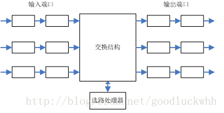
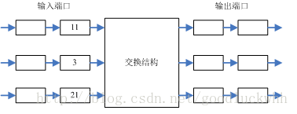
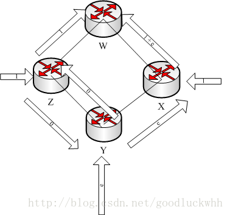

网络层建立在链路层之上，它的最主要的功能是使得网络中的各个主机之间可以互相通信。在因特网中，IP层是TCP/IP协议族中最为核心的协议，也是最复杂的层次之一。

一、概述

1.转发和选路

网络层的功能是要将分组从一个主机移动到另一个主机从而使得主机之间可以互相通信。为此需要网络层提供两种功能：

存储转发：路由器（三层交换机）将进入其某个输入链路的分组转发到其某个输出链路。它是将分组从一个输入链路移动到一个输出链路，是一个路由器的本地动作。

路由选择：在分组从一个主机流向另一个主机的过程中，网络层必须决定分组所走过的路径。计算这个路径信息的算法就是路由算法。它是一个网络范围的动作，决定分组从其源到目的应该走的路径

路由器在网络层是一个极其重要的设备，每台路由器都由一张转发表。路由器检查到达分组首部中的一个字段的值，然后利用该值在路由器的转发表中进行查询，以决定该如何转发该分组。查询的结果是分组将被转发的路由器的链路接口。

选路算法决定了转发表中的值。选路算法可能是集中式（由某个中心点执行）的也可能是分布式的（运行在各台路由器上），无论采用何种方法，路由器都要接受选路协议报文以配置其转发表。

连接建立：在有些计算机网络中，连接建立也是网络层的重要功能。比如ATM，它要求从源到目的地沿着所选择的路径彼此握手，以便在源和目的之间建立起状态。

2.网络服务功能

网络层能够提供的特定服务包括（但实际上不一定提供）：

-   确保服务：确保能最终到达目的地

-   具有时延上届的确保交付：不仅确保交付，而且确保在时延上届内交付

-   有序分组交付：确保分组按照它们被发送的顺序到达目的地

-   确保最小带宽：只要发送主机以低于特定比特率的速录传输，分组就不会丢失

-   确保最大时延抖动：发送方发送两个连续分组的时间间隔和接收方接收它们的时间间隔之间的差值在一定范围内

-   安全性服务：使用仅仅发送方和接收方所知晓的密钥通信。

但是因特网的网络层提供的是无连接的不可靠的服务，尽力而为的服务，其含义是：

-   不可靠：IP层不保证IP数据报能成功到达目的地。如果需要保证可靠传输，则需要使用其它协议，比如TCP。

-   无连接：IP不维护任何关于后续数据报状态的信息，每个数据报的处理是相互独立的。因此两个IP之间的多个报文可能乱序到达，可能走不同的路径。。。

3.分组转发

在因特网中，每当一个主机要发送一个分组时，
它就为该分组加上目的主机的地址，然后将该分组发送出去。

当分组在网络中向目的地传输时，它会经过一系列路由器。每个路由器都使用该分组的目的地址来转发给分组。每台路由器都由一个将目的地址映射到链路接口的转发表，每当分组到达时，路由器就利用分组的目的地址在转发表中查找一个合适的输出链路接口，然后路由器将分组从该输出链路接口发送出去。

在因特网中，路由器的转发表可以由选路算法或者管理员更新。由于转发表的修改可能发生在任意时刻，因而两个主机之间的分组在不同的时刻走的可能是不同的网络路径，并可能无序到达。

1.最长前缀匹配规则

网络前缀：是网络地址的前边某些连续比特。比如对于地址 11101111 11011110 1000000
00000001，其对应的8比特前缀为11101111 ， 16比特前缀为11101111 11011110

在该规则下，路由器的转发表中记录的是网络前缀和输出链路接口之间的对应关系。当查转发表时，仍然利用目的地址来进行匹配，但是可能会有很多歌匹配，这个时候取匹配到的比特数目最多的表象作为命中表项，并根据它来转发分组。

二、路由器

网络层的最主要的功能是将分组从一台主机移动到另一台主机。该功能主要是由路由器完成的。典型的路由器结构如下：

输入端口：它接入输入的物理链路，和链路远端的数据链路层交互，并完成查找和转发功能，以使得输入分组能够进入到合适输出链路接口。对于控制分组，它则会进入选路处理器。

交换结构：它将路由器的输入接口连接到它的输出接口。

输出端口：存储经过交换结构发送给它的分组，并将分组发送出去。同时它执行和输入端口相反的链路层功能和物理层功能。

选路处理器：执行选路协议，维护选路信息和转发表。

1.输入端口

输入端口的线路端接功能与数据链路处理实现了与通向路由器的各个输入链路相关的物理层和数据链路层。输入端口的查找/转发功能对路由器的转发功能是非常重要的。在很多路由器中，就是在这里来确定一个到达的分组经交换结构转发给哪个输出端口。输出端口的选择是取决于转发表中的信息，虽然转发表是由选路处理器计算的，但是通常每个输入端口都会有一份转发表的影子拷贝，并且会被及时更新。正因为输入端口拥有转发表的本地拷贝因而就可以在每个输入接口做出转发决策，而无需调用中央选路处理器，这种模式可以避免在路由器的某个节点产生转发处理瓶颈。

在输入端口处理能力受限的路由器中，输入端口会将分组转发给中央绚丽处理器，然后由它执行转发表查找并将分组转发到恰当的输出端口。

在有了转发表后，转发决策就很简单，就是查找转发表，但是由于主干路由器的转发表规模很大，
而且我们期望输入端口的处理速度能够达到线速或者说我们期望查表的速度越快越好，因而就需要对转发表的组织和查询进行优化，常见的方式有：

-   以树形结构存储转发表，树的每一级对应目的地址中的一个比特，如果地址比特位0则搜索其左子树，否则搜索右子树。采用这种结构，N比特的目的地址可以在N步之内找到相应的转发表项。

-   内容可寻址内存CAM，采用树形结构对于主干路由器来说还是太慢了，CAM允许将一个IP地址交给CAM，然后由CAM在常数时间内返回该地址对应的转发表项的内容。

-   将最近访问的转发表保存在高速缓存。

找到分组输出端口后，分组就可以进入交换结构。这个时候分组可能会被阻塞，因而来自其它输入端口的分组可能正在使用交换结构。被阻塞的分组需要在输入端口排队。

2.交换结构

通过交换结构，分组可以从一个输入端口交换到一个输出接口。三种交换技术：

经内存交换：输入端口和输出端口之间的交换是在CPU的直接控制下完成。分组到达时，端口通过中断方式通知选路处理器，该分组从输入端口被拷贝到处理器内存，然后选路处理器取出分组的目的地址，查找转发表找到输出端口，并将分组拷贝到输出端口的缓存中。这种模式下，转发吞吐量受限于内存带快。PC一般采用该方式。有些现代路由器也采用内存交换，但是与PC的区别在于查表和将分组存储到适当的存储位置是由输入线路卡上的处理器来执行的。

经总线交换：输入端口经一根共享总线直接将分组送到输出接口，不需要选路处理器的干预。这种模式下，路由器的交换带宽受限于总线带宽。

经一个互联网络交换：高端路由器一般采用该方式，它可以克服单一、共享式总线的带宽限制。纵横式交换机时一个由2n条总线组成的互联网络，它将n个输入接口和n个输入接口连接。

在这种由纵横式交换机构成的互联网络中任意两个端口之间都有自己的专用总线，因而可以克服单一、共享式总线的带宽限制。使用这种网络时，往往把长度变化的IP分组分片成固定尺寸的信元，加上标签通过互联网络进行交换，这些信元在输出接口再被装配成初始分组。这种方式能够极大的简化并加快通过互联网络的分组交换。

3.输出端口

输出端口取出存放在输出端口内存中的分组并将它传送到输出链路上。它在数据链路层和物理层上实现与输入接口相反的功能

4.排队

在输入端口和输出端口都可能出现排队。随着这些队列的增长，路由器的缓存空间可能会耗尽，进而导致出现丢包。

对于有N个输入接口和N个输出接口的路由器，定义交换结构速率为交换结构能够从输入端口移动分组到输出端口的速率。则如果交换结构的速率至少是输入线路速率的N倍，则在输入端口不会出现排队，这是因为即便所有的N个端口都在接收报文，交换结构也能够将其全部移动到输出接口。但是对于输出接口，假设交换结构速率为线路速率的N倍，则在最坏情况下，到达所有N个输入端口的分组都要被发送到同一个输出端口，在这个情况下，输出端口发送一个分组的同时它要接收N个分组，因而就会导致排队，这种情况持续下去就会导致输出端口的队列不断增长并耗尽内存出现丢包。

由于会出现排队，因而缓存大小的设置就非常关键，缓存大小设置的经验方法是：缓存量=平均往返时延\*链路的容量。

1.分组调度

输出端口出现排队，一个重要的问题就是输出端口如何发送这些排队的分组，可能的方式有：

-   先来先服务FCFS

-   加权公平队列，它在具有排队等待传输的分组的不同的端到端连接之间公平的共享输出链路。

2.队列管理

另外的一个问题是如果没有足够的缓存来缓存一个分组，是丢弃该分组，还是丢弃一个已排队的分组来为新的分组腾出空间。相关的策略通常为主动队列管理算法AQM。随机早期检测算法RED是一种常见的算法，其思想是为输出队列长度维护一个加权平均值：

-   当队列长度小于低的门限值Tmin时，不丢弃新到达的分组；

-   当队列长度介于Tmin和Tmax之间时，以一定的概率丢弃分组，且分组概率随着队列长度的增长线性增加，

-   当队列长度达到Tmax时，到达的分组全部被丢弃。

这3个阶段分别被称作正常、拥塞避免和拥塞控制三个阶段。最坏情况的最大队列大小被限制为Tmax。

3.HOL

如果交换结构不能快得使所有分组都能无时延的通过它传送，则在输入端口也将出现分组排队。假设

1.  所有链路速率都相同

2.  一个分组能够以与一个输入链路接收一个分组相同的时间从任意一个输入端口移动分组到给定的输出端口

3.  输入队列按照FCFS工作

假设输入端口中的每个数字都表示一个分组，数字值标识其想要转发到的输出端口，并且输入端口和输出端口都从下标1开始从上到下编号。在图中的场景下，假设交换结构决定先移动输入端口1中的分组到其输出端口，则输入端口3中的分组必须等待，进一步的，由于输入端口的队列采用FCFS的工作模式，因而输入端口3中的目的端口为2的分组也必须等待，尽管此时并没有其他输入端口和它竞争输出端口2，这种现象就叫Head-Of-the-Line阻塞，即HOL阻塞。

研究表明由于HOL阻塞，只要输入链路上的分组到达速率达到其容量的58%，在某些假设前提下，输入队列就将无限增大，从而导致丢包。

三、选路算法

网络中的主机通常都直接与一台路由器相连接，该路由器即为该主机的默认路由器，它是该主机的第一跳路由器。每当主机发送一个分组时，它都首先将分组发送给起默认路由器，在接收端，目的主机的默认路由器把来自于网络上其它主机的分组转发给目的主机，因而网络中从源主机到目的主机的选路就是从源主机的默认路由器（也可以成为源路由器）到目的主机的默认路由器（也可以成为目的路由器）之间的选路问题。

选路算法的目的很简单：给定一组路由器以及连接路由器的链路，选路算法要找到一条从源路由器到目的路由器之间的“好"路径。通常好路径指的是最低费用的路径。由于网络中的路由器组成的拓扑是典型的图结构，因而可以用图来研究选路问题。

在网络图中，节点表示路由器，边表示路由器之间的链路。给边赋予一个表示费用的值（费用可以为链路速度，金钱，线路长度等等），然后选路算法的目的就变为在图中找到给定的两点之间的具有最低费用的路径。

1.选路算法的分类

根据选路算法是全局的还是局部的，选路算法可以分为：

-   全局选路算法：用完整的，全局性的网络信息来计算从源到目的的最低费用路径。这种算法通常称为链路状态算法即LS算法，因为该算法必须知道网络中每条链路的费用。

-   分布式选路算法：以迭代的、分布式的方式计算出最低费用路径。没有节点拥有关于所有网络链路费用的完整信息，而每个节点仅有与其直接相连链路的费用信息即可开始工作。然后通过迭代计算过程并与相邻节点交换信息，一个节点逐渐计算出到达目的节点或者一组目的节点的最低费用路径。

还可以根据算法是静态的还是动态的来分类：

-   静态选路算法：随着时间的推移，路由的变化非常缓慢，同时是在人的干预下进行调整。

-   动态选路算法：能够在网络流量负载或者拓扑发生变化时改变选路路径。动态选路算法可以周期性的运行或者在拓扑或链路费用发生变化时直接运行。

还可以根据算法是负载敏感的还是负载迟钝的进行划分：

负载敏感算法：链路费用会动态的变化以反映底层链路的当前拥塞水平。当前的因特网选路算法都是负载迟钝的。

2.链路状态选路算法

链路状态算法需要网络拓扑和所有链路费用信息作为输入。实践中，这可以通过让所有节点都向网络中的而所有其它路由器广播链路状态分组来完成。每个链路状态分组包含了它所连接的链路的特征和费用。广播的结果是所有节点都具有了该网络的同一个完整的视图。于是每个节点都可以运行LS算法从而计算出相同的最低费用路径集合。

根据图论的知识，可以使用Dijkstra算法来计算最短路径，它计算从某个节点到网络中所有其它节点的最低费用路径，它是一个迭代算法，在k次迭代后，就可以得到从源节点触发到k个节点的最短路径。（Prim算法也可以用于计算图中两个节点之间的最短路径，根据图论的知识，它适用于具有稀疏边的图。）算法的复杂度为O(n2)。

LS算法可能会导致网络震荡，以下图为例：

假设在该网络中链路费用等同于链路上的负载，初始状态为：

-   节点X和Z都发送到目的地W的一个单位的流量，且都选择它们与W直接相连的链路。

-   Y有目的地为W的流量e，并走通过X到达W的链路。

此时非0费用的链路有：

-   X,W之间的链路费用为1+e

-   Y,X之间的链路费用为e

-   Z,W之间的链路费用为1

当LS运行时，则

-   节点X发现，它与W直接相连的链路的费用是1+e，而Y-\>Z-\>W这条路径的总费用是1，因而它选择走该链路

-   节点Y发现，它走X-\>W的费用是1+e，而走Z-\>W的费用是1，因而选择Z-\>W的路径。

-   节点Z的选路不变

此时非0费用的链路有：

-   X,Y之间的链路费用为1

-   Y,Z之间的链路费用为1+e

-   Z,W之间的链路费用为2+e

当LS运行时，则

-   节点X发现，它与W直接相连的链路的费用是0，而Y-\>Z-\>W这条路径的总费用是3+2e，因而它选择走与W直接相连的路径

-   节点Y发现，它走X-\>W的费用是0，而走Z-\>W的费用是2+e，因而选择走X-\>W

-   节点Z发现，它走Y-\>X-\>W的费用为0，而走直接连接W的链路的费用是2+e，因而它选择Y-\>X-\>W的路径

此时非0费用的链路有：

-   Z,Y之间的链路费用为1

-   Y,X之间的链路费用为1+e

-   X,W之间的链路费用为2+e

LS算法继续运行，就会不断震荡，解决方案是确保并非所有的路由器都在同一时刻运行LS算法。做法是对于每台路由器，随机的选择发送链路通告的时间。

3.距离向量选路算法

距离向量算法DV（Distance-vector）是一种迭代的、异步的和分布的算法：

-   分布式的：每个节点都要从一个活多个直接相连的邻居收集某些信息，执行计算，然后将结果发回个邻居。

-   迭代的：该过程要一直持续到邻居之间没有更多的信息要交换为止。

-   异步的：各个节点的操作不需要保持一致。

DV算法，利用了Bellman-Ford方程：

dx(y)=minv{c(x,v)+dv(y)}

其中dx(y)表示从节点x到节点y的最低费用路径的费用。c(x,v)的含义是节点x到其邻居v的路径费用。方程式的含义是从节点x到节点y的最低费用路径的费用等于所有邻居v中c(x,v)+dv(y)最小的那个。

在DV算法中，Bellman-Ford的一个重要的贡献就是，得到最小值的那个v节点就是当前节点向y转发时的下一跳节点，当需要向y转发时，只需要将分组送给节点v即可。算法思想：对于网络N中的素有节点，令Dx=[Dx(y):y属于N]是节点x的距离向量，该向量是从x到N中所有其它节点y的费用估计向量。每个节点x维护下列选路数据：

-   对于每个邻居v，从x到直接相连的邻居v的费用为c(x,v)。

-   节点x的距离向量，它包含了x到N中所有目的地的费用的估计值

-   它的每个邻居的距离向量，即对x的每个邻居v有Dv=[Dv(y):y属于N]

DV算法中，每个节点不时的向它的每个邻居发送它的距离向量的拷贝。当节点x收到他的邻居v的一个新的距离向量时，它保存v的距离向量，然后根据Bellman-Ford方程更新自己的距离向量。如果节点x的距离向量因这个更新而改变，则节点x将向它的每个邻居发送它的更新后的距离向量。

从邻居接收更新距离向量，重新计算选路表项和通知邻居到目的地的最低费用路径的费用已经变化的过程会一直持续知道无更新报文发送为止。DV算法被用于因特网的RIP和BGP。

1.距离向量算法：链路费用变化和链路故障

运行DV算法的节点在检测到其到邻居的链路费用发生变化时就会更新器距离向量，并且如果最低费用路径发生了变化，它就向邻居通知其新的距离向量。当链路费用降低时，DV算法可以就得到变化后的最低费用。但是如果是链路费用增加，则会出现一点问题，如下图所示拓扑：

1.  链路费用变化前，网络拓扑如上图所示，则Dy(x)=4,Dy(z)=1, Dz(y)=1,
    Dz(x)=5,在t0时刻，y检测到链路费用变化（从4增加到40）。y会更新器最低费用路径，根据Bellman-Ford方程，其计算出来的值为6。但是观察这个时候的网络拓扑，显然这是不正确的。出现这个现象的原因是：y更新器距离向量时，利用了z通告给它的z的距离向量，Dz(x)=5，但是显然，Dz(x)是依赖于Dy(x)的，在Dy(x)变化后它显然是一个错误的值。更重要的是在这个时刻，会出现选路环路：为了到达x，y通过z选路，而z又选择通过y选路，这样的选路结果是分组无法到达目的地。

2.  y计算出来了一个新的到x的最低费用，因而它在t1时刻将新的距离向量通告给z

3.  z收到y的新的距离向量后更新其距离向量，它计算出来的新的Dz(x)=7

4.  该过程一直循环，直到计算出来一个正确的值Dy(x)=40，Dz(x)=41

从上述过程可以看到使用DV算法时，坏消息传递的比较慢。而且上述过程只是一个链路的费用变高了，如果有多个链路的费用变高，则会遇到所谓的计数到无穷的问题。

2.距离向量算法：增加毒性逆转

毒性逆转可以解决上述特定的网络拓扑中的环路状况。其思想是：如果z通过y选路，则z在通告y时会告诉y它（z）到x的距离是无穷大。毒性逆转只能解决这种特殊环路的问题，如果环路涉及到3个或更多的节点，则它也无能为力

3.LS和DV算法比较

DV算法中，每个节点仅与它的直接邻居交换信息，但它为它的邻居提供了通过它到达网络中（它所知道的）所有其它节点的最低费用估计。LS算法中，每个节点与所有节点交换信息，但它仅仅告其它节点与它直接相连的链路的费用。二者的比较

-   报文复杂性：LS算法要求每个节点都要知道网络中每条链路的费用，因而它需要发送O(\|N\|\|E\|)个报文，而且无论何时一条链路的费用发生变化，都必须向所有节点发送新的链路费用。DV算法要求在每次迭代时，在两个直接邻居之间交换报文。当链路费用发生变化时，仅当新的费用导致与该链路相连的节点的最低费用发生了变化时，才会传播已改变的链路费用。

-   收敛速度：LS算法是一个O(n2)的算法，而DV算法收敛较慢，且在收敛时会遇到选路环路。

-   健壮性：由于LS算法中每个节点都独立的计算自己的路由，因而这在一定程度上提供了健壮性。而DV算法中一个节点的不正确信息则会扩散到整个网络。

4.层次选路

采用层次选路的原因：

-   规模：因特网由上亿台主机组成，如果不采用层次选路，则路由器需要存储选路信息会需要极大的内存，而且如果采用LS算法，则可以预期网络将淹没在LS广播中无法工作；如果采用DV算法，可以预期它根本就不会收敛。

-   管理自治：某些组织可能倾向于按自己的意愿管理自己的网络，对外隐藏自己的内部网络面貌。

解决这两个问题采用的方法是将路由器组织到自制系统（AS）。

每个AS由一组通常在相同管理控制下的路由器组成，相同的AS内部的路由器都运行同样的选路算法，且具有彼此之间的信息。在一个自制系统内运行的选路算法叫自制系统内部选路协议。AS内的一台或多台路由器将有另外的任务，即负责向本AS之外的目的地转发分组，这些路由器被称为网关路由器。

当AS只有一个网关路由器时，AS内的路由器很容易将目的地不属于本AS的分组转发到网关路由器（因为AS内的路由器都知道自己到达网关路由器的最短路径），然后由网关路由器转发到AS外部。

但是当AS有多个网关路由器时，AS就需要

1.  知道经过与自己的网关路由器相连的其它AS可以到达哪些目的地

2.  在本AS内部传播这些可达信息

这两项任务是由自治系统间选路协议完成的。因特网的所有AS都运行相同的自治系统间选路协议。每台路由器都接收来自一个AS内部的内部选路协议和一个AS间选路协议的信息，并使用这些信息配置自己的转发表。

当一个AS通过自治系统间选路协议知道它可以通过自己的多个网关路由器到达某个目的地时，AS内部的路由器如何添加自己到该目的的路由？通常采用的策略是热土豆选路（hot
potato
routing），其思想是让AS尽快摆脱分组，即尽快将分组转发给其它AS，路由器将选择具有下列特性的网关路由器，然后根据本路由器到该网关路由器的路径添加路由：

-   该网关路由器可以到达该目的地

-   该网关路由器到本路由器具有最低费用路径

当一个AS从一个相邻AS知道了一个目的地时，它可以向它的某些其它邻居AS通告该路由信息，但是是否通告，通告哪些内容是一个AS的管理策略问题。取决于AS的配置管理策略。

因此总结起来，在一个AS内部，所有路由器都运行相同的内部选路协议。在各AS之间，AS运行相同的自治系统间选路协议。AS内部的路由器仅需要知道本AS内部的路由器，AS的管理组织可以运行它选择的任何内部选路协议。
