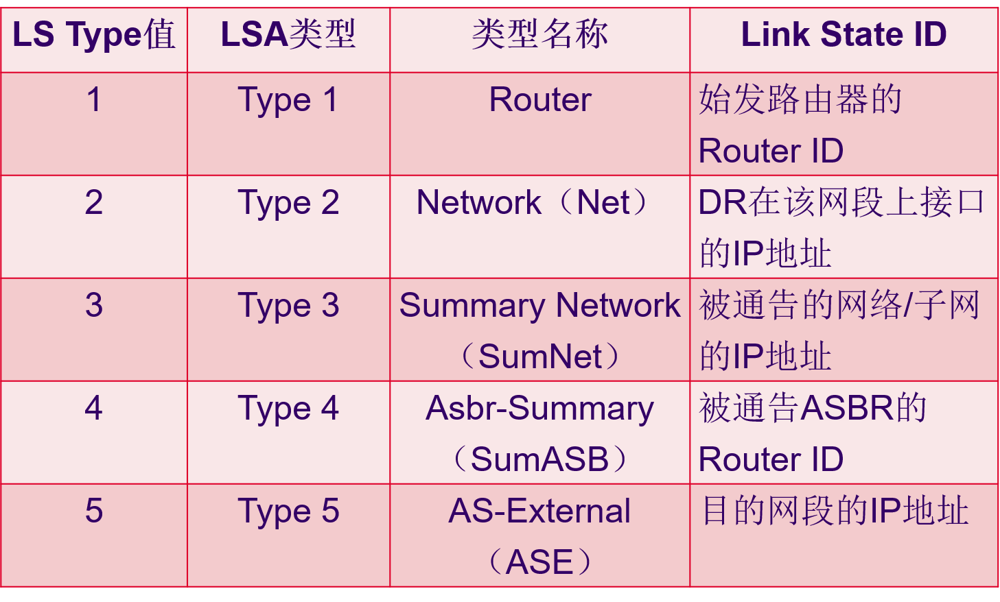
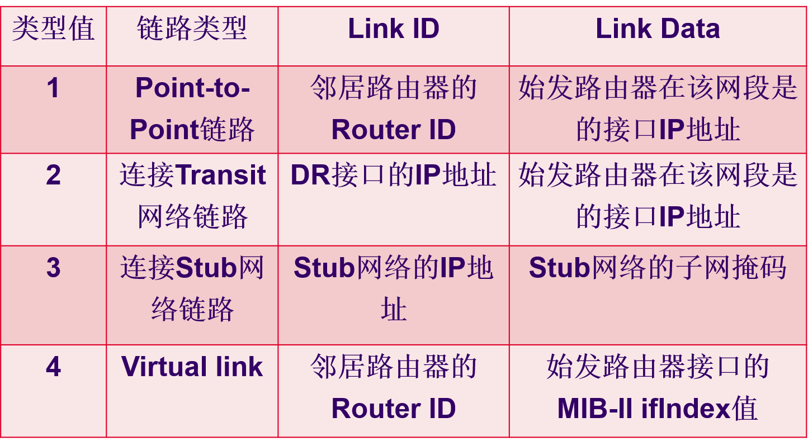

# OSPF协议实验

目录
1. OSPF协议概述及基本配置
2. OSPF协议报文交互过程
3. OSPF协议链路状态描述
4. 区域划分及LSA种类
5. OSPF协议路由的计算
6. OSPF协议组网设计

> 区别
> * OSPF指出了报文类型，表示建立可靠数据连接的过程的作用，指出了交互逻辑。
> * LSA链路状态通告类型，用于反映交互双方（携带数据者）的逻辑关系。是反映的数据发送者、接受者的逻辑关系，而非路由表项的内容。与路由器本身的逻辑位置和逻辑角色有关系。
> * LSA链路状态描述类型，反映了一条路由记录的类型，是一条记录自身的特点，与数据的具体含义有关。

> 联系
> * 链路状态描述信息组成了链路状态通告信息。

> 图片说明
> * 五种链路状态通告类型
> 
> * 五种链路状态描述类型
> 