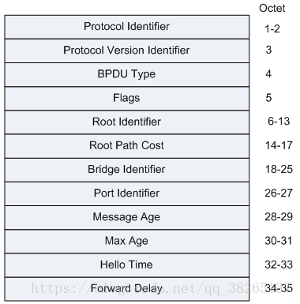

# STP 协议

## 1 STP简介
### STP概述
生成树协议STP（Spanning Tree Protocol）将环形网络修剪成为一个无环的树型网络，避免报文在环形网络中的增生和无限循环。

在一个复杂的网络环境中，难免会出现环路。由于冗余备份的需要，网络设计者都倾向于在设备之间部署多条物理链路，其中一条作主用链路，其他链路作备份，这样都有可能会导致环路产生。

环路会产生广播风暴，最终导致整个网络资源被耗尽，网络瘫痪不可用。环路还会引起MAC地址表震荡导致MAC地址表项被破坏。

为了破除环路，可以采用数据链路层协议STP，运行该协议的设备通过彼此交互信息发现网络中的环路，并有选择的对某个端口进行阻塞，最终将环形网络结构修剪成无环路的树形网络结构，从而防止报文在环形网络中不断循环，避免设备由于重复接收相同的报文造成处理能力下降。

### STP相关概念

* 根桥

树形网络结构必须有树根，于是STP/RSTP引入了根桥（Root Bridge）概念。

对于一个STP/RSTP网络，根桥有且只有一个，它是整个网络的逻辑中心，但不一定是物理中心。但是根据网络拓扑的变化，根桥可能改变。

* BID（Bridge ID）：桥ID

IEEE 802.1d标准中规定BID是由2字节的桥优先级（Bridge Priority）与桥MAC地址构成，即BID（8字节） = 桥优先级（2字节） + 桥MAC（6字节）。

在STP网络中，桥ID最小的设备会被选举为根桥。在华为公司的设备上，桥优先级支持手工配置。

* PID（Port ID）：端口ID

PID由两部分构成的，即PID（16位） = 端口优先级（4位） + 端口号（12位）。

PID只在某些情况下对选择指定端口有作用，即在选择指定端口时，两个端口的根路径开销和发送交换设备BID都相同的情况下，比较端口的PID，PID小者为指定端口。

* 路径开销（RPC）

路径开销是STP/RSTP协议用于选择链路的参考值。STP/RSTP协议通过计算路径开销，选择较为“强壮”的链路，阻塞多余的链路，将网络修剪成无环路的树形网络结构。根设备的端口的路径开销都为0。

在一个STP/RSTP网络中，某端口到根桥累计的路径开销就是所经过的各个桥上的各端口的开销。

* PC（port cost）

PC的计算需要依据端口带宽来计算。

### 端口角色：
* 根端口（RP）：

即去往根桥路径最近的端口。根端口负责向根桥方向转发数据，根端口同时还负责接收上游设备的BPDU报文和用户流量转发。根端口的选择标准是依据根路径开销判定。在一台设备上所有使能STP的端口中，根路径开销最小者，就是根端口。在一个运行STP/RSTP协议的设备上根端口有且只有一个，而且根桥上没有根端口。

* 指定端口（DP）：

对一台交换设备而言，它的指定端口是向下游交换设备转发BPDU报文的端口。根桥的所有端口都是指定端口。在环网的每一网段都会选举出一个指定端口，在一个网段上拥有指定端口的交换设备被称作该网段的指定桥。

* 替代端口（AP）：

由于学习到其它设备发送的配置BPDU报文而阻塞的端口，作为根端口的备份端口，提供了从指定桥到根的另一条可切换路径。

### 端口状态

|端口状态	|目的|	说明|
|-|-|-|
|Forwarding（转发） |端口既转发用户流量也处理BPDU报文。|	只有根端口或指定端口才能进入Forwarding状态。|
|Learning (学习)	|设备会根据收到的用户流量构建MAC地址表，但不转发用户流量。|	过渡状态，增加Learning状态防止临时环路。（15s）|
|Listening（监听）	|确定端口角色，将选举出根桥、根端口和指定端口。	|过渡状态。（15s）|
|Blocking（阻塞）	|端口仅仅接收并处理BPDU报文，不转发用户流量|	阻塞端口的最终状态。|
|Disabled（禁用）	|端口既不处理BPDU报文，也不转发用户流量。|	端口状态为Down。|

### 三种定时器
|类型	|说明|
|-|-|
|Hello Time	|Hello Timer定时器时间的大小控制配置BPDU发送间隔。|
|Forward Delay Timer|	Forward Delay Timer定时器时间的大小控制端口在Listening和Learning状态的持续时间。|
|Max Age|	Max Age定时器时间的大小控制存储配置BPDU的超时时间，超时认为根桥连接失败。|

## 2 STP报文

### STP报文格式




### STP报文字段解释
|字段内容	|说明|
|-|-|
|Protocol Identifier	|协议ID＝“0”|
|Protocol Version Identifier	|协议版本标识符，STP为0，RSTP为2，MSTP为3。|
|BPDU Type	|BPDU类型，MSTP为0x02。0x00：STP的Configuration BPDU0x80：STP的TCN BPDU（Topology Change Notification BPDU）0x02：RST BPDU（Rapid Spanning-Tree BPDU）或者MST BPDU（Multiple Spanning-Tree BPDU）|
|Flags	|对于“标记域”（Flags），第一个bit（左边、高位bit）表示“TCA（拓扑改变响应）”，最后一个bit（右边、低位bit）表示“TC（拓扑改变）”。|
|Root Identifier	|网桥ID都是8个字节——前两个字节是网桥优先级，后6个字节是网桥MAC地址。|
|Root Path Cost	|根路径开销，本端口累计到根桥的开销。|
|Bridge Identifier	|发送者BID，本交换机的BID。|
|Port Identifier	|发送端口PID，发送该BPDU的端口ID。|
|Message Age	|该BPDU的消息年龄。|
|Max Age	|消息老化年龄。|
|Hello Time	|发送两个相邻BPDU间的时间间隔。|
|Forward Delay	|控制Listening和Learning状态的持续时间。|


### STP报文抓包示例


## 3 STP 原理

### STP原理：
找到冗余的一端，然后阻塞端口，避免环路。

### STP版本
IEEE 802.1D STP
IEEE802.1W RSTP
IEEE802.1S（华为） MSTP
### STP的选举过程
1. 在一个交换网络中选举一个根桥，根桥是设备的概念。

2. 根桥选举后，交换网络中的其他设备都是非根桥，每个非根桥还需选取一个到达根桥最短路径的端口称为根端口。

注：非根桥只能有一个根端口。

3. 每条链路上，还需选举一个指定端口，默认情况下根桥的所有端口都是指定端口。

4. 既不是根端口，也不是指定端口的其他端口需要被阻塞，不能转发数据帧。

### 根桥的选举
1. 通过比较BID选举，优选BID小的。BID由优先级+MAC地址组成。
2. 首先比较优先级，优先级越小越优。
3. 如果优先级一样，比较MAC地址，MAC地址越小越优。

### 指定端口的选举
1. 比较RID，优选小的。
2. 比较到达根桥的RPC（Root Path Cost），越小越优。
3. 比较BPDU包发送者的BID，越小越优。
4. 比较BPDU包发送者的PID，越小越优。
5. 比较BPDU包接收者的PID，越小越优。

### BPDU报文的两种类型
* 配置BPDU

包含了桥ID，路径开销，端口ID等参数。

* TCN BPDU

指下游交换机感知到拓扑发生变化时向上游交换机发送的拓扑变化通知。用以快速刷新MAC地址表。

### STP故障：
* 根桥故障

非根桥会在BPDU老化之后，开始根桥的重新选举。

* 直连链路故障

交换机检测到直连链路故障后，会将预备端口转换为根端口。

预备端口会在30s后恢复到转发状态。

* 间接链路故障

间接链路故障进入到转发状态需要50s（MAX age + Forwarding delay * 2）。

* 拓扑改变导致MAC地址表错误

MAC地址默认老化时间为300s，这段时间内无法转发数据。

### STP用于拓扑改变的报文
TCN BPDU报文：拓扑改变通知。

TCN BPDU报文只能由非根桥发出，通告给根桥。

TCA BPDU报文：用于确认接收到的TCN PBDU报文。

TC BPDU报文：只能由根桥发起，连续发送35s（MAX age + Forwarding delay）。

非根桥收到TC BPDU报文后会将MAC地址的老化时间设置为15s，加速老化。

### STP拓扑改变

1. 如果非根桥上发生拓扑变化，向根桥发送TCN BPDU包，通告根桥拓扑已改变。
2. 上联的非根桥从指定端口收到TCN BPDU包后，会向发送者回复TCA flag位置位的配置BPDU包，同时继续向根桥发送TCN BPDU包。
3. 根桥收到TCN BPDU包后，向发送者回复TCA Flag位置位的配置BPDU包，同时向所有指定端口发送TC Flag位置位的配置BPDU包。TC置位的配置BPDU包会连续发送35s，同时将自己的MAC aging 设置为15s。
4. 其他非根桥收到TC置位的配置BPDU包后，将自己的MAC地址的老化时间设置为15s，加速老化。

### STP触发拓扑改变条件
* 一个端口从forwarding状态过渡到disable或blocking状态。
* 一个非根桥如果从指定端口接收到TCN BPDU包，需要向根桥装发TCN BPDU包。
* 一个端口进入转发状态，并且本地已存在一个指端端口。

### STP配置命令行
```
stp mode { stp | rstp | mstp}
//配置交换机的STP工作模式，默认情况下，交换设备运行MSTP模式，MSTP模式兼容STP和RSTP模式。

stp root primary
//配置当前设备为根桥设备。缺省情况下，交换设备不作为任何生成树的根桥。配置后该设备优先级BID值自动为0，并且不能更改设备优先级。

stp root secondary
//配置当前交换机设备为备份根桥设备。缺省情况下，交换设备不作为任何生成树的备份根桥。配置后该设备优先级BID值为4096，并且不能更改设备优先级。

stp priority 32768
//配置交换设备在系统中的优先级。缺省情况下，交换设备的优先级取值是32768。 配置时，优先级必须为4096的倍数。
  
stp pathcost-standard { dot1d-1998 | dot1t | legacy }
//配置端口路径开销计算方法。缺省情况下，路径开销值的计算方法为IEEE 802.1t（dot1t）标准方法。

[接口视图]stp cost 100
//设置当前端口的路径开销值。
//使用华为计算方法时参数cost取值范围是1～200000。
//使用IEEE 802.1d标准方法时取值范围是1～65535。
//使用IEEE 802.1t标准方法时取值范围是1～200000000。

[接口视图] stp port priority 128
//配置端口的优先级。缺省情况下，交换设备端口的优先级取值是128。

stp enable //使能交换设备的STP功能。缺省情况下，设备的STP/RSTP功能处于启用状态。
  
stp converge { fast | normal}
//配置端口的收敛方式
//根据对ARP表项的处理方式不同，STP/RSTP的收敛方式分为fast和normal两种：
//fast：ARP表将需要更新的表项直接删除。
//normal：ARP表中需要更新的表项快速老化。
//交换设备将ARP表中这些表项的剩余存活时间置为0，对这些表项进行老化处理。如果配置的ARP老化探测次数大于零，则ARP对这些表项进行老化探测。

//建议选择normal收敛方式。若选择fast方式，频繁的ARP表项删除可能会导致设备CPU占用率高达100%，报文处理超时导致网络震荡。

stp bridge-diameter 5
//配置网络直径。缺省情况下，网络直径为7。
  
stp timer-factor factor
//配置未收到上游的BPDU就重新开始生成树计算的超时时间。 缺省情况下，设备未收到上游的BPDU就重新开始生成树计算的超时时间是Hello Timer的9倍。

stp timer forward-delay 1500
//配置设备的Forward Delay时间。 缺省情况下，设备的Forward Delay时间是1500厘秒（15秒）。

stp timer hello 200
//配置设备的Hello Time时间。 缺省情况下，设备的Hello Time时间是200厘秒（2秒）。
  
stp timer mac-age 2000
//配置设备的Max Age时间。缺省情况下，设备的Max Age时间是2000厘秒（20秒）。

max bandwidth-affected-linknumber 8
//配置影响带宽的最大连接数。 缺省情况下，影响链路聚合带宽的最大连接数是8。
  
reset stp error packet statistics 
//清除生成树协议的错误报文计数。

display stp toplogy-change
//查看STP/RSTP拓扑变化相关的统计信息

```
