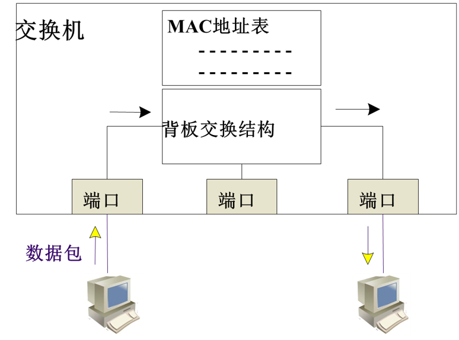

# 网络实验入门

目录
1. 实验环境及设备简介
2. 网线制作和测试
3. 路由器和交换机的基本配置
4. 报文分析软件
5. 简单局域网组建实验
6. 基于地址转换的组网实验

> 网络实验2019年10月17日算是从今天真正的开始做了，之前，可能都是在划水，网络实验，一周付出五天应该不为过。不过我觉得。以后能付出三天应该就能赶上进度。这里主要写一写自己缺少的理论知识。h3c的操作问题全部放到命令行的笔记当中


## 1 实验环境及设备简介


### 集线器（hub）

* 物理层
* 将多条以太网双绞线或光纤集合连接在同一段物理介质下的设备。某个端口接收到比特信号，简单的将比特信号复制转发到其他端口。多个端口同时输入信号时会发生冲突。

### 交换机（switch）

* 链路层
* 是一种用于电（光）信号转发的网络设备。它可以为接入交换机的任意两个网络节点提供独享的电信号通路，把传输的信息送到符合要求的相应路由上。采用背板总线交互结构，每个端口有一个独立的共享介质，每个冲突域只有一个端口。链路层是根据mac地址进行数据转发。
* 交换方式主要包括：端口交换、帧交换、信元交换。
* 具体结构如下：



### 路由器（router）
* 网络层
* 根据IP地址进行路由，转发到对应的网络。工作在广域网，连接不通的网络。数据转发基于路由表实现。
* 路由器的主要功能有两个：存储转发与路由选择。
* 路由选择主要包括两种方法：静态路由与动态路由。
* 具体结构如下：
  


### 说明
* 集线器本身不能区分广播域和冲突域，对收到的任何目的地之的消息都进行转发。
* 二层交换机能够区分冲突域，每个端口是一个独立的冲突域，端口之间不会起冲突，会根据不同目的地址进行转发。但是不区分广播域，收到的广播消息会转发给所有同网段的主机。
* 一个交换机下设置同网段的主机会处于同一个局域网下，设置不同网段的主机可以处于不同的局域网下。
* 路由器和主机都具有适配器，每个适配器具有ip地址与Mac地址。但是交换机没有网络适配器，所有的接口不具有ip地址与Mac地址，其唯一的作用是维护一个Mac地址和交换机接口映射表。
* ARP协议是用来解析MAC地址的协议。ARP协议在网络适配器当中执行，而不是交换机中。ARP维护的IP-MAC地址映射表存在主机的内存中，ARP表的每一个动态项都有生存周期，一段时间后自动清除。
* DNS与ARP协议类似，DNS能够解析因特网中任意地方的主机名解析为IP地址。ARP协议只能讲局域网中的IP地址解析为MAC地址。


* 简单来说，链路层的工作模式：如果是目的ip地址在局域网内，则直接arp拿到mac地址，发送帧。如果目的ip地址在局域网外，直接arp拿到网关mac地址（路由器适配器地址），发送帧。
* 链路层，只关心目标适配器，不关心路由。只进行一跳。


> 一会可以查看一下ping不通的原因，以及为什么路由表中没有另外一个地址（真奇怪）

### 路由器和交换机的配置方式

* console口配置
* Telnet配置
* AUX口远程配置
* 哑终端配置
* FTP方式传送配置文件

### 控制级别

* 参观级
* 监控级
* 配置级
* 管理级


## 2 网线制作和测试

RJ-45连接器：水晶头。包括直通线和交叉线两种接线方式。
## 3 路由器和交换机的基本配置

### 配置方式
* 通过Console口配置
* 通过Telnet远程登录进行相关配置

## 4 报文分析软件
```
# MTU
mtu 100
undo mtu

# speed
speed [100|10|negotiation] //100M,10M,自动协商

# display
display interfaces ethernet number

```
### 交换机以太网端口视图

```
shutdown
undo shutdown

duplex full //设置全双工状态
undo duplex //回复以太网全双工状态

spreed [10|100|auto]

mdi [across|auto|normal] //设置接口网线类型

flow-control //流量控制
undo flow-control //解除流量控制

port link-type [acces|hybrid|trunk] //设置接口链路类型
undo port link-type

display interface Ethernet1/0/1 
```
### VLAN视图

### VLAN接口视图


### RIP视图

### OSPF视图

### ACL视图


## 5 简单局域网组建实验

### 基本配置
```
system-view
sysname R1
interface ethernet 0/0 
ip addr 192.168.2.1 24
interfasce ethernet 0/1
ip addr 192.168.3.1 24
```
## 6 基于地址转换的组网实验
### ACL 命令的作用
acl命令：access control list访问控制列表
1. 限制网络流量、提高网络性能。例如，ACL可以根据数据包的协议，指定这种类型的数据包具有更高的优先级，同等情况下可预先被网络设备处理。
2. 提供对通信流量的控制手段。
3. 提供网络访问的基本安全手段。
4. 在网络设备接口处，决定哪种类型的通信流量被转发、哪种类型的通信流量被阻塞。

### 基本配置
```
# vlan与ip配置略

# 配置访问控制列表
acl number 2001
rule 0 permit source 10.0.0.0 0.0.0.255
rule 1 deny source any

# 配置nat地址转换列表
nat address-group 1 192.168.5.105 192.168.5.109

# 启动nat地址转换
interface ethernet 0/1 
nat outbound 2001 address-group 1

# 配置静态路由
ip route-static 0.0.0.0 0.0.0.0 192.168.5.1
```
