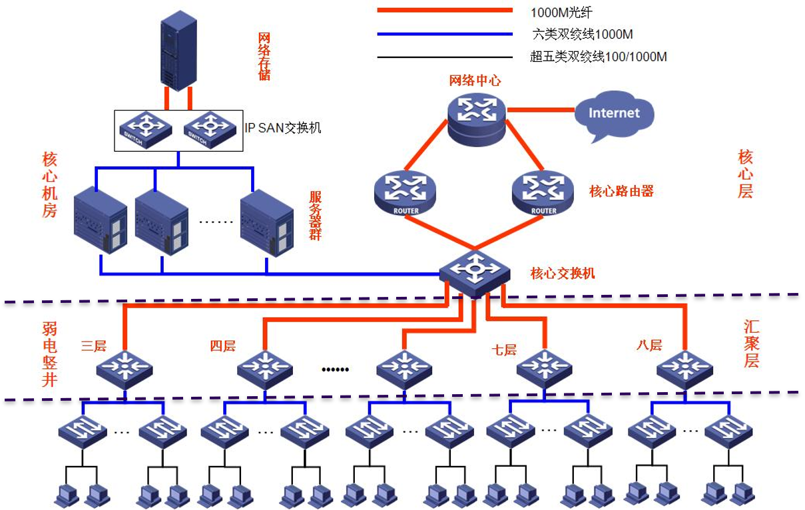
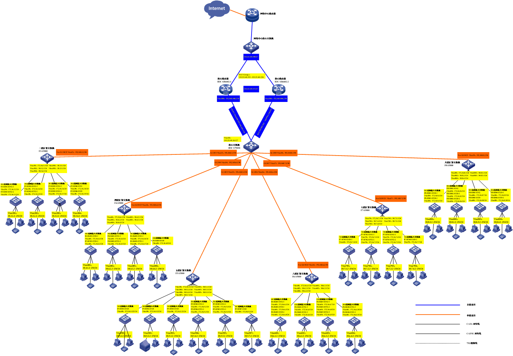
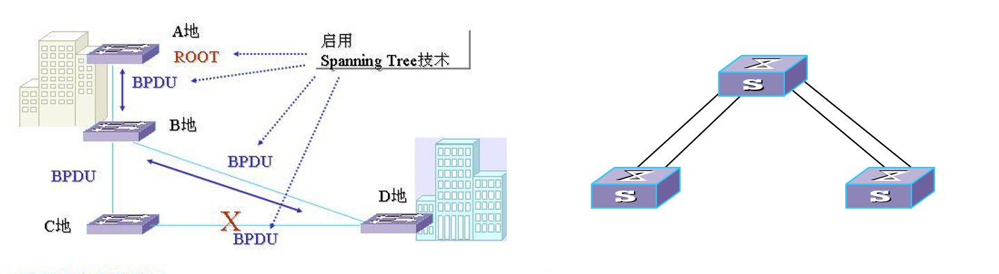
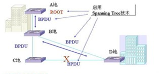
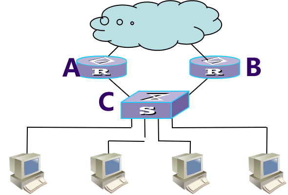
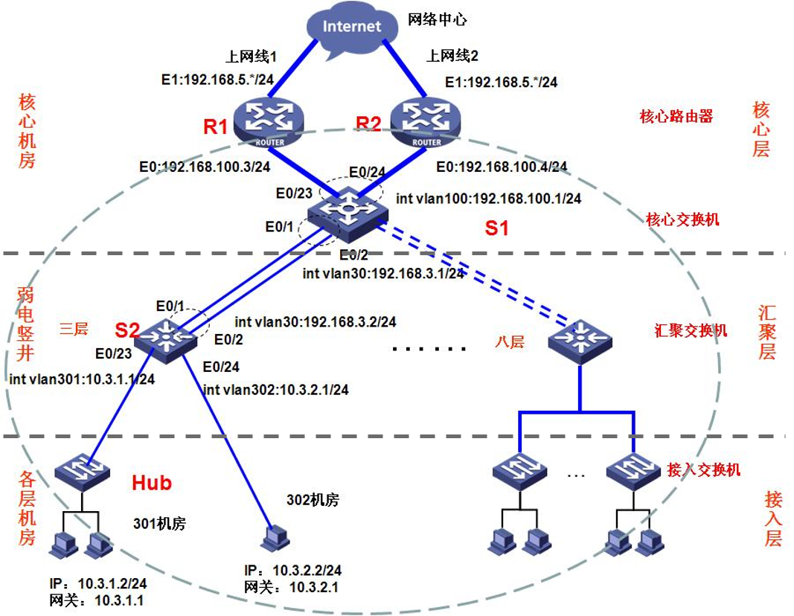

e# 综合组网试验

## 1 总体规划设计

### 系统需求和设计目标
6层楼约30个机房约1600多台计算机，为一般网络应用、监控、服务器、存储、信息发布、电子教室、中控和投影等多个系统提供网络平台

1. 将整个实验中心机房连成一个相对独立的局域网，保证互联互通、学生自由上机、正常上网、刷卡系统、网络服务器、考试系统的正常运行。
2. 满足多媒体教学、流媒体教学的需要，保证音、视频的流畅播放，确保良好的服务质量。
3. 网络的连通性完全可控，要求满足某些机房考试时禁止该机房访问互联网，而其他机房正常上课不受影响。
4. 网络支持组播应用，能够满足机房管理软件等教学相关应用的需求。
5. 网络设备支持抗ARP病毒攻击、广播风暴抑制、DHCP协议、IPv6协议等功能。
6. 所有网络设备都要能够被实时监控和管理。


### 总体规划

1. 信息平台网络采用TCP/IP体系结构，以满足与其他网络系统的互联互通。
2. 分层次的方法划分网络
3. 不同层次使用不同级别的千兆交换机，出口路由器采用中高端路由器
4. 采用地址转换技术(NAT)规划网络。IP地址的划分采用每个机房一个网段。NAT采用基于端口的NAT-PT技术。申请至少128个公网地址的地址池。
5. 采用ACL控制机房的访问
6. 采用支持IPv6协议、DHCP协议、路由协议、组播协议及安全性高的设备。


### 网络拓扑规划




## 2 网络详细设计

### 2.1 网络拓扑设计

### 2.2 网络可靠性设计

* WAN链路备份
    * 用于为路由器的广域网接口提供备份（也可以用于局域网接口备份）
    * 主接口：路由器上的任意一个物理接口或子接口，以及逻辑通道（Dialer口除外）
    * 备份接口：当主接口出现故障时，多个备份接口可以根据配置的优先级来决定接替顺序；而且，备份接口具有分担负载功能
* LAN链路备份
  * 使用二层交换机支持的STP协议、端口聚合技术等实现
    
* 路由备份
  * 动态路由协议能够自动发现路由，并生成路由表
  * 网络中有冗余路径，动态路由收敛需要时间、路由更新报文消耗网络资源等  
  

* 设备备份
  * VRRP（Virtual Router Redundancy Protocol，虚拟路由器冗余协议），一种LAN接入设备备份协议
  * 将局域网的一组多台路由器组织成一个虚拟路由器，称为备份组，优先级最高者为主用路由器，其余为备用
  

### 2.3 设备选型

* 设备厂商选择
* 接入层设备选型
* 汇聚层设备选型
* 核心层设备选型


### 2.4 VLAN划分、网络地址、设备编号规划
* VLAN划分
* IP地址规划
  * 公网地址段： 115.25.141.129∽115.25.141.255/25
  * 私网地址段： 10.0.0.0/8网段
  * 对私网地址划分子网，每个实验室一个网段
  * 地址分配：地址中第二个字节代表楼层，第三个字节代表房间号，第四个字节表示其在房间中的位置编号


* 网络设备采用统一编号：
  * 核心路由器以SR6602-n方式编号
  * 核心交换机编号为S7503E-core
  * 汇聚交换机以Fn-5800方式编号
  * 接入交换机以“F楼层号-房间号-设备型号-n”方式编号

### 2.5 路由设计

* 动态路由
  * 在拓扑图中的红色虚线标注区域，即各实验室内的接入交换机、各楼层的汇聚交换机F3-S5800、F4-S5800、F5-S5800、F6-S5800、F7-S5800、F8-S5800、核心交换机S7503E-core、核心路由器SR6602-1和SR6602-2的G0/0接口上配置OSPF动态路由协议

* 静态路由
  * 在出口路由器（即核心路由器）SR6602-1和SR6602-2上分别配置一条指向外部网络的默认路由

### 2.6 NAT地址转换与访问控制

* NAT地址转换
  * 115.25.141.128/25地址段中115.25.141.193-115.25.141.254/26用于公网地址，另外一段地址为其他服务器等设备使用
  * 保留私有地址段10.0.0.0/8作为内部IP地址
  * 在出口路由器SR6602-1和SR6602-2上配置NAT地址转换
  * 配置命令（包括5大条）
  ```
    //配置地址池
    nat address-group 1 115.25.141.193 115.25.141.254
    //配置访问控制列表
    acl number 2001 
    rule 0 permit source 10.0.0.0 0.255.255.255
    rule 1 deny 
    //在路由器出接口上绑定地址池和ACL
    [interface e0/1]nat outbound 2001 address-group 1
    ```
* 访问控制
  * 通过ACL设置访问控制考试实验室访问Internet，参考命令如下：
  ```
  acl number 2001//禁止403机房上网       
  rule 0 deny source 10.4.3.0 0.0.0.255
  rule 1 permit source 10.0.0.0 0.255.255.255
  rule 2 deny
  ```

### 2.7 网络管理设计
* 在平台内值班室501房间的一台PC机上安装H3C Quidview网管软件，作为网管服务器
* 所有接入交换机、汇聚交换机、核心交换机和核心路由器是被管设备，配置SNMP协议，并指定Trap报文发送到上面管理服务器的IP地址
```
这里以核心交换机S7503E-core为例：
[S7503E-core]snmp-agent
[S7503E-core]snmp sys version v1
[S7503E-core]snmp com write private
[S7503E-core]snmp com read public
[S7503E-core]snmp trap enable
[S7503E-core]snmp target-host trap address udp-domain 10.5.1.100  params  securityname public 
```
### 2.8 组播设计

* 根据需求分析可知，组播应用对网络的要求是：同一实验室内、同一楼层不同实验室机器之间、不同楼层的机器之间都能进行组播传输
* 在各接入交换机、汇聚交换机、核心交换机的各接口上都配置了PIM DM组播路由协议
* 以汇聚交换机F3-S5800为例的配置请见教程
```
[F3-S5800]multicast routing-enable
[F3-S5800-]int vlan 30
[F3-S5800-vlan-interface30]igmp enable
[F3-S5800-vlan-interface30]pim dm
[F3-S5800-]int vlan 301
[F3-S5800-vlan-interface301]igmp enable
[F3-S5800-vlan-interface301]pim dm
[F3-S5800-]int vlan 302
[F3-S5800-vlan-interface302]igmp enable
[F3-S5800-vlan-interface302]pim dm
[F3-S5800-]int vlan 303
[F3-S5800-vlan-interface303]igmp enable
[F3-S5800-vlan-interface303]pim dm
[F3-S5800-]int vlan 304
[F3-S5800-vlan-interface304]igmp enable
[F3-S5800-vlan-interface304]pim dm

```
### 2.9 网络布线与电源布线

* 网络布线
* 电源布线及电源改造


## 3 综合组网实验

### IP配置
> 参考图

### VLAN划分
> 参考图

### 路由实现
* 在汇聚交换机、核心交换机、核心路由器上配置OSPF协议
```
# S2 S1所有端口启动OSPF,R1,R2内网端口启动OSPF
router id 1.1.1.1
ospf
area 0
netwrok 10.3.1.1 0.0.0.255
network 10.3.2.1 0.0.0.255
network 192.168.3.2 0.0.0.255
```
* 在路由器上配置到达外网的静态路由，并引入到OSPF协议当中
```
R1,R2配置前往外网的静态路由，并将静态路由引入到ospf协议当中。
R1
[R1]ip route-static 0.0.0.0 0.0.0.0 192.168.5.1
[ospf]default-route-advertise cost 100
R2
[R1]ip route-static 0.0.0.0 0.0.0.0 192.168.5.1
[ospf]default-route-advertise cost 200
R1,R2引入默认路由S1,S2不需要配置默认路由
```

### 可靠性实现

* 链路聚合+STP协议实现
```
stp enable/disable

interface bridge-aggregation 1
link-aggregation mode dynamic

interface Ethernet1/0/1
port link-aggregation group 1   
                                               
interface Ethernet1/0/2
port link-aggregation group 1

inter bridge-aggregation 1
port link-type trunk
port trunk permit vlan all
```
* 设备备份VRRP实现
```
R1
interface ethernet 0/0
ip address 192.168.100.3 255.255.255.0
vrrp vrid 11 virtual-ip 192.168.100.2

R2
interface ethernet 0/0
ip address 192.168.100.4 255.255.255.0
vrrp vrid 11 virtual-ip 192.168.100.2
vrrp vrid 11 priority 80  
```
* 路由备份实现
```
[R1-OSPF-1]default-route-advertise cost 100
# 将R1上的默认路由ip route-static 0.0.0.0 0.0.0.0 192.168.5.1引入OSPF
[R2-OSPF-1]default-route-advertise cost 200

``` 
### NAT实现
```
//配置访问控制列表
acl number 2001
rule 0 permit source 10.0.0.0 0.255.255.255
rule 1 deny source any
//配置地址池
nat address-group 1
address 192.168.5.140 192.168.5.144
//在路由器出接口上绑定地址池和ACL
[interface e0/1]nat outbound 2001 address-group 1 
```
### 访问控制列表
```
//禁止403机房上网 
acl number 2001
rule 0 deny source 10.4.3.0 0.0.0.255
rule 1 permit source 10.0.0.0 0.255.255.255
rule 2 deny
```
### 网络管理应用
```
[S7503E-core]snmp-agent
[S7503E-core]snmp sys version v1
[S7503E-core]snmp com write private
[S7503E-core]snmp com read public
[S7503E-core]snmp trap enable
[S7503E-core]snmp target-host trap address udp-domain 10.5.1.100  params  securityname public 
```
### 组播实现
```
[F3-S5800]multicast routing-enable
[F3-S5800-]int vlan 30
[F3-S5800-vlan-interface30]igmp enable
[F3-S5800-vlan-interface30]pim dm
[F3-S5800-]int vlan 301
[F3-S5800-vlan-interface301]igmp enable
[F3-S5800-vlan-interface301]pim dm
[F3-S5800-]int vlan 302
[F3-S5800-vlan-interface302]igmp enable
[F3-S5800-vlan-interface302]pim dm
[F3-S5800-]int vlan 303
[F3-S5800-vlan-interface303]igmp enable
[F3-S5800-vlan-interface303]pim dm
[F3-S5800-]int vlan 304
[F3-S5800-vlan-interface304]igmp enable
[F3-S5800-vlan-interface304]pim dm
```