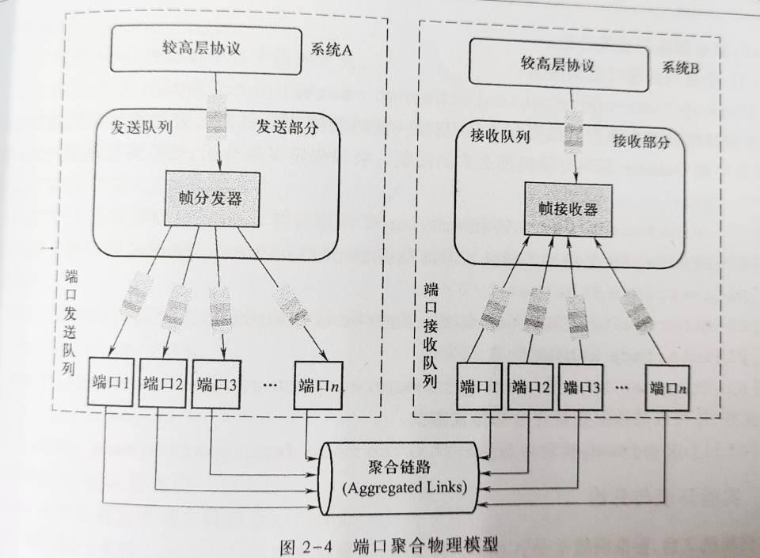

# 链路层实验

目录
1. 以太网链路层帧格式分析
2. 交换机的MAC地址表和端口聚合
3. VLAN的配置与分析
4. 广域网协议分析
5. 设计型实验

## 1 以太网链路层帧格式分析

以太网的技术标准，它规定了包括物理层的连线、电子信号和介质访问层协议的内容。以太网是目前应用最普遍的局域网技术，取代了其他局域网技术如令牌环、FDDI和ARCNET。

以太网是一种网络链路形式，是星型网络。与令牌环、arcnet是链路层网络技术。而不是泛指整个计算机网络。它只是计算机网络某一个层面的一个子集。因特网也是，他是应用层的一种技术，是应用层众多技术中的一个子集，而不是泛指整个计算机网络。

以太网帧格式可以参考[链路层-交换局域网]()的内容。

## 2 交换机的MAC地址表和端口聚合

### MAC地址表
交换机的转发是基于MAC地址表的。以太网交换机收到数据帧时会进行一下操作：
* MAC地址表中没有mac-interface匹配项，则向所有（除发送端口外）端口发送数据帧。
* 如果MAC地址表中有mac-interface匹配项，则表明该端口和目的主机在同一个广播域，转发到指定的端口上。
* 交换机还将检查收到的数据帧的源mac地址，并查找mac地址表中与之相匹配的项，如果没有，交换机将增加一条由mac和interface组成的记录。

### 端口聚合

网络接口产生带宽速度限制。多网络接口连接。一台服务器同时通过多个网络接口提供数据传输，提高用户访问速率。应用场景：
* 交换机与交换机之间的连接：汇聚层交换机到核心层交换机或者核心层交换机之间。
* 交换机与服务器之间的连接：集群服务器采用了多网卡与交换机连接提供集中访问。
* 交换机与路由器之间的连接：交换机和路由器采用端口聚合可以解决广域网和局域网连接瓶颈。
* 服务器与服务器之间的连接：集群服务器采用多王凯与路由器连接提供集中访问。

### 端口聚合实现原理



* 两个以太网交换机进行n个端口的聚合，此时当交换机A要向交换机B通过聚合链路进行数据传输时，从上层协议封装而来的数据帧进行排队，然后通过帧分发器按照一定的规则将帧分发到不同的端口发送队列分别进行发送。
* 数据帧到达对端后，交换机B通过帧接收器将接收到的帧按照接收顺序上交给上层协议，再由上层协议处理。

端口聚合的作用
* 端口汇聚是将2个或多个物理端口组合在一起成为一条逻辑的路径从而增加在交换机和网络节点之间的带宽，将属于这几个端口的带宽合并，给端口提供一个几倍于独立端口的独享的高带宽。简单来说就是将多个端口绑定成一个端口，从而增加带宽。端口聚合的对象可以是交换机和交换机，交换机和路由器，主机与交换机或者路由器之间通过两个或多个端口并行连接同时传输以提供更高带宽、更大吞吐量， 大幅度提供整个网络能力。

* 端口聚合主要用于交换机之间连接。由于两个交换机之间有多条冗余链路的时候，STP会将其中的几条链路关闭，只保留一条，这样可以避免二层的环路产生。主要用途是生成冗余线路，保证通信不会中断。

生成树STP
* 生成树协议STP，开启生成树协议，可以在两台交换机形成环路时，自动断开其中一根线，断掉环路。

```
# 配置stp
stp disable

# 配置端口聚合组
interface bridge-aggeragation 1
link-aggeration mode dynamic

# 将端口加入端口聚合组
inter ethernet 1/0/1
port link-aggregation group 1
inter ethernet 1/0/2
port link-aggregation group 1

# 配置聚合组分发方式
link-aggregation load-sharing mode destionation-mac source-mac

```

## 3 VLAN的配置与分析

> 默认VLANID只作用在接收端接受没有tag域数据帧上。不会作用在发送端上。！！！

> VLAN的tag是在接收端判断的。VLAN的tag是在发送端决定是否加标签发送、无标签发送。

> VLAN数据帧是否丢弃是在输入端口和查询交换机表的过程中决定的。如果输入端口的VLANtag与数据帧的VLANtag不一致则丢弃数据帧；如果查询交换机表中的vlan+目的mac地址的组合没有出现，则转发失败，地球数据帧。 


### VLAN 的产生

一种专门为隔离二层广播报文设计的虚拟局域网技术。路由器本身隔离广播域是因为路由器本身的数据转发都在IP层进行的，而广播本身是在广播域进行的，广播域的mac地址为全1。而交换机本身是不隔离广播域的，对收到的广播帧会向所有端口转发。

在VLAN当中，交换机的转发是区分广播域的。规定，凡是具有VLAN功能的交换机在转发数据报文时，都需要确认该报文属于某一个VLAN，并且该报文智能被转发到属于同一VLAN的端口或主机。每一个VLAN代表了一个广播域，不同的VLAN属于不同的广播域。

广播域是转来用来区分具有相同网络号（网段）的网络接口。

### VLAN的优势
* 限制广播范围，提高带宽的利用率
* 减少移动和改变的代价
* 虚拟工作组
* 用户不受物理设备的限制，VLAN用户可以处于网络中的任何地方
* VLAN对用户的应用不产生影响，是交换机的工作模式。
* 增强通信的安全性
* 增强网络的健壮性

### VLAN的划分

VLAN的主要目的是划分广播域。

1. 基于端口的VLAN划分。利用以太网交换机的端口来划分广播域。VLAN只与交换机有关，与交换机连接的主机无关。
2. 基于MAC地址的VLAN划分。只与主机的MAC地址有关，当用户改变地理位置时，不需要重新配置，但是初始配置代价很大。
3. 基于协议的VLAN划分。根据网络主机使用的网络协议来划分广播域。很难将相同协议的主机广播域划分的很小。
4. 基于子网的划分。根据主机使用的IP地址所在的子网划分广播域。灵活方便管理，但会强迫交换机检查数据包的IP地址，然而这是三层网络层应该做的事情。

### VLAN的帧格式


规定在标准以太网帧添加一个特殊的标志域-tag域。用于表示数据帧所属的VLANID。tag域包括2字节的标签协议IPID和2字节的标签控制信息TCI。TCI包括3bit的优先级信息Priority，CFI说明VLAN格式。
### VLAN标签字段说明

|字段	|长度	|含义取值|
|-|-|-|
|TPID	|2Byte|	Tag Protocol Identifier（标签协议标识符），表示数据帧类型。	表示帧类型，取值为0x8100时表示IEEE 802.1Q的VLAN数据帧。如果不支持802.1Q的设备收到这样的帧，会将其丢弃。 各设备厂商可以自定义该字段的值。当邻居设备将TPID值配置为非0x8100时， 为了能够识别这样的报文，实现互通，必须在本设备上修改TPID值，确保和邻居设备的TPID值配置一致。|
|PRI	|3bit|	Priority，表示数据帧的802.1p优先级。	取值范围为0～7，值越大优先级越高。当网络阻塞时，设备优先发送优先级高的数据帧。|
|CFI	|1bit|	Canonical Format Indicator（标准格式指示位），表示MAC地址在不同的传输介质中是否以标准格式进行封装，用于兼容以太网和令牌环网。	CFI取值为0表示MAC地址以标准格式进行封装，为1表示以非标准格式封装。在以太网中，CFI的值为0。|
|VID	|12bit|	VLAN ID，表示该数据帧所属VLAN的编号。	VLAN ID取值范围是0～4095。由于0和4095为协议保留取值，所以VLAN ID的有效取值范围是1～4094。|

### 缺省VLAN
缺省VLAN又称PVID（Port Default VLAN ID）。前面提到，设备处理的数据帧都带Tag，当设备收到Untagged帧时，就需要给该帧添加Tag，添加什么Tag，就由接口上的缺省VLAN决定。

接口收发数据帧时，对Tag的添加或剥除过程。

* 对于Access接口，缺省VLAN就是它允许通过的VLAN，修改缺省VLAN即可更改接口允许通过的VLAN。
* 对于Trunk接口和Hybrid接口，一个接口可以允许多个VLAN通过，但是只能有一个缺省VLAN。接口的缺省VLAN和允许通过的VLAN需要分别配置，互不影响。

### VLAN数据帧的传输

主机不支持带有tag域的以太网帧。为了让交换机之间能够知道VLAN信息，只有交换机之间的以太网数据帧，才会有VLAN的标签tag域。

过程：
* 交换机收到PC发送的数据帧时，为了让对端交换机知道数据帧的ID，增加VLAN的tag域后在发送。
* 当交换机收到某数据帧的时候，交换机根据数据帧的tag域或者接口端口默认的VLANID来判断数据帧应该转发到哪些端口。如果目的主机是PC，则删除tag域后发送数据帧；如果目的主句是交换机，则添加tag域后发送数据。
* 注意：如果检测到数据帧的VLAN ID和Trunk端口默认的VLANID相同时，不会在数据帧中添加tag域。而是到达对端交换机后，交换机发现没有tag域，为该数据帧为接收端默认VLANID。也就是说，默认VLANID只作用在接收端接受没有tag域数据帧上。


### VLAN端口的分类
* Access端口：连接不支持VLAN技术的端口，常为PC。接受发送不带Tag的以太网数据帧。
* Trunk端口：连接支持VLAN技术的端口，常为交换机。接收发送到包含VLAN标签的以太网帧（如果数据帧的VLAN标签与默认VLAN相同，则接受到不带VLANtag的数据帧，发送的数据帧也不带VLANtag）。
* Hybrid端口：Access与Trunk的混合模式。允许多个VLAN报文不带标签，Trunk只允许默认的VLAN的报文不带标签。


### VLAN数据帧的转发过程
1. 首先检查数据帧是否带有VLAN标签，如果没有，则将该端口默认VLAN ID作为VLAN ID。
2. 如果带有VLAN标签，则检查是否与该端口的VLAN标签一致，如果不一致则丢弃该数据帧。
3. 交换机结合VLANID进行源MAC地址学习，更新MAC地址表。
4. 然后根据数据帧的目的MAC地址和VLANID，查找MAC地址表并向相应的端口转发该数据帧。
5. 最后在发送端口，根据VLANID类型来决定是否将VLAN标签去掉。然后发送数据帧。

```
# vlan 配置
vlan 2
port ethernet 1/0/1 ethernet 1/0/2
vlan 3
port ehternet 1/0/20 to ehternet 1/0/24

# trunk 端口配置
inter ethernet 1/0/13
port link-type trunk
port trunk permit vlan 2 3
```

## 4 广域网数据链路层协议分析

### PPP协议

PPP协议（Point to Point Protocol)点到点协议。数据链路层协议。是跟以太网协议同一个等级，以太网数据帧时用来组建局域网的。由一下三部分组成：
* 一个将IP数据报封装到串行链路的方法。支持异步链路、同步链路。IP数据报是数据部分，受最大接收单元限制MRU。
* 一个用来建立、配置和测试数据链路连接的链路控制协议（link control protocol,LCP），通信双方用来协商。
* 一套网络控制协议（Network Control Protocol，NCP），用来支持不同的网络层协议。

### PPP帧格式


F、A、C字段辅助作用，协议0x33表示数据部分是IP数据。用来区分不同协议。

不适用序号和确认机制。因为没用。

### PPP身份认证


总的来说分为两个步骤，通过LCP建立物理链路，通过NCP打开物理链路传输数据。

身份认证分为两种方式：PAP和CHAP

* PAP身份认证。

Password Authentication Protocol，密码认证协议。PAP认证在LCP链路控制协议建立链路的过程中。不会出现在NCP数据传输阶段。明文发送用户密码。

    1. 客户端发起，用户名+密码明文发送。
    2. 认证方查询数据库，决定是否通过。


* CHAP身份认证

Challenge-Handshake Authentication Protocol，询问握手协议。不仅在LCP链路控制协议连接建立阶段，也会在NCP数据传输阶段随机间隔认证。验证分三步，密文发送验证。

    1. 验证方向被验证方发送：随机报文+主机名
    2. 被验证方接收，查询用户口令秘钥，利用随机报文、秘钥、报文ID用MD5加密算法生成应答。返回主机名
    3. 验证方接收数据，查询用户口令秘钥，利用随机报文、秘钥、报文ID用MD5加密算法得出结果。返回相应的结果。


```
# 启用ppp协议
inter serial 1/0
link-protocol ppp
shutdown
undo shutdown
```
### IPCP协议

> 需要重点自学一下。

## 5 设计型实验
无