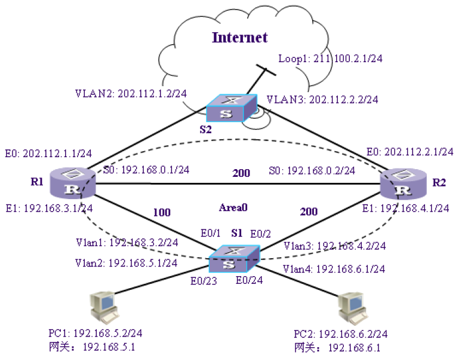

# OSPF协议实验

目录
1. OSPF协议概述及基本配置
2. OSPF协议报文交互过程
3. OSPF协议链路状态描述
4. 区域划分及LSA种类
5. OSPF协议路由的计算
6. OSPF协议组网设计

> 区别
> * OSPF指出了报文类型，表示建立可靠数据连接的过程的作用，指出了交互逻辑。
> * LSA链路状态通告类型，用于反映交互双方（携带数据者）的逻辑关系。是反映的数据发送者、接受者的逻辑关系，而非路由表项的内容。与路由器本身的逻辑位置和逻辑角色有关系。
> * LSA链路状态描述类型，反映了一条路由记录的类型，是一条记录自身的特点，与数据的具体含义有关。

> 联系
> * 链路状态描述信息组成了链路状态通告信息。

> 图片说明
> * 五种不同的报文类型
> 
> * 五种链路状态通告类型
> 
> * 五种链路状态描述类型
> 


# OSPF协议概述及基本配置
```
# 配置静态路由并设置优先级，数值越大优先级越低
ip route-static 1.1.1.1 255.255.0.0 192.168.1.1 pre 50
# 启动ospf
router id 1.1.1.1
ospf 1
area 0
network 1.1.1.0 0.0.0.255
network 2.2.2.0 0.0.0.255
```
# OSPF协议报文交互过程
```
# 引入直连路由和静态路由
opsf
import-route direct cost 100
import-route static cost 100
```
# OSPF协议链路状态描述
```
# 显示ospf LSA中的链路状态描述
dis ospf lsdb router
dis ospf lsdb network 
dis ospf lsdb asb
dis opsf lsdb ase
```
# 区域划分及LSA种类 
# OSPF协议路由的计算
# OSPF协议组网设计
R1、R2和S1所组成的网络运行OSPF协议实现互联，对用户PC1和PC2提供访问互联网的服务。通过为各条连线设置不同的花费值，可以使所有的PC通过指定路径访问互联网。图中各线条上所标的粗体字为花费值，指定路径为 S1-R1-Internet。若S1-R1路径出现故障，路由协议会自动选取S1-R2-Internet作为新的路径，保持网络畅通。若R2-Internet也发生故障，则将S1-R2-RI-Internet作为新的路径。


```
一、设计说明
动态路由协议OSPF能够自动发现路由生成路由表。利用动态路由协议OSPF的特性，进行路由备份设计。
1. 实验中使用两个三层交换机和两个路由器组成四个路由器的网络拓扑。
2. PCA和PCB分别能够通过S1-R1-Internet、S1-R2-Internet、S1-R1-R2-Internet、S1-R2-R1-Internet等不同的线路实现对S2上Internet的访问。不同的链路进行相互备份，减轻链路故障带来的影响。
3. 为每一条链路设置不同的Cost，当所有链路可达的时候，OSPF会根据链路状态数据库计算Cost值最优的链路。
4. 当某一条链路断开失效后，OSPF会根据新的链路状态数据库计算当前状态下Cost值最小的链路，实现对Internet的网络。
5. 在具体的网络实验过程中，OSPF计算路由首先选择S1-R1-Internet访问网络。断开S1-R1之后，选择S1-R2-Internet访问网络。断开R2-Internet之后，选择S1-R2-R1-Internet访问网络。

二、IP与VLAN的配置
首先进行连线组网，然后配置一下内容
设置PCA、PCB的IP地址、子网掩码、网关路由器。
[S1]vlan 1
[S1-vlan1]port Ethernet 1/0/1
[S1]inter vlan 1
[S1-vlan-interface1]ip addr 192.168.3.2 24
[S1]vlan 2
[S1-vlan2]port Ethernet 1/0/23
[S1]inter vlan 2
[S1-vlan-interface2]ip addr 192.168.5.1 24
[S1]vlan 3
[S1-vlan3]port Ethernet 1/0/2
[S1]inter vlan 3
[S1-vlan-interface3]ip addr 192.168.4.2
[S1]vlan 4
[S1-vlan4]port Ethernet 1/0/24
[S1]inter vlan 4
[S1-vlan-interface4]ip addr 192.168.6.1

[R1]inter Ethernet 0/0
[R1-Ehternet0/0]ip addr 202.112.1.1 24
[R1]inter Ethernet 0/1
[R1-Ehternet0/1]ip addr 192.168.3.1 24
[R1]inter serial 1/0
[R1-Serial1/0]ip addr 192.168.0.1 24

[R2]inter Ethernet 0/0
[R2-Ehternet0/0]ip addr 202.112.2.1 24
[R2]inter Ethernet 0/1
[R2-Ehternet0/1]ip addr 192.168.4.1 24
[R2]inter Serial 1/0
[R2-Serial1/0]ip addr 192.168.0.2

[S2]vlan 2
[S2-vlan2]port Ethernet 1/0/1
[S2]inter vlan 2
[S2-vlan-interface2]ip addr 202.112.1.2 24
[S2]vlan 3
[S2-vlan3]port Ethernet 1/0/24
[S2]inter vlan 3
[S2-vlan-interface3]ip addr 202.112.2.2 24
[S2]inter loopback 1
[S2-loopback1]ip addr 211.100.2.1 24

三、OSPF配置
[S1]router id 1.1.1.1
[S1]ospf
[S1-ospf1]area 0
[S1-ospf1-area0.0.0.0]network 192.168.3.2 0.0.0.255
[S1-ospf1-area0.0.0.0]network 192.168.4.2 0.0.0.255
[S1]inter vlan 1
[S1-vlan1]ospf cost 100
[S1]inter vlan 3
[S1-vlan3]ospf cost 200

[R1]router id 3.3.3.3
[R1]ospf
[R1-ospf1]area 0
[R1-ospf1-area0.0.0.0]network 192.168.3.1 0.0.0.255
[R1-ospf1-area0.0.0.0]network 192.168.0.1 0.0.0.255
[R1]inter Ethernet 0/1
[R1-Ethernet0/1]ospf cost 100
[R1]inter Serial 1/0
[R1-Serial1/0]ospf cost 200

[R2]router id 4.4.4.4
[R2]ospf
[R2-ospf1]area 0
[R2-ospf1-area0.0.0.0]network 192.168.0.2 0.0.0.255
[R2-ospf1-area0.0.0.0]network 192.168.4.1 0.0.0.255
[R2]inter Ethernet 0/1
[R2-Ethernet0/1]ospf cost 200
[R2]inter Serial 1/0
[R2-Serial1/0]ospf cost 200

四、路由备份和路由引入
[S1]ospf
[S1-ospf1]import-route direct

[S2]ip route-static 192.168.0.0 255.255.0.0 202.112.1.1 pre 50
[S2]ip route-static 192.168.0.0 255.255.0.0 202.112.2.1 pre 60

[R1]ip route-static 211.100.2.1 255.255.255.0 202.112.1.2
[R1]ospf
[R1-ospf1]imort-route static cost 100
[R1-ospf1]import-route direct cost 100

[R2] ip route-static 211.100.2.1 255.255.255.0 202.112.2.2
[R2]ospf
[R2-ospf1] imort-route static cost 200
[R2-ospf1] import-route direct cost 200

为了能用tracert命令观察到每一跳的内容，在S1、S2、R1、R2上分别执行：
ip unreachables enable
ip ttl-expires enable
```