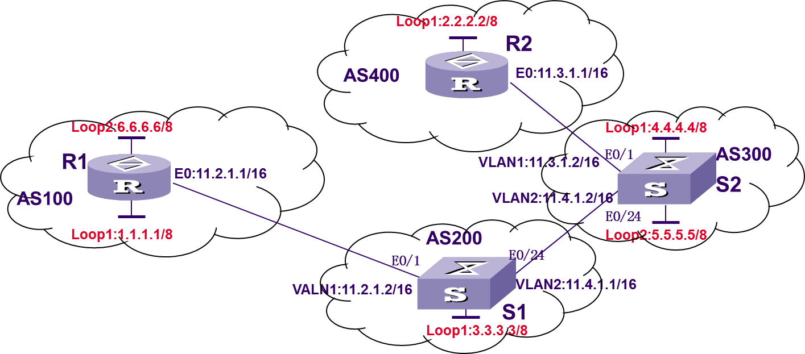

# BGP实验

目录
1. BGP协议基本分析
2. 状态机的分析


3. BGP的路由聚合
4. BGP的基本路由属性分析
5. BGP的同步机制
6. BGP的路由策略及应用


7. BGP设计型实验


> 关于聚合问题需要进一步学习。包括链路层的端口聚合和OSPF与BGP的路由聚合


## 1 BGP基本分析

BGP的路由只包含BGP路由器。仅指明下一跳。

BGP组成的AS之间的网络结构拓扑图是全连接的？并不是。

BGP协议中带有很多属性信息，便于进行路由策略和路由过滤。

对于路由的routing-table来说，OSPF与BGP是一样的，他们只是不同的路由信息传播策略与路由信息生成策略。但具体的路由过程是完全一致的。
也就是说，最终都要提供目的地址和下一跳地址，生成路由表，进行路由转发。
```
# 配置bgp对等体
bgp 100
peer 1.1.1.2 as-number 300
peer 3.1.1.2 as-number 300
address-family ipv4 unicast
peer 1.1.1.2 enable
peer 3.1.1.2 enable
peer 3.1.1.2 next-hop-local

# 通过network引入路由信息
network 5.5.5.5 255.255.255.255
```
## 2 状态机的分析

```
debug bgp event
teminal debugging
reset bgp all

display bgp peer
```
## 3 BGP的路由聚合
```
bgp 100
address-family ipv4 unicast
aggregate 192.168.0.0 255.255.240.0

aggregate 192.168.0.0 255.255.240.0 detail-supressed
```
## 4 BGP的基本路由属性分析
```
bgp 100
import-route direct

display bgp routing-table ipv4
```
## 5 BGP的同步机制
```
```
## 6 BGP的路由策略及应用
路由策略可以分为三类
* 路由发布
* 路由接受
* 路由引入

```
# acl
acl number 2001
rule 0 deny source 5.0.0.0 0.255.255.255
rule 1 permit source 0.0.0.0 255.255.255.255
quit
bgp 300
peer 2.1.1.2 filter-policy 2001 export

# as-path-acl
ip as-path-acl 1 deny \b200$
ip as-path-acl 1 permit ^$
bgp 300
peer 1.1.1.1 as-path-acl 1 export

# route policy
acl number 2001
rule 1 deny 6.0.0.0 0.255.255.255
rule 2 permit source any
quit

route-policy deny6 permit node 10
if match acl 2001
apply cost 888
quit

bgp 300
address-family ipv4 unicast
peer 1.1.1.1 route-policy deny6 export
```
## 7 BGP设计型实验

```
一、设计说明
BGP协议能够实现自制系统之间的路由过程。并可以通过路由策略对路由过程进行控制。常见的路由策略相关的过滤器主要有5种：路由策略、访问控制列表、前缀列表、自治系统路径信息访问列表、团体属性列表。
在本次实验中，使用自治系统路径信息访问列表对路由进行控制。在S1上过滤路由，使得AS300相关的路由通告信息，不会被发往AS100内。

二、IP与VLAN的配置
设置PCA、PCB的IP地址、子网掩码、网关路由器。
[S1]vlan 1
[S1-vlan1]port Ethernet 1/0/1
[S1]inter vlan 1
[S1-vlan-interface1]ip addr 11.2.1.2 16
[S1]vlan 2
[S1-vlan2]port Ethernet 1/0/24
[S1]inter vlan 2
[S1-vlan-interface2]ip addr 11.4.1.1 16
[S1]inter loopback1
[S1-loopback1]ip addr 3.3.3.3 32

[R1]inter Ethernet 0/0
[R1-Ehternet0/0]ip addr 11.2.1.1 16
[R1]inter loopback 1
[R1-loopback1]ip addr 1.1.1.1 32
[R1]inter loopback 2
[R1-loopback2]ip addr 6.6.6.6 32

[R2]inter Ethernet 0/0
[R2-Ehternet0/0]ip addr 11.3.1.1 16
[R2]inter loopback 1
[R2-loopback1]ip addr 2.2.2.2

[S2]vlan 1
[S2-vlan1]port Ethernet 1/0/1
[S2]inter vlan 1
[S2-vlan-interface1]ip addr 11.3.1.2 16
[S2]vlan 2
[S2-vlan2]port Ethernet 1/0/24
[S2]inter vlan 2
[S2-vlan-interface2]ip addr 11.4.1.2 16
[S2]inter loopback 1
[S2-loopback1]ip addr 4.4.4.4 32
[S2]inter loopback 2
[S2-loopback2]ip addr 5.5.5.5 32

三、BGP配置

[R1]bgp 100
[R1-bgp]peer 11.2.1.2 as-number 200
[R1-bgp]network 1.1.1.1 255.255.255.255
[R1-bgp]network 6.6.6.6 255.255.255.255

[S1]bgp 200
[S1-bgp]peer 11.2.1.1 as-number 100
[S1-bgp]peer 11.4.1.2 as-number 300
[S1-bgp]network 3.3.3.3 255.255.255.255

[S2]bgp 300
[S2-bgp]peer 11.4.1.1 as-number 200
[S2-bgp]peer 11.3.1.1 as-number 400
[S2-bgp]network 4.4.4.4 255.255.255.255
[S2-bgp]network 5.5.5.5 255.255.255.255

[R2]bgp 400
[R2-bgp]peer 11.3.1.2 as-number 300
[R2-bgp]network 2.2.2.2 255.255.255.255

四、路由策略配置
[S1]ip as-path-acl 1 deny \b300$
[S1]ip as-path-acl 1 permit ^$
bgp 300
[S1-bgp]peer 11.2.1.1 as-path-acl 1 export
```