# 802.11

> 参考文献
> * [802.11协议族](https://blog.csdn.net/ght886/article/details/79862046)

## 1 无线网络概述

### 定义

无线网络是利用无线电波作为信息传输的媒介所构成的网络。可以将无线网络分为：无线个人网络（PAN）、无线局域网（LAN）、无线城域网（MAN）、无线广域网（WAN）。

### 分类

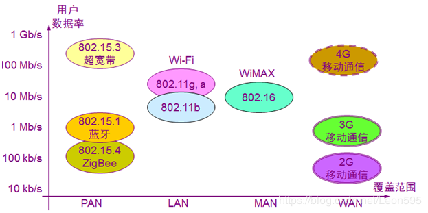

### 组网示意图
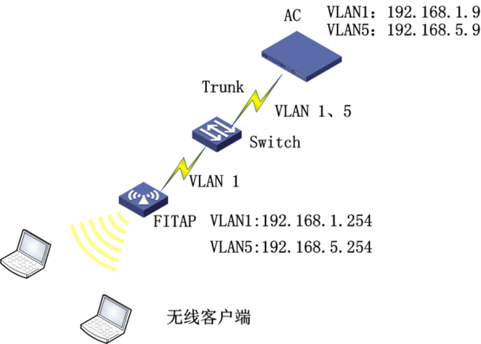

* AC(Access Controller,无线访问控制器):无线控制器对局域网中的FIT AP进行管理和控制,无线控制器还可以通过与认证服务器交互信息来为用户提供无线接入认证功能。

* AP(Access Point,无线接入点):AP提供无线客户端到局域网的桥接功能,在无线客户端与无线局域网之间进行无线与有线之间的帧转换,AP分为FAT AP和FIT AP两种模式。

* AC+FIT AP是当前部署无线网络时的主流模式。无线控制器AC集中处理所有的安全、管理和控制功能，所有配置均是在无线控制器和网桥上；FIT AP零配置，FIT AP只需要从无线控制器上注册并下载配置，提供可靠的、高性能的射频服务。

### FIT AP注册方式
FIT AP 与 AC有三种连接方式：直连方式、二层网络连接、跨三层网络连接。

* AP与无线控制器通过二层网络连接：AP通过DHCP server获取IP地址；然后，通过发出二层广播的发现报文尝试联系一个无线控制器，收到请求的控制器会检查该AP是否有接入本机的权限，如果是有权限，则响应请求；AP从控制器上下载最新软件版本与配置，开始工作。
* AP与无线控制器通过三层网络连接时，采用option 43方式进行注册：AP通过DHCP server获取IP地址、43属性，AP从option43中获取控制器的IP，然后向无线控制器发送单播请求报文，受到请求的控制器检查AP是否有接入本机的权限，如果有权限则响应请求，AP从控制器上下载最新的软件版本与配置，开始工作。

## 2 802.11帧

### 帧格式示意图
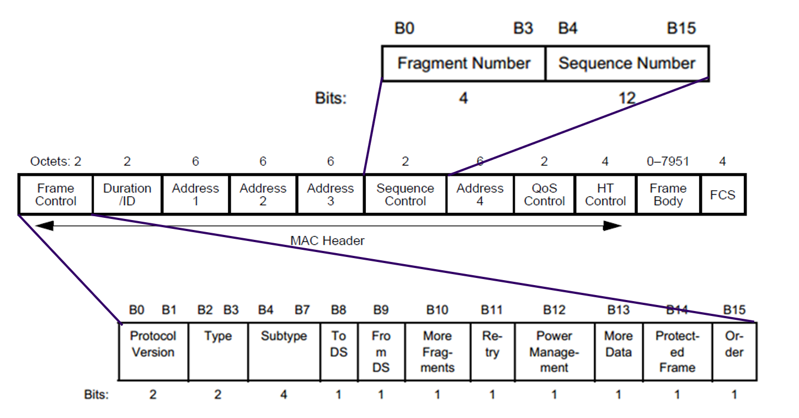
802.11数据帧可以分为三类：管理真、数据帧、控制帧。

### 帧字段说明

1. 帧控制结构(Frame Control)
    * Protocol Version: (协议版本)通常为0
    * Type: 帧类型
        * 控制帧：用于竞争期间的握手通信和正向确认、结束非竞争期等； 
        * 管理帧：主要用于STA与AP之间协商、关系的控制，如关联、认证、同步等； 
        * 数据帧：用于在竞争期和非竞争期传输数据。

    * Subtype: 进一步判断帧的子类型  
    * To DS: 表明该帧是否是BSS向DS发送的帧 
    * From DS: 表明该帧是否是DS向BSS发送的帧 
    * More Fragment: 用于说明长帧被分段的情况，是否还有其它的帧，如果有则该值设置为1
    * Retry(重传域): 表示该分段是先前传输分段的重发帧。 
    * Power Management: 表示传输帧以后，站所采用的电源管理模式
    *  More Data: 表示有很多帧缓存到站中。即至少还有一个数据帧要发送给STA是设置为1。 
    * Protected Frame: 表示根据WEP(Wired Equivalent Privacy)算法对帧主体进行加密。如果帧体部分包含被密钥套处理过的数据，则设置为1，否则设置为0  
    * Order(序号域): 在长帧分段传送时，该域设置为1表示接受者应该严格按照顺序处理该帧，否则设置为0

2. Duration/ID(持续时间/标识)

    表明该帧和它的确认帧将会占用信道多长时间，Duration 值用于网络分配向量(NAV)计算。

3. Address Fields(地址域): 

   * Destination Address
   * Source Address
   * BSS ID 

4. Sequence Control(序列控制域): 用于过滤重复帧
    * MSDU(MAC Server Data Unit), 12位序列号(Sequence Number)终端方出去的数据包序号。
    * MMSDU(MAC Management Server Data Unit), 4位片段号(Fragment Number)组成，数据包分片的序号。
5. QoS Control：服务质量控制。
6. HT Control：仅在个别帧中出现
7. Frame Body(Data): 发送或接收的信息。对于不同类型的数据帧来说，这个域的格式差别较大
8. FCS(CRC): 包括32位的循环冗余校验(CRC)，用于检错，注意是检错不是纠错

### 管理帧

* 管理帧的一般格式

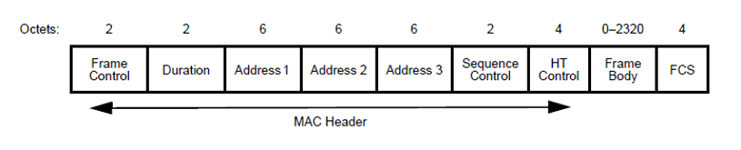

其中Address 1代表目的地址，Address 2代表原地址，Address 3 代表BSSID（Basic Set ID）。

* 管理帧的子类型

|子类型Subtype值|代表的类型|
|-|-|
|0000|Association Request(关联请求)|
|0001|Association Response (关联响应)|
|0010|Reassociation Request(重关联请求)|
|0011|Reassociation Response(重关联响应)|
|0100|Probe Request(探测请求)|
|0101|Probe Response(探测响应)|
|1000|Beacon(信标帧)|
|1001|ATIM(通知传输指示信息)|
|1010|Disassociation(解除关联)|
|1011|Authentication(解除身份验证)|
|1100|Deauthentication(解除身份验证)|

* Beacon帧
* Association Request
* Association Response
* Probe Request
* Probe Response
* Authentication

### 数据帧

* 数据帧的格式

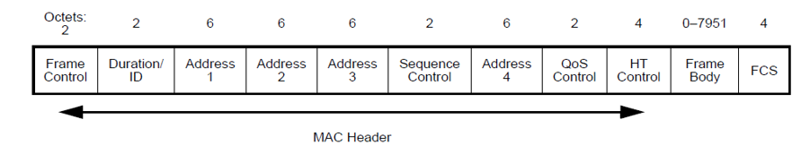

* address字段存在于TO DS、FROM DS关系

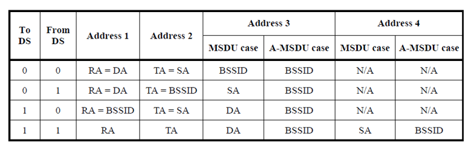

可能会进行分段分片。

### 控制帧

CSMA/CA 访问控制机制
分布式协调功能（distributed coordination function，简称DCF）
预约信道：RTS/CTS
虚拟载波监听功能与网络分配矢量
帧间隔

* 控制帧的类型

|Subtype Value|Subtype Description|
|-|-|
|0000-0110 |Reseved|
|1000 |Block Ack Reques|
|1001 |Block Ack|
|1010 |PS-Poll|
|1011 |RTS|
|1100 |CTS|
|1101 |ACK|

* RTS（Request To Send）请求发送

    * RA：RTS用于为要传送的数据帧、管理帧或者控制帧预约信道，RA就是后续这些帧的目的地址；
    * TA：发送RTS的无线终端的地址；
    * Duration：持续时间，单位为微秒。值为传送一个管理帧或者数据帧时间加上一个CTS时间、一个ACK再加上3个SIFS。

* CTS（Clear To Send）允许发送
    * RA：直接拷贝自对应RTS中的TA；
    * Duration：拷贝自对应的RTS中的Duration值，但要减去传输此CTS帧的时间，并再减去一个SIFS。

* ACK
    * RA：拷贝自所要确认的帧的Address 2字段；
    * Duration：如果Frame Control中More Fragment为0，那么Duration为0；否则将拷贝自所要确认的帧中的Duration值，并减去传输此ACK所需时间，再减去一个SIFS。

* PS-Poll(Power Save模式)
    * 无线接入点为处于PS模式的无线终端缓存数据帧。无线终端唤醒后，通过PS-Poll帧来通知无线接入点把缓存帧发送过来。
    * BSSID：包含连接无线终端的无线接入点所在的服务集标识
    * TA：传输该帧的无线终端地址
    * AID：该无线终端和无线服务器端关联时指定的关联代码。
## 3 802.11与以太网帧转换

### 802.11帧封装
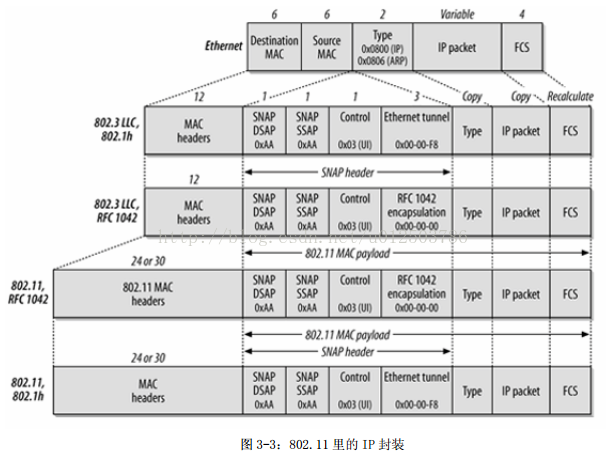

### 无线介质到有线介质

1. 基站收到一个帧，会检测该帧是否完整。接下来，基站会帧对所使用的物理城，检视物理层标头，然后验证802.11帧上的帧检验码

2. 该帧无误，基站会继续检视是否应该进一步处理
    * 传送至基站的帧，会将基站的MAC地址（BSSID）放到802.11MAC标头的address1位。不符该基站BSSID的帧应予以丢弃。（有些产品并未实现此步骤）
    * 802.11 MAC接着监测且移出重复的帧。产生重复帧的原因很多，不过最常见的情况是802.11应答信息在传递过程中丢失或有所损毁。为了简化上层协议的工作，因此由802.11MAC负责剔除重复的帧

3. 一旦决定处理该帧，就必须进行解密，因为该帧会收到链路层安全算法的保护

4. 解密之后，判断该帧是否为帧片段，是否重组。完整性保护针对重组后完整帧，而不是个别的帧片段。（完整性保护ICV在数据中，也被加密）

5. 经过步骤2的检验，判定基站必须桥送该帧，较复杂的802.11MAC标头就会被转换为较简单的以太网MAC标头。

    * 记录在802.11MAC标头的address3的目的地址，会被复制到以太网的目的地址。
    * 记录在802.11MAC标头的address2位的源地址，会被复制到以太网的源地址
    * 从802.11data位里的SNAP标头，将TYPE类型代码复制到以太网帧里的type位。如果该以太网帧亦使用SNAP，就复制整个SNAP标头
    * 顺序信息主要供帧片段重组之用，不过当帧被桥送之后即立即丢弃
    * 如果有标准的服务质量处理程序，即在此进行无线与有线的Qos对应。不过到目前为止，用来表示服务质量的形式，通常就是在有线帧中使用的802.1p优先级等级bit，或者其他的控制形式。

6. 重新计算帧校验码。以太网与802.11使用相同的算法来计算FCS，不过802.11帧多出一些位，同时为FCS所保护。

7. 将产生的新帧交付以太网界面传送

### 有线介质至无线介质

1. 验证以太网FCS后，基站首先会检视是否需要进一步处理所接收到的帧，也检视该帧的目的地址是否属于目前与基站连接的工作站。

2. 将SNAP标头加入以太网帧的数据之前。上层封包是以SNAP标头进行封装，而其type位是自以太网里的类型代码复制而来。如果该以太网帧也使用SNAP，则复制整个SNAP标头

3. 对帧的传送进行排程。802.11包含复杂的省电过程，将帧置于传送序列之前，基站可能会将帧暂存于缓存区。

4. 一旦帧被置于序列待传，就会被赋予一个顺序编号。如有必要，所产生的数据可以用完整性检测值加以保护。如果帧需要分段，则会根据事先设定好的分段门限进行分段。分段帧时，将会在sequence control位指定片段编号

5. 如果帧需要保护，对帧的本体进行加密

6. 802.11MAC标头根据以太网MAC首部产生
    * 将以太网的目的地址复制到802.11MAC标头的address1位
    * 将BSSID置于MAC标头的address2位，以作为帧的发送者
    * 将帧的源地址复制到MAC标头的address3
    * 将其它位填入802.11MAC标头。也就是把预计传送时间填入duration位，并把适当的标志填入到frame control 位

7. 重新计算帧校验码。以太网与802.11使用相同的算法来计算FCS，不过802.11帧多出一些位，同时为FCS所保护

8. 所产生的新帧交付802.11界面传送界面
## 4 802.11工作原理

### 无线网络接入过程

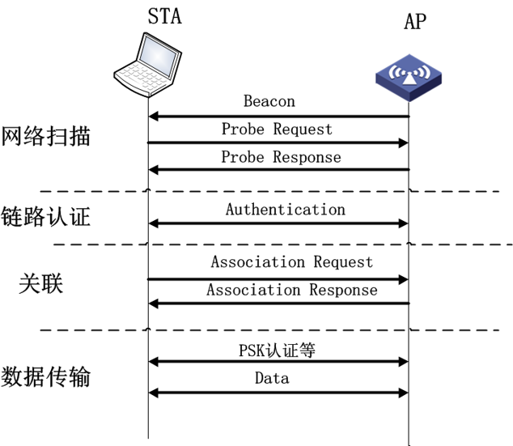

包括四个阶段：网络扫描、链路认证、建立连接、数据传输。

1. 网络扫描：无线网卡发现附近有可能接入的所有无线网络
2. 链路认证：802.11标准要求无线网络终端访问网络前进行链路认证。开放式和共享秘钥。
3. 建立关联：若无线终端想要接入无线网络，与特定的AP（接入点）建立关联。
4. 数据传输：用户开始网络数据访问。之前需要用户身份认证。

> * 链路认证：只允许有限的网络访问，确认身份后允许完整的网络访问权限。可以对用户进行区分并在用户访问网络之前限制其访问权限。对于网络协议而言，链路认证可以配合任何网络层协议使用。
> * 用户身份认证WPA、WPA 2-PSK 、802.1x、WAP、MAC认证。

### 网络扫描
* 相关的参数值

|参数|含义|
|-|-|
|BSSType |指定搜寻的网络类型
|BSSID |针对特定网络进行扫描或者所有网络（individual broadcast）
|ScanType |主动扫描或者被动扫描（active passive）主动扫描发送Probe Request帧，被动扫描监听Beacon帧。
|ChannelList |被动扫描，当前信道被动动监听目前存在的网络列表。
|ProbeDelay |主动扫描某个信道，等到ProbeResponse延时计时器。
|MinChannelTime MaxChannelTime |每个特定的信道使用的最大最小时间量。

* 被动扫描（passive scanning， Beacon 帧）
可以节省电池的电力，不需要传送任何信号。工作站会在信道表（channel list）所列的各个信道之间不断切换，并等待 Beacon 帧。所收到的任何帧都会被缓存起来，以便获取传送这些帧的BSS(Basic Service Set,基本服务集合)的相关数据。

* 主动扫描（ Probe Request帧，Probe Response帧）
主动扫描是主动寻找网络，具体流程：
    1. 跳至某个信道，然后等候来帧指示，或者等到ProbeDelay 计时器超时。
    2. 取得介质使用权后送出一个Probe Request帧
    3. 至少等候一段最短信道时间（MinChannelTime）。如果介质不忙碌，表示没有网络存在。跳至下个信道。如果在MinChannelTime这段期间介质非常忙碌，就继续等候一段时间，直到最长的信道时间（即 MaxChannelTime），然后处理Probe Response帧。
    4. 网络收到Probe Request帧，就发出 Probe Response帧。

扫描结束后会产生一份扫描报告，这份报告列出了该次扫描所发现的所有BSS及其相关参数（如BSSID、SSID 、BSSType等）

### 链路认证

链路认证是无线终端接入无线网络的起点，也是一种对网络表明身份的方式。
* 开放认证方式（Open System Authentication）
* Shared-Key 认证方式（Shared Key Authentication）

两种认证方式都是通过Authentication 报文实现。

### 建立关联

完成身份认证后，无线终端就可以与无线服务端进行关联（或者跟新的无线服务端进行重新关联），以便获得网络的完全访问权。

* 无线终端在发起Association或者Re-association请求帧
* 无线服务端发送Association response或Reassociation response响应帧

无线终端和无线服务端成功完成关联，表明两个设备成功建立了802.11链路。

### 数据传输
参考：802.11与以太网帧转换

### 
### 用户认证-WPA/WPA2-PSK认证

WPA（wifi protected access）wifi保护接入。链路认证阶段使用开放系统认证。用户身份认证阶段采用WPA-PSK认证。

WPA-PSK通过Pre-shared key进行认证，以Pre-shared key作为PMK（pairwise master key成对主秘钥）协商临时加密。无线终端预先配置Key，通过AP-AC四次握手协商验证无线终端侧Key的合法性。产生PTK和GTK用来加密无线报文。

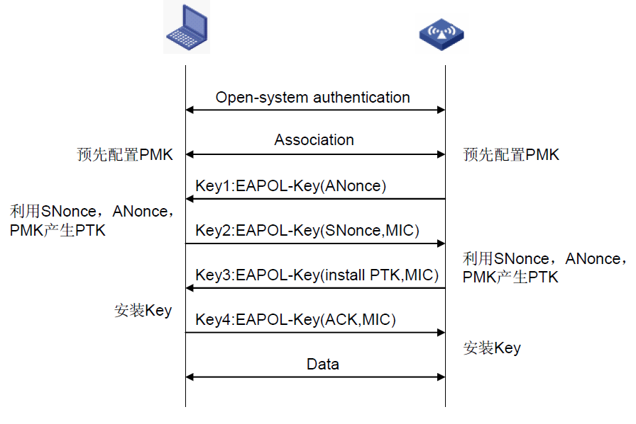

1. 四次单播秘钥协商过程
    * 无线服务端发送EAPOL-Key给无线终端，包括Anonce
    * 无线终端计算PTK，发送EAPOL-Key给无线服务端。
    * 无线服务端计算PTK，校验MIC，验证无线终端PMK。
    * 无线服务端发送EAPOL-Key给无线终端，安装秘钥。
    * 无线终端发送EAPOL-Key给无线服务端，已经安装秘钥。
2. 二次组播秘钥协商过程
    * 无线终端发送秘钥
    * 无线服务端计算GTK。
## 5 802.11协议族
### ★802.11a★
　　802.11a：1999年，IEEE 802.11a标准制定完成，该标准规定无线局域网工作频段在5GHz，数据传输速率达到54Mbps， 传输距离控制在10～100米。802.11a采用正交频分复用（OFDM）的独特扩频技术；可提供25Mbps的无线ATM接口和10Mbps的以太网无线帧结构接口，以及TDD/TDMA的空中接口；支持语音、数据、图像业务；一个扇区可接入多个用户，每个用户可带多个用户终端。

### ★802.11b★
　　802.11b：1999年9月IEEE 802.11b被正式批准，该标准规定无线局域网工作频段在2.4GHz，数据传输速率达到11Mbps。该标准是对IEEE 802.11的一个补充，采用点对点模式和基本模式两种运作模式，在数据传输速率方面可以根据实际情况在11Mbps、5.5Mbps、2Mbps、1Mbps的不同速率间自动切换，802.11b和工作在5GHz频率上的802.11a标准不兼容。由于价格低廉，802.11b产品已经被广泛地投入市场，并在许多实际工作场所运行。

### ★802.11g★
IEEE的802.11g标准是对流行的802.11b（即Wi-Fi标准）的提速（速度从802.11b的11Mb/s提高到54Mb/s）。802.11g接入点支持802.11b和802.11g客户设备。同样，采用802.11g网卡的笔记本电脑也能访问现有的802.11b接入点和新的802.11g接入点。 不过，基于802.11g标准的产品目前还不多见。如果你需要高速度，已经推出的802.11a产品可以提供54Mb/s的最高速度。

### ★802.11n ★
　　Wi－Fi联盟在802.11a/b/g后面的一个无线传输标准协议， 为了 实现 高带宽、高质量的WLAN服务，使无线局域网达到以太网的性能水平，802.11N（TGn）应运而生。802.11n标准至2009年才得到IEEE的正式批准，采用 MIMO OFDM调制技术，而且已经大量在PC、笔记本电脑中应用.

802.11n物理层采用的关键技术有MIMO、MIMO-OFDM、40MHz信道、Short GI、FEC、MRC等。802.11n MAC层采用的关键技术有Block确认、帧聚合等。

### ★802.11ac★
　　802.11ac的核心技术主要基于802.11a
　　继续工作在5.0GHz频段上以保证向下兼容性，但数据传输通道会大大扩充，在当前 20MHz的基础上增至40MHz或者80MHz，甚至有可能达到160MHz。再加上大约10%的实际频率调制效率提升，新标准的理论传输速度最高有望 达到1Gbps，是802.11n 300Mbps的三倍多。

　　802.11ac是第一个承诺将无线数据传输率提升到超过1Gbps的标准，而且还包含很多先进特性来改善用户体验。802.11ac使用更多的多流空间传输技术，采用8x8(MIMO)多输入输出，提供更宽的数据传输信道带宽（达到80MHz），甚至还可以使用信道聚合技术，将数据信道总带宽提升至160MHz。此外，802.11ac获得成功的关键在于他是一个渐进的技术：实现其目标，超越了几个重要的典范，并建立在现有的802.11n基础之上。这是巨大的优势，因为对那些将要使用802.11ac的厂商和消费者来说，802.11ac能够相对容易地从现有无线网络和应用（使用802.11n或者更早期无线协议过渡）。

### 802.11a/b/g/n比较
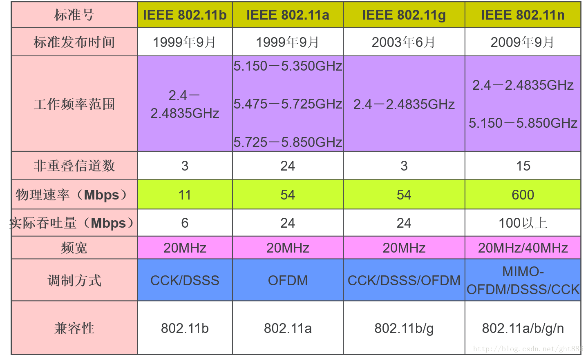
### 802.11n与802.11ac比较
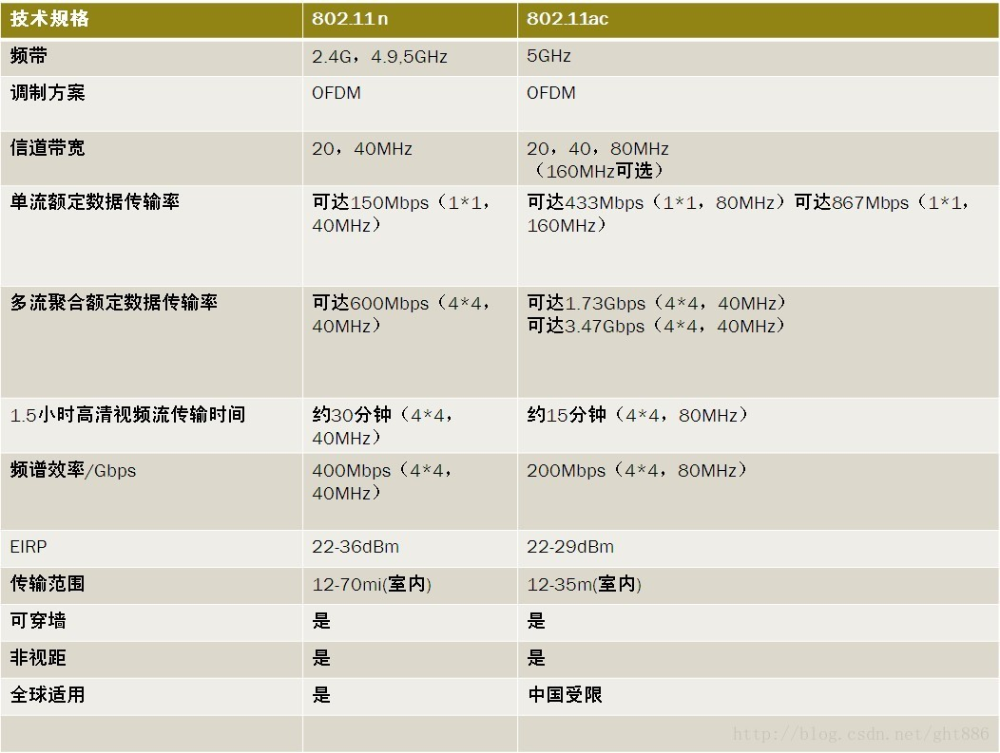

### 802.11n关键技术-MIMO技术
　　802.11n 将 WLAN 带入了全面的多天线时代。MIMO（多输入多输出）技术是指在发射端和接收端分别使用多个发射天线和接收天线，信号通过发射端和接收端，从而改善每个用户的服务质量（误码率或数据速率）。

　　传统的WLAN 系统中，AP 和无线用户通常只是各用一根天线，采用 802.11a/b/g 协议传输，在信号的传输速率上最多达到54Mb/s，很难再提高其速率。而随着 WLAN 技术的普及和广泛应用，用户要求大幅度提高无线通信速率的愿望越来越强烈。802.11n 协议中采用了 MIMO（多输入多输出）多天线技术，WLAN 的信号传输可以很容易的突破单天线所造成的速率瓶颈，满足用户对带宽和信号质量的要求。

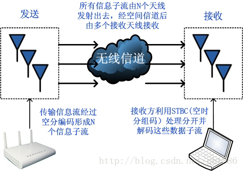

### 802.11n关键技术——OFDM（正交频分复用）技术

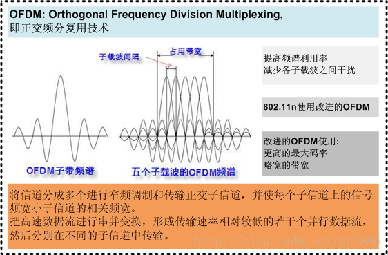

### 802.11n关键技术——MIMO-OFDM

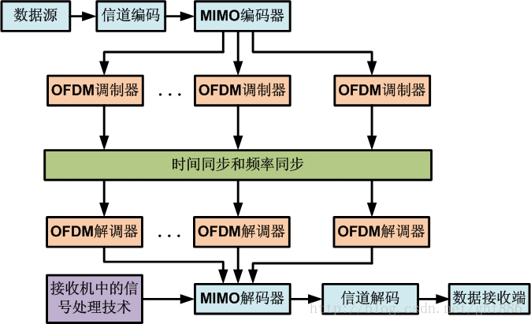

## 6 无线加密技术
### ☆无线网络加密技术之WEP(有线等效加密)☆
　　尽管从名字上看似乎是一个针对有线网络的安全选项，其实并不是这样。WEP标准在无线网络的早期已经创建，目标是成为无线局域网WLAN的必要的安全防护层，但是WEP的表现无疑令人非常失望。它的根源在于设计上存在缺陷。 在使用WEP的系统中，在无线网络中传输的数据是使用一个随机产生的密钥来加密的。但是，WEP用来产生这些密钥的方法很快就被发现具有可预测性，这样对于潜在的入侵者来说，就可以很容易的截取和破解这些密钥。即使是一个中等技术水平的无线黑客也可以在两到三分钟内迅速的破解WEP加密。

### ☆无线网络加密技术之WPA☆
　　WPA延用WEP算法函数RC4，但增加了一些特性以消除WEP使用密码方式上的一些问题： 1.更严格的认证：一个802.1x服务器，如Radius服务器，可以单独地用于用户认证。 2.更长的密钥：WPA将Initialization Vector (IV)的长度增加到48位，主密钥的长度增加到128位。 3.Temporal Key Integrity Protocol (TKIP)为每一个客户生成不同密钥，并且为每一个后续数据包使用不同的密钥。

### ☆无线网络加密技术之WPA2☆
　　在802.11i颁布之后，Wi-Fi联盟推出了WPA2，它支持AES(高级加密算法)，因此它需要新的硬件支持，它使用CCMP(计数器模式密码块链消息完整码协议)。在WPA/WPA2中，PTK的生成依赖PMK，而PMK获的有两种方式，一个是PSK的形式就是预共享密钥，在这种方式中PMK=PSK，而另一种方式中，需要认证服务器和站点进行协商来产生PMK。
