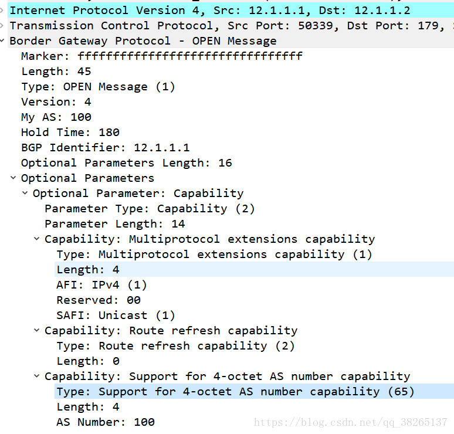
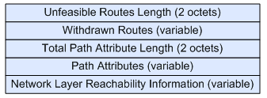
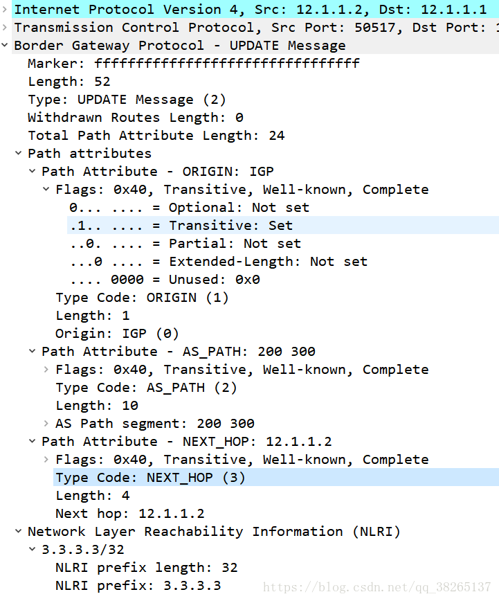
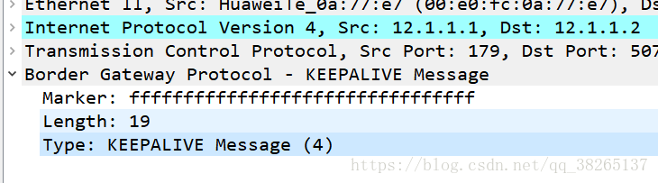
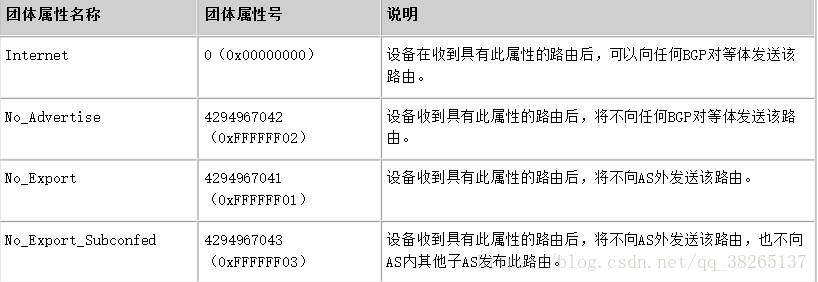
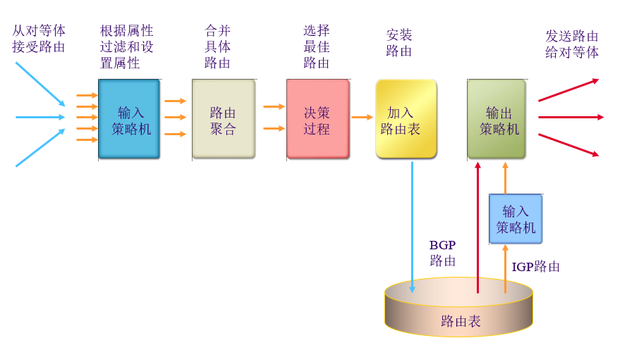
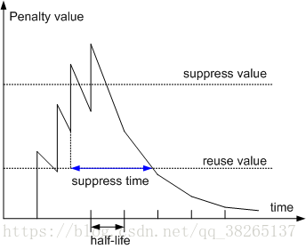

# BGP协议

- [BGP协议](#bgp%e5%8d%8f%e8%ae%ae)
  - [1 BGP概述](#1-bgp%e6%a6%82%e8%bf%b0)
    - [BGP简介](#bgp%e7%ae%80%e4%bb%8b)
    - [目的](#%e7%9b%ae%e7%9a%84)
    - [BGP的优点](#bgp%e7%9a%84%e4%bc%98%e7%82%b9)
  - [2 BGP基础](#2-bgp%e5%9f%ba%e7%a1%80)
    - [BGP基本概念](#bgp%e5%9f%ba%e6%9c%ac%e6%a6%82%e5%bf%b5)
    - [BGP分类](#bgp%e5%88%86%e7%b1%bb)
    - [BGP报文交互中的角色](#bgp%e6%8a%a5%e6%96%87%e4%ba%a4%e4%ba%92%e4%b8%ad%e7%9a%84%e8%a7%92%e8%89%b2)
    - [BGP的路由器号（Router ID）](#bgp%e7%9a%84%e8%b7%af%e7%94%b1%e5%99%a8%e5%8f%b7router-id)
    - [BGP路由生成](#bgp%e8%b7%af%e7%94%b1%e7%94%9f%e6%88%90)
    - [BGP与IGP交互机制-路由注入方式](#bgp%e4%b8%8eigp%e4%ba%a4%e4%ba%92%e6%9c%ba%e5%88%b6-%e8%b7%af%e7%94%b1%e6%b3%a8%e5%85%a5%e6%96%b9%e5%bc%8f)
  - [3 BGP工作原理：](#3-bgp%e5%b7%a5%e4%bd%9c%e5%8e%9f%e7%90%86)
  - [3.1 BGP的报文](#31-bgp%e7%9a%84%e6%8a%a5%e6%96%87)
    - [BGP报文头](#bgp%e6%8a%a5%e6%96%87%e5%a4%b4)
    - [OPEN报文](#open%e6%8a%a5%e6%96%87)
    - [UPDATE报文](#update%e6%8a%a5%e6%96%87)
    - [Notification报文](#notification%e6%8a%a5%e6%96%87)
    - [Keepalive报文](#keepalive%e6%8a%a5%e6%96%87)
    - [Refresh报文格式](#refresh%e6%8a%a5%e6%96%87%e6%a0%bc%e5%bc%8f)
  - [3.2 BGP状态机：](#32-bgp%e7%8a%b6%e6%80%81%e6%9c%ba)
    - [Idle状态](#idle%e7%8a%b6%e6%80%81)
    - [Connet状态](#connet%e7%8a%b6%e6%80%81)
    - [Active状态](#active%e7%8a%b6%e6%80%81)
    - [OpenSent状态](#opensent%e7%8a%b6%e6%80%81)
    - [OpenConfirm状态](#openconfirm%e7%8a%b6%e6%80%81)
    - [Establish状态](#establish%e7%8a%b6%e6%80%81)
  - [3.3 BGP对等体之间的交互原则](#33-bgp%e5%af%b9%e7%ad%89%e4%bd%93%e4%b9%8b%e9%97%b4%e7%9a%84%e4%ba%a4%e4%ba%92%e5%8e%9f%e5%88%99)
  - [5 BGP属性：](#5-bgp%e5%b1%9e%e6%80%a7)
    - [属性分类](#%e5%b1%9e%e6%80%a7%e5%88%86%e7%b1%bb)
    - [BGP常见属性类型：](#bgp%e5%b8%b8%e8%a7%81%e5%b1%9e%e6%80%a7%e7%b1%bb%e5%9e%8b)
    - [Origin属性](#origin%e5%b1%9e%e6%80%a7)
    - [AS_Path属性：](#aspath%e5%b1%9e%e6%80%a7)
    - [Next_hop属性：](#nexthop%e5%b1%9e%e6%80%a7)
    - [Local_pref属性：](#localpref%e5%b1%9e%e6%80%a7)
    - [MED属性：](#med%e5%b1%9e%e6%80%a7)
    - [Community团体属性：](#community%e5%9b%a2%e4%bd%93%e5%b1%9e%e6%80%a7)
    - [Originator_ID属性和Cluster_List属性：](#originatorid%e5%b1%9e%e6%80%a7%e5%92%8cclusterlist%e5%b1%9e%e6%80%a7)
  - [6 BGP路由策略](#6-bgp%e8%b7%af%e7%94%b1%e7%ad%96%e7%95%a5)
    - [路由策略分类](#%e8%b7%af%e7%94%b1%e7%ad%96%e7%95%a5%e5%88%86%e7%b1%bb)
    - [路由策略实施机制](#%e8%b7%af%e7%94%b1%e7%ad%96%e7%95%a5%e5%ae%9e%e6%96%bd%e6%9c%ba%e5%88%b6)
    - [与路由选择相关的过滤器](#%e4%b8%8e%e8%b7%af%e7%94%b1%e9%80%89%e6%8b%a9%e7%9b%b8%e5%85%b3%e7%9a%84%e8%bf%87%e6%bb%a4%e5%99%a8)
    - [路由选择](#%e8%b7%af%e7%94%b1%e9%80%89%e6%8b%a9)
  - [7 BGP的其他机制](#7-bgp%e7%9a%84%e5%85%b6%e4%bb%96%e6%9c%ba%e5%88%b6)
    - [路由聚合](#%e8%b7%af%e7%94%b1%e8%81%9a%e5%90%88)
    - [BGP同步机制](#bgp%e5%90%8c%e6%ad%a5%e6%9c%ba%e5%88%b6)
    - [BGP安全性](#bgp%e5%ae%89%e5%85%a8%e6%80%a7)
    - [BGP负载分担：](#bgp%e8%b4%9f%e8%bd%bd%e5%88%86%e6%8b%85)
    - [BGP路由衰减：](#bgp%e8%b7%af%e7%94%b1%e8%a1%b0%e5%87%8f)

## 1 BGP概述
### BGP简介
边界网关协议BGP（Border Gateway Protocol）是一种实现自治系统AS（Autonomous System）之间的路由可达，并选择最佳路由的距离矢量路由协议。

MP-BGP是对BGP-4进行了扩展，来达到在不同网络中应用的目的，BGP-4原有的消息机制和路由机制并没有改变。MP-BGP在IPv6单播网络上的应用称为BGP4+，在IPv4组播网络上的应用称为MBGP（Multicast BGP）。

### 目的
为方便管理规模不断扩大的网络，网络被分成了不同的自治系统。1982年，外部网关协议EGP（Exterior Gateway Protocol）被用于实现在AS之间动态交换路由信息。但是EGP设计得比较简单，只发布网络可达的路由信息，而不对路由信息进行优选，同时也没有考虑环路避免等问题，很快就无法满足网络管理的要求。

BGP是为取代最初的EGP而设计的另一种外部网关协议。不同于最初的EGP，BGP能够进行路由优选、避免路由环路、更高效率的传递路由和维护大量的路由信息。

虽然BGP用于在AS之间传递路由信息，但并不是所有AS之间传递路由信息都需要运行BGP。比如在数据中心上行的连入Internet的出口上，为了避免Internet海量路由对数据中心内部网络的影响，设备采用静态路由代替BGP与外部网络通信。

### BGP的优点

课本上BGP的特性
* BGP着眼点不在于**发现和计算**路由。而在于控制路由的**传播和选择**最好的路由。
* 通过携带AS路径信息，解决了路由环路问题。
* 为控制路由的传播和路由选择，它为路由附带属性信息
* 支持无类别域间选路CIDR，引入路由聚合。简化路由表。
* 路由更新时只发送增量路由，减少了BGP传播路由的占用宽带。
* 能够对路由进行过滤、选择和控制。
* BGP拓扑结构图中，断点是一个AS区域，边是AS之间的链路。
* BGP需要设置AS间的链路花费、AS区域内的花费。

BGP从多方面保证了网络的安全性、灵活性、稳定性、可靠性和高效性。
* BGP采用认证和GTSM的方式，保证了网络的安全性。
* BGP提供了丰富的路由策略，能够灵活的进行路由选路，并且能指导邻居按策略发布路由。
* BGP提供了路由聚合和路由衰减功能由于防止路由震荡，有效提高了网络的稳定性。
* BGP使用TCP作为其传输层协议（目的端口号179），并支持与BGP与BFD联动、BGP Tracking和BGP GR和NSR，提高了网络的可靠性。
* 在邻居数目多、路由量大且大部分邻居具有相同出口的策略的场景下，BGP使用按组打包技术极大的提高了BGP打包发包性能。

## 2 BGP基础
### BGP基本概念

* 自治系统ASAutonomous System

AS是指在一个实体管辖下的拥有相同选路策略的IP网络。BGP网络中的每个AS都被分配一个唯一的AS号，用于区分不同的AS。AS号分为2字节AS号和4字节AS号，其中2字节AS号的范围为1至65535，4字节AS号的范围为1至4294967295。支持4字节AS号的设备能够与支持2字节AS号的设备兼容。

### BGP分类
BGP按照运行方式分为EBGP（External/Exterior BGP）和IBGP（Internal/Interior BGP）。

* EBGP：运行于不同AS之间的BGP称为EBGP。为了防止AS间产生环路，当BGP设备接收EBGP对等体发送的路由时，会将带有本地AS号的路由丢弃。
* IBGP：运行于同一AS内部的BGP称为IBGP。为了防止AS内产生环路，BGP设备不将从IBGP对等体学到的路由通告给其他IBGP对等体，并与所有IBGP对等体建立全连接。为了解决IBGP对等体的连接数量太多的问题，BGP设计了路由反射器和BGP联盟。

BGP设备将最优路由加入BGP路由表，形成BGP路由。BGP设备与对等体建立邻居关系后，采取以下交互原则：

1. 从IBGP对等体获得的BGP路由，BGP设备只发布给它的EBGP对等体。
2. 从EBGP对等体获得的BGP路由，BGP设备发布给它所有EBGP和IBGP对等体。
3. 当存在多条到达同一目的地址的有效路由时，BGP设备只将最优路由发布给对等体。
4. 路由更新时，BGP设备只发送更新的BGP路由。
5. 所有对等体发送的路由，BGP设备都会接收。
### BGP报文交互中的角色

BGP报文交互中分为Speaker和Peer两种角色。

* Speaker：发送BGP报文的设备称为BGP发言者（Speaker），它接收或产生新的报文信息，并发布（Advertise）给其它BGP Speaker。
* Peer：相互交换报文的Speaker之间互称对等体（Peer）。若干相关的对等体可以构成对等体组（Peer Group）。

### BGP的路由器号（Router ID）

BGP的Router ID是一个用于标识BGP设备的32位值，通常是IPv4地址的形式，在BGP会话建立时发送的Open报文中携带。对等体之间建立BGP会话时，每个BGP设备都必须有唯一的Router ID，否则对等体之间不能建立BGP连接。

BGP的Router ID在BGP网络中必须是唯一的，可以采用手工配置，也可以让设备自动选取。缺省情况下，BGP选择设备上的Loopback接口的IPv4地址作为BGP的Router ID。如果设备上没有配置Loopback接口，系统会选择接口中最大的IPv4地址作为BGP的Router ID。一旦选出Router ID，除非发生接口地址删除等事件，否则即使配置了更大的地址，也保持原来的Router ID。

### BGP路由生成

* 纯动态注入：路由器通过IGP路由协议获得的路由信息注入到BGP当中。
* 半动态注入：路由器选择性的将IGP发现的动态路由信息注册到BGP当中。
* 静态注入：静态配置某条路由到BGP当中。

### BGP与IGP交互机制-路由注入方式

BGP与IGP在设备中使用不同的路由表，为了实现不同AS间相互通讯，BGP需要与IGP进行交互，即BGP路由表和IGP路由表相互引入。

**BGP引入IGP路由**

BGP协议本身不发现路由，因此需要将其他路由引入到BGP路由表，实现AS间的路由互通。当一个AS需要将路由发布给其他AS时，AS边缘路由器会在BGP路由表中引入IGP的路由。为了更好的规划网络，BGP在引入IGP的路由时，可以使用路由策略进行路由过滤和路由属性设置，也可以设置MED值指导EBGP对等体判断流量进入AS时选路。

BGP引入路由时支持Import和Network两种方式：

* Import方式是按协议类型，将RIP、OSPF、ISIS等协议的路由引入到BGP路由表中。为了保证引入的IGP路由的有效性，Import方式还可以引入静态路由static和直连路由direct。
* Network方式是逐条将IP路由表中已经存在的路由引入到BGP路由表中，比Import方式更精确。

**IGP引入BGP路由**

当一个AS需要引入其他AS的路由时，AS边缘路由器会在IGP路由表中引入BGP的路由。为了避免大量BGP路由对AS内设备造成影响，当IGP引入BGP路由时，可以使用路由策略，进行路由过滤和路由属性设置。
## 3 BGP工作原理：
BGP对等体的建立、更新和删除等交互过程主要有5种报文、6种状态机和5个原则。

## 3.1 BGP的报文
BGP对等体间通过以下5种报文进行交互，其中Keepalive报文为周期性发送，其余报文为触发式发送：

* Open报文：用于建立BGP对等体连接。
* Update报文：用于在对等体之间交换路由信息。
* Notification报文：用于中断BGP连接。
* Keepalive报文：用于保持BGP连接。
* Route-refresh报文：用于在改变路由策略后请求对等体重新发送路由信息。只有支持路由刷新（Route-refresh）能力的BGP设备会发送和响应此报文。

### BGP报文头

* **Marker**：占16字节，用于检查BGP对等体的同步信息是否完整，以及用于BGP验证的计算。不使用验证时所有比特均为1（十六进制则全“FF”）。

* **Length**：占2个字节（无符号位），BGP消息总长度（包括报文头在内），以字节为单位。长度范围是19～4096。

* **Type**：占1个字节（无符号位），BGP消息的类型。Type有5个可选值，表示BGP报文头后面所接的5类报文（其中，前四种消息是在RFC4271中定义的，而Type5的消息则是在RFC2918中定义的）：

|TYPE值|	报文类型|
|-|-|-|
|1	|OPEN|
|2	|UPDATE|
|3	|NOTIFICATION|
|4	|KEEPALIVE|
|5	|REFRESH（RFC2918）|

### OPEN报文
如果BGP报文头中的TYPE为1，则该报文为OPEN报文。报文头后面所接的报文内容如下，OPEN报文用于建立BGP连接。
* OPEN报文格式

* 字段说明

|字段|说明|
|-|-|
|version|表示协议的版本号，现在BGP的版本号为4。|
|My autonomous System|发送者自己的AS域号|
|Hold Time|发送者自己设定的hold time值（单位：秒），用于协商BGP对等体间保持建立连接关系，发送KEEPALIVE或UPDATE等报文的时间间隔。BGP的状态机必须在收到对等体的OPEN报文后，对发出的OPEN报文和收到的OPEN报文两者的hold time时间作比较，选择较小的时间作为协商结果。Hold Time的值可为零（不发KEEPALIVE报文）或大于等于3，我们系统的默认为180。|
|BGP Identifier|发送者的router id。|
|Opt Parm Len|表示Optional Parameters（可选参数）的长度。如果此值为0，表示没有可选参数。|
|Optional Paramters|此值为BGP可选参数列表，每一个可选参数是一个TLV格式的单元(RFC3392)。|

* OPEN报文实例

### UPDATE报文
如果BGP报文头中的TYPE为2，则该报文为UPDATE报文。报文头后面所接的报文内容如下（RFC 4271），UPDATE报文用于通告路由。
* UPDATE报文格式

* UPDATE报文字段说明

|字段|说明|
|-|-|
|**Error code**|占1个字节（无符号位），定义错误的类型，非特定的错误类型用零表示。|
|**Error subcode**|占1个字节（无符号位），指定错误细节编号，非特定的错误细节编号用零表示。|
|**Data**|指定错误数据内容。|
* UPDATE报文实例

### Notification报文
如果BGP报文头中的TYPE为3，则该报文为NOTIFICATION报文。报文头后面所接的报文内容如下（RFC 4271），NOTIFICATION报文用于处理BGP进程中的各种错误。

* Notification报文格式

* Notification报文字段说明

|字段|说明|
|-|-|
|**Error code**|占1个字节（无符号位），定义错误的类型，非特定的错误类型用零表示。|
|**Error subcode**|占1个字节（无符号位），指定错误细节编号，非特定的错误细节编号用零表示。|
|**Data**|指定错误数据内容。|

* Notification实例

### Keepalive报文
如果BGP报文头中的TYPE为4，则该报文为KEEPALIVE报文。KEEPALIVE报文用于保持BGP连接。

* Keepalive报文格式

KEEPALIVE报文只有BGP报文头，没有具体内容，故其报文长度应固定为19个字节。
* Keepalive报文实例

### Refresh报文格式
Refresh报文格式
如果BGP报文头中的TYPE为5，则该报文为REFRESH报文。报文头后面所接的报文内容如下（RFC 2918），REFRESH报文用于动态的请求BGP路由发布者重新发布UPDATE报文，进行路由更新。

* Refresh报文格式

* Refresh报文字段说明

|Field字段|	Length长度	|Description描述|
|-|-|-|
|AFI	|2字节（无符号位）	|表示地址族id，与UPDATE报文中的定义相同。|
|Res.	|1字节（无符号位）	|所有为应全为零，在接收报文时，此位被忽略。|
|SAFI	|1字节（无符号位）	|与UPDATE报文中的定义相同|
* Refresh报文实例

## 3.2 BGP状态机：
BGP对等体的交互过程中存在6种状态机：空闲（Idle）、连接（Connect）、活跃（Active）、Open报文已发送（OpenSent）、Open报文已确认（OpenConfirm）和连接已建立（Established）。在BGP对等体建立的过程中，通常可见的3个状态是：Idle、Active和Established。

### Idle状态
Idle状态是BGP初始状态。在Idle状态下，BGP拒绝邻居发送的连接请求。只有在收到本设备的Start事件后，BGP才开始尝试和其它BGP对等体进行TCP连接，并转至Connect状态。

### Connet状态
在Connect状态下，BGP启动连接重传定时器（Connect Retry），等待TCP完成连接。
* 如果TCP连接成功，那么BGP向对等体发送Open报文，并转至OpenSent状态。
* 如果TCP连接失败，那么BGP转至Active状态。
* 如果连接重传定时器超时，BGP仍没有收到BGP对等体的响应，那么BGP继续尝试和其它BGP对等体进行TCP连接，停留在Connect状态。

### Active状态
在Active状态下，BGP总是在试图建立TCP连接。

* 如果TCP连接成功，那么BGP向对等体发送Open报文，关闭连接重传定时器，并转至OpenSent状态。
* 如果TCP连接失败，那么BGP停留在Active状态。
* 如果连接重传定时器超时，BGP仍没有收到BGP对等体的响应，那么BGP转至Connect状态。

### OpenSent状态
在OpenSent状态下，BGP等待对等体的Open报文，并对收到的Open报文中的AS号、版本号、认证码等进行检查。

* 如果收到的Open报文正确，那么BGP发送Keepalive报文，并转至OpenConfirm状态。
* 如果发现收到的Open报文有错误，那么BGP发送Notification报文给对等体，并转至Idle状态。

### OpenConfirm状态
在OpenConfirm状态下，BGP等待Keepalive或Notification报文。如果收到Keepalive报文，则转至Established状态，如果收到Notification报文，则转至Idle状态。

### Establish状态
在Established状态下，BGP可以和对等体交换Update、Keepalive、Route-refresh报文和Notification报文。
* 如果收到正确的Update或Keepalive报文，那么BGP就认为对端处于正常运行状态，将保持BGP连接。
* 如果收到错误的Update或Keepalive报文，那么BGP发送Notification报文通知对端，并转至Idle状态。
Route-refresh报文不会改变BGP状态。
* 如果收到Notification报文，那么BGP转至Idle状态。
* 如果收到TCP拆链通知，那么BGP断开连接，转至Idle状态。

## 3.3 BGP对等体之间的交互原则

BGP路由通告原则
1. 连接建立时，BGP Speaker只把本身用的最优路由通告给对等体。

2. 多条路径时，BGP Speraker只选择最优的路由放入路由表。

3. BGP Speraker从EBGP获得路由会向它所有的BGP对等体通告（包括EBGP和IBGP）。通告给EBGP时，下一跳为自己。（注：如果通告路由的EBGP邻居需要接收的的EBGP邻居在同一网段，则通告时不修改下一跳。）通告给IBGP时，不更改下一跳。防止次优路径。

4. BGP Speraker从IBGP获得的路由不会通告给其他的IBGP邻居。IBGP的水平分割原理：从一个IBGP邻居收到的路由条目不会再通告给其他IBGP邻居。如果想让所有的IBGP邻居都能收到路由，有三种解决方案：
    * 全互联（每两台设备之间都建立IBGP邻居）。
    * RP（路由反射器）。
    * 联盟
5. BGP与IGP同步。BGP不将从IBGP对等体获得的路由通告给它的EBGP对等体，除非该路由信息也能通过IBGP过得。

所有厂商同步功能默认关闭。华为不支持开启，思科可以开启。

## 5 BGP属性：

### 属性分类
路由属性是对路由的特定描述，所有的BGP路由属性都可以分为以下4类，常见BGP属性类型所示：

* 公认必须遵循（Well-known mandatory）：所有BGP设备都可以识别此类属性，且必须存在于Update报文中。如果缺少这类属性，路由信息就会出错。
* 公认任意（Well-known discretionary）：所有BGP设备都可以识别此类属性，但不要求必须存在于Update报文中，即就算缺少这类属性，路由信息也不会出错。
* 过渡（Optional transitive）：BGP设备可以不识别此类属性，如果BGP设备不识别此类属性，但它仍然会接收这类属性，并通告给其他对等体。
* 非过渡（Optional non-transitive）：BGP设备可以不识别此类属性，如果BGP设备不识别此类属性，则会被忽略该属性，且不会通告给其他对等体。

### BGP常见属性类型：

|属性名|	类型|
|-|-|
|Origin属性|	公认必须遵循|
|AS_Path属性|	公认必须遵循|
|Next_Hop属性|	公认必须遵循|
|Local_Pref属性|	公认任意|
|MED属性|	可选非过渡|
|团体属性|	可选过渡|
|Originator_ID属性|	可选非过渡|
|Cluster_List属性|	可选非过渡|

### Origin属性
Origin属性用来定义路径信息的来源，标记一条路由是怎么成为

BGP路由的。它有以下3种类型：

* IGP：具有最高的优先级。通过network命令注入到BGP路由表的路由，其Origin属性为IGP。
* EGP：优先级次之。通过EGP得到的路由信息，其Origin属性为EGP。
* Incomplete：优先级最低。通过其他方式学习到的路由信息。比如BGP通过import-route命令引入的路由，其Origin属性为Incomplete。

### AS_Path属性：
AS_Path属性按矢量顺序记录了某条路由从本地到目的地址所要经过的所有AS编号。在接收路由时，设备如果发现AS_Path列表中有本AS号，则不接收该路由，从而避免了AS间的路由环路。

当BGP Speaker传播自身引入的路由时：

* 当BGP Speaker将这条路由通告到EBGP对等体时，便会在Update报文中创建一个携带本地AS号的AS_Path列表。
* 当BGP Speaker将这条路由通告给IBGP对等体时，便会在Update报文中创建一个空的AS_Path列表。

当BGP Speaker传播从其他BGP Speaker的Update报文中学习到的路由时：

* 当BGP Speaker将这条路由通告给EBGP对等体时，便会把本地AS编号添加在AS_Path列表的最前面（最左面）。收到此路由的BGP设备根据AS_Path属性就可以知道去目的地址所要经过的AS。离本地AS最近的相邻AS号排在前面，其他AS号按顺序依次排列。
* 当BGP Speaker将这条路由通告给IBGP对等体时，不会改变这条路由相关的AS_Path属性。

### Next_hop属性：
Next_Hop属性记录了路由的下一跳信息。BGP的下一跳属性和IGP的有所不同，不一定就是邻居设备的IP地址。通常情况下，Next_Hop属性遵循下面的规则：

* BGP Speaker在向EBGP对等体发布某条路由时，会把该路由信息的下一跳属性设置为本地与对端建立BGP邻居关系的接口地址。
* BGP Speaker将本地始发路由发布给IBGP对等体时，会把该路由信息的下一跳属性设置为本地与对端建立BGP邻居关系的接口地址。
* BGP Speaker在向IBGP对等体发布从EBGP对等体学来的路由时，并不改变该路由信息的下一跳属性。

### Local_pref属性：
Local_Pref属性表明路由器的BGP优先级，用于判断流量离开AS时的最佳路由。当BGP的设备通过不同的IBGP对等体得到目的地址相同但下一跳不同的多条路由时，将优先选择Local_Pref属性值较高的路由。Local_Pref属性仅在IBGP对等体之间有效，不通告给其他AS。Local_Pref属性可以手动配置，如果路由没有配置Local_Pref属性，BGP选路时将该路由的Local_Pref值按缺省值100来处理。

### MED属性：
MED（Multi-Exit Discriminator）属性用于判断流量进入AS时的最佳路由，当一个运行BGP的设备通过不同的EBGP对等体得到目的地址相同但下一跳不同的多条路由时，在其它条件相同的情况下，将优先选择MED值较小者作为最佳路由。

MED属性仅在相邻两个AS之间传递，收到此属性的AS一方不会再将其通告给任何其他第三方AS。MED属性可以手动配置，如果路由没有配置MED属性，BGP选路时将该路由的MED值按缺省值0来处理。

### Community团体属性：
团体属性（Community）用于标识具有相同特征的BGP路由，使路由策略的应用更加灵活，同时降低了维护管理的难度。

团体属性分为自定义团体属性和公认团体属性。公认团体属性如下所示：

### Originator_ID属性和Cluster_List属性：
Originator_ID属性和Cluster_List属性用于解决路由反射器场景中的环路问题。

## 6 BGP路由策略

### 路由策略分类

* 路由发布
* 路由接受
* 路由引入

### 路由策略实施机制

### 与路由选择相关的过滤器

* 路由策略（routing policy）。设定匹配条件，属性匹配后进行设置操作。
* 访问控制列表(Access Conrole list)。匹配路由信息的目的网段地址或吓一跳地址，过滤不符合条件的路由信息。
* 前缀列表(IP-Prefix)。匹配路由信息的目的地之或直接作用于路由器对象
* 自制系统路径信息访问控制列表(AS-Path List)。匹配BGP路由信息
* 团体属性列表(Community-list)。匹配BGP路由信息的自治系统域。

### 路由选择
当到达同一目的地存在多条路由时，BGP依次对比下列属性来选择路由：

1. 优选协议首选值（PrefVal）最高的路由。

协议首选值（PrefVal）是华为设备的特有属性，该属性仅在本地有效。

2. 优选本地优先级（Local_Pref）最高的路由。

如果路由没有本地优先级，BGP选路时将该路由按缺省的本地优先级100来处理。

3. 依次优选手动聚合路由、自动聚合路由、network命令引入的路由、import-route命令引入的路由、从对等体学习的路由。

4. . 优选AS路径（AS_Path）最短的路由。

5. 依次优选Origin类型为IGP、EGP、Incomplete的路由。

6. 对于来自同一AS的路由，优选MED值最低的路由。

7. 依次优选EBGP路由、IBGP路由、LocalCross路由、RemoteCross路由。

PE上某个VPN实例的VPNv4路由的ERT匹配其他VPN实例的IRT后复制到该VPN实例，称为LocalCross；从远端PE学习到的VPNv4路由的ERT匹配某个VPN实例的IRT后复制到该VPN实例，称为RemoteCross。

8. 优选到BGP下一跳IGP度量值（metric）最小的路由。

9. 优选Cluster_List最短的路由。

10. 优选Router ID最小的设备发布的路由。

11. 优选从具有最小IP Address的对等体学来的路由。

## 7 BGP的其他机制
### 路由聚合
在大规模的网络中，BGP路由表十分庞大，给设备造成了很大的负担，同时使发生路由振荡的几率也大大增加，影响网络的稳定性。

路由聚合是将多条路由合并的机制，它通过只向对等体发送聚合后的路由而不发送所有的具体路由的方法，减小路由表的规模。并且被聚合的路由如果发生路由振荡，也不再对网络造成影响，从而提高了网络的稳定性。路由聚合的优点：
* 只通告聚合路由
* 聚合但一直特定的具体路由
* 改变聚合路由的AS路径属性
* 聚合时生成AS-SET集合

BGP在IPv4网络中支持自动聚合和手动聚合两种方式，而IPv6网络中仅支持手动聚合方式：

* 自动聚合：对BGP引入的路由进行聚合。配置自动聚合后，BGP将按照自然网段聚合路由（例如非自然网段A类地址10.1.1.1/24和10.2.1.1/24将聚合为自然网段A类地址10.0.0.0/8），并且BGP向对等体只发送聚合后的路由。

* 手动聚合：对BGP本地路由表中存在的路由进行聚合。手动聚合可以控制聚合路由的属性，以及决定是否发布具体路由。

为了避免路由聚合可能引起的路由环路，BGP设计了AS_Set属性。AS_Set属性是一种无序的AS_Path属性，标明聚合路由所经过的AS号。当聚合路由重新进入AS_Set属性中列出的任何一个AS时，BGP将会检测到自己的AS号在聚合路由的AS_Set属性中，于是会丢弃该聚合路由，从而避免了路由环路的形成。

### BGP同步机制

BGP规定：一个BGP路由器不讲从内部BGP对等体得到的路由信息通告给外部对等体，除非该路由信息也能通过IGP得到。
### BGP安全性
BGP使用认证和通用TTL安全保护机制GTSM（Generalized TTL Security Mechanism）两个方法保证BGP对等体间的交互安全。

* BGP认证  
BGP认证分为MD5认证和Keychain认证，对BGP对等体关系进行认证是提高安全性的有效手段。MD5认证只能为TCP连接设置认证密码，而Keychain认证除了可以为TCP连接设置认证密码外，还可以对BGP协议报文进行认证。

* BGP GTSM
BGP GTSM检测IP报文头中的TTL（time-to-live）值是否在一个预先设置好的特定范围内，并对不符合TTL值范围的报文进行允许通过或丢弃的操作，从而实现了保护IP层以上业务，增强系统安全性的目的。

例如将IBGP对等体的报文的TTL的范围设为254至255。当攻击者模拟合法的BGP协议报文，对设备不断的发送报文进行攻击时，TTL值必然小于254。如果没有使能BGP GTSM功能，设备收到这些报文后，发现是发送给本机的报文，会直接上送控制层面处理。这时将会因为控制层面处理大量攻击报文，导致设备CPU占用率高，系统异常繁忙。如果使能BGP GTSM功能，系统会对所有BGP报文的TTL值进行检查，丢弃TTL值小于254的攻击报文，从而避免了因网络攻击报文导致CPU占用率高的问题。

### BGP负载分担：
当到达同一目的地址存在多条等价路由时，可以通过BGP等价负载分担实现均衡流量的目的。形成BGP等价负载分担的条件是“BGP选择路由的策略”的1至8条规则中需要比较的属性完全相同。

### BGP路由衰减：
当BGP应用于复杂的网络环境时，路由振荡十分频繁。为了防止频繁的路由振荡带来的不利影响，BGP使用路由衰减来抑制不稳定的路由。

路由振荡指路由表中添加一条路由后，该路由又被撤销的过程。当发生路由振荡时，设备就会向邻居发布路由更新，收到更新报文的设备需要重新计算路由并修改路由表。所以频繁的路由振荡会消耗大量的带宽资源和CPU资源，严重时会影响到网络的正常工作。

路由衰减使用惩罚值（Penalty value）来衡量一条路由的稳定性，惩罚值越高说明路由越不稳定。如上图所示，路由每发生一次振荡，BGP便会给此路由增加1000的惩罚值，其余时间惩罚值会慢慢下降。当惩罚值超过抑制阈值（suppress value）时，此路由被抑制，不加入到路由表中，也不再向其他BGP对等体发布更新报文。被抑制的路由每经过一段时间，惩罚值便会减少一半，这个时间称为半衰期（half-life）。当惩罚值降到再使用阈值（reuse value）时，此路由变为可用并被加入到路由表中，同时向其他BGP对等体发布更新报文。从路由被抑制到路由恢复可用的时间称为抑制时间（suppress time）。

路由衰减只对EBGP路由起作用，对IBGP路由不起作用。这是因为IBGP路由可能含有本AS的路由，而IGP网络要求AS内部路由表尽可能一致。如果路由衰减对IBGP路由起作用，那么当不同设备的衰减参数不一致时，将会导致路由表不一致。
