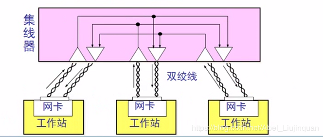
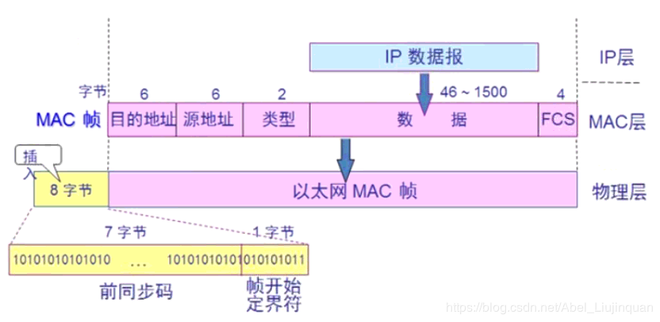

# Ethernet

> 以太网不是网络的统称，是一种是先局域网的方式。
## 1 计算机网络

### 网络结点分布

* 局域网（Local Area Network，LAN）是一种在小范围内实现的计算机网络，一般在一个建筑物内，或一个工厂、一个事业单位内部，为单位独有。局域网距离可在十几公里以内，信道传输速率可达1~20Mbps，结构简单，布线容易。

* 广域网（Wide Area Network，WAN）范围很广，可以分布在一个省内、一个国家或几个国家。广域网信道传输速率较低，一般小于0.1Mbps，结构比较复杂。

* 城域网（Metropolitan Area Network，MAN）是在一个城市内部组建的计算机信息网络，提供全市的信息服务。
目前，我国许多城市正在建设城域网。

### 交换方式

* 线路交换（Circurt Switching）最早出现在电话系统中，早期的计算机网络就是采用此方式来传输数据的，数字信号经过变换成为模拟信号后才能在线路上传输。

* 报文交换（Message Switching）是一种数字化网络。当通信开始时，源机发出的一个报文被存储在交换器里，交换器根据报文的目的地址选择合适的路径发送报文，这种方式称做存储-转发方式。

* 分组交换（Packet Switching）也采用报文传输，但它不是以不定长的报文做传输的基本单位，而是将一个长的报文划分为许多定长的报文分组，以分组作为传输的基本单位。这不仅大大简化了对计算机存储器的管理，而且也加速了信息在网络中的传播速度。由于分组交换优于线路交换和报文交换，具有许多优点，因此它已成为计算机网络的主流。

### 网络拓扑结构

* 星型网络
* 树型网络
* 总线型网络
* 环型网络
* 网状网络

## 2 概念区分

### 以太网Ethernet

以太网不是一种具体的网络，是一种**技术规范**。以太网（Ethernet），是当今现有局域网采用的最通用的通信协议标准。以太网络使用CSMA/CD（载波监听多路访问及冲突检测）技术，并以10M/S的速率（仅指标准以太网的速率而已）运行在多种类型的电缆上。以太网与IEEE802.3系列标准相类似。以太网可以说是局域网的一种。局域网之间的通信协议必须是相同的，即局域网内计算机（或计算机网络）只允许使用同一种通信规则进行通信。而

### 局域网

现阶段成熟的**局域网技术**有三种：以太网（Ethernet）、令牌环（Token Ring）和光纤分布式数据接口（FDDI），其中以太网技术逐步成为局域网技术的主流。

### Internet（因特网）

> 是一个具体的网络。就跟说你家的网络、他家的网络一样。不是一种技术（以太网技术），也不是一种网络（局域网等，包括很多个网络）。

是广域网的一个。是指一个具体的计算机网络。Internet 是一个专有名词，它是指当前全球最大的、开放的、有众多网络互相连接而成的特定的计算机网络，它采用 TCP/IP 协议族作为通信的规则，其前身是美国的ARPNET。

一般说互联网也指因特网。

## 3 Ethernet的拓扑结构

以太网拓扑常常是星型拓扑，星型拓扑中心常常是一种可靠性很高的设备，叫做集线器。使用集线器的以太网在逻辑上仍是一个总线网，各工作站使用 CSMA/CD协议，并共享逻辑上的总线。集线器像一个多接口的转发器，工作在物理层。

## 4 Ethernet的帧格式
数据链路层的MAC帧分为五部分：
* 目的MAC地址
* 原MAC地址
* 类型（网络层使用的协议）
* 数据（网络层的IP数据报）
* FCS（帧检验序列）

## 5 Ethernet扩展

通过光纤连接集线器，可以使以太网在距离上扩展；通过集线器级联，使网络中的计算机增加，但是组建了一个大的冲突域，通信效率降低了。为了优化扩展后的以太网性能，可以使用网桥和交换机设备。

### 网桥

在交换机还没有出现以前，可以使用网桥来连接两个集线器进行通信。最大的作用是防止了集线器之间的数据传输冲突，将冲突控制在单个集线器范围内，隔离大的冲突域，减少冲突的几率。
网桥工作在数据链路层，它根据MAC帧的目的地址对收到的帧进行转发。
网桥具有过滤帧的功能。当网桥收到一个帧时，并不是向所有的接口转发此帧，而是先检查此帧的目的MAC地址，然后再确定将该帧转发到哪一个接口。

### 交换机

随着连接的集线器越来越多，网桥慢慢发展演变成交换机。
交换机是现在主流的局域网的交换设备，它有许多接口，直接和计算机相连接。
交换机通过学习构建MAC地址表，并根据MAC地址定向地存储转发数据，避免了广播式的数据发送，具有更高的安全性。

## 6 MAC地址表

## 7 链路聚合-端口聚合

### 端口聚合的需求和应用

交换机与路由器之间的连接：交换机和路由器采用端口聚合可以解决广域网和局域网连接的瓶颈。

### 端口聚合的实现原理

