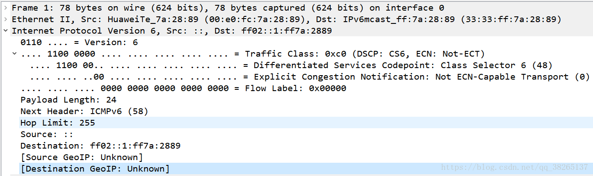

 
# ICMPv6

## 1 ICMPv6基本概念
ICMPv6（Internet Control Message Protocol for the IPv6）是IPv6的基础协议之一。

在IPv4中，Internet控制报文协议ICMP（Internet Control Message Protocol）向源节点报告关于向目的地传输IP数据包过程中的错误和信息。它为诊断、信息和管理目的定义了一些消息，如：目的不可达、数据包超长、超时、回应请求和回应应答等。在IPv6中，ICMPv6除了提供ICMPv4常用的功能之外，还是其它一些功能的基础，如邻接点发现、无状态地址配置（包括重复地址检测）、PMTU发现等。

### 分类
* 差错报文：报告转发ICMPv6数据报过程中出现差的差错，包括目的不可达、数据报超长、超时、参数问题等。
* 信息报文：提供诊断功能和附加功能。诊断报文主要包括回送请求报文和回送应答报文。附加功能包括多播侦听发现MLD和邻居发现ND中的使用。
## 2 ICMPv6报文格式

ICMPv6的协议类型号（即IPv6报文中的Next Header字段的值）为58。ICMPv6的报文格式下图所示：

|字段|字段说明|
|-|-|
|Type|表明消息的类型，0至127表示差错报文类型，128至255表示消息报文类型。|
|Code|表示此消息类型细分的类型。|
|Checksum|表示ICMPv6报文的校验和。|

## 3 ICMPv6报文示例

## 4 ICMPv6错误报文

ICMPv6错误报文用于报告在转发IPv6数据包过程中出现的错误。ICMPv6错误报文可以分为以下4种：

* 目的不可达错误报文

在IPv6节点转发IPv6报文过程中，当设备发现目的地址不可达时，就会向发送报文的源节点发送ICMPv6目的不可达错误报文，同时报文中会携带引起该错误报文的具体原因。

目的不可达错误报文的Type字段值为1。根据错误具体原因又可以细分为：

    * Code=0：没有到达目标设备的路由。
    * Code=1：与目标设备的通信被管理策略禁止。
    * Code=2：未指定。
    * Code=3：目的IP地址不可达。
    * Code=4：目的端口不可达。

* 数据包过大错误报文

在IPv6节点转发IPv6报文过程中，发现报文超过出接口的链路MTU时，则向发送报文的源节点发送ICMPv6数据包过大错误报文，其中携带出接口的链路MTU值。数据包过大错误报文是Path MTU发现机制的基础。

数据包过大错误报文的Type字段值为2，Code字段值为0。

* 时间超时错误报文

在IPv6报文收发过程中，当设备收到Hop Limit字段值等于0的数据包，或者当设备将Hop Limit字段值减为0时，会向发送报文的源节点发送ICMPv6超时错误报文。对于分段重组报文的操作，如果超过定时时间，也会产生一个ICMPv6超时报文。

时间超时错误报文的Type字段值为3，根据错误具体原因又可以细分为：

    * Code=0：在传输中超越了跳数限制。
    * Code=1：分片重组超时。

* 参数错误报文

当目的节点收到一个IPv6报文时，会对报文进行有效性检查，如果发现问题会向报文的源节点回应一个ICMPv6参数错误差错报文。

参数错误报文的Type字段值为4，根据错误具体原因又可以细分为：

    * Code=0：IPv6基本头或扩展头的某个字段有错误。
    * Code=1：IPv6基本头或扩展头的NextHeader值不可识别。
    * Code=2：扩展头中出现未知的选项。

## 5 ICMPv6信息报文

* 回送请求报文：回送请求报文用于发送到目标节点，以使目标节点立即发回一个回送应答报文。回送请求报文的Type字段值为128，Code字段的值为0。
* 回送应答报文：当收到一个回送请求报文时，ICMPv6会用回送应答报文响应。回送应答报文的Type字段的值为129，Code字段的值为0。

* 邻居发现ND：

    * Type=133 路由器请求 RS（Router Solicitation）
    * Type=134 路由器公告 RA（Router Advertisement）
    * Type=135 邻居请求 NS（Neighbor Solicitation）
    * Type=136 邻居通告 NA（Neighbor Advertisement）
    * Type=137 重定向（Redirect）

* 多播侦听发现协议MLD：

    * Type=130 多播听众查询
    * Type-131 多播听众报告
    * Type=132 多播听众退出

## 6 邻居发现ND中的ICMPv6报文

### 路由器请求报文RS
路由器不愿意等待下一次周期性的路由器宣告，立即向周围发送路由器请求报文，可以马上得到链路上路由器的配置参数。

类型133，Code=0，原地址是发送主机的地址或者未指定地址，目的地址是所有路由器的多播地址FF02::2。字段包括Type、Code、Checksum、Reserved、Options。

### 路由器公告报文RA

路由器周期性地通告它的存在以及配置的链路和网络参数，或者对路由器请求消息做出响应的报文。，包含连接确定、地址配置的前缀、跳数限制等内容。

类型134，Code=0，源地址是路由器本地链路地址，目的地址是发送路由器请求节点的地址，或者链路范围内的所有节点多薄地址。

* Cur Hop Limit：主机发送普通报文时，使用的默认跳数限制。接受节点只认为跳数限制为255的路由器通告为有效通告。
* Router LifeTime：发送RA报文的路由器作为默认路由器的生命周期，默认30分钟。
* Reacheble Time：路由器在接口上通过发送RA报文，让同一链路上的所有节点使用相同的可达保持状态。
* Retrans Timer：重传NS报文的时间间隔，用于邻居不可达检测和地址解析。
* Options：含有链路层地址选项、MTU、前缀信息选项、通告间隔选项。8

### 邻居请求报文NS

节点发送邻居请求报文，请求邻居的链路层地址，验证起先前所获得的并保存在缓存中的邻居链路层地址的可达性。或者验证其地址在本地上是否唯一。

类型135，Code=0，源地址上发送请求的节点的单播地址，目的地址是被请求节点的多播地址，或者是被确认可达性的节点的单薄地址。

### 邻居通告报文NA

邻居请求报文的响应。可以主动发出，指示链路层地址的变化。

类型136，Code=0，源地址是发送接口的单播地址，目的地址是请求报文的源地址或者所有节点的组播地址FF02::1。

* FLAG:R 路由器标记，表示发送者的角色。值为1。
* FLAG:S 值为1表示对NS的响应
* FLAG:O 值为1表示对邻居的链路层地址进行覆盖。

### 重定向报文
路由器通过重定向消息，通知主机。对于特定的目的地址，如果不是最佳路由，则通知主机到达目的地址的最佳下一跳。