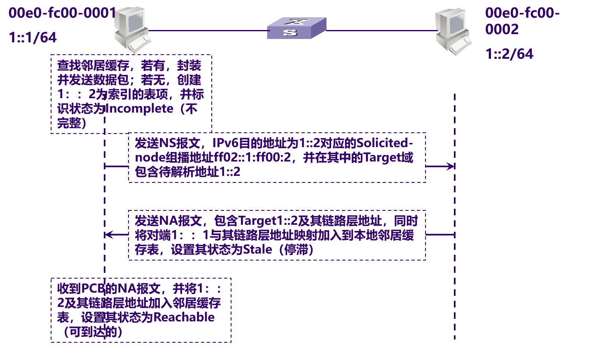
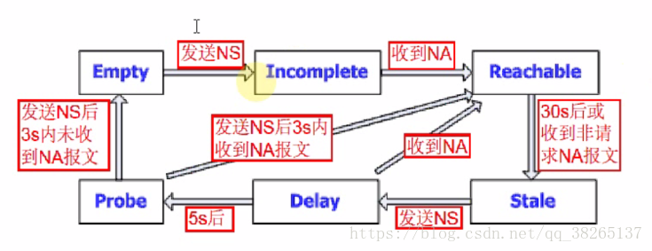

# 邻居发现协议NDP

> 参考文献
> * [邻居发现协议](https://blog.csdn.net/qq_38265137/article/details/80466128)

## 0 NDP简介
邻居发现协议NDP（Neighbor Discovery Protocol）是IPv6协议体系中一个重要的基础协议。邻居发现协议替代了IPv4的ARP（Address Resolution Protocol）和ICMP路由器发现（Router Discovery），它定义了使用ICMPv6报文实现。
1. 地址自动配置
1. 路由器和路由前缀发现
2. 地址解析
3. 跟踪邻居状态（邻居不可达检测）
1. 重复地址检测
2. 重定向

## 1 地址自动配置
IPv4使用DHCP实现自动配置，包括IP地址，缺省网关等信息，简化了网络管理。IPv6地址增长为128位，且终端节点多，对于自动配置的要求更为迫切，除保留了DHCP作为有状态自动配置外，还增加了无状态自动配置。无状态自动配置即自动生成链路本地地址，主机根据RA报文的前缀信息，自动配置全球单播地址等，并获得其他相关信息。

IPv6主机无状态自动配置过程：

1. 根据接口标识产生链路本地地址。
2. 发出邻居请求，进行重复地址检测。
3. 如地址冲突，则停止自动配置，需要手工配置。
4. 如不冲突，链路本地地址生效，节点具备本地链路通信能力。
5. 主机会发送RS报文（或接收到设备定期发送的RA报文）。
6. 根据RA报文中的前缀信息和接口标识得到IPv6地址。

## 2 路由器发现和前缀发现
路由器发现功能用来发现与本地链路相连的设备，并获取与地址自动配置相关的前缀和其他配置参数。

在IPv6中，IPv6地址可以支持无状态的自动配置，即主机通过某种机制获取网络前缀信息，然后主机自己生成地址的接口标识部分。路由器发现功能是IPv6地址自动配置功能的基础，主要通过以下两种报文实现：

* 路由器通告RA（Router Advertisement）报文：每台设备为了让二层网络上的主机和设备知道自己的存在，定时都会组播发送RA报文，RA报文中会带有网络前缀信息，及其他一些标志位信息。RA报文的Type字段值为134。

* 路由器请求RS（Router Solicitation）报文：很多情况下主机接入网络后希望尽快获取网络前缀进行通信，此时主机可以立刻发送RS报文，网络上的设备将回应RA报文。RS报文的Tpye字段值为133。

### RA报文字段说明

* Cur Hop Limit：默认值应当放置在发出IP分组的IP首部的Hop Count字段中。 取0值意味着未(由该路由器)规定。
* M：M位为0表示无状态自动配置生成IPv6地址，如果M=1表示需要通过有状态（DHCPv6）方式获取ipv6地址。
* O：O位为0表示除了IPv6地址以外的其他参数需要通过无状态自动配置获取，如果O=1表示除了IPv6地址以外的其它需要通过有状态（DHCPv6）方式进行获取。
* Router Lifetime：与默认路由器关联的生存期，以秒为单位。最大值18.2小时。取0值的Lifetime指出路由器不是默认路由器并且不应当出现在默认路由器列表中。Router Lifetime仅适用于作为默认路由器的路由器应用；对包括在其他消息字段或选项中的信息不适用。需要对它们的信息规定时间限制的选项有它们自己的生存期字段。
* Reachable time：此时间以毫秒计，在收到可达性确认后节点假定该邻居是可到达的。它由Neighbor Unreachability Detection算法使用。此值为0意味着没有(由此路由器)作出规定。
* Retrans Timer：重发的Neighbor Solicitation消息间隔时间，以毫秒计。由地址解析和Neighbor Unreachability Detection算法使用。此值为0意味着没有(由此路由器)作出规定。
* ICMP Prefix Option中的flag字段：
    * aoto-config:如果该位为1表示该前缀可以用于无状态自动配置，如果为0不能用于无状态自动配置。
    * on-link：指定0-flag标识位。若配置该参数，则只会本地链路内的主机RA报文中的前缀不是分配给本地链路的。主机若想该前缀指定的地址发送报文时，需要经过默认路由器转发。

### 路由器发现功能

RA在华为中的通告时间有两种：

* min-interval=200s。
* max-interval=600s。

### 默认路由器优先级和路由信息发现

当主机所在的链路中存在多个设备时，主机需要根据报文的目的地址选择转发设备。在这种情况下，设备通过发布默认路由优先级和特定路由信息给主机，提高主机根据不同的目的地选择合适的转发设备的能力。

在RA报文中，定义了默认路由优先级和路由信息两个字段，帮助主机在发送报文时选择合适的转发设备。

主机收到包含路由信息的RA报文后，会更新自己的路由表。当主机向其他设备发送报文时，通过查询该列表的路由信息，选择合适的路由发送报文。

主机收到包含默认设备优先级信息的RA报文后，会更新自己的默认路由列表。当主机向其他设备发送报文时，如果没有路由可选，则首先查询该列表，然后选择本链路内优先级最高的设备发送报文；如果该设备故障，主机根据优先级从高到低的顺序，依次选择其他设备。

## 3 地址解析
在IPv4中，当主机需要和目标主机通信时，必须先通过ARP协议获得目的主机的链路层地址。在IPv6中，同样需要从IP地址解析到链路层地址的功能。邻居发现协议实现了这个功能。

ARP报文是直接封装在以太网报文中，以太网协议类型为0x0806，普遍观点认为ARP定位为第2.5层的协议。ND本身基于ICMPv6实现，以太网协议类型为0x86DD，即IPv6报文，IPv6下一个报头字段值为58，表示ICMPv6报文，由于ND协议使用的所有报文均封装在ICMPv6报文中，一般来说，ND被看作第3层的协议。在三层完成地址解析，主要带来以下几个好处：

* 地址解析在三层完成，不同的二层介质可以采用相同的地址解析协议。
* 可以使用三层的安全机制避免地址解析攻击。
* 使用组播方式发送请求报文，减少了二层网络的性能压力。

地址解析过程中使用了两种ICMPv6报文：邻居请求报文NS（Neighbor Solicitation）和邻居通告报文NA（Neighbor
Advertisement）。

* NS报文：Type字段值为135，Code字段值为0，在地址解析中的作用类似于IPv4中的ARP请求报文。
* NA报文：Type字段值为136，Code字段值为0，在地址解析中的作用类似于IPv4中的ARP应答报文。

### IPv6地址解析过程

1. Host A在向Host B发送报文之前它必须要解析出Host B的链路层地址，所以首先Host A会发送一个NS报文，其中源地址为Host A的IPv6地址，目的地址为Host B的被请求节点组播地址，需要解析的目标IP为Host B的IPv6地址，这就表示Host A想要知道Host B的链路层地址。同时需要指出的是，在NS报文的Options字段中还携带了Host A的链路层地址。
2. 当Host B接收到了NS报文之后，就会回应NA报文，其中源地址为Host B的IPv6地址，目的地址为Host A的IPv6地址（使用NS报文中的Host A的链路层地址进行单播），Host B的链路层地址被放在Options字段中。这样就完成了一个地址解析的过程。

### 邻居通告报文中Flags字段解释：

* R：路由器标记。当置1时，R位指出发送者是路由器。R位由Neighbor Unreachability Detection使用，用于检测改变为主机的路由器。
* S：请求标记。当置1时，S位指出通告被发送以响应来自目的地地址的Neighbor Solicitation。S位用作Neighbor Unreachability Detection的可达性确认。在多播通告和非请求单播通告中置0。
* O：替代标记。替代标志，1表示通告中的信息替代缓存，如更新链路层地址时，对于任播的回应则不应置位。在针对任播地址的请求通告中，以及在请求的前缀通告中它不能被置1。在其他请求通告中和在非请求通告中它应当被置1。
* Target Address：对于请求的通告，是在Neighbor Solicitation消息(该消息催促这个通告)中的Target Address字段。对于非请求通告，是其链路层地址已经改变的地址。Target Address必须不是多播地址。

## 4 跟踪邻居状态
通过邻居或到达邻居的通信，会因各种原因而中断，包括硬件故障、接口卡的热插入等。如果目的地失效，则恢复是不可能的，通信失败；如果路径失效，则恢复是可能的。因此节点需要维护一张邻居表，每个邻居都有相应的状态，状态之间可以迁移。

RFC2461中定义了5种邻居状态，分别是：

1. 未完成（Incomplete）
2. 可达（Reachable）
3. 陈旧（Stale）
4. 延迟（Delay）
5. 探查（Probe）

邻居状态的具体迁移过程如下图所示：

下面以A、B两个邻居节点之间相互通信过程中A节点的邻居状态变化为例（假设A、B之前从未通信），说明邻居状态迁移的过程。

1. A先发送NS报文，并生成缓存条目，此时，邻居状态为Incomplete。
2. 若B回复NA报文，则邻居状态由Incomplete变为Reachable，否则固定时间后邻居状态由Incomplete变为Empty，即删除表项。
3. 经过邻居可达时间，邻居状态由Reachable（默认30s）变为Stale，即未知是否可达。
4. 如果在Reachable状态，A收到B的非请求NA报文（MAC地址修改），且报文中携带的B的链路层地址和表项中不同，则邻居状态马上变为Stale。
5. 在Stale状态若A要向B发送数据，则邻居状态由Stale变为Delay，并发送NS请求。
6. 在经过一段固定时间后，邻居状态由Delay（默认5s）变为Probe（每隔1s发送一次NS报文，连续发送3次），其间若有NA应答，则邻居状态由Delay变为Reachable。
7. 在Probe状态，A每隔一定时间间隔z(1s)发送单播NS，发送固定次数(3)后，有应答则邻居状态变为Reachable，否则邻居状态变为Empty，即删除表项。

## 5 重复地址检测
### 重复地址检测说明

重复地址检测DAD（Duplicate Address Detect）是在接口使用某个IPv6单播地址之前进行的，主要是为了探测是否有其它的节点使用了该地址。尤其是在地址自动配置的时候，进行DAD检测是很必要的。一个IPv6单播地址在分配给一个接口之后且通过重复地址检测之前称为试验地址（Tentative Address）。此时该接口不能使用这个试验地址进行单播通信，但是仍然会加入两个组播组：ALL-NODES组播组和试验地址所对应的Solicited-Node组播组。

IPv6重复地址检测技术和IPv4中的免费ARP类似：节点向试验地址所对应的Solicited-Node组播组发送NS报文。NS报文中目标地址即为该试验地址。如果收到某个其他站点回应的NA报文，就证明该地址已被网络上使用，节点将不能使用该试验地址通讯。

### 重复地址检测原理

Host A的IPv6地址FC00::1为新配置地址，即FC00::1为Host A的试验地址。Host A向FC00::1的Solicited-Node组播组发送一个以FC00::1为请求的目标地址的NS报文进行重复地址检测，由于FC00::1并未正式指定，所以NS报文的源地址为未指定地址。当Host B收到该NS报文后，有两种处理方法：

1. 如果Host B发现FC00::1是自身的一个试验地址，则Host B放弃使用这个地址作为接口地址，并且不会发送NA报文。
2. 如果Host B发现FC00::1是一个已经正常使用的地址，Host B会向FF02::1发送一个NA报文，该消息中会包含FC00::1。这样，Host A收到这个消息后就会发现自身的试验地址是重复的。Host A上该试验地址不生效，被标识为duplicated状态。

当两端同时检测时情况如下：

* 若2个节点配置相同地址，同时作重复地址检测时，该地址处于Tentative状态，当一方收到对方发出的DAD NS，则接收方将不启用该地址
* 一种极端的情况，如果同时收到NS报文，则两端都放弃改地址

### IPv6地址生命周期

在preferred time和valid lifetime之间叫做deprecated（弃用）状态，当地址达到这个时间段的时候，地址不能主动的发起连接只能是被动的接受连接，过了valid lifetime时间，地址就变为invalid，这时任何连接就会down掉。

## 6 重定向
当网关设备发现报文从其它网关设备转发更好，它就会发送重定向报文告知报文的发送者，让报文发送者选择另一个网关设备。重定向报文也承载在ICMPv6报文中，其Type字段值为137，报文中会携带更好的路径下一跳地址和需要重定向转发的报文的目的地址等信息。

Host A需要和Host B通信，Host A的默认网关设备是Router A，当Host A发送报文给Host B时报文会被送到Router A。Router A接收到Host A发送的报文以后会发现实际上Host A直接发送给Router B更好，它将发送一个重定向报文给主机A，其中报文中更好的路径下一跳地址为Router B，Destination Address为Host B。Host A接收到了重定向报文之后，会在默认路由表中添加一个主机路由，以后发往Host B的报文就直接发送给Router B。

当设备收到一个报文后，只有在如下情况下，设备会向报文发送者发送重定向报文：

* 报文的目的地址不是一个组播地址。
* 报文并非通过路由转发给设备。
* 经过路由计算后，路由的下一跳出接口是接收报文的接口。
* 设备发现报文的最佳下一跳IP地址和报文的源IP地址处于同一网段。
* 设备检查报文的源地址，发现自身的邻居表项中有用该地址作为全球单播地址或链路本地地址的邻居存在。