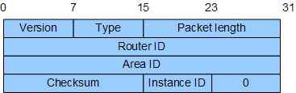
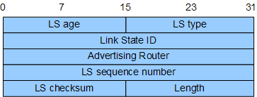

 # IPv6-OSPFv3

> 参考文献
> * [IPV6 OSPFv3](https://blog.csdn.net/weixin_33819479/article/details/85179864)
> * [华为技术文档](https://support.huawei.com/enterprise/zh/doc/EDOC1100055548/4c1815c9)
> * [H3C技术文档](http://www.h3c.com/CN/D_200911/922190_30005_0.htm)

## 1 概述

OSPFv3主要用于在IPv6网络中提供路由功能，OSPFv3是基于OSPFv2上开发用于IPv6网络的路由协议。而无论是OSPFv2还是OSPFv3在工作机制上基本相同；但为了支持IPv6地址格式，OSPFv3对OSPFv2做了一些改动，下面将介绍OSPFv3与OSPFv2的异同点。

OSPFv3与OSPFv2类似也使用组播进行工作，OSPFv3的DR路由器使用众所周知的IPv6组播地址FF02::6这个地址,它类似于IPv4环境中的224.0.0.6；其他的OSPFv3的路由器使用FF02::5这个组播地址，它类似于IPv4环境中的224.0.0.5

### OSPFv3与OSPFv2相同点：

OSPFv3协议设计思路和工作机制与OSPFv2基本一致，相同点如下所示:

* 数据包类型相同：其中包括Hello、DBD(数据库描述)、LSR（链路状态请求）、LSU（链路状态更新）和LSAck（链路状态确定包）。

* 区域划分相同：包括骨干区域、一般区域、末节区域、NSSA（次末节区域）和完全末节区域。

* 路由器类型相同：包括内部路由器（internalrouter）、骨干路由器（backbone router）、区域边界路由器（area border router）和自治系统边界路由器（autonomoussystem boundary router）。

* 使用网络类型相同：包括点到点络网、点到多点网络、多路访问网络、NBMA网络。

* 邻居发现和邻接关系形成机制相同：OSPF 路由器启动后，便会通过 OSPF接口向外发送 Hello报文，收到 Hello报文的 OSPF路由器会检查报文中所定义的参数，如果双方一致就会形成邻居关系。

* LSA泛洪和同步机制相同：为了保证 LSDB内容的正确性，需要保证 LSA的可靠泛洪和同步。

* DR选举机制相同：在 NBMA网络和广播网络中DR和BDR的选举过程相同。

* 路由计算方法相同：采用最短路径优先算法（SPF）计算路由。

### OSPFv3与OSPFv2不同点

为适应IPv6运行环境，支持IPv6报文的转发，OSPFv3相对OSPFv2做出相关的改进，使得OSPFv3可以独立于网络层协议，并且其扩展性加强，可以满足未来的需求。其与OSPFv2不同点如下所示：

* 基于链路的运行

* 使用IPv6链路本地地址

* 链路支持多实例复用

* 通过RouterID唯一标识邻居

* 认证的变化

* OPSFv3更灵活的处理未知LSA类型

* OSPFv3增加了本地链路洪泛扩散的范围

* OSPFv3取消了寻址的概念

### 理解基于链路的运行：

OSPFv2是基于网络运行的，也就是说两台路由器要形成邻居关系，它们必须在同一个子网。OSPFv3是基于链路运行的，一个链路可以划分为多个IPv6前缀（类似于子网的概念），节点即使不在同一个前缀范围，只要在同一链路上也可以形成邻居关系，这与OSPFv2完全不同，因为在IPv6中一条链路可以属于多个子网。

### 理解使用IPv6链路本地地址：

OSPFv3将使用本地链路地址作为报文发送的源地址。一台路由器可以学习到同一链路上相连的所有路由器的本地链路地址，并使用这些本地链路地址作为下一跳来转发报文。但是在虚拟链路连接上，必须使用全球范围地址或者本地站点地址作为OSPFv3协议报文发送的源地址。本地链路地址只在本地链路上有意义且只能在本地链路上泛洪。

### 理解链路支持多实例复用：

在OSPFv3中支持链路多实例复用，所谓链路多实例复用是指：在一条共享型广播链路上可以运行多个OSPF实例（Instance）。比如：如图12.121所示，路由器R1与R2属于同一个OSPF路由域；路由器R3和R4属于另一个OSPF路由域，但是它们连接到同一个广播网络中，共享同一条链路且都能相互建立邻居关系，正常的行为应该让路由器R1与R2建立邻居关系；路由器R3与R4建立邻居关系，因为您总不能让路由器R1和R3或者路由器R2和R4建立邻居吧？因为它们不处于同一个OSPF路由域。当然，在OSPFv2中可以使用OSPF的认证功能来隔离这两个OSPF的路由域，但这并不是一种完美的解决方案，因为OPSF路由器将不断的记录被其他邻居拒绝的OSPF认证失败的数据包。而在OSPFv3链路支持多实例复用是因为在OSPFv3报文头中添加Instance ID字段。如果接口配置的Instance ID与接收的OSPFv3报文的Instance ID不匹配，则丢弃该报文，从而无法建立起邻居关系。

### 理解通过Router ID唯一标识邻居：

   在OPSFv2中，当OSPF运行在广播网络或者NBMA网络上时，OSPFv2的邻居是通过路由器的接口地址进行标识，而其他链路的 OSPFv2的邻居则是通过路由器ID（RID）来表示。在OSPFv3中取消了这种不一致性，所有类型的链路全部通过RID来标识邻居，而且OPSFv3的RID将会作为配置的必须项，在OPSFv2中RID的配置是可选项，在OSPFv3中如果不为路由器配置RID那么OSPFv3将无法启动，会出现如图12.122所示的提示：

### 理解认证的变化：

在OSPFv2中OSPF拥有自己特有的认证方式，这些认证消息被包含在OSPFv2的数据包中。OSPFv3自身不再提供认证功能，而是通过使用IPv6提供的安全机制来保证自身报文的合法性。所以，OSPFv2报文中的认证字段，在OSPFv3报文头中被取消。

### 理解OPSFv3更灵活的处理未知LSA类型：

在OSPFv2上会对未知的LSA作丢弃，在OSPFv3中可以把这些未知的LSA当作本地链路洪泛扩散范围，这类似于这些未知的LSA被识别一样，但是在它们自己的SPF算法中将被忽略，这样做的结果是OSPFv3处理网络的变化比v2更容易。

### 理解OSPFv3增加了本地链路洪泛扩散的范围：

　　因为IPv6的本地链路地址有广泛的用途，所以OSPFv3增加了一个本地链路洪泛扩散的范围，新增加的LSA叫做链路LSA，它用来携带单个链路上邻居相关联的信息，这种类型的LSA只在本地链路范围内洪泛，所以它不能超出路由器以外进行扩散。

### 理解OSPFv3取消了寻址的概念：

OSPFv3的路由器LSA和网络LSA不再携带IP地址，这加强了OSPF的扩展性。

## 2 OSPFv3报文
OSPFv3用IPv6报文直接封装协议报文，协议号为89。OSPFv3分为5种报文：Hello报文、DD报文、LSR报文、LSU报文和LSAck报文。

 | 字段名 | 长度 | 含义 |
 |-|-|-|-|
|Version| 8比特 | OSPF的版本号。对于OSPFv3，其值为3。
 |  Type | 8比特 | OSPFv3报文的类型：1：Hello报文。2：DD报文。3：LSR报文。4：LSU报文。5：LSAck报文。
 | Packet length | 16比特 | OSPFv3报文的总长度，包括报文头在内，单位为字节。
 | Router ID | 32比特 | 发送该报文的路由器标识。
 | Area ID | 32比特 | 发送该报文的路由器的所属区域。
 | Checksum | 16比特 | 包含除了认证字段的整个报文的校验和。
 | Instance ID | 8比特 | OSPFv3多实例ID。
 | 0 | 8比特 | 预留值。

## 3 LSA格式

### LSA 分类
在AS内的每台路由器，根据路由器的分类产生一种或多种LSA。LSA的集合形成了LSDB（Link-state Database）。OSPFv3中对路由信息的描述都是封装在LSA中发布出去的。常用的LSA包括：

* Router-LSA（Type1）每个路由器都会产生，描述了路由器的链路状态和花费，在所属的区域内传播。
* Network-LSA（Type2）由广播网或NBMA网络中的DR产生，Network-LSA中记录了这一网络上所有路由器的Router ID，描述本网段的链路状态，在所属的区域内传播。
* Inter-Area-Prefix-LSA（Type3）描述区域内某个网段的路由，由ABR产生，并通告给其他相关区域。
* Inter-Area-Router-LSA（Type4）由ABR产生，描述到ASBR的路由，通告给除ASBR所在区域的其他相关区域。
* AS-external-LSA（Type5）AS-External-LSA描述到AS外部的路由，由ASBR产生。
* NSSA LSA（Type7）NSSA-LSA描述到AS外部的路由，由ASBR产生。
* Link-LSA（Type8）每个路由器都会为每个链路产生一个Link-LSA，描述到此Link上的link-local地址、IPv6前缀地址，并提供将会在Network-LSA中设置的链路选项，它仅在此链路内传播。
* Intra-Area-Prefix-LSA（Type9）每个路由器及DR都会产生一个或多个此类LSA，在所属的区域内传播。路由器产生的此类LSA，描述与Route-LSA相关联的IPv6前缀地址。DR产生的此类LSA，描述与Network-LSA相关联的IPv6前缀地址。

### LSA 格式

|字段名|长度|含义
|-|-|-|
|LS age|16比特|LSA产生后所经过的时间，单位是秒。无论LSA是在链路上传输，还是保存在LSDB中，其值都会在不停的增长。
|LS type|16比特|LSA的类型：Type1：Router-LSA。Type2：Network-LSA。Type3：Inter-Area-Prefix-LSA。Type4：Inter-Area-Router-LSA。Type5：AS-external-LSA。Type7：NSSA-LSA。Type8：Link-LSA。Type9：Intra-Area-Prefix-LSA。
|Link State ID|32比特|与LS Type一起描述路由域中唯一一个LSA。
|Advertising Router|32比特|产生此LSA的路由器的Router ID
|LS sequence number|32比特|LSA的序列号。其他路由器根据这个值可以判断哪个LSA是最新的。
|LS checksum|16比特|除了LS age外其它各域的校验和。
|Length|16比特|LSA的总长度，包括LSA Header，以字节为单位。

### LSA洪泛范围

* 链路本地范围：只在本地链路上洪泛，用于Link LSA
* 区域范围：覆盖OSPFv3区域。Router LSA、Network LSA、Inter Area Prefix LSA、Inter Area Router LSA、Intra Prefix LSA
* 自制系统范围：整个路由域。AS External LSA。