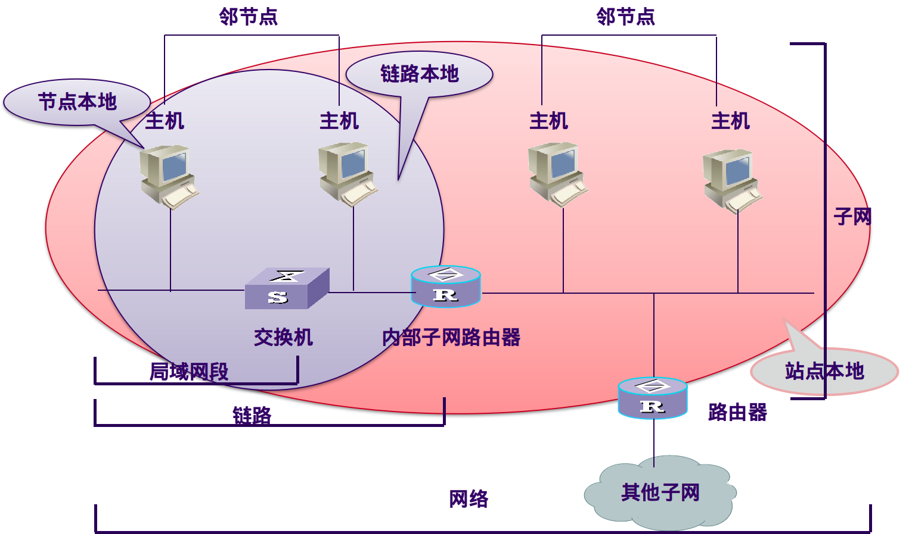
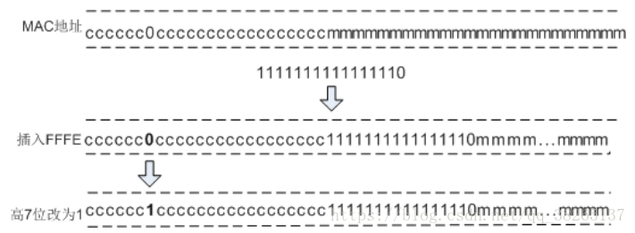
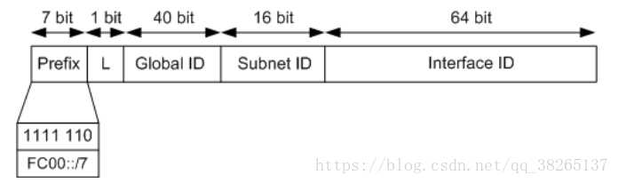
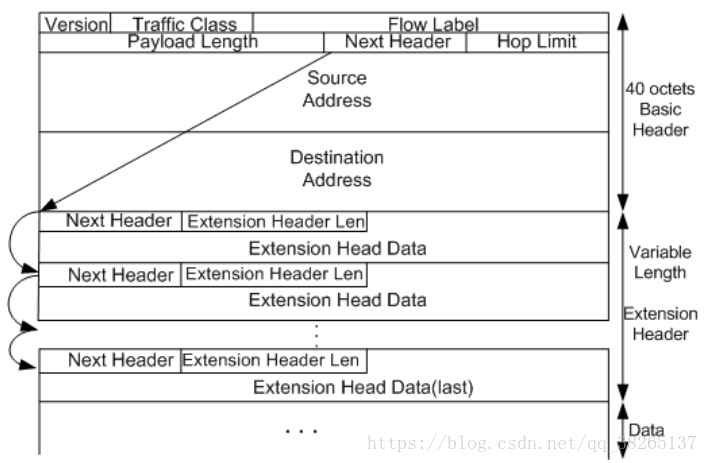

# IPv6

> 参考文献
> * [IPv6基础笔记](https://blog.csdn.net/qq_38265137/article/details/80439611)

## 1 IPv6简介
IPv6（Internet Protocol Version 6）是网络层协议的第二代标准协议，也被称为IPng（IP Next Generation）。它是Internet工程任务组IETF（Internet Engineering Task Force）设计的一套规范，是IPv4（Internet Protocol Version 4）的升级版本。

### 目的

IPv4协议是目前广泛部署的因特网协议。在因特网发展初期，IPv4以其协议简单、易于实现、互操作性好的优势而得到快速发展。但随着因特网的迅猛发展，IPv4设计的不足也日益明显，IPv6的出现，解决了IPv4的一些弊端。相比IPv4，IPv6具有如下优势：

|问题	|IPv4的缺陷|	IPv6的优势|
|-|-|-|
|地址空间	|IPv4地址采用32比特标识，理论上能够提供的地址数量是43亿（由于地址分配的原因，实际可使用的数量不到43亿）。另外，IPv4地址的分配也很不均衡：美国占全球地址空间的一半左右，而欧洲则相对匮乏；亚太地区则更加匮乏。与此同时，移动IP和宽带技术的发展需要更多的IP地址。目前IPv4地址已经消耗殆尽。针对IPv4的地址短缺问题，也曾先后出现过几种解决方案。比较有代表性的是无类别域间路由CIDR（Classless Inter-Domain Routing）和网络地址转换NAT（Network Address Translator）。但是CIDR和NAT都有各自的弊端和不能解决的问题，由此推动了IPv6的发展。	|IPv6地址采用128比特标识。128位的地址结构使IPv6理论上可以拥有（43亿×43亿×43亿×43亿）个地址。近乎无限的地址空间是IPv6的最大优势。|
|报文格式	|IPv4报头包含可选字段Options，内容涉及Security、Timestamp、Record route等，这些Options可以将IPv4报头长度从20字节扩充到60字节。携带这些Options的IPv4报文在转发过程中往往需要中间路由转发设备进行软件处理，对于性能是个很大的消耗，因此实际中也很少使用。	|IPv6和IPv4相比，去除了IHL、Identifier、Flag、Fragment Offset、Header Checksum、 Option、Padding域，只增加了流标签域，因此IPv6报文头的处理较IPv4更为简化，提高了处理效率。另外，IPv6为了更好支持各种选项处理，提出了扩展头的概念，新增选项时不必修改现有结构，理论上可以无限扩展，体现了优异的灵活性。|
|自动配置和重新编址	|由于IPv4地址只有32比特，并且地址分配不均衡，导致在网络扩容或重新部署时，经常需要重新分配IP地址，因此需要能够进行自动配置和重新编址，以减少维护工作量。目前IPv4的自动配置和重新编址机制主要依靠DHCP协议。	|IPv6协议内置支持通过地址自动配置方式使主机自动发现网络并获取IPv6地址，大大提高了内部网络的可管理性。|
|路由聚合	|由于IPv4发展初期的分配规划问题，造成许多IPv4地址分配不连续，不能有效聚合路由。日益庞大的路由表耗用大量内存，对设备成本和转发效率产生影响，这一问题促使设备制造商不断升级其产品，以提高路由寻址和转发性能。	|巨大的地址空间使得IPv6可以方便的进行层次化网络部署。层次化的网络结构可以方便的进行路由聚合，提高了路由转发效率。|
|对端到端的安全的支持	|IPv4协议制定时并没有仔细针对安全性进行设计，因此固有的框架结构并不能支持端到端的安全。	|IPv6中，网络层支持IPSec的认证和加密，支持端到端的安全。|
|对QoS（Quality of Service）的支持	|随着网络会议、网络电话、网络电视迅速普及与使用，客户要求有更好的QoS来保障这些音视频实时转发。IPv4并没有专门的手段对QoS进行支持。	|IPv6新增了流标记域，提供QoS保证。|
|对移动特性的支持	|随着Internet的发展，移动IPv4出现了一些问题，比如：三角路由，源地址过滤等。	|IPv6协议规定必须支持移动特性。和移动IPv4相比，移动IPv6使用邻居发现功能可直接实现外地网络的发现并得到转交地址，而不必使用外地代理。同时，利用路由扩展头和目的地址扩展头移动节点和对等节点之间可以直接通信，解决了移动IPv4的三角路由、源地址过滤问题，移动通信处理效率更高且对应用层透明。|

### 基本术语

1. 节点：运行IPv6的设备，包括路由器和主机。
2. 路由器：一种节点，能够转发数据包。
3. 主机：一种节点，发送或接收数据信息。
4. 上层协议：运行在IPv6上层的其他协议。
5. 局域网段：由单一介质组成，以二层交换机设备为边界。
6. 链路：多个局域网段，以路由器为边界。这里可以简单的理解为ipv4链路层arp能够到达的地方，就属于同一个物理链路。
7. 子网：使用相同ipv6前缀的一个或多个链路。可以被内部子网路由器划分为很多部分。
8. 网络：由路由器连接起来的多个子网。
9. 邻接点：连接到同一个链路上的物理或者逻辑节点。
10. 链路MTU：链路上的最大传输单元
11. Path MTU：路径上的最大传输单元。

## 2 IPv6地址

### IPv6地址的表示方法

**首选格式**  
IPv6地址总长度为128比特，通常分为8组，每组为4个十六进制数的形式，每组十六进制数间用冒号分隔。例如：FC00:0000:130F:0000:0000:09C0:876A:130B，这是IPv6地址的首选格式。

**压缩格式**  
为了书写方便，IPv6还提供了压缩格式，以上述IPv6地址为例，具体压缩规则为：

* 每组中的前导“0”都可以省略，所以上述地址可写为：FC00:0:130F:0:0:9C0:876A:130B。
* 地址中包含的连续两个或多个均为0的组，可以用双冒号“::”来代替，所以上述地址又可以进一步简写为：FC00:0:130F::9C0:876A:130B。
* 需要注意的是，在一个IPv6地址中只能使用一次双冒号“::”，否则当计算机将压缩后的地址恢复成128位时，无法确定每个“::”代表0的个数。

**内嵌格式**  
内嵌IPv4地址的IPv6地址：
0:0:0:0:0:0:192.168.1.2

### IPv6地址的结构:
一个IPv6地址可以分为如下两部分：

* 网络前缀：n比特，相当于IPv4地址中的网络ID
* 接口标识：128-n比特，相当于IPv4地址中的主机ID

对于IPv6单播地址来说，如果地址的前三bit不是000，则接口标识必须为64位；如果地址的前三位是000，则没有此限制。

接口标识可通过三种方法生成：手工配置、系统通过软件自动生成或IEEE EUI-64规范生成。其中，EUI-64规范自动生成最为常用。

IEEE EUI-64规范是将接口的MAC地址转换为IPv6接口标识的过程。如下图所示，MAC地址的前24位（用c表示的部分）为公司标识，后24位（用m表示的部分）为扩展标识符。从高位数，第7位是0表示了MAC地址本地唯一。转换的第一步将FFFE插入MAC地址的公司标识和扩展标识符之间，第二步将从高位数，第7位的0改为1表示此接口标识全球唯一。

例如：MAC地址：000E-0C82-C4D4；转换后020E:0CFF:FE82:C4D4。

这种由MAC地址产生IPv6地址接口标识的方法可以减少配置的工作量，尤其是当采用无状态地址自动配置时，只需要获取一个IPv6前缀就可以与接口标识形成IPv6地址。但是使用这种方式最大的缺点是任何人都可以通过二层MAC地址推算出三层IPv6地址。

### IPv6的地址分类
IPv6地址分为单播地址、任播地址（Anycast Address）、组播地址三种类型。和IPv4相比，取消了广播地址类型，以更丰富的组播地址代替，同时增加了任播地址类型。

### IPv6单播地址
IPv6单播地址标识了一个接口，由于每个接口属于一个节点，因此每个节点的任何接口上的单播地址都可以标识这个节点。发往单播地址的报文，由此地址标识的接口接收。

IPv6定义了多种单播地址，目前常用的单播地址有：未指定地址、环回地址、全球单播地址、链路本地地址、唯一本地地址ULA（Unique Local Address）。

* 未指定地址

IPv6中的未指定地址即 0:0:0:0:0:0:0:0/128 或者::/128。该地址可以表示某个接口或者节点还没有IP地址，可以作为某些报文的源IP地址（例如在NS报文的重复地址检测中会出现）。源IP地址是::的报文不会被路由设备转发。

* 环回地址

IPv6中的环回地址即 0:0:0:0:0:0:0:1/128 或者::1/128。环回与IPv4中的127.0.0.1作用相同，主要用于设备给自己发送报文。该地址通常用来作为一个虚接口的地址（如Loopback接口）。实际发送的数据包中不能使用环回地址作为源IP地址或者目的IP地址。

* 全球单播地址

全球单播地址是带有全球单播前缀的IPv6地址，其作用类似于IPv4中的公网地址。这种类型的地址允许路由前缀的聚合，从而限制了全球路由表项的数量。

全球单播地址由全球路由前缀（Global routing prefix）、子网ID（Subnet ID）和接口标识（Interface ID）组成，其格式如下如所示：

Global routing prefix：全球路由前缀。由提供商（Provider）指定给一个组织机构，通常全球路由前缀至少为48位。目前已经分配的全球路由前缀的前3bit均为001。

Subnet ID：子网ID。组织机构可以用子网ID来构建本地网络（Site）。子网ID通常最多分配到第64位。子网ID和IPv4中的子网号作用相似。

Interface ID：接口标识。用来标识一个设备（Host）。

* 链路本地地址link local address

链路本地地址是IPv6中的应用范围受限制的地址类型，只能在连接到同一本地链路的节点之间使用。它使用了特定的本地链路前缀FE80::/10（最高10位值为1111111010），同时将接口标识添加在后面作为地址的低64比特。无法穿过路由器，在ipv4中arp广播能够到达的范围就属于同同一个链路，即链路层的地址，不需要经过路由器转发，处于同一个广播域。

为何需要link-local?在一个接口可以配置很多IPv6地址，所以学习路由就有可能出现很多下一跳。所以出现Link Local地址唯一标识一个节点。在本地链路看到下一跳都是对端的Link Local地址。在网络重新编址过程中，节点和路由器的Link Local地址不会发生变化，可以很容易地做一个修改，不用担心网络不可达。

当一个节点启动IPv6协议栈时，启动时节点的每个接口会自动配置一个链路本地地址（其固定的前缀+EUI-64规则形成的接口标识）。这种机制使得两个连接到同一链路的IPv6节点不需要做任何配置就可以通信。所以链路本地地址广泛应用于邻居发现，无状态地址配置等应用。

以链路本地地址为源地址或目的地址的IPv6报文不会被路由设备转发到其他链路。链路本地地址的格式如下如所示：

* 唯一本地地址（站点本地地址）site local address

唯一本地地址是另一种应用范围受限的地址，它仅能在一个站点内使用。由于本地站点地址的废除（RFC3879），唯一本地地址被用来代替本地站点地址。可以穿越路由器，进行局域网内的路由。

唯一本地地址的作用类似于IPv4中的私网地址，任何没有申请到提供商分配的全球单播地址的组织机构都可以使用唯一本地地址。唯一本地地址只能在本地网络内部被路由转发而不会在全球网络中被路由转发。唯一本地地址格式如下如所示：

|字段|含义|
|-|-|
|Prefix|前缀；固定为FC00::/7。|
|L|L标志位；值为1代表该地址为在本地网络范围内使用的地址；值为0被保留，用于以后扩展。|
|Global ID|全球唯一前缀；通过伪随机方式产生。|
|Subnet ID|子网ID；划分子网使用。|
|Interface ID|接口标识。|

唯一本地地址具有如下特点：

    * 具有全球唯一的前缀（虽然随机方式产生，但是冲突概率很低）。
    * 可以进行网络之间的私有连接，而不必担心地址冲突等问题。
    * 具有知名前缀（FC00::/7），方便边缘设备进行路由过滤。
    * 如果出现路由泄漏，该地址不会和其他地址冲突，不会造成Internet路由冲突。
    * 应用中，上层应用程序将这些地址看作全球单播地址对待。
    * 独立于互联网服务提供商ISP（Internet Service Provider）。

### IPv6组播地址

IPv6的组播与IPv4相同，用来标识一组接口，一般这些接口属于不同的节点。一个节点可能属于0到多个组播组。发往组播地址的报文被组播地址标识的所有接口接收。例如组播地址FF02::1表示链路本地范围的所有节点，组播地址FF02::2表示链路本地范围的所有路由器。

一个IPv6组播地址由前缀，标志（Flag）字段、范围（Scope）字段以及组播组ID（Global ID）4个部分组成：

* 前缀：IPv6组播地址的前缀是FF00::/8。
* 标志字段（Flag）：长度4bit，目前只使用了最后一个比特（前三位必须置0），当该位值为0时，表示当前的组播地址是由IANA所分配的一个* 永久分配地址；当该值为1时，表示当前的组播地址是一个临时组播地址（非永久分配地址）。
* 范围字段（Scope）：长度4bit，用来限制组播数据流在网络中发送的范围。
* 组播组ID（Group ID）：长度112bit，用以标识组播组。目前，RFC2373并没有将所有的112位都定义成组标识，而是建议仅使用该112位的最低32位作为组播组ID，将剩余的80位都置0。这样每个组播组ID都映射到一个唯一的以太网组播MAC地址（RFC2464）。
* IPv6组播地址格式如下图:

**常见组播地址前缀**

* FF01::1：本地接口范围内所有节点  
* FF01::2：本地借口范围的所有路由器  
* FF02::1：本地链路范围内的所有节点  
* FF02::2：本地链路范围内的所有路由器  

**被请求节点组播地址**:

被请求节点即一个可能会发出组播数据的单播节点。

被请求节点组播地址通过节点的单播或任播地址生成。当一个节点具有了单播或任播地址，就会对应生成一个被请求节点组播地址，并且加入这个组播组。一个单播地址或任播地址对应一个被请求节点组播地址。该地址主要用于邻居发现机制和地址重复检测功能。

IPv6中没有广播地址，也不使用ARP。但是仍然需要从IP地址解析到MAC地址的功能。在IPv6中，这个功能通过邻居请求NS（Neighbor Solicitation）报文完成。当一个节点需要解析某个IPv6地址对应的MAC地址时，会发送NS报文，该报文的目的IP就是需要解析的IPv6地址对应的被请求节点组播地址；只有具有该组播地址的节点会检查处理。

被请求节点组播地址由前缀FF02::1:FF00:0/104和单播地址的最后24位组成。

### IPv6任播地址
任播地址标识一组网络接口（通常属于不同的节点）。目标地址是任播地址的数据包将发送给其中路由意义上最近的一个网络接口。

任播地址设计用来在给多个主机或者节点提供相同服务时提供冗余功能和负载分担功能。目前，任播地址的使用通过共享单播地址方式来完成。将一个单播地址分配给多个节点或者主机，这样在网络中如果存在多条该地址路由，当发送者发送以任播地址为目的IP的数据报文时，发送者无法控制哪台设备能够收到，这取决于整个网络中路由协议计算的结果。这种方式可以适用于一些无状态的应用，例如DNS等。

IPv6中没有为任播规定单独的地址空间，任播地址和单播地址使用相同的地址空间。目前IPv6中任播主要应用于移动IPv6。

注：IPv6任播地址仅可以被分配给路由设备，不能应用于主机。任播地址不能作为IPv6报文的源地址。

* 子网路由器任播地址

子网路由器任播地址是已经定义好的一种任播地址（RFC3513）。发送到子网路由器任播地址的报文会被发送到该地址标识的子网中路由意义上最近的一个设备。所有设备都必须支持子网任播地址。子网路由器任播地址用于节点需要和远端子网上所有设备中的一个（不关心具体是哪一个）通信时使用。例如，一个移动节点需要和它的“家乡”子网上的所有移动代理中的一个进行通信。

子网路由器任播地址由n bit子网前缀标识子网，其余用0填充。格式如下如所示：

### 主机上的IPv6地址
接口上的地址
* 每个接口的线路本地地址
* 每个接口的全球地址
* 回环接口的回环地址::1

接口上监听的地址

* 本地接口范围内所有节点的组播地址FF01::1
* 本地链路范围内所有节点的组播地址FF02::1
* 被请求节点的组播地址
* 组播组地址（如果加入了组播组）

### 路由器上的IPv6地址

接口上的单点地址
* 每个接口上的链路本地地址
* 每个接口上的全球地址
* 子网-路由器任播地址
* 其他任播地址
* 回环接口的回环地址

接口上坚挺的地址

* 本地接口范围内的所有节点组播地址
* 本地接口范围内的所有路由器组播地址
* 本地链路防伪捏的所有节点组播地址
* 本地链路范围内的所有路由器组播地址
* 站点本地范围内所有的路由器组播地址
* 被请求节点的组播地址
* 组播组地址

## 3 IPv6报文格式
IPv6报文由IPv6基本报头、IPv6扩展报头以及上层协议数据单元三部分组成。

上层协议数据单元一般由上层协议报头和它的有效载荷构成，有效载荷可以是一个ICMPv6报文、一个TCP报文或一个UDP报文。

### IPv6基本报头

IPv6报头格式中主要字段解释如下：

|字段|说明|
|-|-|
|Version|版本号，长度为4bit。对于IPv6，该值为6。|
|Traffic Class|流类别，长度为8bit。等同于IPv4中的TOS字段，表示IPv6数据报的类或优先级，主要应用于QoS。|
|Flow Label|流标签，长度为20bit。IPv6中的新增字段，用于区分实时流量，不同的流标签+源地址可以唯一确定一条数据流，中间网络设备可以根据这些信息更加高效率的区分数据流。|
|Payload Length|有效载荷长度，长度为16bit。有效载荷是指紧跟IPv6报头的数据报的其它部分（即扩展报头和上层协议数据单元）。该字段只能表示最大长度为65535字节的有效载荷。如果有效载荷的长度超过这个值，该字段会置0，而有效载荷的长度用逐跳选项扩展报头中的超大有效载荷选项来表示。|
|Next Header|下一个报头，长度为8bit。该字段定义紧跟在IPv6报头后面的第一个扩展报头（如果存在）的类型，或者上层协议数据单元中的协议类型。|
|Hop Limit|跳数限制，长度为8bit。该字段类似于IPv4中的Time to Live字段，它定义了IP数据报所能经过的最大跳数。每经过一个设备，该数值减去1，当该字段的值为0时，数据报将被丢弃。|
|Source Address|源地址，长度为128bit。表示发送方的地址。|
|Destination Address|目的地址，长度为128bit。表示接收方的地址。|

IPv6和IPv4相比，去除了IHL、identifiers、Flags、Fragment Offset、Header Checksum、 Options、Paddiing域，只增了流标签域，因此IPv6报文头的处理较IPv4大大简化，提高了处理效率。另外，IPv6为了更好支持各种选项处理，提出了扩展头的概念，新增选项时不必修改现有结构就能做到，理论上可以无限扩展，体现了优异的灵活性。下面为读者介绍IPv6扩展报头的一些信息。

### IPv6报文示例

### IPv6扩展头部
在IPv4中，IPv4报头包含可选字段Options，内容涉及security、Timestamp、Record route等，这些Options可以将IPv4报头长度从20字节扩充到60字节。在转发过程中，处理携带这些Options的IPv4报文会占用设备很大的资源，因此实际中也很少使用。

IPv6将这些Options从IPv6基本报头中剥离，放到了扩展报头中，扩展报头被置于IPv6报头和上层协议数据单元之间。一个IPv6报文可以包含0个、1个或多个扩展报头，仅当需要设备或目的节点做某些特殊处理时，才由发送方添加一个或多个扩展头。与IPv4不同，IPv6扩展头长度任意，不受40字节限制，这样便于日后扩充新增选项，这一特征加上选项的处理方式使得IPv6选项能得以真正的利用。但是为了提高处理选项头和传输层协议的性能，扩展报头总是8字节长度的整数倍。

当使用多个扩展报头时，前面报头的Next Header字段指明下一个扩展报头的类型，这样就形成了链状的报头列表。如下图所示，IPv6基本报头中的Next Header字段指明了第一个扩展报头的类型，而第一个扩展报头中的Next Header字段指明了下一个扩展报头的类型（如果不存在，则指明上层协议的类型）。

|字段|说明|
|-|-|
|Next Header|下一个报头，长度为8bit。与基本报头的Next Header的作用相同。指明下一个扩展报头（如果存在）或上层协议的类型。|
|Extension Header Len|报头扩展长度，长度为8bit。表示扩展报头的长度（不包含Next Header字段）。|
|Extension Head Data|扩展报头数据，长度可变。扩展报头的内容，为一系列选项字段和填充字段的组合。|

目前，RFC 2460中定义了6个IPv6扩展头：逐跳选项报头、目的选项报头、路由报头、分段报头、认证报头、封装安全净载报头.

* 逐跳选项报头

（代表该报头的Next Header字段值=0）

该选项主要用于为在传送路径上的每跳转发指定发送参数，传送路径上的每台中间节点都要读取并处理该字段。逐跳选项报头目前的主要应用有以下三种：

用于巨型载荷（载荷长度超过65535字节）。
用于设备提示，使设备检查该选项的信息，而不是简单的转发出去。
用于资源预留（RSVP）。
目的选项报头：

（代表该报头的Next Header字段值=60）

目的选项报头携带了一些只有目的节点才会处理的信息。目前，目的选项报文头主要应用于移动IPv6。

* 路由报头：

（代表该报头的Next Header字段值=43）

路由报头和IPv4的Loose Source and Record Route选项类似，该报头能够被IPv6源节点用来强制数据包经过特定的设备。

* 分段报头:

（代表该报头的Next Header字段值=44）

同IPv4一样，IPv6报文发送也受到MTU的限制。当报文长度超过MTU时就需要将报文分段发送，而在IPv6中，分段发送使用的是分段报头。

* 认证报头：

（代表该报头的Next Header字段值=51）

该报头由IPsec使用，提供认证、数据完整性以及重放保护。它还对IPv6基本报头中的一些字段进行保护。

* 封装安全净载报头：

（代表该报头的Next Header字段值=50）

该报头由IPsec使用，提供认证、数据完整性以及重放保护和IPv6数据报的保密，类似于认证报头。

### IPv6扩展报头规约
当超过一种扩展报头被用在同一个分组里时，报头必须按照下列顺序出现：

1. IPv6基本报头
2. 逐跳选项扩展报头
3. 目的选项扩展报头
4. 路由扩展报头
5. 分段扩展报头
6. 认证扩展报头
7. 封装安全有效载荷扩展报头
8. 目的选项扩展报头
9. 上层协议数据报文

路由设备转发时根据基本报头中Next Header值来决定是否要处理扩展头，并不是所有的扩展报头都需要被转发路由设备查看和处理的。

除了目的选项扩展报头可能出现一次或两次（一次在路由扩展报头之前，另一次在上层协议数据报文之前），其余扩展报头只能出现一次。

## 4 Path MTU
在IPv4中，报文如果过大，必须要分片进行发送，所以在每个节点发送报文之前，设备都会根据发送接口的最大传输单元MTU（Maximum Transmission Unit）来对报文进行分片。但是在IPv6中，为了减少中间转发设备的处理压力，中间转发设备不对IPv6报文进行分片，报文的分片将在源节点进行。当中间转发设备的接口收到一个报文后，如果发现报文长度比转发接口的MTU值大，则会将其丢弃；同时将转发接口的MTU值通过ICMPv6报文的“Packet Too Big”消息发给源端主机，源端主机以该值重新发送IPv6报文，这样带来了额外流量开销。PMTU发现协议可以动态发现整条传输路径上各链路的MTU值，减少由于重传带来的额外流量开销。

PMTU协议是通过ICMPv6的Packet Too Big报文来完成的。首先源节点假设PMTU就是其出接口的MTU，发出一个试探性的报文，当转发路径上存在一个小于当前假设的PMTU时，转发设备就会向源节点发送Packet Too Big报文，并且携带自己的MTU值，此后源节点将PMTU的假设值更改为新收到的MTU值继续发送报文。如此反复，直到报文到达目的地之后，源节点就能知道到达目的地的PMTU了。

整条传输路径需要通过4条链路，每条链路的MTU分别是1500、1500、1400、1300，当源节点发送一个分片报文的时候，首先按照PMTU为1500进行分片并发送分片报文，当到达MTU为1400的出接口时，设备返回Packet Too Big错误，同时携带MTU值为1400的信息。源节点接收到之后会将报文重新按照PMTU为1400进行分片并再次发送一个分片报文，当分片报文到达MTU值为1300的出接口时，同样返回Packet Too Big错误，携带MTU值为1300的信息。之后源节点重新按照PMTU为1300进行分片并发送分片报文，最终到达目的地，这样就找到了该路径的PMTU。

由于IPv6要求链路层所支持的最小MTU为1280，所以PMTU的值必须大于1280。建议您用1500作为链路的PMTU值。
