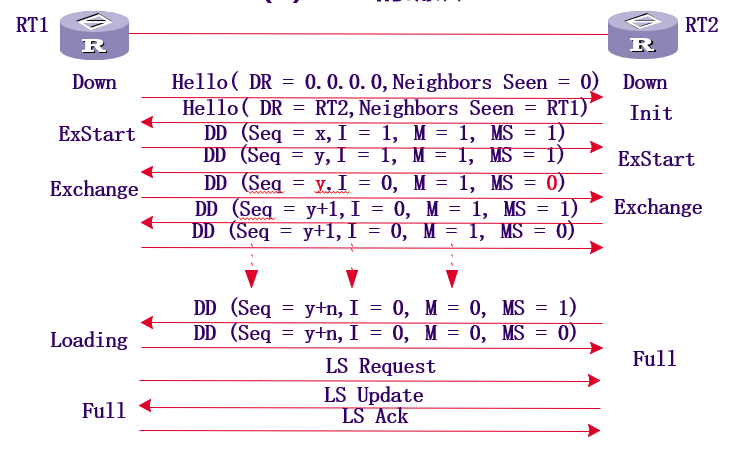
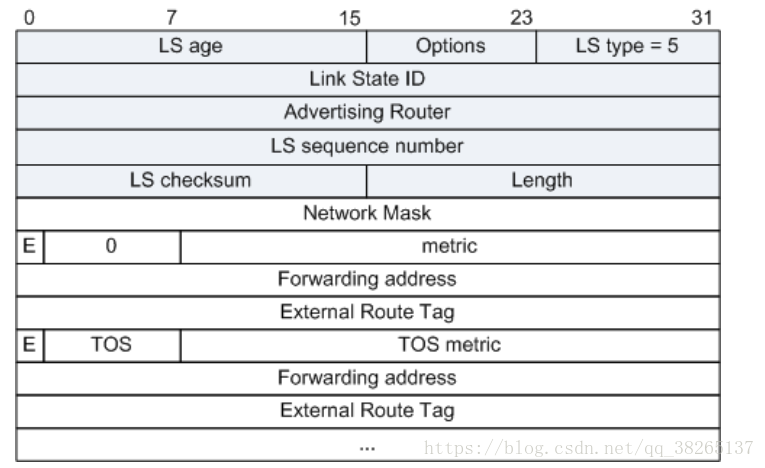

# OSPF协议

> 参考文献
> * [OSPF报文类型](https://blog.csdn.net/qq_38265137/article/details/80390729)


- [OSPF协议](#ospf%e5%8d%8f%e8%ae%ae)
  - [1 OSPF协议概述](#1-ospf%e5%8d%8f%e8%ae%ae%e6%a6%82%e8%bf%b0)
    - [OSPF原理](#ospf%e5%8e%9f%e7%90%86)
    - [OSPF特点](#ospf%e7%89%b9%e7%82%b9)
    - [OSPF优点](#ospf%e4%bc%98%e7%82%b9)
    - [自制系统和OSPF区域](#%e8%87%aa%e5%88%b6%e7%b3%bb%e7%bb%9f%e5%92%8cospf%e5%8c%ba%e5%9f%9f)
    - [OSPF路由器逻辑角色](#ospf%e8%b7%af%e7%94%b1%e5%99%a8%e9%80%bb%e8%be%91%e8%a7%92%e8%89%b2)
    - [OSPF路由器逻辑位置](#ospf%e8%b7%af%e7%94%b1%e5%99%a8%e9%80%bb%e8%be%91%e4%bd%8d%e7%bd%ae)
    - [邻居和邻接](#%e9%82%bb%e5%b1%85%e5%92%8c%e9%82%bb%e6%8e%a5)
    - [OSPF更新](#ospf%e6%9b%b4%e6%96%b0)
    - [OSPF中的表](#ospf%e4%b8%ad%e7%9a%84%e8%a1%a8)
  - [2 OSPF协议报文交互过程](#2-ospf%e5%8d%8f%e8%ae%ae%e6%8a%a5%e6%96%87%e4%ba%a4%e4%ba%92%e8%bf%87%e7%a8%8b)
    - [OSPF报文总体结构](#ospf%e6%8a%a5%e6%96%87%e6%80%bb%e4%bd%93%e7%bb%93%e6%9e%84)
    - [OSPF报文头](#ospf%e6%8a%a5%e6%96%87%e5%a4%b4)
    - [5种OSPF报文类型-Hello报文](#5%e7%a7%8dospf%e6%8a%a5%e6%96%87%e7%b1%bb%e5%9e%8b-hello%e6%8a%a5%e6%96%87)
    - [5中OSPF报文类型-DD报文](#5%e4%b8%adospf%e6%8a%a5%e6%96%87%e7%b1%bb%e5%9e%8b-dd%e6%8a%a5%e6%96%87)
    - [5种OSPF报文类型-LSR报文](#5%e7%a7%8dospf%e6%8a%a5%e6%96%87%e7%b1%bb%e5%9e%8b-lsr%e6%8a%a5%e6%96%87)
    - [5种OSPF报文类型-LSU报文](#5%e7%a7%8dospf%e6%8a%a5%e6%96%87%e7%b1%bb%e5%9e%8b-lsu%e6%8a%a5%e6%96%87)
    - [5种OSPF报文类型-LSACK报文](#5%e7%a7%8dospf%e6%8a%a5%e6%96%87%e7%b1%bb%e5%9e%8b-lsack%e6%8a%a5%e6%96%87)
    - [OSPF可靠传输机制](#ospf%e5%8f%af%e9%9d%a0%e4%bc%a0%e8%be%93%e6%9c%ba%e5%88%b6)
    - [OSPF邻居状态机](#ospf%e9%82%bb%e5%b1%85%e7%8a%b6%e6%80%81%e6%9c%ba)
    - [OSPF报文交互过程](#ospf%e6%8a%a5%e6%96%87%e4%ba%a4%e4%ba%92%e8%bf%87%e7%a8%8b)
  - [3 OSPF协议链路状态描述](#3-ospf%e5%8d%8f%e8%ae%ae%e9%93%be%e8%b7%af%e7%8a%b6%e6%80%81%e6%8f%8f%e8%bf%b0)
    - [LSA 相同的Header](#lsa-%e7%9b%b8%e5%90%8c%e7%9a%84header)
    - [五种链路状态通告类型](#%e4%ba%94%e7%a7%8d%e9%93%be%e8%b7%af%e7%8a%b6%e6%80%81%e9%80%9a%e5%91%8a%e7%b1%bb%e5%9e%8b)
    - [Router-LSA（1类）](#router-lsa1%e7%b1%bb)
    - [Network- LSA(2类)](#network--lsa2%e7%b1%bb)
    - [Network Summary-LSA（3类）](#network-summary-lsa3%e7%b1%bb)
    - [ASBR Summary-LSA(4类)](#asbr-summary-lsa4%e7%b1%bb)
    - [AS External-LSA（5类）](#as-external-lsa5%e7%b1%bb)
    - [OSPF协议的4种网络类型](#ospf%e5%8d%8f%e8%ae%ae%e7%9a%844%e7%a7%8d%e7%bd%91%e7%bb%9c%e7%b1%bb%e5%9e%8b)
    - [OSPF周围4种网络拓扑结构](#ospf%e5%91%a8%e5%9b%b44%e7%a7%8d%e7%bd%91%e7%bb%9c%e6%8b%93%e6%89%91%e7%bb%93%e6%9e%84)
    - [链路状态描述信息](#%e9%93%be%e8%b7%af%e7%8a%b6%e6%80%81%e6%8f%8f%e8%bf%b0%e4%bf%a1%e6%81%af)
    - [链路状态描述信息与链路状态通告信息关系](#%e9%93%be%e8%b7%af%e7%8a%b6%e6%80%81%e6%8f%8f%e8%bf%b0%e4%bf%a1%e6%81%af%e4%b8%8e%e9%93%be%e8%b7%af%e7%8a%b6%e6%80%81%e9%80%9a%e5%91%8a%e4%bf%a1%e6%81%af%e5%85%b3%e7%b3%bb)
    - [DR与BDR的选举](#dr%e4%b8%8ebdr%e7%9a%84%e9%80%89%e4%b8%be)
  - [4 区域划分及LSA种类](#4-%e5%8c%ba%e5%9f%9f%e5%88%92%e5%88%86%e5%8f%8alsa%e7%a7%8d%e7%b1%bb)
    - [原理](#%e5%8e%9f%e7%90%86)
    - [路由器类型](#%e8%b7%af%e7%94%b1%e5%99%a8%e7%b1%bb%e5%9e%8b)
    - [与自治系统外部通信](#%e4%b8%8e%e8%87%aa%e6%b2%bb%e7%b3%bb%e7%bb%9f%e5%a4%96%e9%83%a8%e9%80%9a%e4%bf%a1)
    - [骨干区域与虚连接](#%e9%aa%a8%e5%b9%b2%e5%8c%ba%e5%9f%9f%e4%b8%8e%e8%99%9a%e8%bf%9e%e6%8e%a5)
  - [5 OSPF协议路由的计算](#5-ospf%e5%8d%8f%e8%ae%ae%e8%b7%af%e7%94%b1%e7%9a%84%e8%ae%a1%e7%ae%97)
    - [SPF算法和COST值](#spf%e7%ae%97%e6%b3%95%e5%92%8ccost%e5%80%bc)
    - [区域内OSPF路由计算过程](#%e5%8c%ba%e5%9f%9f%e5%86%85ospf%e8%b7%af%e7%94%b1%e8%ae%a1%e7%ae%97%e8%bf%87%e7%a8%8b)
    - [区域间OSPF路由计算过程](#%e5%8c%ba%e5%9f%9f%e9%97%b4ospf%e8%b7%af%e7%94%b1%e8%ae%a1%e7%ae%97%e8%bf%87%e7%a8%8b)
    - [区域外OSPF路由的计算过程](#%e5%8c%ba%e5%9f%9f%e5%a4%96ospf%e8%b7%af%e7%94%b1%e7%9a%84%e8%ae%a1%e7%ae%97%e8%bf%87%e7%a8%8b)
    - [路由的类型和优选顺序](#%e8%b7%af%e7%94%b1%e7%9a%84%e7%b1%bb%e5%9e%8b%e5%92%8c%e4%bc%98%e9%80%89%e9%a1%ba%e5%ba%8f)
    - [一个SPF算法运行的实例分析（来自课本）](#%e4%b8%80%e4%b8%aaspf%e7%ae%97%e6%b3%95%e8%bf%90%e8%a1%8c%e7%9a%84%e5%ae%9e%e4%be%8b%e5%88%86%e6%9e%90%e6%9d%a5%e8%87%aa%e8%af%be%e6%9c%ac)


## 1 OSPF协议概述

> 主要介绍了OSPF一些静态的基础知识。


### OSPF原理
每一台路由器将其周边的链路状态描述出来，发送给网络中相邻的路由器。经过一段时间的链路状态信息交互，每台路由器都保存了一个链路状态数据库，该数据库是整个网络完整的链路状态描述。然后应用最短路优先算法计算路由。主要是Djskra算法。

OSPF组播的方式在所有开启OSPF的接口发送Hello包，用来确定是否有OSPF邻居，若发现了，则建立OSPF邻居关系，形成邻居表，之后互相发送LSA（链路状态通告）相互通告路由，形成LSDB（链路状态数据库）。再通过SPF算法，计算最佳路径（cost最小）后放入路由表。


### OSPF特点
* OSPF是一种无类别域间路由协议，支持VLSM可变长子网掩码。支持IPV4和IPV6.
* 组播地址：224.0.0.5 224.0.0.6。
* OSPF度量：从源到目的所有出接口的度量值，和接口带宽反比（10^8/带宽）。
* 收敛速度极快，但大型网络配置很复杂。
* IP封装，协议号89


### OSPF优点
* 适应范围广
* 快速收敛
* 无自环
* 支持验证、组播发送、路由分级、等值路由。

### 自制系统和OSPF区域
自治系统（Autonomy System，AS）由统一机构管理的，使用同一组选路策略的路由器集合。OSPF是自治系统内部的路由选择协议。

区域（Area）是指一个路由器的集合，相同的区域有着相同的拓扑结构数据库。OSPF用区域把一个AS分成多个链路状态。分为骨干区域和非骨干区域。

* 骨干区域（区域0）：骨干区域必须连接所有的非骨干区域，而且骨干区域不可分割，有且只有一个，一般情况下，骨干区域内没有终端用户。
* 非骨干区域（非0区域）：非骨干区域一般根据实际情况而划分，必须连接到骨干区域（不规则区域也需通过tunnel或virtual-link连接到骨干区域）。一般情况下，费骨干区域主要连接终端用户和资源。

### OSPF路由器逻辑角色
* DR（Designated Router）：指定路由器，OSPF协议启动后开始选举而来
* BDR（Back-up Designated Router）：备份指定路由器，同样是由OSPF启动后选举而来
* DRothers：其他路由器，非DR非BDR的路由器都是DRothers。

### OSPF路由器逻辑位置

* 区域内路由器(IAR internal area router)：所有端口在同一区域的路由器，维护一个链路状态数据库。 

* 区域边界路由器(ABR area border router)：具有连接多区域端口的路由器，一般作为一个区域的出口。ABR为每一个所连接的区域建立链路状态数据库，负责将所连接区域的路由摘要信息发送到主干区域，而主干区域上的ABR则负责将这些信息发送到各个区域。 


* 骨干路由器(BBR backbone router)：具有连接主干区域端口的路由器。 至少有一个接口属于骨干区域（area = 0）

* 自治域系统边界路由器(ASBR as boundary router)：至少拥有一个连接外部自治域网络（如非OSPF的网络）端口的路由器，负责将非OSPF网络信息传入OSPF网络。


### 邻居和邻接
邻居不一定是邻接，邻接一定是邻居，只有交互了LSA的OSPF邻居才成为OSPF的邻接，只交互Hello包的支撑位邻居。

在点对点网络中，所有邻居都能成为邻接。

MA（广播多路访问网络，比如以太网）网络类型中，DR，BDR，DRothers三者关系为：DR、BDR与所有的邻居形成邻接，DRothers之间只是邻居而不交换LSA。

* OSPF发送hello报文（只有一跳）收到报文进行协商建立邻居关系。是一种物理上直接相连的关系，但不一定是逻辑上的邻接关系。
* 当双方成功交换链路状态通告信息后才会成为邻接关系。建立了逻辑上的邻接关系。

### OSPF更新
OSPF是一种触发更新的机制。一旦拓扑发生变化便会更新。
OSPF也有周期性更新（30分钟一次）

当收到一条LSA之后：
首先查看是否在LSDB中，若没有则假如LSDB，回复LSACK。继续泛洪出去，并且通过SPF算法计算最佳路径并加入路由表。若存在，则比较谁的更“新”（看序号），序号大者新，若本地不如收到的信更新本地LSDB并泛洪，且通过SPF算法计算最佳路径并加入路由表，若比收到的新，则将本地的泛洪出去。

### OSPF中的表

* 邻居表：记录了建立邻居关系的路由器```dis ospf peer```
* LSDB（链路状态数据库）：包含了本路由器上的区域的所有的链路状态信息，并实时同步。```dis ospf lsdb```
* 路由转发表：由LSDB和SPF算法计算得到。```dis ospf routing```

## 2 OSPF协议报文交互过程

> 主要介绍了OSPF报文和动态交互过程。面向的对象OSPF协议本身。建立可靠数据连接的过程。

### OSPF报文总体结构


IP 封装了OSPF报文，LSU（链路状态更新类型的报文）类型的OSPF报文封装了LSA（链路状态通告）报文，LSA报文封装了多个LSA数据。

更具体的封装格式：
IPHeader----OSPFHeader----particularHeader----LSAHeader----LSAData

### OSPF报文头

|字段	|长度	|含义|
|-|-|-|
|Version	|1字节	|版本，OSPF的版本号。对于OSPFv2来说，其值为2。|
|Type	|1字节	|类型，OSPF报文的类型，有下面几种类型：1：Hello报文；2：DD报文；3：LSR报文；4：LSU报文；5：LSAck报文。|
Packet length|	2字节|	OSPF报文的总长度，包括报文头在内，单位为字节。
Router ID	|4字节	|发送该报文的路由器标识。
Area ID	|4字节	|发送该报文的所属区域。
Checksum|	2字节|	校验和，包含除了认证字段的整个报文的校验和。
AuType	|2字节	|验证类型，值有如下几种表示， 0：不验证；1：简单认证；2：MD5认证。
Authentication	|8字节	|鉴定字段，其数值根据验证类型而定。当验证类型为0时未作定义；类型为1时此字段为密码信息；类型为2时此字段包括Key ID、MD5验证数据长度和序列号的信息。MD5验证数据添加在OSPF报文后面，不包含在Authenticaiton字段中。

### 5种OSPF报文类型-Hello报文

Hello：周期性地发送给本路由器的邻居，使用的组播地址224.0.0.5。DR和BDR发送报文使用的组播地址是224.0.0.6。其作用为建立和维护邻接关系，周期性的在使能了OSPF的接口上发送。报文内容包括一些定时器的数值、DR、BDR以及自己已知的邻居。

* OSPF-hello报文格式


* OSPF-hello字段说明

|字段	|长度	|含义|
|-|-|-|
|Network Mask	|32比特|	发送Hello报文的接口所在网络的掩码。|
|HelloInterval|	16比特|	发送Hello报文的时间间隔。|
|Options	|8比特	|可选项：E：允许Flood AS-External-LSAs MC：转发IP组播报文 N/P：处理Type-7 LSAs DC：处理按需链路|
|Rtr Pri	|8比特|	DR优先级。默认为1。如果设置为0，则路由器不能参与DR或BDR的选举。|
|RouterDeadInterval	|32比特|	失效时间。如果在此时间内未收到邻居发来的Hello报文，则认为邻居失效。|
|Designated Router	|32比特|	DR的接口地址。|
|Backup Designated Router|	32比特|	BDR的接口地址。|
|Neighbor	|32比特	|邻居，以Router ID标识。|

* OSPF-hello报文实例


### 5中OSPF报文类型-DD报文
DD：Database Description 本地数据库摘要，供路由器核对数据库是否同步。只交换摘要，减少带宽占用。包括空DD报文和带有摘要信息的DD报文。空DD报文用来确定Master/Slave关系，由Master规定起始序列号，每发送一个DD报文序列号加1，Slave方使用Master的序列号作为确认。
* OSPF-DD报文格式


* OSPF-DD报文字段说明

|字段	|长度|含义|
|-|-|-|
|Interface MTU	|16比特	|在不分片的情况下，此接口最大可发|出的IP报文长度。
|Options	|8比特|	可选项：E：允许Flood AS-External-LSAs|；MC：转发IP组播报文；N/P：处理Type-7 LSAs；DC：处理按需链路。
|I	|1比特|	当发送连续多个DD报文时，如果这是第一个DD报文|，则置为1，否则置为0。
|M (More)	|1比特|	当发送连续多个DD报文时，如果这是最后|一个DD报文，则置为0。否则置为1，表示后面还有其他的DD报文。
|M/S (Master/Slave)	|1比特|	当两台OSPF路由器交换DD报文时，首先需要确定双方的主从关系，Router ID大的一方会成为Master。当值为1时表示发送方为Master。|
|DD sequence number	|32比特|	DD报文序列号。主从双方利|用序列号来保证DD报文传输的可靠性和完整性。
|LSA Headers	|可变|	该DD报文中所包含的LSA的头部信息。|
* OSPF-DD报文实例


### 5种OSPF报文类型-LSR报文
LSR：Link-State Request 请求链路状态，在数据库同步过程中使用，请求其他角色发送自己失去的LSA最新版本。内容包括所需要的LSA的摘要。
* OSPF-LSR报文格式


* OSPF-LSR报文字段说明

|字段	|长度	|含义|
|-|-|-|
|LS type	|32比特|	LSA的类型号。|
|Link State ID|	32比特|	根据LSA中的LS Type和LSA description在路由域中描述一个LSA。|
|Advertising Router	|32比特	|产生此LSA的路由器的Router ID。|

* OSPF-LSR报文实例


### 5种OSPF报文类型-LSU报文
LSU：Link-State Update 链路状态更新，用来向对端Router发送其所需要的LSA或者泛洪自己更新的LSA，内容是多条LSA（全部内容）的集合。LSU包括几种类型的LSA，LSU负责泛洪LSA，和响应LSR。LSA只会发送给之前以LSR请求的LSA的直连邻居，进行泛洪的时候，邻居路由负责把收到的LSA信息重新封装在新的LSU中。

* OSPF-LSU报文格式


* OSPF-LSU报文字段说明

|字段|长度|	含义|
|-|-|-|
|Number of LSAs	|32比特|	LSA的数量。|

* OSPF-LSU报文实例


### 5种OSPF报文类型-LSACK报文
LSACK：链路状态确认，路由器必须对每个收到的LSA进行LSACK确认，但可以用一个LSACK确认多个LSA。
* OSPF-LSACK报文格式


* OSPF-LSACK报文字段说明

|字段	|长度	|含义|
|-|-|-|
|LSAs Headers	|可变	|通过LSA的头部信息确认收到该LSA。|

* OSPF-LSACK报文实例


### OSPF可靠传输机制

采用了确认重传机制，确保OSPF路由信息的可靠传输。

### OSPF邻居状态机


邻居状态机的状态说明
* Down
邻居状态机的初始状态，是指在过去的Dead-Interval时间内没有收到对方的Hello报文 

* Init 
本状态表示已经收到了邻居的HELLO报文，但是该报文中列出的邻居中没有包含本Router ID（对方并没有收到我发的HELLO
* Attempt 
只适用于NBMA类型的接口，处于本状态时，定期向那些手工配置的邻居发送HELLO报文 
* 2-Way 
本状态表示双方互相收到了对端发送的HELLO报文，建立了邻居关系。在广播和NBMA类型的网络中，两个接口状态是DROther的路由器之间将停留在此状态。其他情况状态机将继续转入高级状态。
* ExStart 
在此状态下，路由器和它的邻居之间通过互相交换DD报文（该报文并不包含实际的内容，只包含一些标志位）来决定发送时的主/从关系。建立主/从关系主要是为了保证在后续的DD报文交换中能够有序的发送。 
* Exchange 
路由器将本地的LSDB用DD报文来描述，并发给邻居
* Loading 
路由器发送LSR报文向邻居请求对方的LSU报文
* Full 
在此状态下，邻居路由器的LSDB中所有的LSA本路由器全都有了。本路由器和邻居建立了邻接状态

### OSPF报文交互过程


具体步骤
1. 通过HELLO报文的邻居发现
2. DD报文的主从关系协商
3. DD报文交换摘要信息
4. LSA的请求
5. LSA的更新
6. LSA 的确认

## 3 OSPF协议链路状态通告

> 主要介绍了LSA链路状态通告和与LSA有关的逻辑关系。这一部分主要讲解了OSPF如何来描述整个网路，即如何生成LSDB。下一部分主要讲解通过LSDB，OSPF计算得到ospf routing table的过程。

常用的LSA共有5种，分别为：Router-LSA、Network-LSA、Network-summary-LSA、ASBR-summary-LSA和AS-External-LSA。

### LSA 相同的Header


* 字段说明


|字段	|长度|	含义|
|-|-|-|
|LS age	|16比特|	LSA产生后所经过的时间，以秒为单位。无论LSA是在链路上传送，还是保存在LSDB中，其值都会在不停的增长。|
|Options	|8比特|	可选项：E：允许泛洪AS-External-LSA；MC：转发IP组播报文；N/P：处理Type-7 LSA；DC：处理按需链路。|
|LS type	|8比特|	LSA的类型：Type1：Router-LSA Type2：Network-LSA Type3：Network-summary-LSA Type4：ASBR-summary-LSA Type5：AS-External-LSA Type7：NSSA-LSA|
|Link State ID	|32比特|	与LSA中的LS Type和LSA description一起在路由域中描述一个LSA。|
|Advertising Router|	32比特|	产生此LSA的路由器的Router ID。|
|LS sequence number	|32比特	|LSA的序列号。其他路由器根据这个值可以判断哪个LSA是最新的。|
|LS checksum	|16比特|	除了LS age外其它各域的校验和。|
|length	|16比特	|LSA的总长度，包括LSA Header，以字节为单位。|

### 五种链路状态通告类型


### Router-LSA（1类）
Router-LSA（Type1）：每个路由器都会产生，描述了路由器的链路状态和花费，在所属的区域内传播。

* Router-LSA通告格式


* Router-LSA通告字段说明

|字段|	长度	|含义|
|-|-|-|
|Link State ID	|32比特	|生成LSA的Router ID。|
|V (Virtual Link)	|1比特|	如果产生此LSA的路由器是虚连接的端点，则置为1。|
|E (External)	|1比特|	如果产生此LSA的路由器是ASBR，则置为1。|
|B (Border)|	1比特|	如果产生此LSA的路由器是ABR，则置为1。|
|# links	|16比特	|LSA中所描述的链路信息的数量，包括路由器上处于某区域中的所有链路和接口。|
|Link ID	|32比特	|路由器所接入的目标，其值取决于连接的类型：1：Router ID；2：DR的接口IP地址；3：网段／子网号；4：虚连接中对端的Router ID。|
|Link Data	|32比特|	连接数据，其值取决于连接的类型：unnumbered P2P：接口的索引值；stub网络：子网掩码；其它连接：路由器接口的IP地址。|
|Type	|8比特|	路由器连接的基本描述：1：点到点连接到另一台路由器；2：连接到传输网络；3：连接到stub网络；4：虚拟链路。|
|# TOS	|8比特|	连接不同的TOS数量。|
|metric	|16比特|	链路的开销值。|
|TOS	|8比特|	服务类型。|
|TOS metric	|16比特|	和指定TOS值相关联的度量。|


### Network- LSA(2类)
Network-LSA（Type2）：由广播网或NBMA网络中的DR产生,Network-LSA中记录了这一网络上所有路由器的Router
ID，描述本网段的链路状态，在所属的区域内传播。

* Network-LSA通告格式


* Network-LSA通告字段说明

|字段|	长度|	含义|
|-|-|-|
|Link State ID	|32比特|	DR的接口IP地址。|
|Network Mask	|32比特|	该广播网或NBMA网络地址的掩码。|
|Attached Router	|32比特|	连接在同一个网络上的所有路由器的Router ID，也包括DR的Router ID。|


### Network Summary-LSA（3类）

Network-summary-LSA（Type3）：描述区域内所有网段的路由，并通告给其他相关区域。ASBR-summary-LSA（Type4）：描述到ASBR的路由，通告给除ASBR所在区域的其他相关区域。Type3和Type4的LSA有相同的格式，它们都是由ABR产生。

* Network Summary-LSA&ASBR Summary-LSA通告格式


* Network Summary-LSA&ASBR Summary-LSA通告字段说明

|字段	|长度|	含义|
|-|-|-|
|Link State ID	|32比特|	通告的网络地址。如果是ASBR Summary LSA，此字段表示ASBR的Router ID。|
|Network Mask	|32比特|	该广播网或NBMA网络地址的掩码。如果是ASBR Summary LSA，此字段无意义，设置为0.0.0.0。|
|metric	|24比特|	到目的地址的路由开销。|
|TOS	|8比特|	服务类型。|
|TOS metric	|24比特|	和指定TOS值相关联的度量。|

### ASBR Summary-LSA(4类)
ASBR-Summary-LSA（Type4）：描述到ASBR的路由，通告给除ASBR所在区域的其他相关区域。Type3和Type4的LSA有相同的格式，它们都是由ABR产生。
### AS External-LSA（5类）
AS-External-LSA（Type5）：由ASBR产生，描述到AS外部的路由，这是五种LSA中，唯一一种通告到所有区域（除了Stub区域和NSSA区域）的LSA。

* AS External-LSA通告格式


* AS External-LSA通告字段说明

|字段	|长度|	含义|
|-|-|-|
|Link State ID	|32比特|	通告的网络地址。|
|Network Mask	|32比特|	通告的目的地址的掩码。|
|E	|1比特|	外部度量值类型：0：第一类外部路由；1：第二类外部路由。|
|metric	|24比特|	到目的地址的路由开销。|
|Forwarding Address	|32比特|	到所通告的目的地址的报文将被转发到这个地址。|
|External Route Tag	|32比特|	添加到外部路由上的标记。OSPF本身并不使用这个字段，它可以用来对外部路由进行管理。|
|TOS	|8比特|	服务类型。|
|TOS metric	|24比特|	TOS附加距离信息。|

## 4 OPSF协议链路状态描述

### OSPF协议的4种网络类型

* Broadcast类型。广播网络。选举指定路由器DR与备份指定路由器BDR。广播型全连接网络拓扑结构。
* NBMA类型。非广播多点可达。选举DR与BDR。单播型全连接网络拓扑结构。
* PRMP类型。点到多点网络。不要求DR和BDR。使用组播24.0.0.5发送协议。非全连接拓扑结构。
* PTP类型。点到点网络。无序选择DR和BDR。使用组播224.0.0.5发送协议。点对点拓扑结构。

### OSPF周围4种网络拓扑结构

* Stub net：末端网络拓扑结构，路由器直连其他PC，网段中没有其他运行OSPF协议的网络设备。
* PPP网络描述：点到点拓扑结构，链路连接另一个OSPF的路由器。
* 点到多点：非全连接拓扑结构。
* 全连接网络：全连接拓扑结构。信息冗余。选取DR与BDR。

### 链路状态描述信息

链路状态描述信息+链路状态通告头组成了链路状态通告信息。链路状态描述信息描述了一条记录的具体含义，反映了路由器周边的网络拓扑结构。不同的网络结构使用不同的链路状态描述信息。链路状态描述是链路状态通告的主体部分。

| 类型值 | 链路类型|LinkID|LinkData|
|-|-|-|-|
|1-router|Point-to-Point链路|邻居路由器的RouterID|始发路由器在该网段时的接口IP地址|
|2-transit|连接Transit网络链路|DR接口的IP地址|始发路由器在该网段是的接口IP地址|
|3-stubnet|连接Stub网络链路|Stub网络的IP地址|Stub网络的子网掩码|
|4-virtual|Virtual Link|邻居路由器的RouterID|始发路由器接口的MIB-IIifINDEX值|


### 链路状态描述信息与链路状态通告信息关系

> 重要：关系理解

链路状态信息组成了链路状态通告信息。链路状态描述信息通过接口链路类型区别。链路状态通告类型，通同路由器逻辑作用区别。

当使用以太网连接路由器的一个端口的时候，这个时候默认为广播类型，默认网络结构为全连接网络，默认生成第二类LSA。

第一类链路状态通告信息LSARouter中链路状态描述信息：

* Stub类型的网络Serial
  * 使用StubNet链路状态描述信息，描述链路的网段信息
* PPP网络Serial
  * 使用StubNet链路状态描述信息，描述相连的网段信息
  * 使用p2p链路状态描述信息，描述相连的路由器信息
* 点到多点Serial
  * 使用StubNet链路状态描述信息，描述相连的网段信息
  * 使用p2p链路状态描述信息，描述相连的路由器。
* 以太网连接Ethernet
  * 使用TransNet链路状态描述信息，描述网段信息。

第二类链路状态通告信息LSANetwork中的链路状态描述：
* 全连接网络（或者说，以太网连接网络）
  * 直接描述同一个网段的全连接路由器。

第三类链路状态通告信息LSASumNet

第四类链路状态通告信息LSASumASB


### DR与BDR的选举
1. 登记本网段内运行OSPF的路由器；
2. 登记具有DR候选资格的路由器，即本网段内的Priority>0的OSPF路由器（Priority可以手工配置，缺省值是1）；
3. 所有的Priority>0的OSPF路由器都认为自己是DR；
4. Priority值最大，若Priority值相等则Router ID最大的路由器将成为DR。第二为BDR。
5. 每台路由器通过互相发送Hello报文，同时将自己选出的DR写入Hello报文中，本网段中所有路由器共同选举出DR和BDR。

选举的原则

* 选举制
DR是各路由器选出来的，而非人工指定的，虽然管理员可以通过配置Priority干预选举过程。
* 终身制
DR一旦当选，除非路由器故障，否则不会更换，即使后来的路由器Priority更高。
* 世袭制
DR选出的同时也选出BDR来，DR故障后，由BDR接替DR成为新的DR。
* 稳定压倒一切
如果DR频繁的更迭，则每次都要重新引起本网段内的所有路由器与新的DR建立邻接关系。
* BDR快速响应
BDR与DR同时被选举出来。BDR也与本网段内的所有路由器建立邻接关系并交换路由信息。DR失效后，BDR立即成为DR。

## 5 区域划分及LSA种类

### 原理
路由器数量增多，LSDB庞大，占用存储空间，增加运行SPF算法的复杂度，同时两台路由器之间进行LSDB同步的时间变长。

减少LSA的数量，缩小网络变化的搏击范围。

OSPF协议通过将自治系统划分成不同的区域解决问题。区域内使用第一类和第二类LSA链路通告类型。第三类LSA主要对区域内的路由（网段）信息进行描述，大大减少了路由信息描述的数量。

路由聚合功能。

### 路由器类型

在第一章讲过

### 与自治系统外部通信

ASBR可以在系统中的任何位置。将其他路由协议（包括静态路由和接口直连路由）导入到OSPF路由器中。

使用第五类LSA描述包括该路由的目的地之、掩码和花费等信息。将外部信息导入到自制系统内部传播。

### 骨干区域与虚连接


## 6 OSPF协议路由的计算

### SPF算法和COST值

* SPF算法-Dijkstra算法。

  根据链路状态数据库，还原网络区域的拓扑结构图。SPF算法根据甲醛有向图，以该路由器为根，计算最小生成树，获得到每一个目的网段的路由。

* Cost值

  链路花费。值越小，链路带宽越高。OSPF中的COST值一般为$10^8/链路宽带$。
### 区域内OSPF路由计算过程

> LSA描述路由器本地状态--报文交互-->生成LSDB--SPF算法-->LS Routing

1. 每台路由器根据自己周围的网络拓扑结构生成一条LSA（静态）。通过相互之间发送协议报文将LSA发送给网络中相邻的路由器（动态交互）。网络中所有的路由器具有所有的相同的LSA构成的LSDB。
2. LSDB是对整个网络拓扑结构的描述。使用LSDB生成带权有向图。
3. 每台路由器运行SPF算法计算最短路径树。


### 区域间OSPF路由计算过程

1. 同一个区域内的路由器之间会保持LSDB的同步。网络拓扑结构的变化首先在区域内更新。
2. 区域之间通过ABR来完成。生成Type3的LSA
3. 另一个区域根据Type3的LSA，生成路由，下一跳都指向ABR


### 区域外OSPF路由的计算过程

1. 第一类外部路由接受的IGP路由。第一类外部路由开销=本路由器到ASBR开销+ASBR到目的地址开销。
2. 第二类外部路由接受的EGP路由。第二类外部路由开销=ASBR到目的地之的开销。
   

### 路由的类型和优选顺序

1. 优选区域内路由
2. 优选区域间路由
3. 优选自治系统Tpye1类外部路由
4. 优选自制系统Type2类外部路由
5. 若都相等，添加等值路由。

### 一个SPF算法运行的实例分析（来自课本）

1. 每个路由器生成了第一类LSA


