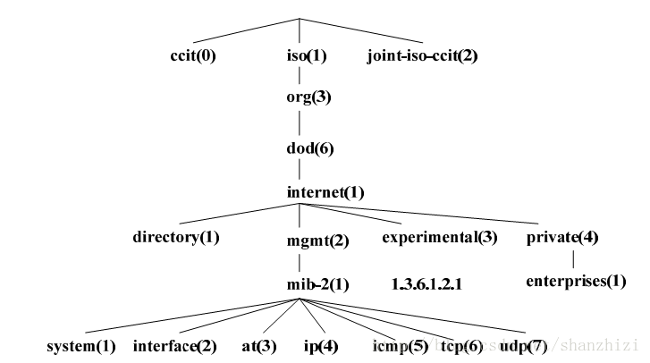
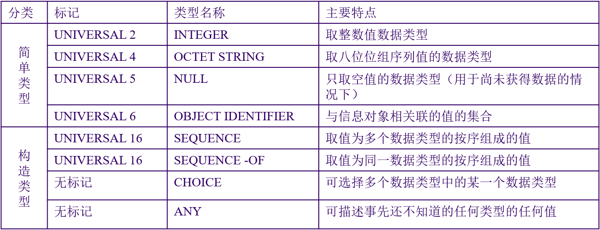
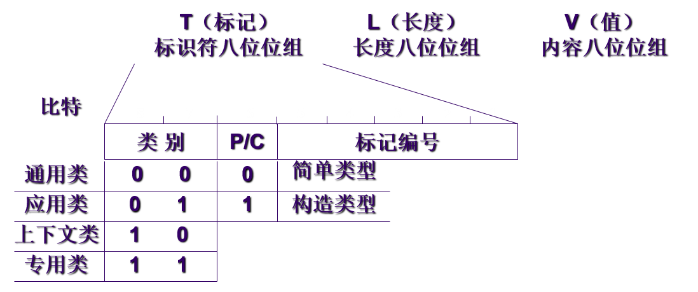
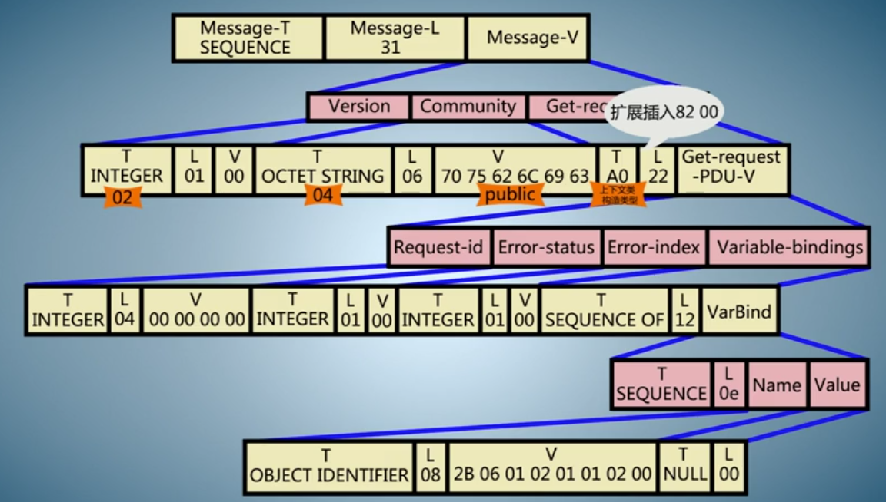
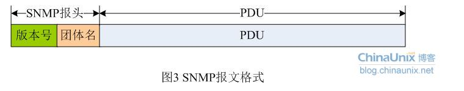
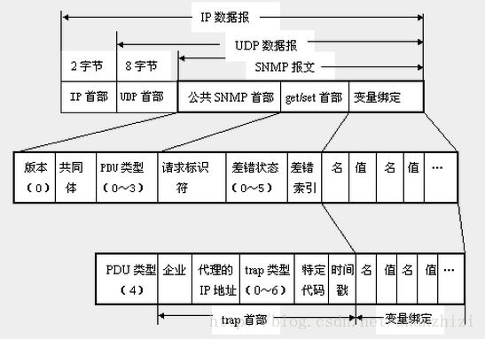
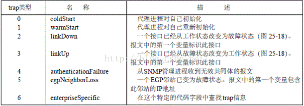
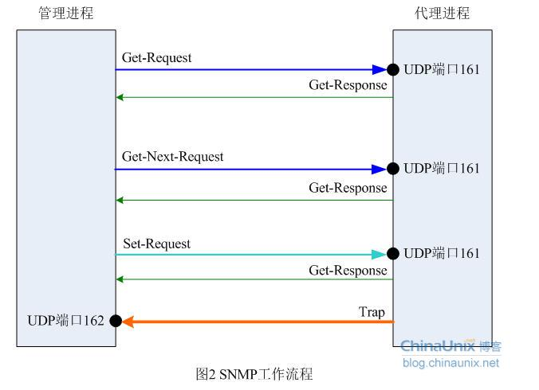
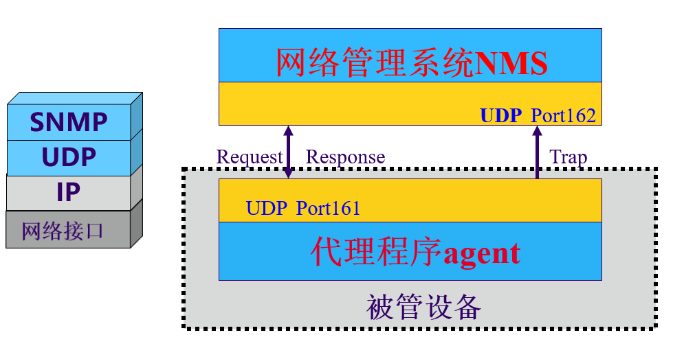
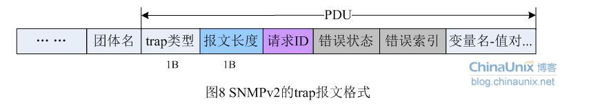

  1# SNMP

> 参考文献
> * [简单网络管理协议](https://blog.csdn.net/HandsomeHong/article/details/80016249)

## 1 版本
简单网络管理协议（SNMP）是TCP/IP协议簇的一个应用层协议。在1988年被制定，并被Internet体系结构委员会（IAB）采纳作为一个短期的网络管理解决方案；由于SNMP的简单性，在Internet时代得到了蓬勃的发展，1992年发布了SNMPv2版本，以增强SNMPv1的安全性和功能。现在，已经有了SNMPv3版本。

### SNMPv1

SNMPv1 是 SNMP 协议的最初版本，提供最小限度的网络管理功能。SNMPv1 的 SMI 和 MIB 都比较简单，且存在较多安全缺陷。SNMPv1 采用团体名认证。团体名的作用类似于密码，用来限制NMS对Agent 的访问。

如果 SNMP 报文携带的团体名没有得到 NMS/Agent 的认可，该报文将被丢弃。SNMPV1 是一种简单的请求/响应协议。网络管理系统发出一个请求，管理器则返回一个响应。这一行为的实现是通过使用四种协议操作中的其中任一种完成的。这四种操作分别是 GET、GETNEXT、SET 和 TRAP。

* NMS 通过 GET 操作，从 SNMP 代理处得到一个或 更多的对象(实例)值。如果代理处不能提供请求列表中所有的对象(实例)值，它也就不提供任何值。 

* NMS 使用 GETNEXT 操作请求代理从请求列表或对象列表中取出下一 个对象实例值。

* NMS 通过 SET 操作向 SNMP 代理发送命令，要求对对象值重新配置。

* SNMP 代理通过 TRAP 操作不定时的通知 NMS 所发生的特定事件 SNMP 是一种应用程序协议。

### SNMPv2

SNMPv2c 也采用团体名认证。在兼容 SNMPv1 的同时又扩充了 SNMPv1 的功能:它提 供了更多的操作类型(GetBulk--批量获取操作等)；支持更多的数据类型(Counter32等)，提供了更丰富的错误代码，能够更细致地区分错误。

SNMPV1 中的 GET、GETNEXT 及 SET 操作同样适用于 SNMPV2，只是 SNMPV2 添加和增强了有关协议操作。例如 SNMPV2 中的 TRAP 操作，不但具备 SNMPV1 中 TRAP 的相同功能，而且它采用了一种不同的消息格式，它用于替换 SNMPV1 中的 TRAP。

SNMPV2 中还定了两种新操作，即 GET BULK 和 INFORM。

* NMS 通过 GET BULK 操作能有效地获取大块数据，如对象列表中的多行。请求多少数据 GETBULK 返回一个包含尽可能多的请求数据的应答消息。
* INFORM 操作使一个NMS 能发送 TRAP 给另一个 NMS 并收到回复。SNMPV2中，如果回复 GET BULK 操作的 SNMP 代理不能提供请求表中所有变量值，那么SNMP代理只提供部分结果。

### SNMPV3

SNMPv3主要在安全性方面进行了增强，它采用了 USM（基于用户的安全控制模型）和 VACM（基于视图的访问控制模型） 技术。USM 提供了认证和加密功能，VACM 确定用户是否允许访问特定的 MIB 对象以及访问方式。

SNMPV3 中增加了安全管理方式及远程控制。SNMPV3 结构引入了基于用户的安全模型用于保证消息安全及基于视图的访问控制模型用于访问控制(USM)。这种安全管理方式支持不同安全性，访问控制安全性认证和隐私授权和访问控制管理框架人员和政策用户名及密钥管理通知目标文件代理关系实体命名。

SNMPV3 使用 SNMP SET 命令配置MIB对象，使之能动态配置SNMP代理。这种动态配置方式支持本地或远程地配置实体的添加、删除及修改。

 
## 2 SNMP基本组成

基于TCP/IP的网络管理包含3个组成部分：

1. 管理信息库MIB（Management Information Base）。管理信息库包含所有代理进程的所有可被查询和修改的参数。RFC 1213[McCloghrie and Rose 1991]定义了第二版的MIB，叫做MIB-II。

2. 管理信息结构SMI（Structure of Management Information）。关于MIB的一套公用的结构和表示符号。这个在RFC 1155 [Rose and McCloghrie 1990] 中定义。例如：SMI定义计数器是一个非负整数，它的计数范围是 0~4294967295，当达到最大值时，又从0开始计数。

3. 简单网络管理协议SNMP（Simple Network Management Protocol）。管理进程和代理进程之间的通信协议，在RFC 1157 [Case et al. 1990]中定义。SNMP包括数据报交换的格式等。尽管可以在传输层采用各种各样的协议，但是在SNMP中，用得最多的协议还是UDP。


### 管理信息库MIB

* 定义  

    任何一个被管理的资源都表示成一个对象，称为被管理的对象。MIB是被管理对象的集合。它定义了被管理对象的一系列属性：对象的名称、对象的访问权限和对象的数据类型等。每个SNMP设备（Agent）都有自己的MIB。MIB也可以看作是NMS（网络管理系统）和Agent（网络代理）之间的沟通桥梁。



MIB文件中的变量使用的名字取自ISO和ITU管理的对象标识符（object identifier）名字空间。它是一种分级树的结构。变量的名字可以表示为：

```
iso.org.dod.internet.mgmt.mib.ip.ipInReceives
# 相应的数字表示
1.3.6.1.2.1.4.3
```
* 工作方式

  在网络管理中，驻留在被管设备上的Agent从UDP端口161接受来自网络管理站的串行化报文，经过解码、共同体名验证、**分析得到管理变量在MIB书中对应的节点**，从响应的模块中得到管理变量的值，形成响应报文，编码发送回管理站；管理站得到响应报文后经过处理，显示最终结果。

### 管理信息结构（SMI）

SMI（structure of management information）用来定义SNMP数据结构。SMI标准规定了所有的MIB变量必须使用抽象语法记法1（ASN.1）来定义。

ASN.1定义对象信息数据，**数据类型及序列格式**。

* ASN.1定义的数据类型



> 补充：应用类型（application-wide）
> * IpAddress: 以网络序表示的IP地址。因为它是一个32位的值，所以定义为4个字节；
> * counter：计数器是一个非负的整数，它递增至最大值，而后回零。在SNMPv1中定义的计数器是32位的，即最大值为4，294，967，295；
> * Gauge ：也是一个非负整数，它可以递增或递减，但达到最大值时保持在最大值，最大值为232-1；
> * time ticks：是一个时间单位，表示以0.01秒为单位计算的时间；

* ASN.1定义的序列化格式  

定义了ASN.1类型的值如何明确地转换为适合于传输的字节序列，也就是将ASN.1语法表示的抽象数据转换成具体的比特流。



* ASN.1语法实例


### SNMP协议报文
 

SNMP报文结构如下：




SNMP共有5种报文，对应五种协议数据单元PDU也有5种。SNMP中定义了五种消息类型：Get-Request、Get-Response、Get-Next-Request、Set-Request和Trap 。

* Get-Request 、Get-Next-Request与Get-Response

    SNMP 管理站用Get-Request消息从拥有SNMP代理的网络设备中检索信息，而SNMP代理则用Get-Response消息响应。Get-Next- Request用于和Get-Request组合起来查询特定的表对象中的列元素。

* Set-Request 

    SNMP管理站用Set-Request 可以对网络设备进行远程配置（包括设备名、设备属性、删除设备或使某一个设备属性有效/无效等）。

* Trap 

    SNMP代理使用Trap向SNMP管理站发送非请求消息，一般用于描述某一事件的发生，如接口UP/DOWN，IP地址更改等。

上面五种消息中Get-Request、Get-Next-Request和Set-Request是由管理站发送到代理侧的161端口的；后面两种Get-Response和Trap 是由代理进程发给管理进程的，其中Trap消息被发送到管理进程的162端口，所有数据都是走UDP封装。


## 3 SNMP报文封装

### SNMP报文封装
下图是封装成UDP数据报的5种操作的SNMP报文格式。一个SNMP报文共有三个部分组成，即公共SNMP首部、get/set首部或者trap首部、变量绑定。



### 公共SNMP首部

* 版本：写入版本字段的是版本号减1，对于SNMP（即SNMPV1）则应写入0。
* 共同体（community）：共同体就是一个字符串，作为管理进程和代理进程之间的明文口令，常用的是6个字符“public”。
* PDU类型：根据PDU的类型，填入0～4中的一个数字，其对应关系如表2所示意图。


|PDU类型|名称|用途|
|-|-|-|
|0|get-request|用来查询一个或多个变量的值
|1|get-next-request|允许在一个MIB树上检索下一个变量，此操作可反复进行
|2|get-response|对get/set报文作出响应，并提供差错码、差错状态等信息
|3|set-request|对一个或多个变量的值进行设置
|4|trap|向管理进程报告代理中发生的事件

### get/set首部
* 请求标识符(request ID)：这是由管理进程设置的一个整数值。代理进程在发送get-response报文时也要返回此请求标识符。管理进程可同时向许多代理发出get报文，这些报文都使用UDP传送，先发送的有可能后到达。设置了请求标识符可使管理进程能够识别返回的响应报文对于哪一个请求报文
* 差错状态（error status）：由代理进程回答时填入0～5中的一个数字，见表3的描述

|差错状态|名字|说明|
|-|-|-|
|0|noError|一切正常|
|1|tooBig|代理无法将回答装入到一个SNMP报文之中|
|2|noSuchName|操作指明了一个不存在的变量|
|3|badValue|一个set操作指明了一个无效值或无效语法|
|4|readOnly|管理进程试图修改一个只读变量|
|5|genErr|某些其他的差错|

* 差错索引(error index)：当出现noSuchName、badValue或readOnly的差错时，由代理进程在回答时设置的一个整数，它指明有差错的变量在变量列表中的偏移。


### trap首部


* trap 类型


    当使用上述类型2、3、5时，在报文后面变量部分的第一个变量应标识响应的接口。
* 企业（enterprise）：填入trap报文的网络设备的对象标识符。此对象标识符肯定是在图3的对象命名树上的enterprise结点{1.3.6.1.4.1}下面的一棵子树上。

* 代理地址：即代理进程所在系统的地址。


* 特定代码：特定代码仅仅在trap类型为6时有效，否则都置为0，他是厂家自定义的事件代码。

* 时间戳(timestamp)：指明自代理进程初始化到trap报告的事件发生所经历的时间，单位为10ms。例如时间戳为1908表明在代理初始化后1908ms发生了该时间。

### 变量绑定(variable-bindings)

指明一个或多个变量的名和对应的值。在get或get-next报文中，变量的值应忽略。

管理变量表示管理对象类型在某一时刻的值（或称该类型的实例），SNMP以管理变量作为操作对象。管理变量的表示方法是这样规定的：形如x.y，其中x是管理对象的object identifer。y是能唯一确定对象类型值的一组数字。

## 4 SNMP工作原理

### SNMP交互过程






### SNMP的运行过程

驻留在被管设备上的AGENT从UDP端口161接受来自网管站的串行化报文，经解码、团体名验证、分析得到管理变量在MIB树中对应的节点，从相应的模块中得到管理变量的值，再形成响应报文，编码发送回网管站。网管站得到响应报文后，再经同样的处理，最终显示结果。

1. 首先解码生成用内部数据结构表示的报文，解码依据ASN.1的基本编码规则，如果在此过程中出现错误导致解码失败则丢弃该报文，不做进一步处理。

2. 第二步：将报文中的版本号取出，如果与本Agent支持的SNMP版本不一致，则丢弃该报文，不做进一步处理。当前北研的数据通信产品只支持SNMP版本1。

3. 第三步：将报文中的团体名取出，此团体名由发出请求的网管站填写。如与本设备认可的团体名不符，则丢弃该报文，不做进一步处理，同时产生一个陷阱报文。SNMPv1只提供了较弱的安全措施，在版本3中这一功能将大大加强。

4. 第四步：从通过验证的ASN.1对象中提出协议数据单元PDU，如果失败，丢弃报文，不做进一不处理。否则处理PDU，结果将产生一个报文，该报文的发送目的地址应同收到报文的源地址一致。

### 不同PDU的处理

**GetRequest PDU**

* 第一种情况：如果PDU中的变量名在本地维护的MIB树中不存在,则接受到这个PDU的协议实体将向发出者发送一个GetResponse报文，其中的PDU与源PDU只有一点不同：将ERROR-STATUS置为noSuchName,并在ERROR-INDEX中指出产生该变量在变量LIST中的位置。

* 第二种情况：如果本地协议实体将产生的响应报文的长度大于本地长度限制，将向该PDU的发出者发送一个GetResponse报文，该PDU除了ERROR-STATUS置为tooBig，ERROR-INDEX置为0以外，与源PDU相同。

* 第三种情况：如果本地协议实体因为其他原因不能产生正确的响应报文，将向该PDU的发出者发送一个GetResponse报文，该PDU除了ERROR-STATUS置为genErr，ERROR-INDEX置为出错变量在变量LIST中的位置，其余与源PDU相同。

* 第四中情况：如果上面的情况都没有发生，则本地协议实体向该PDU的发出者发送一个GetResponse报文，该PDU中将包含变量名和相应值的对偶表，ERROR-STATUS为noError,ERROR-INDEX为0，request-id域的值应与收到PDU的request-id相同。

**GetNextRequest PDU**

GetNextRequest PDU的最重要的功能是表的遍历，这种操作受到了前面所说的管理变量的表示方法的支持，从而可以访问一组相关的变量，就好象他们在一个表内。


**GetResponse PDU**

GetResponse PDU只有当收到getRequest GetNextRequest SetRequest才由协议实体产生，网管站收到这个PDU后，应显示其结果。

**SetRequest PDU**

SetRequest PDU除了PDU类型标识以外，和GetRequest相同，当需要对被管变量进行写操作时，网管站侧的协议实体将生成该PDU。

对SetRequest的响应将根据下面情况分别处理：

* 如果是关于一个只读变量的设置请求，则收到该PDU的协议实体产生一个GetReponse报文，并置error status为noSuchName, error index的值是错误变量在变量list中的位置。

* 如果被管设备上的协议实体收到的PDU中的变量对偶中的值，类型、长度不符和要求，则收到该PDU的协议实体产生一个GetReponse报文，并置error status为badValue, error index的值是错误变量在变量list中的位置。

* 如果需要产生的GetReponse报文长度超过了本地限制，则收到该PDU的协议实体产生一个GetReponse报文，并置error status为tooBig, error index的值是0。

* 如果是其他原因导致SET失败，则收到该PDU的协议实体产生一个GetReponse报文，并置error status为genErr, error index的值是错误变量在变量list中的位置。

* 如果不符合上面任何情况，则agent将把管理变量设置收到的PDU中的相应值，这往往可以改变被管设备的运行状态。同时产生一个GetResponse PDU，其中error status置为noError,error index的值为0。

**Trap PDU**
Trap PDU的字段：产生trap的系统的OBJECT IDENTIFIER、系统的IP地址、普通类型、特定类型、时戳、变量对偶表。

SNMPv2 Trap报文 SNMPv2的Trap报文格式如图所示：


Trap是被管设备遇到紧急情况时主动向网管站发送的消息。网管站收到trap PDU后要将起变量对偶表中的内容显示出来。一些常用的trap类型有冷、热启动，链路状态发生变化等。