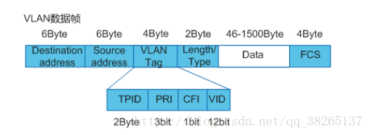

# VLAN技术
> 参考文献
> * [VLAN基础知识](https://blog.csdn.net/qq_38265137/article/details/80390759)
> * 可以等到以后复习的时候，补充完整这一块。

## 1 VLAN简介

### 定义

VLAN（Virtual Local Area Network）即虚拟局域网，是将一个物理的LAN在逻辑上划分成多个广播域的通信技术。VLAN内的主机间可以直接通信，而VLAN间不能直接通信，从而将广播报文限制在一个VLAN内。

### 目的
以太网是一种基于CSMA/CD（Carrier Sense Multiple Access/Collision Detection）的共享通讯介质的数据网络通讯技术。当主机数目较多时会导致冲突严重、广播泛滥、性能显著下降甚至造成网络不可用等问题。通过交换机实现LAN互连虽然可以解决冲突严重的问题，但仍然不能隔离广播报文和提升网络质量。

在这种情况下出现了VLAN技术，这种技术可以把一个LAN划分成多个逻辑的VLAN，每个VLAN是一个广播域，VLAN内的主机间通信就和在一个LAN内一样，而VLAN间则不能直接互通，这样，广播报文就被限制在一个VLAN内。

### 作用
* 限制广播域：广播域被限制在一个VLAN内，节省了带宽，提高了网络处理能力。
* 增强局域网的安全性：不同VLAN内的报文在传输时是相互隔离的，即一个VLAN内的用户不能和其它VLAN内的用户直接通信。
* 提高了网络的健壮性：故障被限制在一个VLAN内，本VLAN内的故障不会影响其他VLAN的正常工作。
* 灵活构建虚拟工作组：用VLAN可以划分不同的用户到不同的工作组，同一工作组的用户也不必局限于某一固定的物理范围，网络构建和维护更方便灵活。

## 2 VLAN帧格式

字段解释：

|字段|	长度|	含义|	取值|
|-|-|-|-|
|TPID|	2Byte|	Tag Protocol Identifier（标签协议标识符），表示数据帧类型。|	表示帧类型，取值为0x8100时表示IEEE 802.1Q的VLAN数据帧。如果不支持802.1Q的设备收到这样的帧，会将其丢弃。 各设备厂商可以自定义该字段的值。当邻居设备将TPID值配置为非0x8100时， 为了能够识别这样的报文，实现互通，必须在本设备上修改TPID值，确保和邻居设备的TPID值配置一致。|
|PRI|	3bit|	Priority，表示数据帧的802.1p优先级。	|取值范围为0～7，值越大优先级越高。当网络阻塞时，设备优先发送优先级高的数据帧。|
|CFI|	1bit|	Canonical Format Indicator（标准格式指示位），表示MAC地址在不同的传输介质中是否以标准格式进行封装，用于兼容以太网和令牌环网。	|CFI取值为0表示MAC地址以标准格式进行封装，为1表示以非标准格式封装。在以太网中，CFI的值为0。|
|VID|	12bit|	VLAN ID，表示该数据帧所属VLAN的编号。	|VLAN ID取值范围是0～4095。由于0和4095为协议保留取值，所以VLAN ID的有效取值范围是1～4094。|

设备利用VLAN标签中的VID来识别数据帧所属的VLAN，广播帧只在同一VLAN内转发，这就将广播域限制在一个VLAN内。

## 3 VLAN标签

### VLAN标签
要使设备能够分辨不同VLAN的报文，需要在报文中添加标识VLAN信息的字段。IEEE 802.1Q协议规定，在以太网数据帧的目的MAC地址和源MAC地址字段之后、协议类型字段之前加入4个字节的VLAN标签（又称VLAN Tag，简称Tag），用以标识VLAN信息。

### 常用设备收发数据帧的VLAN标签情况

在一个VLAN交换网络中，以太网帧主要有以下两种格式：

* 有标记帧（Tagged帧）：加入了4字节VLAN标签的帧。
* 无标记帧（Untagged帧）：原始的、未加入4字节VLAN标签的帧。

常用设备中：

* 用户主机、服务器、Hub只能收发Untagged帧。
* 交换机、路由器和AC既能收发Tagged帧，也能收发Untagged帧。
* 语音终端、AP等设备可以同时收发一个Tagged帧和一个Untagged帧。
* 为了提高处理效率，设备内部处理的数据帧一律都是Tagged帧。

### 链路类型
设备内部处理的数据帧一律都带有VLAN标签，而现网中的设备有些只会收发Untagged帧，需要接口能够识别Untagged帧并在收发时给帧添加、剥除VLAN标签。

设备定义接入链路（Access Link）和干道链路（Trunk Link）两种链路类型。根据链路中需要承载的VLAN数目的不同，以太网链路分为：

* 接入链路

  接入链路只可以承载1个VLAN的数据帧，用于连接设备和用户终端（如用户主机、服务器等）。通常情况下，用户终端并不需要知道自己属于哪个VLAN，也不能识别带有Tag的帧，所以在接入链路上传输的帧都是Untagged帧。

* 干道链路

  干道链路可以承载多个不同VLAN的数据帧，用于设备间互连。为了保证其它网络设备能够正确识别数据帧中的VLAN信息，在干道链路上传输的数据帧必须都打上Tag。

### 接口类型
设备定义了Access接口、Trunk接口和Hybrid接口3种接口类型。根据接口连接对象以及对收发数据帧处理的不同，以太网接口分为：

* Access接口

  Access接口一般用于和不能识别Tag的用户终端（如用户主机、服务器等）相连，或者不需要区分不同VLAN成员时使用。它只能收发Untagged帧，且只能为Untagged帧添加唯一VLAN的Tag。

* Trunk接口

  Trunk接口一般用于连接交换机、路由器、AP以及可同时收发Tagged帧和Untagged帧的语音终端。它可以允许多个VLAN的帧带Tag通过，但只允许一个VLAN的帧从该类接口上发出时不带Tag（即剥除Tag）。

* Hybrid接口

  Hybrid接口既可以用于连接不能识别Tag的用户终端（如用户主机、服务器等）和网络设备（如Hub），也可以用于连接交换机、路由器以及可同时收发Tagged帧和Untagged帧的语音终端、AP。它可以允许多个VLAN的帧带Tag通过，且允许从该类接口发出的帧根据需要配置某些VLAN的帧带Tag（即不剥除Tag）、某些VLAN的帧不带Tag（即剥除Tag）。

Hybrid接口和Trunk接口在很多应用场景下可以通用，但在某些应用场景下，必须使用Hybrid接口。比如一个接口连接不同VLAN网段的场景中，因为一个接口需要给多个Untagged报文添加Tag，所以必须使用Hybrid接口。

### 缺省VLAN标签

PVID（Port Default VLAN ID）。前面提到，设备处理的数据帧都带Tag，当设备收到Untagged帧时，就需要给该帧添加Tag，添加什么Tag，就由接口上的缺省VLAN决定。

### 同类型接口添加或剥除VLAN标签

|接口类型	|对接收不带Tag的报文处理	|对接收带Tag的报文处理	|发送帧处理过程|
|-|-|-|-|
|Access接口	|接收该报文，并打上缺省的VLAN ID。	|当VLAN ID与缺省VLAN ID相同时，接收该报文。当VLAN ID与缺省VLAN ID不同时，丢弃该报文。	|先剥离帧的PVID Tag，然后再发送。|
|Trunk接口	|打上缺省的VLAN ID，当缺省VLAN ID在允许通过的VLAN ID列表里时，接收该报文。打上缺省的VLAN ID，当缺省VLAN ID不在允许通过的VLAN ID列表里时，丢弃该报文。	|当VLAN ID在接口允许通过的VLAN ID列表里时，接收该报文。当VLAN ID不在接口允许通过的VLAN ID列表里时，丢弃该报文。	|当VLAN ID与缺省VLAN ID相同，且是该接口允许通过的VLAN ID时，去掉Tag，发送该报文。当VLAN ID与缺省VLAN ID不同，且是该接口允许通过的VLAN ID时，保持原有Tag，发送该报文。|
|Hybrid接口	|打上缺省的VLAN ID，当缺省VLAN ID在允许通过的VLAN ID列表里时，接收该报文。打上缺省的VLAN ID，当缺省VLAN ID不在允许通过的VLAN ID列表里时，丢弃该报文。	|当VLAN ID在接口允许通过的VLAN ID列表里时，接收该报文。当VLAN ID不在接口允许通过的VLAN ID列表里时，丢弃该报文。	|当VLAN ID是该接口允许通过的VLAN ID时，发送该报文。可以通过命令设置发送时是否携带Tag。|

接受数据帧时
* 当接收到不带VLAN标签的数据帧时，Access接口、Trunk接口、Hybrid接口都会给数据帧打上VLAN标签PVID。

* 当接收到带VLAN标签的数据帧时，Access接口、Trunk接口、Hybrid接口都会根据数据帧的VID是否为其允许通过的VLAN（Access接口允许通过的VLAN就是缺省VLAN）来判断是否接收。

发送数据帧时：

* Access接口直接剥离数据帧中的VLAN标签。
* Trunk接口只有在数据帧中的VID与接口的PVID相等时才会剥离数据帧中的VLAN标签。
* Hybrid接口会根据接口上的配置判断是否剥离数据帧中的VLAN标签。

因此，Access接口发出的数据帧肯定不带Tag，Trunk接口发出的数据帧只有一个VLAN的数据帧不带Tag，其他都带VLAN标签，Hybrid接口发出的数据帧可根据需要设置某些VLAN的数据帧带Tag，某些VLAN的数据帧不带Tag。

## 4 VLAN内互访

### 同一VLAN内用户互访过程
1. 用户主机的报文转发

    源主机在发起通信之前，会将自己的IP与目的主机的IP进行比较，如果两者位于同一网段，会获取目的主机的MAC地址，并将其作为目的MAC地址封装进报文；如果两者位于不同网段，源主机会将报文递交给网关，获取网关的MAC地址，并将其作为目的MAC地址封装进报文。

2. 设备内部的以太网交换

* 如果目的MAC地址+VID匹配自己的MAC表且三层转发标志置位，则进行三层交换，会根据报文的目的IP地址查找三层转发表项，如果没有找到会将报文上送CPU，由CPU查找路由表实现三层转发。
* 如果目的MAC地址+VID匹配自己的MAC表但三层转发标志未置位，则进行二层交换，会直接将报文根据MAC表的出接口发出去。
* 如果目的MAC地址+VID没有匹配自己的MAC表，则进行二层交换，此时会向所有允许VID通过的接口广播该报文，以获取目的主机的MAC地址。

3. 设备之间交互时，VLAN标签的添加和剥离
    
    设备内部的以太网交换都是带Tag的，为了与不同设备进行成功交互，设备需要根据接口的设置添加或剥除Tag。不同接口VLAN标签添加和剥离情况不同。

从以太网交换原理可以看出，划分VLAN后，广播报文只在同一VLAN内二层转发，因此同一VLAN内的用户可以直接二层互访。根据属于同一VLAN的主机是否连接在不同的设备，VLAN内互访有两种场景：同设备VLAN内互访和跨设备VLAN内互访。

### 同设备VLAN内互访

同设备互访过程

1. Host_1判断目的IP地址跟自己的IP地址在同一网段，于是发送ARP广播请求报文获取目的主机Host_2的MAC地址，报文目的MAC填写全F，目的IP为Host_2的IP地址10.1.1.3。
2. 报文到达Router的接口IF_1，发现是Untagged帧，给报文添加VID=2的Tag（Tag的VID=接口的PVID），然后根据报文的源MAC地址、VID和报文入接口（1-1-1， 2， IF_1）生成MAC表。
3. 根据报文目的MAC地址+VID查找Router的MAC表，没有找到，于是在所有允许VLAN2通过的接口（本例中接口为IF_2）广播该报文。
4. Router的接口IF_2在发出ARP请求报文前，根据接口配置，剥离VID=2的Tag。
5. Host_2收到该ARP请求报文，将Host_1的MAC地址和IP地址对应关系记录ARP表。然后比较目的IP与自己的IP，发现跟自己的相同，就发送ARP响应报文，报文中封装自己的MAC地址2-2-2，目的IP为Host_1的IP地址10.1.1.2。
6. Router的接口IF_2收到ARP响应报文后，同样给报文添加VID=2的Tag。
7. Router根据报文的源MAC地址、VID和报文入接口（2-2-2， 2， IF_2）生成MAC表，然后根据报文的目的MAC地址+VID（1-1-1， 2）查找MAC地址表，由于前面已记录，查找成功，向出接口IF_1转发该ARP响应报文。
8. Router向出接口IF_1转发前，同样根据接口配置剥离VID=2的Tag。
9. Host_1收到Host_2的ARP响应报文，将Host_2的MAC地址和IP地址对应关系记录ARP表。

后续Host_1与Host_2的互访，由于彼此已学习到对方的MAC地址，报文中的目的MAC地址直接填写对方的MAC地址。

此组网场景下，当同一VLAN的用户处于不同网段时，主机将在报文中封装网关的MAC地址，可借助VLANIF技术（需配置主从IP地址）实现互访。

### 跨设备VLAN内互访：

为了识别和发送跨越设备的数据帧，设备间通过干道链路连接。报文的发送过程如下

1. 经过与同设备VLAN内互访的步骤1～2一样的过程后，报文被广播到Router_1的IF_2接口。
2. Router_1的IF_2接口在发出ARP请求报文前，因为接口的PVID=1（缺省值），与报文的VID不相等，直接透传该报文到Router_2的IF_2接口，不剥除报文的Tag。
3. Router_2的IF_2接口收到该报文后，判断报文的Tag中的VID=2是接口允许通过的VLAN，接收该报文。
4. 经过与同设备VLAN内互访的步骤3～6一样的过程后，Router_2将向其出接口IF_2转发Host_2的ARP响应报文，转发前，因为接口IF_2为Trunk接口且PVID=1（缺省值），与报文的VID不相等，直接透传报文到Router_1的IF_2接口。
5. Router_1的IF_2接口收到Host_2的ARP响应报文后，判断报文的Tag中的VID=2是接口允许通过的VLAN，接收该报文。后续处理同同设备VLAN内互访的步骤7～9一样。

可见，干道链路除可传输多个VLAN的数据帧外，还起到透传VLAN的作用，即干道链路上，数据帧只会转发，不会发生Tag的添加或剥离。

## 5 VLAN间互访
### VLAN间互访
划分VLAN后，由于广播报文只在同VLAN内转发，所以不同VLAN的用户间不能二层互访，这样能起到隔离广播的作用。但实际应用中，不同VLAN的用户又常有互访的需求，此时就需要实现不同VLAN的用户互访，简称VLAN间互访。

同VLAN间互访一样，VLAN间互访也会经过用户主机的报文转发、设备内部的以太网交换、设备之间交互时VLAN标签的添加和剥离三个环节。同样，根据以太网交换原理，广播报文只在同一VLAN内转发，不同VLAN内的用户则不能直接二层互访，需要借助三层路由技术或VLAN转换技术才能实现互访。

### 同设备VLAN间互访

互访的源主机Host_1和目的主机Host_2连接在同一台设备Router上，分别属于VLAN2和VLAN3，并位于不同的网段。在Router上分别创建VLANIF2和VLANIF3并配置其IP地址，然后将用户主机的缺省网关设置为所属VLAN对应VLANIF接口的IP地址。

当用户主机Host_1发送报文给用户主机Host_2时，报文的发送过程如下

1. Host_1判断目的IP地址跟自己的IP地址不在同一网段，因此，它发出请求网关MAC地址的ARP请求报文，目的IP为网关IP 10.1.1.1，目的MAC为全F。
2. 报文到达Router的接口IF_1，Router给报文添加VID=2的Tag（Tag的VID=接口的PVID），然后将报文的源MAC地址+VID与接口的对应关系（1-1-1， 2， IF_1）添加进MAC表。
3. Router检查报文是ARP请求报文，且目的IP是自己VLANIF2接口的IP地址，给Host_1应答，并将VLANIF2接口的MAC地址3-3-3封装在应答报文中，应答报文从IF_1发出前，剥掉VID=2的Tag。同时，Router会将Host_1的IP地址与MAC地址的对应关系记录到ARP表。
4. Host_1收到Router的应答报文，将Router的VLANIF2接口的IP地址与MAC地址对应关系记录到自己的ARP表中，并向Router发送目的MAC为3-3-3、目的IP为Host_2的IP地址 10.2.2.2的报文。
5. 报文到达Router的接口IF_1，同样给报文添加VID=2的Tag。
6. Router根据报文的源MAC地址+VID与接口的对应关系更新MAC表，并比较报文的目的MAC地址与VLANIF2的MAC地址，发现两者相等，进行三层转发，根据目的IP查找三层转发表，没有找到匹配项，上送CPU查找路由表。
7. CPU根据报文的目的IP去找路由表，发现匹配了一个直连网段（VLANIF3对应的网段），于是继续查找ARP表，没有找到，Router会在目的网段对应的VLAN3的所有接口发送ARP请求报文，目的IP是10.2.2.2。从接口IF_2发出前，根据接口配置，剥掉VID=2的Tag。
8. Host_2收到ARP请求报文，发现请求IP是自己的IP地址，就发送ARP应答报文，将自己的MAC地址包含在其中。同时，将VLANIF3的MAC地址与IP地址的对应关系记录到自己的ARP表中。
9. Router的接口IF_2收到Host_2的ARP应答报文后，给报文添加VID=3的Tag，并将Host_2的MAC和IP的对应关系记录到自己的ARP表中。然后，将Host_1的报文转发给Host_2，发送前，同样剥离报文中的Tag。同时，将Host_2的IP、MAC、VID及出接口的对应关系记录到三层转发表中。

至此，Host_1完成对Host_2的单向访问。Host_2访问Host_1的过程与此类似。这样，后续Host_1与Host_2之间的往返报文，都先发送给网关Router，由Router查三层转发表进行三层转发。

### 跨设备VLAN间互访

由于VLANIF接口的IP地址只能在设备上生成直连路由，当不同VLAN的用户跨多台设备互访时，除配置VLANIF接口的IP地址外，还需要配置静态路由或运行动态路由协议。

互访的源主机Host_1和目的主机Host_2连接在不同的设备Router_1和Router_2上，分别属于VLAN2和VLAN3，并位于不同的网段。在Router_1上分别创建VLANIF2和VLANIF4，配置其IP地址为10.1.1.1和10.1.4.1；在Router_2上分别创建VLANIF3和VLANIF4，配置其IP地址为10.1.2.1和10.1.4.2，并在Router_1和Router_2上分别配置静态路由。Router_1上静态路由的目的网段是10.1.2.0/24，下一跳是10.1.4.2；Router_2上静态路由的目的网段是10.1.1.0/24，下一跳是10.1.4.1。

当用户主机Host_1发送报文给用户主机Host_2时，报文的发送过程如下（假设Router_1和Router_2上还未建立任何转发表项）。

1. 与同设备VLAN间互访的步骤1～6一样，经过“Host_1比较目的IP地址—>Host_1查ARP表—>Host_1获取网关MAC地址—>Host_1将发给Host_2的报文送到Router_1—>Router_1查MAC表—>Router_1查三层转发表”的过程，Router_1上送CPU查找路由表。
2. Router_1的CPU根据报文的目的IP 10.1.2.2去找路由表，发现匹配了一个路由网段10.1.2.0/24（VLANIF3对应的网段），下一跳IP地址为10.1.4.2，于是继续查找ARP表，没有找到，Router_1会在下一跳IP地址对应的VLAN4的所有接口发送ARP请求报文，目的IP是10.1.4.2。报文从Router_1的接口IF_2发出前，根据接口配置，直接透传该报文到Router_2的IF_2接口，不剥除报文的Tag。
3. ARP请求报文到达Router_2后，发现目的IP为VLANIF4接口的IP地址，给Router_1回应，填写VLANIF4接口的MAC地址。
4. Router_2的ARP响应报文从其IF_2接口直接透传到Router_1，Router_1接收后，记录VLANIF4的MAC地址与IP地址的对应关系到ARP表项。
5. Router_1将Host_1的报文转发给Router_2，报文的目的MAC修改为Router_2的VLANIF4接口的MAC地址，源MAC地址修改自己的VLANIF4接口的MAC地址，并将刚用到的转发信息记录在三层转发表中（10.1.2.0/24，下一跳IP的MAC地址， 出口VLAN， 出接口）。同样，报文是直接透传到Router_2的IF_2接口。
6. Router_2收到Router_1转发的Host_1的报文后，与同设备VLAN间互访的步骤6～9一样，经过“查MAC表—>查三层转发表—>送CPU—>匹配直连路由—>查ARP表并获取Host_2的MAC地址—>将Host_1的报文转发给Host_2”的过程，同时将Host_2的IP地址、MAC地址、出口VLAN、出接口记录到三层转发表项。