# IGMP协议

## 1 IGMP概述

### 简介
IGMP（Internet Group Management Protocol，互联网组管理协议）是TCP/IP协议族中负责IPv4组播成员管理的协议。IGMP用来在接收者主机和与其直接相邻的组播路由器之间建立和维护组播组成员关系。

IGMP通过在接收者主机和组播路由器之间交互IGMP报文实现组成员管理功能，IGMP报文封装在IP报文中。协议号2，TTL字段为1.

### 目的

IP组播通信的特点是报文从一个源发出，被转发到一组特定的接收者。

在组播通信模型中:
* 发送者不关注接收者的位置信息，只是将数据发送到约定的目的组播地址。
* 接受者不受限制地加入组播组，只需要控制加入与退出。
* 组播路由器不需要保存加入的主机，保存组播网段信息。

IGMP是用来在接收者主机和与其所在网段直接相邻的组播路由器之间建立、维护组播组成员关系的协议。

### 组成员关系建立过程

* 接收者向共享网络报告组播的成员关系。
* 处于同一网段的能使用IGMP功能的路由器选举查询器，查询器周期性地向共享网段发送组播成员查询消息。
* 主机接收到该查询消息后进行响应，报告组成员关系。
* 查询器接收的响应刷新组成员的存在信息。查询器通过IGMP了解每个接口连接的网段上是否存在某个组播组的接收者。

## 2.1 IGMPv1报文

### ICMPv1报文类型

* 成员关系查询报文（General Query）：查询器向共享网络上所有主机和路由器发送的查询报文，用于了解哪些组播组存在成员。
* 成员关系报告报文（Report）：主机向查询器发送的报告报文，用于申请加入某个组播组或者应答查询报文。

### IGMPv1报文格式

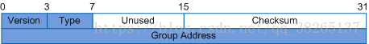

|字段|	说明|
|-|-|
|Version|	IGMP版本，值为1。|
|Type|	报文类型。该字段有以下两种取值：0x11：表示成员关系查询报文。0x12：表示成员关系报告报文。|
|Unused|	在IGMPv1中，该字段在发送时被设为0，并在接收时被忽略。|
|Checksum|	IGMP报文的校验和。校验和是IGMP报文长度（即IP报文的整个有效负载）的16位检测，表示IGMP信息补码之和的补码。Checksum字段在进行校验计算时设为0。当发送报文时，必须计算校验和并插入到Checksum字段中去。当接收报文时，校验和必须在处理该报文之前进行检验。|
|Group Address|	组播组地址。在普遍组查询报文中，该字段设为0；在成员报告报文中，该字段为成员加入的组播组地址。|

### IGMPv1报文实例

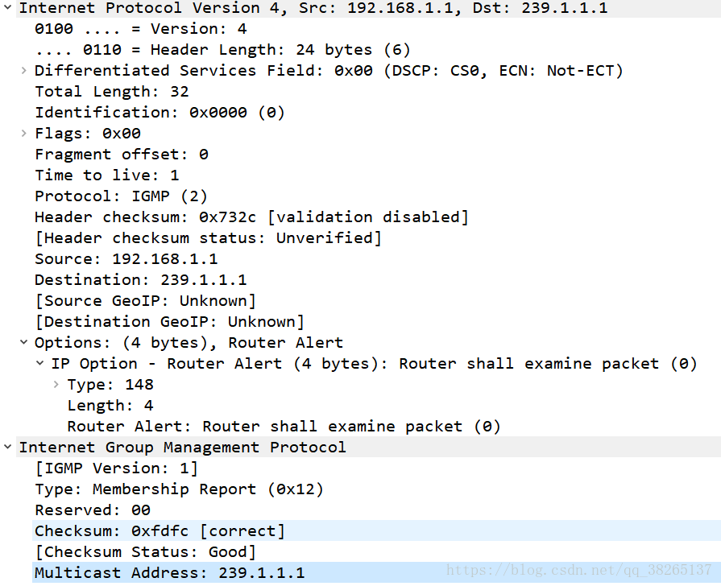

## 2.2 IGMPv2报文
### IGMPv2报文变化

与IGMPv1相比，IGMPv2的变化如下：

* 除了普遍组查询报文和成员报告报文之外，IGMPv2新增了两种报文：
  * 成员离开报文（Leave）：成员离开组播组时主动向查询器发送的报文，用于宣告自己离开了某个组播组。
  * 特定组查询报文（Group-Specific Query）：查询器向共享网段内指定组播组发送的查询报文，用于查询该组播组是否存在成员。
* IGMPv2对普遍组查询报文格式也做了改进，添加了最大响应时间（Max Response Time）字段。此字段取值可以通过命令配置，用于控制成员对于查询报文的响应速度。

### IGMPv2报文格式

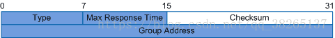

* Type：报文类型。该字段有以下四种取值：
  * 0x11:表示查询报文。IGMPv2的查询报文包括普遍组查询报文和特定组查询报文两类。
  * 0x12:表示IGMPv1成员报告报文。
  * 0x16:表示IGMPv2成员报告报文。
  * 0x17:表示成员离开报文。

* Max Response Time：最大响应时间。

    成员主机在收到IGMP查询器发送的普遍组查询报文后，需要在最大响应时间内做出回应。该字段仅在IGMP查询报文中有效。

* Group Address：组播组地址。

  * 在普遍组查询报文中，该字段设为0.0.0.0。
  * 在特定组查询报文中，该字段为要查询的组播组地址。
  * 在成员报告报文和离开报文中，该字段为成员要加入或离开的组播组地址。

### IGMPv2报文实例

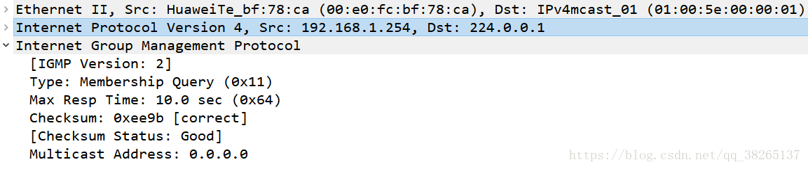

## 2.3 IGMPv3报文

### IGMPv3报文变化

与IGMPv2相比，IGMPv3报文的变化如下：

* IGMPv3报文包含两大类：成员查询报文和成员报告报文。IGMPv3没有定义专门的成员离开报文，成员离开通过特定类型的报告报文来传达。
* 查询报文中不仅包含普遍组查询报文和特定组查询报文，还新增了特定源组查询报文（Group-and-Source-Specific Query）。该报文由查询器向共享网段内特定组播组成员发送，用于查询该组成员是否愿意接收特定源发送的数据。特定源组查询通过在报文中携带一个或多个组播源地址来达到这一目的。
* 成员报告报文不仅包含主机想要加入的组播组，而且包含主机想要接收来自哪些组播源的数据。IGMPv3增加了针对组播源的过滤模式（INCLUDE/EXCLUDE），将组播组与源列表之间的对应关系简单的表示为（G，INCLUDE，(S1、S2…)），表示只接收来自指定组播源S1、S2……发往组G的数据；或（G，EXCLUDE，(S1、S2…)），表示接收除了组播源S1、S2……之外的组播源发给组G的数据。当组播组与组播源列表的对应关系发生了变化，IGMPv3报告报文会将该关系变化存放于组记录（Group Record）字段，发送给IGMP查询器。
* 在IGMPv3中一个成员报告报文可以携带多个组播组信息，而之前的版本一个成员报告只能携带一个组播组。这样在IGMPv3中报文数量大大减少。

### IGMPv3查询报文格式

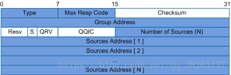

IGMPv3查询报文字段说明：

|字段	|说明|
|-|-|
|Type	|报文类型，取值为0x11。|
|Max Response Code	|最大响应时间。成员主机在收到IGMP查询器发送的普遍组查询报文后，需要在最大响应时间内做出回应。|
|Checksum	|IGMP报文的校验和。|
|Group Address	|组播组地址。在普遍组查询报文中，该字段设为0；在特定组查询报文和特定源组查询报文中，该字段为要查询的组播组地址。|
|Resv	|保留字段。发送报文时该字段设为0；接收报文时，对该字段不做处理。|
|S	|该比特位为1时，所有收到此查询报文的其他路由器不启动定时器刷新过程，但是此查询报文并不抑制查询器选举过程和路由器的主机侧处理过程。|
|QRV	|如果该字段非0，则表示查询器的健壮系数（Robustness Variable）。如果该字段为0，则表示查询器的健壮系数大于7。路由器接收到查询报文时，如果发现该字段非0，则将自己的健壮系数调整为该字段的值；如果发现该字段为0，则不做处理。|
|QQIC	|IGMP查询器的查询间隔，单位为秒。非查询器收到查询报文时，如果发现该字段非0，则将自己的查询间隔参数调整为该字段的值；如果发现该字段为0，则不做处理。|
|Number of Sources	|报文中包含的组播源的数量。对于普遍组查询报文和特定组查询报文，该字段为0；对于特定源组查询报文，该字段非0。此参数的大小受到所在网络MTU大小的限制。|
|Source Address	|组播源地址，其数量受到Number of Sources字段值大小的限制。|

### IGMPv3查询报文实例

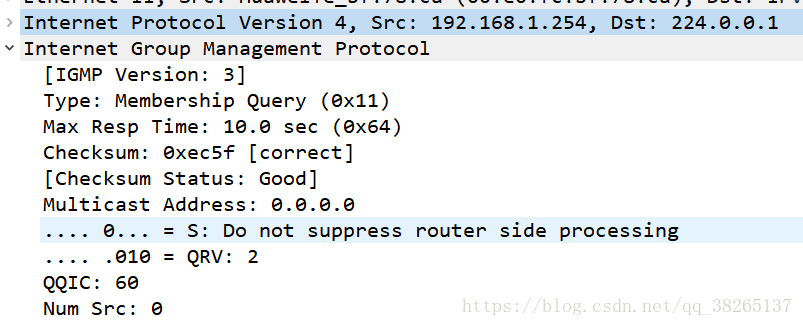

### IGMPv3成员报告报文

IGMPv3成员报告报文格式

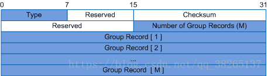

字段解释：

|字段	|说明|
|-|-|
|Type	|报文类型，取值为0x22。|
|Reserved	|保留字段。|
|Checksum	|IGMP报文的校验和。|
|Number of Group Records	|报文中包含的组记录的数量。|
|Group Record	|组记录。|

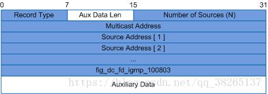

字段解释：
|字段|说明|
|-|-|
|Record Type|组记录的类型。共分为三大类。当前状态报告。用于对查询报文进行响应，通告自己目前的状态，共两种：一种是MODE_IS_INCLUDE，表示接收源地址列表包含的源发往该组的组播数据。如果指定源地址列表为空，该报文无效；另一种是MODE_IS_EXCLUDE，表示不接收源地址列表包含的源发往该组的组播数据。过滤模式改变报告。当组和源的关系在INCLUDE和EXCLUDE之间切换时，会通告过滤模式发生变化，共两种：一种是CHANGE_TO_INCLUDE_MODE，表示过滤模式由EXCLUDE转换到INCLUDE，接收源地址列表包含的新组播源发往该组播组的数据。如果指定源地址列表为空，主机将离开组播组；另一种是CHANGE_TO_EXCLUDE_MODE，表示过滤模式由INCLUDE转换到EXCLUDE，拒绝源地址列表包含的新组播源发往该组的组播数据。源列表改变报告。当指定源发生改变时，会通告源列表发生变化，共两种：一种是ALLOW_NEW_SOURCES，表示在现有的基础上，需要接收源地址列表包含的组播源发往该组播组的组播数据。如果当前对应关系为INCLUDE，则向现有源列表中添加这些组播源；如果当前对应关系为EXCLUDE，则从现有阻塞源列表中删除这些组播源；另一种是BLOCK_OLD_SOURCES，表示在现有的基础上，不再接收源地址列表包含的组播源发往该组播组的组播数据。如果当前对应关系为INCLUDE，则从现有源列表中删除这些组播源；如果当前对应关系为EXCLUDE，则向现有源列表中添加这些组播源。
|Aux Data Len|辅助数据长度。在IGMPv3的报告报文中，不存在辅助数据字段，该字段设为0。|
|Number of Sources|本记录中包含的源地址数量。|
|Multicast Address|组播组地址。|
|Sources Address|组播源地址。|
|Auxiliary Data|辅助数据。预留给IGMP后续扩展或后续版本。在IGMPv3的报告报文中，不存在辅助数据。|

### IGMPv3成员报告报文实例

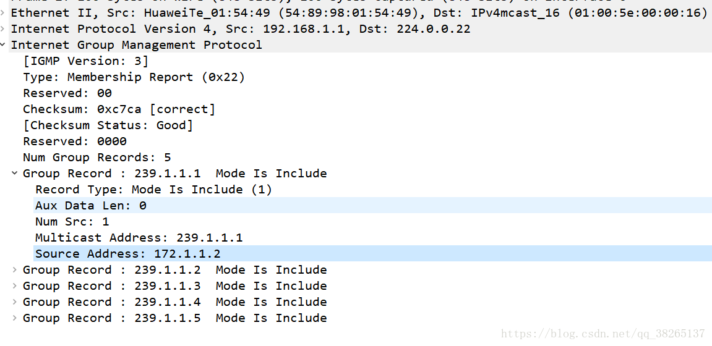

## 3.1 IGMPv1工作原理

IGMPv1协议主要基于查询和响应机制完成组播组管理。IGMPv1的工作机制可以分为：普遍组查询和响应机制、新成员加入机制和组成员离开机制三个方面。

当一个网段内有多个组播路由器时，由于它们都可以接收到主机发送的成员报告报文，因此只需要选取其中一台组播路由器发送查询报文就足够了，该组播路由器称为IGMP查询器（Querier）。在IGMPv1中，由组播路由协议PIM选举出唯一的组播信息转发者（Assert Winner或DR）作为IGMPv1的查询器，负责该网段的组成员关系查询。

### 普遍组查询响应机制

通过普遍组查询和响应，IGMP查询器可以了解到该网段内哪些组播组存在成员。

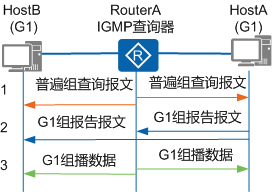

普遍组查询响应过程如下：

1. IGMP查询器发送目的地址为224.0.0.1（表示同一网段内所有主机和路由器）的普遍组查询报文；收到该查询报文的组成员启动定时器。

    普遍组查询报文是周期性发送的，发送周期可以通过命令配置，缺省情况下每隔60秒发送一次。HostA和HostB是组播组G1的成员，则在本地启动定时器Timer-G1。缺省情况下，定时器的范围为0～10秒之间的随机值。

2. 第一个定时器超时的组成员发送针对该组的报告报文。

    假设HostA上的Timer-G1首先超时，HostA向该网段发送目的地址为G1的报告报文。也想加入组G1的HostB收到此报告报文，则停止定时器Timer-G1，不再发送针对G1的报告报文。这样报告报文被抑制，可以减少网段上的流量。（同网段报文抑制）

3. IGMP查询器接收到HostA的报告报文后，了解到本网段内存在组播组G1的成员，则由组播路由协议生成（*，G1）组播转发表项，“ * ”代表任意组播源。网络中一旦有组播组G1的数据到达路由器，将向该网段转发。

### 新组成员加入机制

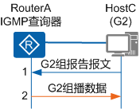

主机HostC加入组播组G2的过程如下：

1. 主机HostC不等待普遍组查询报文的到来，主动发送针对G2的报告报文以声明加入。
2. IGMP查询器接收到HostC的报告报文后，了解到本网段内出现了组播组G2的成员，则生成组播转发项（*，G2）。网络中一旦有G2的数据到达路由器，将向该网段转发。

### 组成员离开机制
IGMPv1没有专门定义离开组的报文。主机离开组播组后，便不会再对普遍组查询报文做出回应。

* 假设HostA想要退出组播组G1

    HostA收到IGMP查询器发送的普遍组查询报文时，不再发送针对G1的报告报文。由于网段内还存在G1组成员HostB，HostB会向IGMP查询器发送针对G1的报告报文，因此IGMP查询器感知不到HostA的离开。

* 假设HostC想要退出组播组G2

    HostC收到IGMP查询器发送的普遍组查询报文时，不再发送针对G2的报告报文。由于网段内不存在组G2的其他成员，IGMP查询器不会收到G2组成员的报告报文，则在一定时间（缺省值为130秒）后，删除G2所对应的组播转发表项。

## 3.2 IGMPv2工作原理

IGMPv2的工作机制与IGMPv1基本相同，在工作机制上，IGMPv2增加了查询器选举和离开组机制。

IGMPv2增加了离开组机制。成员主机离开组播组时，会主动发送成员离开报文通知IGMP查询器；IGMP查询器收到成员离开报文后，会连续发送特定组查询报文，询问该组播组是否还存在组成员。如果在一段时间内没有收到成员主机发送的报告报文，IGMP查询器将不再维护该组的组成员关系。

IGMPv2可以使IGMP查询器及时了解到网段内哪些组播组已不存在成员，从而及时更新组成员关系，减少网络中冗余的组播流量。

### 查询器选举机制

IGMPv2使用独立的查询器选举机制，当共享网段上存在多个组播路由器时，IP地址最小的路由器成为查询器。

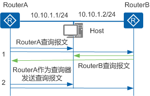

在IGMPv2中，查询器的选举过程如下：

1. 最初，所有运行IGMPv2的组播路由器（RouterA和RouterB）都认为自己是查询器，向本网段内的所有主机和组播路由器发送普遍组查询报文。

2. RouterA和RouterB在收到对方发送的普遍组查询报文后，将报文的源IP地址与自己的接口地址作比较。通过比较，IP地址最小的组播路由器将成为查询器，其他组播路由器成为非查询器（Non-Querier）。

2. 此后，将由IGMP查询器（RouterA）向本网段内的所有主机和其他组播路由器发送普遍组查询报文，而非查询器（RouterB）则不再发送普遍组查询报文。

4. 非查询器（RouterB）上都会启动一个定时器（即其他查询器存在时间定时器Other Querier Present Timer）。在该定时器超时前，如果收到了来自查询器的查询报文，则重置该定时器；否则，就认为原查询器失效，并发起新的查询器选举过程。

### 离开组机制：

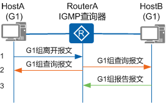

在IGMPv2中，主机HostA离开组播组G1的过程如下：

1. HostA向本地网段内的所有组播路由器（目的地址为224.0.0.2）发送针对组G1的离开报文。

2. 查询器收到离开报文，会发送针对组G1的特定组查询报文。发送间隔和发送次数可以通过命令配置，缺省情况下每隔1秒发送一次，共发送两次。同时查询器启动组成员关系定时器（Timer-Membership=发送间隔x发送次数）。

3. 该网段内还存在组G1的其他成员，这些成员在收到查询器发送的特定组查询报文后，会立即发送针对组G1的报告报文。查询器收到针对组G1的报告报文后将继续维护该组成员关系。

    如果该网段内不存在组G1的其他成员，查询器将不会收到针对组G1的报告报文。在Timer-Membership超时后，查询器将删除（*，G1）对应的IGMP组表项。当有组G1的组播数据到达查询器时，查询器将不会向下游转发。 

## 3.3 IGMPv3工作原理

在工作机制上，与IGMPv2相比，IGMPv3增加了主机对组播源的选择能力。

### 特定组加入

IGMPv3的成员报告报文的目的地址为224.0.0.22（表示同一网段所有使能IGMPv3的路由器）。通过在报告报文中携带组记录，主机在加入组播组的同时，能够明确要求接收或不接收特定组播源发出的组播数据。

如果Host和组播路由器之间运行的是IGMPv1或IGMPv2，Host加入组播组G时无法对组播源进行选择，无论其是否需要，都会同时接收到来自组播源S1和S2的数据。如果采用IGMPv3，成员主机可以选择仅接收S1组播数据。

* 方法一：Host发送IGMPv3报告（G，INCLUDE，(S1)），仅接收源S1向组播组G发送的数据。
* 方法二：Host发送IGMPv3报告（G，EXCLUDE，(S2)），不接收指定源S2向组播组G发送的数据，从而仅有来自S1的组播数据才能传递到Host。

### 特定组查询

当接收到组成员发送的改变组播组与源列表的对应关系的报告时（比如CHANGE_TO_INCLUDE_MODE、CHANGE_TO_EXCLUDE_MODE），IGMP查询器会发送特定源组查询报文。如果组成员希望接收其中任意一个源的组播数据，将反馈报告报文。IGMP查询器根据反馈的组成员报告更新该组对应的源列表。

## 4 IGMP各个版本对比

IGMPv1中定义了基本的组成员查询和报告过程，IGMPv2在此基础上添加了查询器选举和组成员离开的机制，IGMPv3中增加的主要功能是成员可以指定接收或指定不接收某些组播源的报文。三个版本在演进过程中对协议报文的处理是向前兼容的，因此尽管各个版本的协议报文格式不同，但是运行IGMP高版本的路由器可以识别低版本的IGMP报文。

所有IGMP版本都支持ASM（Any-Source Multicast）模型。IGMPv3可以直接应用于SSM（Source-Specific Multicast）模型，而IGMPv1和IGMPv2则需要IGMP SSM Mapping技术的支持才可以应用于SSM模型。

|项目	|IGMPv1	|IGMPv2	|IGMPv3|
|-|-|-|-|
|查询器选举方式	|依靠组播路由协议PIM选举	|同网段组播路由器之间竞争选举	|同网段组播路由器之间竞争选举|
|普遍组查询报文	|支持	|支持	|支持|
|成员报告报文	|支持	|支持	|支持|
|特定组查询报文	|不支持	|支持	|支持|
|成员离开报文	|不支持	|支持	|没有定义专门的成员离开报文，成员离开通过特定类型的报告报文来传达|
|特定源组查询报文	|不支持	|不支持	|支持|
|指定组播源	|不支持	|不支持	|支持|
|可识别报文协议版本	|IGMPv1	|IGMPv1、IGMPv2	|IGMPv1、IGMPv2、IGMPv3|
|ASM模型	|支持	|支持	|支持|
|SSM模型	|需要IGMP SSM Mapping技术支持	|需要IGMP SSM Mapping技术支持	|支持|

## 5 IGMP SSM Mapping
SSM（Source-Specific Multicast）称为指定源组播，要求路由器能了解成员主机加入组播组时所指定的组播源。如果成员主机上运行IGMPv3，可以在IGMPv3报告报文中直接指定组播源地址。但是某些情况下，成员主机只能运行IGMPv1或IGMPv2，为了使其也能够使用SSM服务，路由器上需要提供IGMP SSM Mapping功能。

IGMP SSM Mapping的机制是：通过在路由器上静态配置SSM地址的映射规则，将IGMPv1和IGMPv2报告报文中的(*, G)信息转化为对应的(G, INCLUDE, (S1, S2…))信息，以提供SSM组播服务。

* 如果G在ASM（Any-Source Multicast）范围内，则只提供ASM服务。
* 如果G在SSM组地址范围内（缺省情况下为232.0.0.0～232.255.255.255）：
    * 如果路由器上没有G对应的SSM Mapping规则，则无法提供SSM服务，丢弃该报文。
    * 如果路由器上有G对应的SSM Mapping规则，则依据规则将报告报文中所包含的(*, G)信息映射为(G, INCLUDE, (S1, S2…))信息，提供SSM服务。

## 6 IGMP Proxy

### 简介
IGMP Proxy，也称为IGMP代理，通常被部署在接入设备（RouterA）和成员主机之间的三层设备上，IGMP Proxy设备可以收集下游成员主机的IGMP报告/离开报文，将报告/离开报文汇聚后代理下游成员主机统一上送给接入设备；另一方面，IGMP Proxy设备也可以代理IGMP查询器向下游成员主机发送查询报文，维护组成员关系，基于组成员关系进行组播转发。在接入设备RouterA看来，RouterB就是一台主机；在下游成员主机看来，RouterB就是IGMP查询器。

* 上游接口：指IGMP代理设备上配置IGMP Proxy功能的接口，该接口执行IGMP代理设备的主机行为，因此也称为主机接口（Host Interface）。
* 下游接口：指IGMP代理设备上配置IGMP功能的接口，该接口执行IGMP代理设备的路由器行为，因此也称为路由器接口（Router Interface）。

### IGMP Proxy工作机制

IGMP代理设备实现的功能主要分为两种：主机行为和路由器行为。

**主机行为**

主机行为是指IGMP代理设备的上游接口收到查询报文时根据当前组播转发表的状态对查询报文做出响应，或者当组播转发表发生变化时上游接口主动向接入设备发送报告/离开报文。主机行为的工作机制如下：

* IGMP代理设备上游接口收到查询报文时，会根据当前组播转发表的状态对查询报文做出响应。

* IGMP代理设备收到某组播组的报告报文后，会在组播转发表中查找该组播组：

    * 如果没有找到相应的组播组，IGMP代理设备会向接入设备发送针对该组播组的报告报文，并在组播转发表中添加该组播组；
    * 如果找到相应的组播组，IGMP代理设备就不需要向接入设备发送报告报文。
* IGMP代理设备收到某组播组G的离开报文后，会向接收到该离开报文的接口发送一个特定组查询报文，检查该接口下是否还存在组播组G的其他成员：

    * 如果没有其他成员，IGMP代理设备会向接入设备发送针对该组播组的离开报文，并在组播转发表中将对应的接口删除；
    * 如果有其他成员，IGMP代理设备会继续向该接口转发组播数据。

**路由器行为**

路由器行为是指IGMP代理设备的下游接口通过成员主机加入/离开组播组的信息生成组播转发表项、接收接入设备下发的组播数据并根据组播转发表项的出接口信息向特定的接口转发组播数据。

### IGMP Proxy备份机制
为了提高链路的可靠性，IGMP代理设备的上游接口配置完IGMP Proxy功能后，可以再在IGMP代理设备上配置一个IGMP
Proxy备份接口，作为上游接口的备份，如下图所示。这样，当上游接口所在链路发生故障时，备份链路会自动接管IGMP代理业务，使业务能够自动恢复。

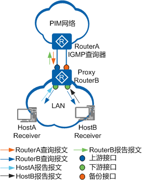

IGMP Proxy本身并没有检测机制，如果组播链路发生了故障，无法保证及时进行主、备链路的切换，可能造成较长时间的组播业务中断。通过IGMP Proxy与NQA联动可以解决此问题。IGMP Proxy与NQA测试例联动是利用NQA测试例检测端到端的链路状态，并根据NQA测试例的检测结果，进行主、备链路的切换，从而避免通信长时间中断。

### 查询者的作用：
查询者可以转发组播流量，通过这种方式可以避免组播流量的重复。为了保证组播可靠性，非查询者的路由器也会创建并维护组播组，同时非查询者需要监听查询者的存在，如果查询者在Hold timer时间内没有发送查询报文，非查询者会认为查询者已经故障，需要重新选举查询者。查询者会转发组播流量，同时每隔interval（60s）的时间发送查询报文。

## 7 IGMP Snooping监听

### 简介
IGMP Snooping (Internet Group Management Protocol
Snooping)是一种IPv4二层组播协议，通过侦听三层组播设备和用户主机之间发送的TGMP组播协议报文来维护组播报文的出接口信息，从而管理和控制组播数据报文在数据链路层的转发。

### 目的
在很多情况下，组播报文经过一些二层交换设备，尤其是在局域网环境里。

由于组播报文的目的地址为组播组地址，在二层设备上是学习不到这一类MAC表项的，因此组播报文就会在所有接口进行广播，和它在同一广播域内的组播成员和非组播成员都能收到组播报文。这样不但浪费了网络带宽，而且影响了网络信息安全。IGMP Snooping有效地解决了这个问题。

### 基本原理

当组播数据从三层组播设备Router转发下来以后，处于接入边缘的二层组播设备Switch负责将组播数据转发给用户主机。
* 当Switch没有运行IGMP Snooping时，组播数据在二层被广播；
* 当Switch运行了IGMP Snooping后，组播数据不会在二层广播，而是会被Switch发送给指定的接收者。

使能IGMP Snooping功能后，Switch会侦听主机和上游三层设备之间交互的IGMP报文，通过分析报文中携带的信息（报文类型、组播组地址、接收报文的接口等），建立和维护二层组播转发表，从而指导组播数据在数据链路层按需转发。

### 基本概念

如下图所示，三层设备Router从组播源接收数据并向下游转发，在二层组播设备SwitchA和SwitchB上分别运行IGMP Snooping，HostA、HostB和HostC为接收者主机（即组播组成员）。

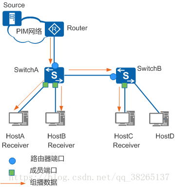

IGMP Snooping中的端口角色:

|端口角色	|作用	|如何生成|
|-|-|-|
|路由器端口（Router Port）如SwitchA和SwitchB上蓝色圆圈表示的接口。 说明： 路由器端口都是指二层组播设备上朝向组播路由器的接口，而不是指路由器上的接口。	|二层组播设备上朝向三层组播设备（DR或IGMP查询器）一侧的接口，二层组播设备从此接口接收组播数据报文。	|由协议生成的路由器端口叫做动态路由器端口。收到源地址不为0.0.0.0的IGMP普遍组查询报文或PIM Hello报文（三层组播设备的PIM接口向外发送的用于发现并维持邻居关系的报文）的接口都将被视为动态路由器端口。手工配置的路由器端口叫做静态路由器端口。|
|成员端口（Member Port）如SwitchA和SwitchB上黄色方框表示的接口。	|又称组播组成员端口，表示二层组播设备上朝向组播组成员一侧的端口，二层组播设备往此接口发送组播数据报文。	|由协议生成的成员端口叫做动态成员端口。收到IGMP Report报文的接口，二层组播设备会将其标识为动态成员端口。手工配置的成员端口叫做静态成员端口。|

路由器端口和成员端口，是二层组播转发表项中的一个重要信息：出接口。其中路由器端口相当于上游接口，成员端口相当于下游接口。通过协议报文学习到的端口，对应的为动态表项；而手工配置的端口，对应的为静态表项。

除了出接口外，每条表项还包括组播组地址和VLAN编号。

### 工作机制
二层组播设备运行了IGMP Snooping后，收到不同的IGMP协议报文会进行不同的处理，并在此过程中建立起二层组播转发表项。

### 当收到IGMP普遍组查询报文时：
* IGMP工作阶段：

普遍组查询
IGMP查询器定期向本地网段内的所有主机与路由器（目的地址为224.0.0.1）发送IGMP普遍组查询报文，以查询该网段有哪些组播组的成员。

* 处理方式：

    1. 向VLAN内除接收接口外的其他所有接口转发，并对接收接口做如下处理：
    2. 如果路由器端口列表中尚未包含该接口，则将其添加进去，并启动老化定时器。
    3. 如果路由器端口列表中已包含该动态路由器端口，则重置老化定时器。

> 收到IGMP普遍组查询报文时，动态路由器端口的老化定时器缺省为180秒，可以通过命令行配置。

### 当收到IGMP报告报文时：
* IGMP工作阶段：

成员报告阶段。有两种情况：

    1. 成员收到IGMP普遍组查询报文后，回应IGMP报告报文。
    2. 成员主动向IGMP查询器发送IGMP报告报文以声明加入该组播组。

* 处理方式：

向VLAN内所有路由器端口转发。从报文中解析出主机要加入的组播组地址，并对接收接口做如下处理：

    1. 如果不存在该组对应的转发表项，则创建转发表项，将该接口作为动态成员端口添加到出接口列表中，并启动老化定时器。
    2. 如果已存在该组对应的转发表项，但出接口列表中未包含该接口，则将该接口作为动态成员端口添加到出接口列表，并启动老化定时器。
    3. 如果已存在该组所对应的转发表项，且出接口列表中已包含该动态成员端口，则重置其老化定时器。

> 收到IGMP报告报文后，动态成员端口的老化定时器 = 健壮系数 x 普遍组查询间隔 + 最大响应时间。

### 当收到IGMP离开报文时：

* IGMP工作阶段：

成员离开组播组。有两个阶段：

    1. 运行IGMPv2或IGMPv3的成员发送IGMP离开报文，以通知IGMP查询器自己离开了某个组播组。
    2. IGMP查询器收到IGMP离开报文后，从中解析出组播组地址，并通过接收接口向该组播组发送IGMP特定组查询报文/IGMP特定源组查询报文。

* 处理方式：

判断离开的组是否存在对应的转发表项，以及转发表项出接口列表是否包含报文的接收接口：

    1. 如果不存在该组对应的转发表项，或者该组对应转发表项的出接口列表中不包含接收接口，二层组播设备不转发该报文，将其直接丢弃。
    2. 如果存在该组对应的转发表项，且转发表项的出接口列表中包含该接口，二层组播设备会将报文向VLAN内所有路由器端口转发。
    对于IGMP离开报文的接收接口（假定为动态成员端口），二层组播设备在其老化时间内：
    3. 如果从该接口收到了主机响应IGMP特定组/源组查询的报告报文，表示接口下还有该组的成员，于是重置其老化定时器。
    4. 如果没有从该接口收到主机响应IGMP特定组/源组查询的报告报文，则表示接口下已没有该组成员，则在老化时间超时后，将接口从该组的转发表项出接口列表中删除。

此外，当二层组播设备收到PIM Hello报文时，向VLAN内除接收接口外的其他所有接口转发，并对接收接口做如下处理：

    1. 如果路由器端口列表中已包含该动态路由器端口，则重置老化定时器。
    2. 如果路由器端口列表中尚未包含该接口，则将其添加进去，并启动老化定时器。

如果配置了静态路由器端口，二层组播设备收到IGMP报告和离开报文也会向静态路由器端口转发。如果配置了静态成员端口，则转发表项中会添加该接口为出接口。

当二层组播设备上建立了二层组播转发表项以后，二层组播设备接收到组播数据报文时，依据报文所属VLAN和报文的目的地址（即组播组地址）查找转发表项是否存在对应的“出接口信息”。如果存在，则将报文发送到相应的组播组成员端口和路由器端口；如果不存在，则丢弃该报文或将报文在VLAN内广播。

## 5 IGMP Spoofing欺骗

### 概述

在没有路由器的局域网中，IGMP Snooping无法生成端口成员列表，无法交换组播数据包。

交换机冒充路由器发送IGMP查询报文，主机会影后生成端口成员列表和组播地址转发表项。
