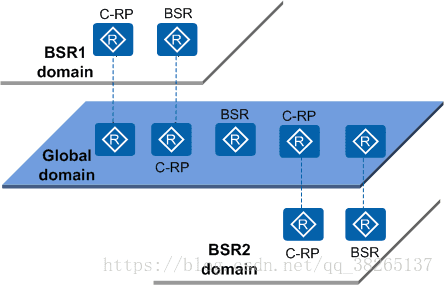
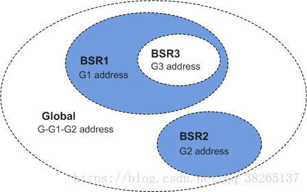
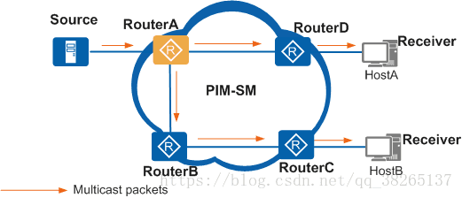

# 组播-PIM


> 需要补充PIM相关的报文格式与相关的流程图。根据课本上的来即可。


## 1 PIM简介

### 作用

PIM（Protocol Independent Multicast）称为协议无关组播。与单播路由协议无关。

作为组播路由解决方案，它直接利用单播路由表的路由信息，对组播报文执行RPF（Reverse Path Forwarding，逆向路径转发）检查，检查通过后创建组播路由表项，从而转发组播报文。

目前设备实际支持的PIM协议包括：PIM-DM（PIM-Dense Mode密集模式）、PIM-SM（PIM-Sparse Mode稀疏模式）。

### 组播分发树
PIM网络以组播组为单位在路由器上建立一点到多点的组播转发路径。由于组播转发路径呈现树型结构，也称为组播分发树MDT（Multicast Distribution Tree）。

组播分发树主要包括以下两种：

* 以组播源为根，组播组成员为叶子的组播分发树称为SPT（Shortest Path Tree）。SPT同时适用于PIM-DM网络和PIM-SM网络。
* 以RP（Rendezvous Point）为根，组播组成员为叶子的组播分发树称为RPT（RP Tree）。RPT适用于PIM-SM网络。

### PIM路由器

在接口上使能了PIM协议的路由器即为PIM路由器。在建立组播分发树的过程中，PIM路由器又分为以下几种：

* 叶子路由器：与用户主机相连的PIM路由器，但连接的用户主机不一定为组成员。
* 第一跳路由器：组播转发路径上，与组播源相连且负责转发该组播源发出的组播数据的PIM路由器。
* 最后一跳路由器：组播转发路径上，与组播组成员相连且负责向该组成员转发组播数据的PIM路由器。
* 中间路由器：组播转发路径上，第一跳路由器与最后一跳路由器之间的PIM路由器。

### PIM路由表项与转发流程
PIM路由表项即通过PIM协议建立的组播路由表项。PIM网络中存在两种路由表项：（S，G）路由表项或（ * ，G）路由表项。S表示组播源，G表示组播组， * 表示任意。

* （S，G）路由表项主要用于在PIM网络中建立SPT。对于PIM-DM网络和PIM-SM网络适用。
* （*，G）路由表项主要用于在PIM网络中建立RPT。对于PIM-SM网络适用。


PIM路由器上可能同时存在两种路由表项。当收到源地址为S，组地址为G的组播报文，且RPF检查通过的情况下，按照如下的规则转发：

* 如果存在（S，G）路由表项，则由（S，G）路由表项指导报文转发。
* 如果不存在（S，G）路由表项，只存在（ * ，G）路由表项，则先依照（ * ，G）路由表项创建（S，G）路由表项，再由（S，G）路由表项指导报文转发。

PIM路由表项中主要用于指导转发的信息如下：

* 组播源地址。
* 组播组地址。
* 上游接口：本地路由器上接收到组播数据的接口。
* 下游接口：将组播数据转发出去的接口。

## 2 PIM-DM

### 基本原理

PIM-DM使用“推（Push）模式”转发组播报文，一般应用于组播组成员规模相对较小、相对密集的网络。

在实现过程中，它会假设网络中的组成员分布非常稠密，每个网段都可能存在组成员。当有活跃的组播源出现时，PIM-DM会将组播源发来的组播报文扩散到整个网络的PIM路由器上，再裁剪掉不存在组成员的分支。

PIM-DM通过周期性的进行“扩散（Flooding）—剪枝（Prune）”，来构建并维护一棵连接组播源和组成员的单向无环SPT（Source Specific Shortest Path Tree）。

如果在下一次“扩散-剪枝”进行前，被裁剪掉的分支由于其叶子路由器上有新的组成员加入而希望提前恢复转发状态，也可通过嫁接（Graft）机制主动恢复其对组播报文的转发。

PIM-DM的关键工作机制包括**邻居发现、扩散、剪枝、嫁接、断言和状态刷新**。其中，扩散、剪枝、嫁接是构建SPT的主要方法。

### PIM报文

|报文类型	|类型ID	|报文作用|
|-|-|-|
|hello|	0	|发现，协商参数。维护邻居关系|
|register|1|组播源注册，单播发送|
|register stop|2|组播源注册停止，单播发送|
|jion/prune|	3	|加入/剪枝，J置位为1，表明为jion报文，p置位为1，表明为prune报文|
|bootstrap|4|BSR RP报文
|assert|	5	|断言|
|graft|	6	|剪枝，单播发送|
|graft ack|	7	|剪枝确认，单播发送|
|state-refresh|	9	|状态刷新|

### RPF逆向路径转发

为了避免多个路由器向同一个网段转发组播消息，需要进行逆向路径转发，避免向同一个路由器或同一个网段的重复转发。
1. 路由器检查组播报文的原地址。确定原地址的组播到达接口与原地址的单播到达接口是否一致。
2. 如果组播报文在可返回原地址的接口上，则RPF检查通过，报文被转发。
3. 如果RPF检查失败，则丢弃报文。

> RPF检查保证了SPT最短路径树的唯一性（即使以源节点为根通过OSPF计算的最短路径树），不会存在两个分支之间相互转发报文，不会形成环路。

### 邻居发现（Neighbor Discovery）：

PIM路由器上每个使能了PIM协议的接口都会对外发送Hello报文。封装Hello报文的组播报文的目的地址是224.0.0.13（表示同一网段中所有PIM路由器）、源地址为接口的IP地址、TTL数值为1。

Hello报文的作用：发现PIM邻居、协调各项PIM协议报文参数、维持邻居关系。

* 发现PIM邻居

    同一网段中的PIM路由器都必须接收目的地址为224.0.0.13的组播报文。这样直接相连的PIM路由器之间通过交互Hello报文以后，就可以彼此知道自己的邻居信息，建立邻居关系。

    只有邻居关系建立成功后，PIM路由器才能接收其他PIM协议报文，从而创建组播路由表项。

* 协调各项PIM协议报文参数

    Hello报文中携带多项PIM协议报文参数，主要用于PIM邻居之间PIM协议报文的控制。具体如下：

|参数|说明|
|-|-|
DR_Priority|表示各路由器接口竞选DR的优先级，优先级越高越容易获胜。|
Holdtime|表示保持邻居为可达状态的超时时间。如果在超时时间内没有收到PIM邻居发送的Hello报文，路由器则认为邻居不可达。|
LAN_Delay|表示共享网段内传输Prune报文的延迟时间。|
Neighbor-Tracking|表示邻居跟踪功能。|
Override-Interval|表示Hello报文中携带的否决剪枝的时间间隔。|

* 维持邻居关系

    PIM路由器之间周期性地发送Hello报文。如果Holdtime超时还没有收到该PIM邻居发出的新的Hello报文，PIM路由器就认为该邻居不可达，将其从邻居列表中清除。

    PIM邻居的变化将导致网络中组播拓扑的变化。如果组播分发树上的某上游邻居或下游邻居不可达，将导致组播路由重新收敛，组播分发树迁移。

### 扩散（Flooding）:

当PIM-DM网络中出现活跃的组播源之后，组播源发送的组播报文将在全网内扩散。当PIM路由器接收到组播报文，根据单播路由表进行RPF检查通过后，就会在该路由器上创建（S，G）表项，下游接口列表中包括除上游接口之外与所有PIM邻居相连的接口，后续到达的组播报文将从各个下游接口转发出去。

最后组播报文扩散到达叶子路由器，会出现以下两种情况：

* 若与该叶子路由器相连用户网段上存在组成员，则将与该网段相连的接口加入（S，G）表项的下游接口列表中，后续的组播报文会向组成员转发。
* 若与该叶子路由器相连用户网段上不存在组成员，且不需要向其下游PIM邻居转发组播报文，则执行剪枝动作。

### 剪枝（Prune）：

当PIM路由器接收到组播报文后，RPF检查通过，但是下游网段没有组播报文需求。此时PIM路由器会向上游发送剪枝报文，通知上游路由器禁止相应下游接口的转发，将其从（S，G）表项的下游接口列表中删除。剪枝操作由叶子路由器发起，逐跳向上，最终组播转发路径上只存在与组成员相连的分支。

路由器为被裁剪的下游接口启动一个剪枝定时器，定时器超时后接口恢复转发。组播报文重新在全网范围内扩散，新加入的组成员可以接收到组播报文。随后，下游不存在组成员的叶子路由器将向上发起剪枝操作。通过这种周期性的扩散-剪枝，PIM-DM周期性的刷新SPT。

当下游接口被剪枝后：

* 如果下游叶子路由器有组成员加入，并且希望在下次“扩散-剪枝”前就恢复组播报文转发，则执行嫁接动作。
* 如果下游叶子路由器一直没有组成员加入，希望该接口保持抑制转发状态，则执行状态刷新动作。

### 嫁接（Graft）：

PIM-DM通过嫁接机制，使有新组成员加入的网段快速得到组播报文。叶子路由器通过IGMP了解到与其相连的用户网段上，组播组G有新的组成员加入。随后叶子路由器会向上游发送Graft报文，请求上游路由器恢复相应出接口转发，将其添加在（S，G）表项下游接口列表中。

嫁接过程从叶子路由器开始，到有组播报文到达的路由器结束。

### 剪枝否决
* 下游路由器RouteB和RouterC，当RouterB向上游路由器Router A发送剪枝消息，因为RouterA通过Hello报文发现下游还有其他的邻居，不确定是否剪枝，会等待一段时间。
* RouterC也受到了剪枝消息，如果其存在（S,G)的转发表项，表示其不想被剪枝，向上游RouterA发送剪枝否决消息Join报文。
* RouterA收到加入消息后，继续向该端口发送组报文忽略RouterB的剪枝消息。

### 状态刷新（State Refresh）：

在PIM-DM网络中，为了避免被裁剪的接口因为“剪枝定时器”超时而恢复转发，离组播源最近的第一跳路由器会周期性地触发State Refresh报文在全网内扩散。收到State Refresh报文的PIM路由器会刷新剪枝定时器的状态。被裁剪接口的下游叶子路由器如果一直没有组成员加入，该接口将一直处于抑制转发状态。

### 断言（Assert）：
当一个网段内有多个相连的PIM路由器RPF检查通过向该网段转发组播报文时，则需要通过断言机制来保证只有一个PIM路由器向该网段转发组播报文。

PIM路由器在接收到邻居路由器发送的相同组播报文后，会以组播的方式向本网段的所有PIM路由器发送Assert报文，其中目的地址为永久组播组地址224.0.0.13。其它PIM路由器在接收到Assert报文后，将自身参数与对方报文中携带的参数做比较，进行Assert竞选。竞选规则如下：

1. 单播路由协议优先级较高者获胜。
2. 如果优先级相同，则到组播源的开销较小者获胜。
3. 如果以上都相同，则下游接口IP地址最大者获胜。

根据Assert竞选结果，路由器将执行不同的操作：

* 获胜一方的下游接口称为Assert Winner，将负责后续对该网段组播报文的转发。
* 落败一方的下游接口称为Assert Loser，后续不会对该网段转发组播报文，PIM路由器也会将其从（S，G）表项下游接口列表中删除。


Assert竞选结束后，该网段上只存在一个下游接口，只传输一份组播报文。所有Assert Loser可以周期性地恢复组播报文转发，从而引发周期性的Assert竞选。

## 3 PIM-SM(ASM模型)

### 基本原理（ASM模型）：
在ASM（Any-Source Multicast）模型中，PIM-SM使用“拉（Pull）模式”转发组播报文，一般应用于组播组成员规模相对较大、相对稀疏的网络。基于这一种稀疏的网络模型，它的实现方法是：

* 在网络中维护一台重要的PIM路由器：**汇聚点RP**（Rendezvous Point），可以为随时出现的组成员或组播源服务。网络中所有PIM路由器都知道RP的位置。负责构造RPT，组播数据沿RPT发送给接受者。
* 当网络中出现组成员（用户主机通过IGMP加入某组播组G）时，最后一跳路由器向RP发送Join报文，逐跳创建（ * ，G）表项，生成一棵以RP为根的**RPT**。
* 当网络中出现活跃的组播源（组播源向某组播组G发送第一个组播数据）时，第一跳路由器将组播数据封装在Register报文中**单播**发往RP，在RP上创建（S，G）表项，注册源信息。达到RP后建立最短路径树SPT。组播源沿SPT发向RP，组播数据到达RP后沿汇聚树RPT发送给接收者。

在ASM模型中，PIM-SM的关键机制包括**邻居发现、DR竞选、RP指定、RPT构建、组播源注册、SPT切换、断言**；同时也可通过配置BSR（Bootstrap Router）管理域来实现单个PIM-SM域的精细化管理。

### 邻居发现与DR选取
在组播源或组成员所在的网段，通常同时连接着多台PIM路由器。这些PIM路由器之间通过交互Hello报文成为PIM邻居，Hello报文中携带DR优先级和该网段接口地址。PIM路由器将自身条件与对方报文中携带的信息进行比较，选举出DR来负责源端或组成员端组播报文的收发。竞选规则如下：

* DR优先级较高者获胜（网段中所有PIM路由器都支持DR优先级）。
* 如果DR优先级相同或该网段存在至少一台PIM路由器不支持在Hello报文中携带DR优先级，则IP地址较大者获胜。

如果当前DR出现故障，将导致PIM邻居关系超时，其他PIM邻居之间会触发新一轮的DR竞选。

在ASM模型中，DR主要作用如下：

* 在连接组播源的共享网段，由DR负责向RP发送Register注册报文。与组播源相连的DR称为源端DR。
* 在连接组成员的共享网段，由DR负责向RP发送Join加入报文。与组成员相连的DR称为组成员端DR。

### 汇聚点RP指定
汇聚点RP为网络中一台重要的PIM路由器，用于处理源端DR注册信息及组成员加入请求，网络中的所有PIM路由器都必须知道RP的地址，类似于一个供求信息的汇聚中心。

一个RP可以同时为多个组播组服务，但一个组播组只能对应一个RP。目前可以通过以下方式配置RP：

* 静态RP：在网络中的所有PIM路由器上配置相同的RP地址，静态指定RP的位置。

* 动态RP：在PIM域内选择几台PIM路由器，配置C-RP（Candidate-RP，候选RP）来动态竞选出RP。同时，还需要通过配置BSR（Bootstrap Router 自举路由器）负责PIM-SM域的管理和C-BSR（Candidate-BSR，候选BSR），来收集C-RP的通告信息，向PIM-SM域内的所有PIM路由器发布。

C-BSR在竞选的时候，开始时每个C-BSR都认为自己是BSR，向全网发送Bootstrap报文。Bootstrap报文中携带C-BSR地址、C-BSR的优先级。每一台PIM路由器都收到所有C-BSR发出的Bootstrap报文，通过比较这些C-BSR信息，竞选产生BSR。竞选规则如下：

* 优先级较高者获胜（优先级数值越大优先级越高）。
* 如果优先级相同，IP地址较大者获胜。


C-RP的竞选过程如下：

* C-RP向BSR发送Advertisement报文，报文中携带C-RP地址、服务的组范围和C-RP优先级。

* BSR将这些信息汇总为RP-Set，封装在Bootstrap报文中，发布给全网的每一台PIM-SM路由器。

* 各PIM路由器根据RP-Set，使用相同的规则进行计算和比较，从多个针对特定组的C-RP中竞选出该组RP。规则如下：
​

    * 与用户加入的组地址匹配的C-RP服务的组范围掩码最长者获胜。
    * 如果以上比较结果相同，则C-RP优先级较高者获胜（优先级数值越小优先级越高）。
    * 如果以上比较结果都相同，则执行Hash函数，计算结果较大者获胜。
    * 如果以上比较结果都相同，则C-RP的IP地址较大者获胜


由于所有PIM路由器使用相同的RP-Set和竞选规则，所以得到的组播组与RP之间的对应关系也相同。PIM路由器将“组播组—RP”对应关系保存下来，指导后续的组播操作。

### 共享树RPT构建
PIM-SM RPT是一棵以RP为根，以存在组成员关系的PIM路由器为叶子的组播分发树。

1. 接受者加入组播G是，通过IGMP报文通知直连DR
2. DR掌握了组播组G的接受者信息后，向RP方向逐跳发送Join报文。
3. 在RPT构建过程中，PIM路由器在发送Join报文时，会进行RPF检测查找到达RP的单播路由，单播路由的出接口为上游接口，下一跳为RPF邻居。Join报文从组成员端DR开始逐跳发送，直至到RP。然后在每一跳路由器转发表中添加(*,G)表项。

### 组播源注册与注册停止
在PIM-SM网络中，任何一个新出现的组播源都必须首先在RP处“注册”，继而才能将组播报文传输到组成员。具体过程如下：

1. 组播源将组播报文发给源端DR。
2. 源端DR接收到组播报文后，将其封装在Register报文中，发送给RP。
3. RP接收到Register报文，将其解封装，建立（S，G）表项，并将组播数据沿RPT发送到达组成员。

### RPT向SPT切换

在PIM-SM网络中，一个组播组只对应一个RP，只构建一棵RPT。在未进行SPT切换的情况下，所有发往该组的组播报文都必须先封装在注册报文中发往RP，RP解封装后，再沿RPT分发。RP是所有组播报文必经的中转站，当组播报文速率逐渐变大时，对RP形成巨大的负担。为了解决此问题，PIM-SM允许RP或组成员端DR通过触发SPT切换来减轻RP的负担。

* RP触发SPT切换

    RP收到源端DR的注册报文后，将封装在Register报文中的组播报文沿RPT转发给组成员，同时RP会向源端DR逐跳发送Join报文。发送过程中在PIM路由器创建（S，G）表项，从而建立了RP到源的SPT。

    SPT树建立成功后，源端DR直接将组播报文转发到RP，使源端DR和RP免除了频繁的封装与解封装。

* 组成员端DR触发SPT切换


STP切换机制：组成员端DR周期性检测组播报文的转发速率，一旦发现（S，G）报文的转发速率超过阈值，则触发SPT切换：

    1. 组成员端DR逐跳向源端DR逐跳发送Join报文并创建（S，G）表项，建立源端DR到组成员DR的SPT。
    2. SPT建立后，组成员端DR会沿着RPT逐跳向RP发送剪枝报文，删除（*，G）表项中相应的下游接口。剪枝结束后，RP不再沿RPT转发组播报文到组成员端。
    3. 如果SPT不经过RP，RP会继续向源端DR逐跳发送剪枝报文，删除（S，G）表项中相应的下游接口。剪枝结束后，源端DR不再沿“源端DR-RP”的SPT转发组播报文到RP。

> 缺省情况下，设备一般未设置组播报文转发速率的阈值，RP或者组成员端DR在接收到第一份组播报文时都会触发各自的SPT切换。

## 4 BSR管理域：
为了实现网络管理精细化，可以选择将一个PIM-SM网络划分为多个BSR管理域和一个Global域。这样一方面可以有效地分担单一BSR的管理压力，另一方面可以使用私有组地址为特定区域的用户提供专门服务。

每个BSR管理域中维护一个BSR，为某一特定地址范围的组播组服务。Global域中维护一个BSR，为所有剩余的组播组服务。

下文将从地域空间、组地址范围、组播功能三个角度分析BSR管理域和Global域的关系。

### 地域空间：




如上图所示，对于有相同组地址的不同管理域，各BSR管理域所包含的PIM路由器互不相同，同一PIM路由器不能同时属于多个BSR管理域。各BSR管理域在地域上相互独立，且相互隔离。BSR管理域是针对特定地址范围的组播组的管理区域，属于此范围的组播报文只能在本管理域内传播，无法通过BSR管理域边界。

Global域包含PIM-SM网络内的全部PIM路由器。不属于任意BSR管理域的组播报文，可以在整个PIM网络范围内传播。

### 组地址范围：



每个BSR管理域为特定地址范围的组播组提供服务，不同的BSR管理域服务的组播组范围可以重叠。该组播地址只在本BSR管理域内有效，相当于私有组地址。如上图所示，BSR1域和BSR3域对应的组地址范围出现重叠。

不属于任何BSR管理域的组播组，一律属于Global域的服务范围。如上图所示，Global域组地址范围是除G1、G2之外的G-G1-G2。

### 组播功能：

Global域和每个BSR管理域都包含针对自己域的C-RP和BSR设备，这些设备在行使相应功能时，仅在本域内有效。即BSR机制和RP竞选在各管理域之间是隔离的。

每个BSR管理域都有自己的边界，该管理域的组播信息（C-RP宣告报文、BSR自举报文等）不能跨越域传播。同时Global域的组播信息可以在整个Global域内传递，可以穿越任意BSR管理域。

## 5 PIM-SM（SSM模型）

### 基本原理（SSM模型）

SSM模型是借助PIM-SM的部分技术和IGMPv3/MLDv2来实现的，无需维护RP、无需构建RPT、无需注册组播源，可以直接在源与组成员之间建立SPT。

SSM的特点是网络用户能够预先知道组播源的具体位置。因此用户在加入组播组时，可以明确指定从哪些源接收信息。组成员端DR了解到用户主机的需求后，直接向源端DR发送Join报文。Join报文逐跳向上传输，在源与组成员之间建立SPT。

在SSM模型中，PIM-SM的关键机制包括邻居发现、DR竞选、构建SPT。

### Anycast RP:

配置基于PIM协议的Anycast RP功能时，当RP收到源DR发送的注册报文后，对注册报文的源地址进行判断，如果是从源DR发送过来的，将注册报文转发给Anycast RP对等体，如果注册报文是从Anycast RP对等体发送过来的，则不进行转发。

RP转发注册报文时，需要将源地址替换为Anycast RP本地地址，目的地址替换为Anycast RP对等体地址。从而达到Anycast RP之间相互学习源组信息的目的。

Anycast RP集合的成员与外部均建立MSDP对等体；
将Anycast RP集合中的RP分为两部分，其中一部分与外部建立MSDP对等体，另外一部分不建立MSDP对等体，当与外部建立了MSDP对等体的RP收到MSDP SA报文时，转换为注册报文发送给其它未建立MSDP对等体的RP。

* 注意事项

每个Anycast RP最多可以配置16个对等体。

在同一PIM SM域内配置Anycast RP，Anycast RP之间逻辑上需要配置为全连接结构，即任意两两Anycast RP之间配置为Anycast RP对等体。

* 通过Anycast RP，可以实现：

    * RP路径最优：组播源向距离最近的RP进行注册，建立路径最优的SPT；接收者向距离最近的RP发起加入，建立路径最优的RPT。
    * RP间的负载分担：每个RP上只需维护PIM-SM域内的部分源/组信息、转发部分的组播数据，从而实现了RP间的负载分担。
    * RP间的冗余备份：当某RP失效后，原先在该RP上注册或加入的组播源或接收者会自动选择就近的RP进行注册或加入操作，从而实现了RP间的冗余备份。

## 6 PIM BFD和PIM GR

### PIM BFD
为了减小设备故障对业务的影响，提高网络的可靠性，网络设备需要快速检测到与相邻设备间的通信故障，以便及时采取措施，保证业务继续进行。

BFD（Bidirectional Forwarding Detection）检测机制可提供毫秒级的快速检测，并采用单一机制对所有类型的介质、协议层进行检测，实现全网统一的检测机制。其检测原理是在两个系统间建立BFD会话，并沿它们之间的路径周期性发送BFD检测报文，如果一方在检测周期内没有收到BFD检测报文，则认为该路径发生了故障。

### 在PIM中的应用：
在组播的应用中，如果共享网段上的当前DR或Assert winner发生故障，其他PIM邻居会等到邻居关系超时或Assert timer超时才触发新一轮的DR竞选或Assert竞选过程，导致组播数据传输中断，中断的时间将不小于邻居关系的超时时间或Assert timer超时时间，通常是秒级。

PIM BFD能够在毫秒级内检测共享网段内的链路状态，快速响应PIM邻居故障。如果配置了PIM BFD功能的接口在检测周期内没有收到当前DR或Assert winner发送的BFD检测报文，则认为当前DR或Assert winner发生故障，BFD快速把会话状态通告给RM，再由RM通告给PIM。PIM模块触发新一轮的DR竞选或Assert竞选过程，而不是等到邻居关系超时或Assert timer超时，从而缩小组播数据传输的中断时间，提高组播数据传输的可靠性。

### PIM GR：
滑重启GR（Graceful Restart）属于高可靠性HA（High Availability）技术的一种，实现协议重启时业务的不间断转发（Multicast Non-Stop Forwarding）能力。PIM GR是一种组播协议GR。在具有双主控板的设备上，PIM GR可以在设备进行主备倒换时实现用户组播流量的正常转发。

目前，仅PIM-SM（ASM模型）与PIM-SM（SSM模型）支持PIM GR，PIM-DM不支持PIM GR。

### 基本原理
PIM GR依赖于单播GR。设备进行主备倒换期间，新主控板的PIM协议需要从下游邻居重新学习PIM加入状态，同时还需要从IGMP成员主机学习加入的组成员。新主控板的PIM协议通过以上过程完成如下动作：

* 重新计算PIM组播路由表项。
* 维持下游邻居的加入状态。
* 更新转发平面的组播路由表项。

通过PIM GR，设备可以达到主备倒换后快速恢复新的主用主控板的PIM路由表项及刷新接口板组播转发表项的目的，从而最大限度地减少主备倒换对用户组播流量转发的影响。

### 工作机制：
PIM GR建立在单播GR的基础上，整个PIM GR的过程分为三个阶段：开始阶段（GR_START）、同步阶段（GR_SYNC）和完成阶段（GR_END）。




* GR_START

RouterA发生主备倒换，PIM协议启动GR定时器，PIM GR进入开始阶段，同时单播开始进行GR。

PIM协议向所有使能PIM-SM的接口发送携带新的Generation ID的Hello报文。

RouterA的下游邻居RouterB、RouterD发现RPF邻居的Generation ID改变，向RouterA重新发送Join/Prune报文。

若网络中使用动态RP，当网络中的邻居收到Generation ID改变的Hello报文后，向RouterA单播发送BSR报文，恢复RouterA的BSR及RP信息。

RouterA通过接收下游RouterB、RouterD发送的Join/Prune报文，在空的入接口表中创建PIM路由表项，记录下游的加入信息。

在此期间，转发模块转发表项保持不变，维持组播业务数据的转发。

* GR_SYNC

单播GR结束，PIM GR进入同步阶段，根据单播路由信息建立组播分发树，恢复PIM路由表项的入接口，更新到源或到RP的加入队列，并通知组播转发模块更新转发表。

* GR_END

GR定时器超时，PIM协议完成GR，并通知组播转发模块。组播转发模块老化GR期间未更新的转发表项。

## 7 PIM补充知识
### Hello消息作用：
PIM中的hello报文发送间隔是30s，邻居的超时时间为3.5（105s）倍的hello interval时间。

在PIM-DM网络中，刚启动的组播路由器需要使用Hello消息来发现邻居，并维护邻居关系。路由器之间周期性的发送Hello 消息来构建和维护SPT数。

Pim timer hello interval， 在接口视图下配置发送hello消息的时间间隔。hello消息默认周期是30s。

除了维护邻居关系外，Hello消息还具有一个重要的功能就是在多个路由器网段中选举DR指定路由器。DR充当IGMPv1查询器。在IGMP概述中已经提到过IGMPv1中查询器的选举路由组播协议决定。

在PIM-DM中各路由器通过比较hello消息中携带的优先级和IP地址，为多路由器网段选举指定路由器DR，充当IGMPv1的查询器。

当DR出现故障时，接收hello消息将会超时，邻居路由器之间会触发新的DR选举过程。

pim hello-opthion holdtime interval在接口视图下配置hello消息超时时间。默认情况下超时时间为105s.

PIM DR的选举过程：

* 优先级大的。（默认为1）
* IP地址大的。

> 注：在PIM-DM模式下，DR只用于充当IGMPv1版本的查询者，没有其他用途。

### RPF检测的顺序：
* 优先级优先（默认）:

    1. 如果同时存在单播和组播路由（用于RPF检查的组播路由条目），比较优先级，优先级越小越优。
    2. 如果优先级一样，组播静态>MBGP>单播（默认情况下组播静态优先级为1，MBGP优先级为255，单播路由需要视协议而定。）
    3. 如果都是单播路由，比较路由的掩码长度，掩码查毒越长越优。
    4. 如果掩码长度一样，比较下一跳的IP地址，IP地址越大越优。

* 掩码长度优先：

    1. 如果同时存在单播和组播路由，比较掩码长度，掩码长度越长越优。
    2. 如有掩码长度一样，比较路由协议优先级，优先级越小越优。
    3. 如果优先级一样，组播静态>MBGP>单播。
    4. 如果都是单播路由，比较下一跳的IP地址，IP地址越大越优。

### Assert

利用Assert选举出广播网中的winner和loser，winner在广播网中只能有一个，loser可以有多个。只有weinner可以装发组播流量，而loser只能被动监听winner状态，而不能发送组播流。

* 什么情况下才会触发assert机制？

如果下游接口接受到自己发送的组播流，就会触发assert选举。

* Assert报文中携带的内容：

    1. 包含Assert报文发送者到达组播源所使用的路由协议优先级。
    2. 包含Assert报文发送者到达组播源的距离（metric）。
    3. 包含Assert报文发送者的IP地址。

* Assert的选举过程：

    1. 比较发送者到达组播路由协议的优先级，越小越优。
    2. 如果优先级一样， 比较到达组播源的距离（metric），距离越小越优。
    3. 如果metric也一样，比较报文发送者的IP地址，IP地址越大越优。

### RP
在PIM-SM组播网络里，当当共享树树根的节点称为RP（Rendezovous Ponit）。

* RP的作用：

    1. 共享树里所有组播流都通过RP装发到接收者。
    2. RP可以负责几个或者所有组播组的转发，网络中可以有一个或过个RP。用户通过配置命令，可以限制RP只为IP地址在一定范围的组播组服务。一个RP可以同时为多个组播组服务，但一个组播组只能对应一个RP。所有该组成员和向该组播发送数据的组播源都向唯一的RP汇聚。

* RP的发现：

    1. 静态RP：在PIM域中所有PIM路由器上逐一进行配置，静态指定RP。
    ```
    static-rp rp-Address //指定静态RP的IP地址。
    ```

    2. 动态RP：在PIM域内选择几台PIM路由器，配置称为C-RP(Candidate-RP),最后从C-RP中竞选产生RP。
    使用动态RP，必须同时配置C-BSR（Candidate-BootStarp Router）。由C-BSR竞选产生BSR。

RP是PIM-SM域中的核心路由器，在小型并且简单的网络中，组播信息量少，全网络仅依靠给一个RP进行信息装发即可，此时可以在SM域中个路由器上静态指定RP位置。但是更多的情况下，PIM-SM网络规模都很大，通过RP转发的组播信息量巨大，为了缓解RP的负担同时优化共享树的拓扑结构，不同组播组应该对应不同的RP，此时就需要自举机制来动态选举RP，配置自举路由器BSR（BootStrap ROuter）。

### BSR

第一步：需要在组播网络中选举BSR，在组播网络中可以指定多个C—BSR（候选BSR），多个C-BSR之间需要进行比较，选举出一台BSR设备。在一个组播网络中只能有一台BSR，但可以有多台C-BSR。

* BSR的选举过程：

    1. 比较优先级，优先级越大优越。（默认优先级为0）
    2. 如果优先级一样，比较IP地址，IP地址越大越优。

> 注：BSR只负责收集C-RP的信息，然后利用BSR报文通告到整个组播网络，最终的RP选举由叶路由器决定。

* RP的选举过程：

    1. 比较C-RP可以负责的组播组掩码长度，掩码长度越长越优。
    2. 如果组播掩码长度一致，比较C-RP的优先级，优先级越小越优。（默认优先级为0）
    3. 如果优先级也一样，比较HASH值，hash值越大越优。HASH值的计算涉及：组地址、Hash Mask（由BSR通告）、C-RP地址。