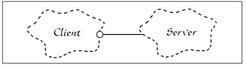
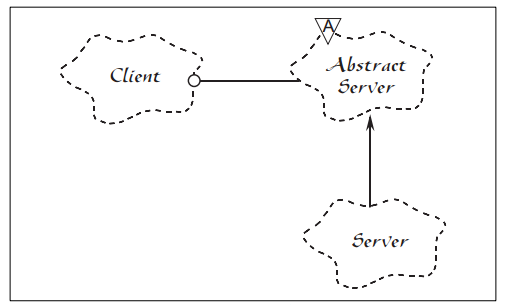

## 1 开放封闭原则

> OCP（Open Closed Principle）

### 为什么

> "所有系统在其生命周期中都会进行变化，只要系统要开发一个版本以上这一点就需时刻记住。"
> 
>   All systems change during their life cycles. This must be borne in mind when developing systems expected to last longer than the first version.


在面向对象的设计中有很多流行的思想，比如说
1. "所有的成员变量都应该设置为私有（Private）"
2. "要避免使用全局变量（Global Variables）"
3. "使用运行时类型识别（RTTI：Run Time Type Identification，例如dynamic_cast）是危险的"

那么，这些思想的源泉是什么？为什么它们要这样定义？这些思想总是正确的吗？本篇文章将介绍这些思想的基础：开放封闭原则（Open Closed Principle）。

那么我们到底如何才能构建一个稳定的设计来面对这些变化，以使软件生命周期持续的更长呢？

### 是什么
> "软件实体（类、模块、函数等）应对扩展开放，但对修改封闭。"。
> 
>   **Software entities (classes, modules, functions, etc.) should be open for extension, but closed for modification.**


当一个需求变化导致程序中多个依赖模块都发生了级联的改动，那么这个程序就展现出了我们所说的"坏设计（bad design）"的特质。应用程序也相应地变得脆弱、僵化、无法预期和无法重用。开放封闭原则（Open Closed Principle）即为解决这些问题而产生，它强调的是你设计的模块应该从不改变。当需求变化时，你可以通过添加新的代码来扩展这个模块的行为，而不去更改那些已经存在的可以工作的代码。

开放封闭原则（Open Closed Principle）描述符合开放封闭原则的模块都有两个主要特性：

1. **它们 "面向扩展开放（Open For Extension）"。** 也就是说模块的行为是能够被扩展的。当应用程序的需求变化时，我们可以使模块表现出全新的或与以往不同的行为，以满足新的需求。

2. **它们 "面向修改封闭（Closed For Modification）"。** 模块的源代码是不能被侵犯的，任何人都不允许修改已有源代码。


### 怎么做
> 抽象是关键。
> 
>   **Abstraction is the Key.**

在使用面向对象设计技术时，可以创建固定的抽象和一组无限界的可能行为来表述。这里的抽象指的是抽象基类，而无限界的可能行为则由诸多可能衍生出的子类来表示。为了一个模块而篡改一个抽象类是有可能的，而这样的模块则可以对修改封闭，因为它依赖于一个固定的抽象。然后这个模块的行为可以通过创建抽象的衍生类来扩展。

## 2.1 示例：Client/Server引用关系

> 图1 展示了一个简单的且不符合开放封闭原则的设计。


Client 和 Server 类都是具体类（Concrete Class）。 这里 Client 类使用了 Server 类的服务。如果我们想让 Client对象使用一个不同的 Server 对象，那么必须修改 Client 类以使用新的 Server类和对象。

> 图 2 中展示了符合开放封闭原则的相应设计。



在这个示例中，AbstractServer 类是一个抽象类，并包含一个纯虚成员函数。Client类依赖了这个抽象，但 Client 类将使用衍生的 Server 类的对象实例。如果我们需要Client 对象使用一个不同的 Server 类，则可以从 AbstractServer类衍生出一个新的子类，而 Client 类则依然保持不变。


## 2.2 示例：Shape 抽象

考虑下面这个例子。我们有一个应用程序需要在标准 GUI窗口上绘制圆形（Circle）和方形（Square）。圆形和方形必须以特定的顺序进行绘制。圆形和方形会被创建在同一个列表中，并保持适当的顺序，而程序必须能够顺序遍历列表并绘制所有的圆形和方形。

> 在 C语言中，使用过程化技术是无法满足开放封闭原则的。我们可能会通过下面代码显示的方式来解决该问题。

```
 1 enum ShapeType {circle, square};
 2 
 3 struct Shape 
 4 {
 5     ShapeType itsType;
 6 };
 7 
 8 struct Square 
 9 {
10     ShapeType itsType;
11     double itsSide; 
12     Point itsTopLeft;
13 };
14 
15 struct Circle 
16 {
17     ShapeType itsType;
18     double itsRadius; 
19     Point itsCenter;
20 };
21 
22 void DrawSquare(struct Square*);
23 void DrawCircle(struct Circle*);
24 typedef struct Shape *ShapePointer;
25 
26 void DrawAllShapes(ShapePointer list[], int n)
27 {
28     int i;
29     for (i=0; i<n; i++)
30     {
31         struct Shape* s = list[i];
32         switch (s->itsType)
33         {
34             case square:
35                 DrawSquare((struct Square*)s);
36                 break;
37             case circle:
38                 DrawCircle((struct Circle*)s);
39                 break;
40         }
41     }
42 }
```

在这里我们看到了一组数据结构定义，这些结构中除了第一元素相同外，其他都不同。通过第一个元素的类型码来识别该结构是在表示一个圆形（Circle）还是一个方形（Square）。函数DrawAllShapes 遍历了数组中的结构指针，检查类型码然后调用相匹配的函数（DrawCircle
或 DrawSquare）。

这里函数 DrawAllShapes 不符合开放封闭原则，因为它无法保证对新的 Shape
种类保持封闭。如果我们想要扩展这个函数，使其能够支持一个图形列表并且包含三角形（Triangle）定义，则我们将不得不修改这个函数。事实上，每当我们需要绘制新的图形种类时，我们都不得不修改这个函数。


> 下面这段代码展示了符合开放封闭原则的 Cicle/Square 问题的一个解决方案。

```java
 1   public abstract class Shape
 2   {
 3     public abstract void Draw();
 4   }
 5 
 6   public class Circle : Shape
 7   {
 8     public override void Draw()
 9     {
10       // draw circle on GUI
11     }
12   }
13 
14   public class Square : Shape
15   {
16     public override void Draw()
17     {
18       // draw square on GUI
19     }
20   }
21 
22   public class Client
23   {
24     public void DrawAllShapes(List<Shape> shapes)
25     {
26       foreach (var shape in shapes)
27       {
28         shape.Draw();
29       }
30     }
31   }
```

在这个例子中，我们创建了一个 Shape 抽象类，这个抽象类包含一个纯虚函数 Draw。而Circle 和 Square 都衍生自 Shape 类。

注意在这里如果我们想扩展 DrawAllShapes函数的行为来绘制一个新的图形种类，我们所需要做的就是增加一个从 Shape类衍生的子类。而DrawAllShapes 函数则无需进行修改。因此DrawAllShapes符合了开放封闭原则，它的行为可以不通过对其修改而扩展。

在比较现实的情况中，Shape类可能包含很多个方法。但是在应用程序中增加一个新的图形仍然是非常简单的，因为所需要做的仅是创建一个衍生类来实现这些函数。同时，我们也不再需要在应用程序内查找所有需要修改的位置了。

因为更改符合开放封闭原则的程序是通过增加新的代码，而不是修改已存在的代码，之前描述的那种级联式的更改也就不存在了。

## 3 封闭
### **策略性的闭合（Strategic Closure）**

要明白程序是不可能 100% 完全封闭的。例如，试想上面的 Shape
示例，如果我们现在决定所有的 Circle 都应该在 Square 之前先进行绘制，则DrawAllShapes 函数将会发生什么呢？DrawAllShapes
函数是不可能对这样的变化保持封闭的。通常来说，无论模块的设计有多封闭，总是有各种各样的变化会打破这种封闭。

因此，完全闭合是不现实的，所以必须讲究策略。也就是说，**程序设计师必须甄别其设计对哪些变化封闭**。这需要一些基于经验的预测。有经验的设计师会很好的了解用户和所在的行业，以判断各种变化的可能性。然后可以确定对最有可能的变化保持开放封闭原则。

### **使用抽象来获取显示地闭合**

那我们该如何使 DrawAllShapes函数对绘制逻辑中的排序的变化保持闭合呢？要记住闭合是基于抽象的。因此，为了使DrawAllShapes对排序闭合，则我们需要对排序进行某种程度的抽象。上述例子中关于排序的一个特例就是某种类别的图形需要在其他类别的图像之前进行绘制。

一个排序策略就是，给定任意两个对象，可以发现哪一个应当被先绘制。因此，我们可以在Shape 中定义一个名为 Precedes 的方法，它可以接受另一个 Shape 作为参数并返回一个bool 类型的结果。如果结果为 true 则表示接收调用的 Shape 对象应排在被作为参数的Shape 对象的前面。

我们可以使用重载操作符技术来实现这样的比较功能。这样通过比较我们就可以得到两个Shape 对象的相对顺序，然后排序后就可以按照顺序进行绘制。

```java
 1   public abstract class Shape
 2   {
 3     public abstract void Draw();
 4 
 5     public bool Precedes(Shape another)
 6     {
 7       if (another is Circle)
 8         return true;
 9       else
10         return false;
11     }
12   }
13 
14   public class Circle : Shape
15   {
16     public override void Draw()
17     {
18       // draw circle on GUI
19     }
20   }
21 
22   public class Square : Shape
23   {
24     public override void Draw()
25     {
26       // draw square on GUI
27     }
28   }
29 
30   public class ShapeComparer : IComparer<Shape>
31   {
32     public int Compare(Shape x, Shape y)
33     {
34       return x.Precedes(y) ? 1 : 0;
35     }
36   }
37 
38   public class Client
39   {
40     public void DrawAllShapes(List<Shape> shapes)
41     {
42       SortedSet<Shape> orderedList =
43         new SortedSet<Shape>(shapes, new ShapeComparer());
44 
45       foreach (var shape in orderedList)
46       {
47         shape.Draw();
48       }
49     }
50   }
```
这达成了排序 Shape对象的目的，并可按照适当的顺序进行排序。但我们仍然还没有一个合适的排序抽象。以现在这种情况，单独的Shape 对象将不得不覆写 Precedes 方法来指定顺序。这将如何工作呢？我们需要在
Precedes 中写什么样的代码才能确保 Circle 能够在 Square 之前绘制呢？

```java
1     public bool Precedes(Shape another)
2     {
3       if (another is Circle)
4         return true;
5       else
6         return false;
7     }
```

可以看出，这个函数不符合开放封闭原则。无法使其对新衍生出的 Shape
子类保持封闭。每次当一个新的 Shape 衍生类被创建时，这个方法将总是被修改。

### **使用 "数据驱动（Data Driven）" 闭合**

使用表驱动（Table Driven）方法能够达成对 Shape
衍生类的闭合，而不会强制修改每个衍生类。下面展示了一种可能的设计。

```
 1     private Dictionary<Type, int> _typeOrderTable = new Dictionary<Type, int>();
 2 
 3     private void Initialize()
 4     {
 5       _typeOrderTable.Add(typeof(Circle), 2);
 6       _typeOrderTable.Add(typeof(Square), 1);
 7     }
 8 
 9     public bool Precedes(Shape another)
10     {
11       return _typeOrderTable[this.GetType()] > _typeOrderTable[another.GetType()];
12     }
```

通过使用这种方法我们已经成功地使 DrawAllShapes函数在一般情况下对排序问题保持封闭，并且每个 Shape 的衍生类都对新的 Shape子类或者排序策略的修改（例如修改排序规则以使先绘制 Square）等保持封闭。

这里仍然无法对多种 Shape的顺序保持封闭的就是表（Table）本身。但我们可以将这个表定义放置在单独的模块中，使表与其他模块隔离，这样对表的更改则不再会对任何其他模块产生影响。

### **进一步的扩展闭合**

我们可以掌控 Shape 的层级结构和 DrawAllShapes 函数对依据不同 Shape
类型的排序规则的闭合。尽管如此，Shape的衍生类对不判断图形类型的排序规则是非闭合的。看起来可能我们希望可以根据更高级别的结构来对Shape
进行排序。对这个问题的一个完整的研究已经超出了这篇文章的范围，但是感兴趣的读者可以考虑如何实现。例如让一个OrderedShape 类来持有一个抽象的 OrderedObject 类，而其自身同时继承自 Shape 和OrderedObject 类的实现。

## 4 **总结**

关于开放封闭原则（Open Closed Principle）还有很多可以讲的。在很多方面这个原则都是面向对象设计的核心。始终遵循该原则才能从面向对象技术中持续地获得最大的益处，例如：可重用性和可维护性。同时，对该原则的遵循也不是通过使用一种面向对象的编程语言就能够达成的。更确切的说，它需要程序设计师更专注于将抽象技术应用到程序中那些趋于变化的部分上。