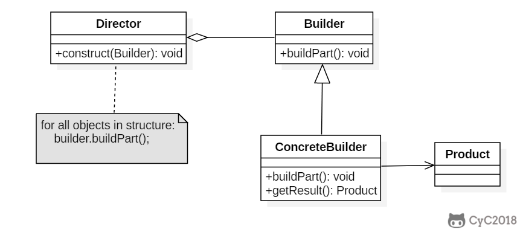

**意图**

将一个复杂对象的构建与它的表示分离，使得同样的构建过程可以创建不同的表示。

**结构**



**参与者**

Builder

-   为创建一个 Product 对象的各个部件指定抽象接口。

ConcreteBuilder

-   实现 Builder 的接口以构造和装配该产品的各个部件。

-   定义并明确它所创建的表示。

-   提供一个检索产品的接口。

Director

-   构造一个使用 Builder 接口的对象。

Product

-   表示被构造的复杂对象。ConcreteBuilder
    创建该产品的内部表示并定义它的装配过程。

-   包含定义组成部件的类，包括将这些部件装配成最终产品的接口。

**适用性**

在以下情况下可以使用 Builder 模式：

-   当创建复杂对象的算法应该独立于该对象的组成部分以及它们的装配方式时。

-   当构造过程必须允许被构造的对象有不同的表示时。

**效果**

-   它使你可以改变一个产品的内部表示。在改变该产品的内部表示时所要做的只是定义一个新的
    ConcreteBuilder。

-   它将构造代码和表示代码分开，提高了对象的模块性。客户不需要知道定义产品内部结构的类的所有信息。

-   它使你可以对构造过程进行更精细的控制。对象是在 Director
    的控制下一步一步构造的，仅当产品构造完成时 Director 才从 Builder 中取回它。

**相关模式**

-   Abstract Factory 和 Builder 相似，因为它也可以创建复杂对象。区别是 Builder
    着重于一步步构造一个复杂对象。而 Abstract Factory
    着重于多个系列的产品对象（或简单或复杂）。Builder
    是在最后一步返回产品，Abstract Factory 是立即返回。

-   Composite 通常是用 Builder 生成的。

## Implementation

以下是一个简易的 StringBuilder 实现，参考了 JDK 1.8 源码。

```java
public class AbstractStringBuilder {
    protected char[] value;

    protected int count;

    public AbstractStringBuilder(int capacity) {
        count = 0;
        value = new char[capacity];
    }

    public AbstractStringBuilder append(char c) {
        ensureCapacityInternal(count + 1);
        value[count++] = c;
        return this;
    }

    private void ensureCapacityInternal(int minimumCapacity) {
        // overflow-conscious code
        if (minimumCapacity - value.length > 0)
            expandCapacity(minimumCapacity);
    }

    void expandCapacity(int minimumCapacity) {
        int newCapacity = value.length * 2 + 2;
        if (newCapacity - minimumCapacity < 0)
            newCapacity = minimumCapacity;
        if (newCapacity < 0) {
            if (minimumCapacity < 0) // overflow
                throw new OutOfMemoryError();
            newCapacity = Integer.MAX_VALUE;
        }
        value = Arrays.copyOf(value, newCapacity);
    }
}
```

```java
public class StringBuilder extends AbstractStringBuilder {
    public StringBuilder() {
        super(16);
    }

    @Override
    public String toString() {
        // Create a copy, don't share the array
        return new String(value, 0, count);
    }
}
```

```java
public class Client {
    public static void main(String[] args) {
        StringBuilder sb = new StringBuilder();
        final int count = 26;
        for (int i = 0; i < count; i++) {
            sb.append((char) ('a' + i));
        }
        System.out.println(sb.toString());
    }
}
```

```html
abcdefghijklmnopqrstuvwxyz
```

### JDK

- [java.lang.StringBuilder](http://docs.oracle.com/javase/8/docs/api/java/lang/StringBuilder.html)
- [java.nio.ByteBuffer](http://docs.oracle.com/javase/8/docs/api/java/nio/ByteBuffer.html#put-byte-)
- [java.lang.StringBuffer](http://docs.oracle.com/javase/8/docs/api/java/lang/StringBuffer.html#append-boolean-)
- [java.lang.Appendable](http://docs.oracle.com/javase/8/docs/api/java/lang/Appendable.html)
- [Apache Camel builders](https://github.com/apache/camel/tree/0e195428ee04531be27a0b659005e3aa8d159d23/camel-core/src/main/java/org/apache/camel/builder)
