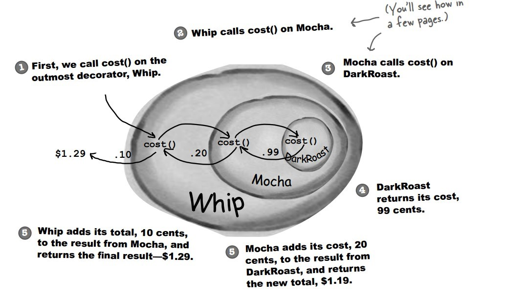

**别名**

-   包装器（Wrapper）

**意图**

动态地给一个对象添加一些额外的职责。

就增加功能来说，Decorator 模式相比生成子类更为灵活。

Attach additional responsibilities to an object dynamically.

Decorators provide a flexible alternative to subclassing for extending
functionality.

**结构**


**参与者**

Component

-   定义一个对象接口，可以给这些对象动态地添加职责。

ConcreteComponent

-   定义一个对象，可以给这个对象添加一些职责。

Decorator

-   维持一个指向 Component 对象的指针，并定义一个与 Component 接口一致的接口。

ConcreteDecorator

-   向组件添加职责。

**适用性**

在以下情况下可以使用 Decorator 模式：

-   在不影响其他对象的情况下，以动态、透明的方式给单个对象添加职责。

-   处理那些可以撤销的职责。

-   当不能采用生成子类的方法进行扩充时。

**缺点**

-   Decorator 是一个透明的包装，其与 Component 还是有些差别的。

-   采用 Decorator
    模式进行系统设计往往会产生许多看上去类似的小对象。导致很难学习系统，排错也很困难。

**效果**

-   比静态继承更灵活。

-   避免在层次结构高层的类有太多的特征。

**相关模式**

-   Decorator 模式不同于 Adapter 模式，因为 Decorator
    仅改变对象的职责而不改变它的接口，而 Adapter 将给对象一个全新的接口。

-   可以将 Decorator 视为一个退化的、仅有一个组件的 Composite。然而，Decorator
    仅给对象添加额外的职责，它的目的不在于对象聚集。

-   用一个 Decorator 可以改变对象的外表，而 Strategy
    模式使得你可以改变对象的内核。这是改变对象的两种途径。

-   当 Component 类原本就很庞大时，使用 Decorator 模式的代价太高，Strategy
    模式相对更好一些。


## Implementation

设计不同种类的饮料，饮料可以添加配料，比如可以添加牛奶，并且支持动态添加新配料。每增加一种配料，该饮料的价格就会增加，要求计算一种饮料的价格。

下图表示在 DarkRoast 饮料上新增新添加 Mocha 配料，之后又添加了 Whip 配料。DarkRoast 被 Mocha 包裹，Mocha 又被 Whip 包裹。它们都继承自相同父类，都有 cost() 方法，外层类的 cost() 方法调用了内层类的 cost() 方法。




```java
public interface Beverage {
    double cost();
}
```

```java
public class DarkRoast implements Beverage {
    @Override
    public double cost() {
        return 1;
    }
}
```

```java
public class HouseBlend implements Beverage {
    @Override
    public double cost() {
        return 1;
    }
}
```

```java
public abstract class CondimentDecorator implements Beverage {
    protected Beverage beverage;
}
```

```java
public class Milk extends CondimentDecorator {

    public Milk(Beverage beverage) {
        this.beverage = beverage;
    }

    @Override
    public double cost() {
        return 1 + beverage.cost();
    }
}
```

```java
public class Mocha extends CondimentDecorator {

    public Mocha(Beverage beverage) {
        this.beverage = beverage;
    }

    @Override
    public double cost() {
        return 1 + beverage.cost();
    }
}
```

```java
public class Client {

    public static void main(String[] args) {
        Beverage beverage = new HouseBlend();
        beverage = new Mocha(beverage);
        beverage = new Milk(beverage);
        System.out.println(beverage.cost());
    }
}
```

```html
3.0
```

### 设计原则

类应该对扩展开放，对修改关闭：也就是添加新功能时不需要修改代码。饮料可以动态添加新的配料，而不需要去修改饮料的代码。

不可能把所有的类设计成都满足这一原则，应当把该原则应用于最有可能发生改变的地方。

### JDK

- java.io.BufferedInputStream(InputStream)
- java.io.DataInputStream(InputStream)
- java.io.BufferedOutputStream(OutputStream)
- java.util.zip.ZipOutputStream(OutputStream)
- java.util.Collections#checked[List|Map|Set|SortedSet|SortedMap]()
