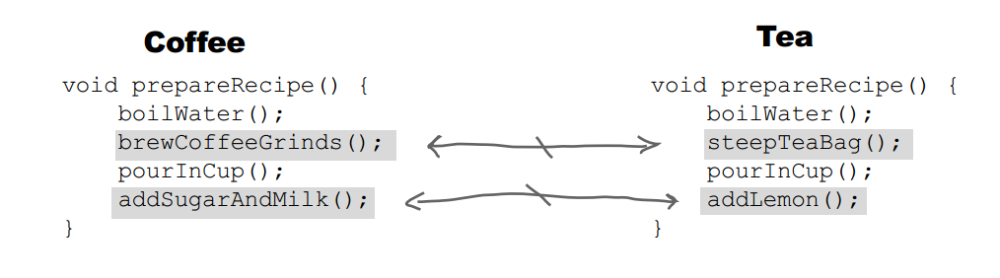

**意图**

定义一个操作中的算法的骨架，而将一些步骤延迟到子类中。

Template Method 使得子类可以不改变一个算法的结构即可重定义该算法的某些特定步骤。

**结构**


**参与者**

AbstractClass

-   定义抽象的原语操作（Primitive
    Operation），具体的子类将重定义它们以实现一个算法的各步骤。

-   实现一个模板方法，定义一个算法的骨架。该模板方法不仅调用原语操作，也调用定义在类中的其他操作。

ConcreteClass

-   实现原语操作以完成算法中与特定子类相关的步骤。

**适用性**

在以下情况下可以使用 Template Method 模式：

-   一次性实现一个算法的不变的部分，并将可变的行为留给子类来实现。

-   各子类中公共的行为应被提取出来并集中到一个公共父类中以避免代码重复。

-   控制子类扩展。只允许特定的点进行扩展。

**效果**

-   模板方法是一种代码复用的基本技术。

-   “好莱坞法则：Don't call us, we'll call
    you.”，一个父类调用一个子类的操作，而不是相反。

**相关模式**

-   Factory Method 常被 Template Method 调用。

-   Template Method 使用继承来改变算法的一部分。Strategy
    使用委托来改变整个算法。

## Implementation

冲咖啡和冲茶都有类似的流程，但是某些步骤会有点不一样，要求复用那些相同步骤的代码。


```java
public abstract class CaffeineBeverage {

    final void prepareRecipe() {
        boilWater();
        brew();
        pourInCup();
        addCondiments();
    }

    abstract void brew();

    abstract void addCondiments();

    void boilWater() {
        System.out.println("boilWater");
    }

    void pourInCup() {
        System.out.println("pourInCup");
    }
}
```

```java
public class Coffee extends CaffeineBeverage {
    @Override
    void brew() {
        System.out.println("Coffee.brew");
    }

    @Override
    void addCondiments() {
        System.out.println("Coffee.addCondiments");
    }
}
```

```java
public class Tea extends CaffeineBeverage {
    @Override
    void brew() {
        System.out.println("Tea.brew");
    }

    @Override
    void addCondiments() {
        System.out.println("Tea.addCondiments");
    }
}
```

```java
public class Client {
    public static void main(String[] args) {
        CaffeineBeverage caffeineBeverage = new Coffee();
        caffeineBeverage.prepareRecipe();
        System.out.println("-----------");
        caffeineBeverage = new Tea();
        caffeineBeverage.prepareRecipe();
    }
}
```

```html
boilWater
Coffee.brew
pourInCup
Coffee.addCondiments
-----------
boilWater
Tea.brew
pourInCup
Tea.addCondiments
```

### JDK

- java.util.Collections#sort()
- java.io.InputStream#skip()
- java.io.InputStream#read()
- java.util.AbstractList#indexOf()
