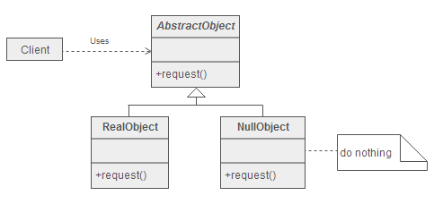

**意图**

通过对缺失对象的封装，以提供默认无任何行为的对象替代品。

Encapsulate the absence of an object by providing a substitutable alternative
that offers suitable default do nothing behavior.

In short, a design where "nothing will come of nothing".

**结构**



**参与者**

AbstractObject

-   声明协作对象的接口。

-   如果需要，可以实现默认行为。

RealObject

-   具体的协作对象类，提供有意义的行为。

NullObject

-   空对象类，继承自 AbstractObject，但接口实现不做任何事情。

Client

-   请求协作对象。

**适用性**

当以下情况成立时可以使用 Null Object 模式：

-   一个对象需要一个协作对象，但并无具体的协作对象。

-   协作对象不需要做任何事情。

**效果**

-   减少了对对象是否为 Null 的判断。

-   提供默认无任何具体行为的协作对象。

**相关模式**

-   因为 Null Object 通常没有任何状态，所以多个实例可能都是类似的，可以使用
    [Singleton](http://www.cnblogs.com/gaochundong/p/design_pattern_singleton.html)
    模式来实现。

-   Null Object 看起来很像
    [Proxy](http://www.cnblogs.com/gaochundong/p/design_pattern_proxy.html)
    模式，但两者有着不同的目的。Proxy 提供对目标对象访问的控制，而 Null Object
    并不隐藏任何对象。

-   Null Object 可以作为
    [Strategy](http://www.cnblogs.com/gaochundong/p/design_pattern_strategy.html)
    模式中的一个特例。Strategy 提供多个具体类以区分算法，而 NullStrategy
    则可不做任何事情。

-   Null Object 可以作为
    [State](http://www.cnblogs.com/gaochundong/p/design_pattern_state.html)
    模式中的一个特例。使用 NullState 以便不做任何事情。

-   在
    [Visitor](http://www.cnblogs.com/gaochundong/p/design_pattern_visitor.html)
    模式中也可以使用 Null Object 以提供某种默认行为。

## Implementation

```java
public abstract class AbstractOperation {
    abstract void request();
}
```

```java
public class RealOperation extends AbstractOperation {
    @Override
    void request() {
        System.out.println("do something");
    }
}
```

```java
public class NullOperation extends AbstractOperation{
    @Override
    void request() {
        // do nothing
    }
}
```

```java
public class Client {
    public static void main(String[] args) {
        AbstractOperation abstractOperation = func(-1);
        abstractOperation.request();
    }

    public static AbstractOperation func(int para) {
        if (para < 0) {
            return new NullOperation();
        }
        return new RealOperation();
    }
}
```
