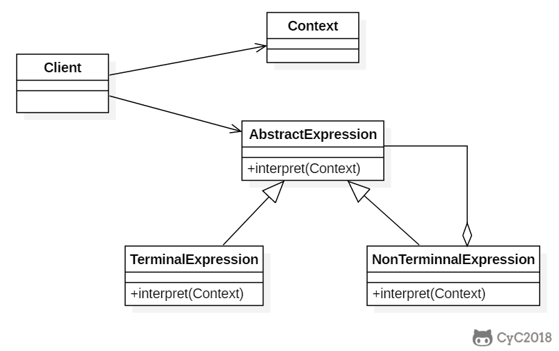

**意图**

给定一个语言，定义它的文法的一种表示，并定义一个解释器，这个解释器使用该表示来解释语言中的句子。

Given a language, define a represention for its grammar along with an
interpreter that uses the representation to interpret sentences in the language.

**结构**



**参与者**

AbstractExpression

-   声明一个抽象的解释操作，这个接口为抽象语法树中所有的节点所共享。

TerminalExpression

-   实现与文法中的终结符相关联的解释操作。

-   一个句子中的每一个终结符需要该类的一个实例。

NonterminalExpression

-   对文法中的规则的解释操作。

Context

-   包含解释器之外的一些全局信息。

Client

-   构建表示该语法定义的语言中一个特定的句子的抽象语法树。

-   调用解释操作

**适用性**

当有个语言需要解释执行，并且你可将该语言中的句子表示为一个抽象语法树时，可以使用
Interpreter 模式。

当存在以下情况时效果最好：

-   该文法简单对于复杂的文法，文法的类层次变得庞大而无法管理。

-   效率不是一个关键问题，最高效的解释器通常不是通过直接解释语法分析树实现的，而是首先将它们转换成另一种形式。

**效果**

-   易于改变和扩展文法。

-   易于实现文法。

-   复杂的文法难以维护。

-   增加了新的解释表达式的方式。

**相关模式**

-   抽象语法树是一个 Composite 模式的实例。

-   可以使用 Flyweight 模式在抽象语法树中共享终结符。

-   可以使用 Iterator 模式遍历解释器结构。

-   可以使用 Visitor 模式在一个类中维护抽象语法树中的各个节点的行为。


## Implementation

以下是一个规则检验器实现，具有 and 和 or 规则，通过规则可以构建一颗解析树，用来检验一个文本是否满足解析树定义的规则。

例如一颗解析树为 D And (A Or (B C))，文本 "D A" 满足该解析树定义的规则。

这里的 Context 指的是 String。

```java
public abstract class Expression {
    public abstract boolean interpret(String str);
}
```

```java
public class TerminalExpression extends Expression {

    private String literal = null;

    public TerminalExpression(String str) {
        literal = str;
    }

    public boolean interpret(String str) {
        StringTokenizer st = new StringTokenizer(str);
        while (st.hasMoreTokens()) {
            String test = st.nextToken();
            if (test.equals(literal)) {
                return true;
            }
        }
        return false;
    }
}
```

```java
public class AndExpression extends Expression {

    private Expression expression1 = null;
    private Expression expression2 = null;

    public AndExpression(Expression expression1, Expression expression2) {
        this.expression1 = expression1;
        this.expression2 = expression2;
    }

    public boolean interpret(String str) {
        return expression1.interpret(str) && expression2.interpret(str);
    }
}
```

```java
public class OrExpression extends Expression {
    private Expression expression1 = null;
    private Expression expression2 = null;

    public OrExpression(Expression expression1, Expression expression2) {
        this.expression1 = expression1;
        this.expression2 = expression2;
    }

    public boolean interpret(String str) {
        return expression1.interpret(str) || expression2.interpret(str);
    }
}
```

```java
public class Client {

    /**
     * 构建解析树
     */
    public static Expression buildInterpreterTree() {
        // Literal
        Expression terminal1 = new TerminalExpression("A");
        Expression terminal2 = new TerminalExpression("B");
        Expression terminal3 = new TerminalExpression("C");
        Expression terminal4 = new TerminalExpression("D");
        // B C
        Expression alternation1 = new OrExpression(terminal2, terminal3);
        // A Or (B C)
        Expression alternation2 = new OrExpression(terminal1, alternation1);
        // D And (A Or (B C))
        return new AndExpression(terminal4, alternation2);
    }

    public static void main(String[] args) {
        Expression define = buildInterpreterTree();
        String context1 = "D A";
        String context2 = "A B";
        System.out.println(define.interpret(context1));
        System.out.println(define.interpret(context2));
    }
}
```

```html
true
false
```

### JDK

- [java.util.Pattern](http://docs.oracle.com/javase/8/docs/api/java/util/regex/Pattern.html)
- [java.text.Normalizer](http://docs.oracle.com/javase/8/docs/api/java/text/Normalizer.html)
- All subclasses of [java.text.Format](http://docs.oracle.com/javase/8/docs/api/java/text/Format.html)
- [javax.el.ELResolver](http://docs.oracle.com/javaee/7/api/javax/el/ELResolver.html)
