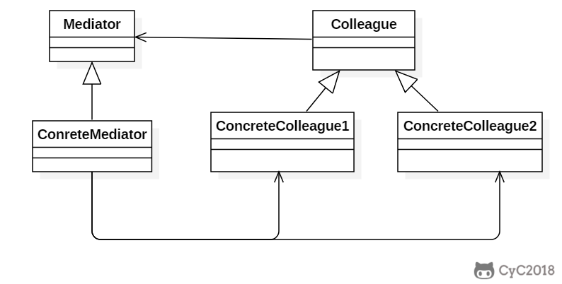
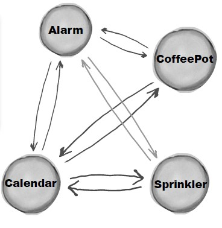
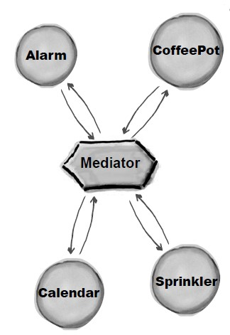

**意图**

用一个中介对象来封装一系列的对象交互。

中介者使各对象不需要显式地相互引用，从而使其耦合松散，而且可以独立地改变它们之间的交互。

Define an object that encapsulates how a set of objects interact.

Mediator promotes loose coupling by keeping objects from referring to each other
explicitly, and it lets you vary their interaction independently.

**结构**



一个典型的对象结构：

**参与者**

Mediator

-   中介者定义一个接口用于与各同事对象通信。

ConcreteMediator

-   具体中介者通过协调各同事对象实现协作行为。

-   了解并维护它的各个同事。

Colleague

-   每一个同事类都知道它的中介者。

-   每一个同事对象在需与其他同事通信时，与它的中介者通信。

**适用性**

在以下情况下可以使用 Mediator 模式：

-   一组对象定义良好但是使用复杂的通信方式。产生的相互依赖关系结构混乱且难以理解。

-   一个对象引用其他很多对象并且直接与这些对象通信，导致难以复用该对象。

-   想定制一个分布在多个类中的行为，而又不想生成太多的子类。

**效果**

-   减少了子类的生成。

-   将各个同事类解耦。

-   它简化了对象协议。

-   它对对象如何协作进行了抽象。

-   它使控制集中化。

**相关模式**

-   Facade 模式与 Mediator
    模式的不同之处在于它是对一个对象子系统进行抽象，从而提供了一个更为方便的接口。它的协议是单向的，即
    Facade 对象对这个子系统类提出要求，但反之则不行。Mediator 提供了各 Colleague
    对象不支持或不能支持的协作行为，而协议是多向的。

-   Colleague 可以使用 Observer 模式与 Mediator 通信。


## Implementation

Alarm（闹钟）、CoffeePot（咖啡壶）、Calendar（日历）、Sprinkler（喷头）是一组相关的对象，在某个对象的事件产生时需要去操作其它对象，形成了下面这种依赖结构：



使用中介者模式可以将复杂的依赖结构变成星形结构：



```java
public abstract class Colleague {
    public abstract void onEvent(Mediator mediator);
}
```

```java
public class Alarm extends Colleague {

    @Override
    public void onEvent(Mediator mediator) {
        mediator.doEvent("alarm");
    }

    public void doAlarm() {
        System.out.println("doAlarm()");
    }
}
```

```java
public class CoffeePot extends Colleague {
    @Override
    public void onEvent(Mediator mediator) {
        mediator.doEvent("coffeePot");
    }

    public void doCoffeePot() {
        System.out.println("doCoffeePot()");
    }
}
```

```java
public class Calender extends Colleague {
    @Override
    public void onEvent(Mediator mediator) {
        mediator.doEvent("calender");
    }

    public void doCalender() {
        System.out.println("doCalender()");
    }
}
```

```java
public class Sprinkler extends Colleague {
    @Override
    public void onEvent(Mediator mediator) {
        mediator.doEvent("sprinkler");
    }

    public void doSprinkler() {
        System.out.println("doSprinkler()");
    }
}
```

```java
public abstract class Mediator {
    public abstract void doEvent(String eventType);
}
```

```java
public class ConcreteMediator extends Mediator {
    private Alarm alarm;
    private CoffeePot coffeePot;
    private Calender calender;
    private Sprinkler sprinkler;

    public ConcreteMediator(Alarm alarm, CoffeePot coffeePot, Calender calender, Sprinkler sprinkler) {
        this.alarm = alarm;
        this.coffeePot = coffeePot;
        this.calender = calender;
        this.sprinkler = sprinkler;
    }

    @Override
    public void doEvent(String eventType) {
        switch (eventType) {
            case "alarm":
                doAlarmEvent();
                break;
            case "coffeePot":
                doCoffeePotEvent();
                break;
            case "calender":
                doCalenderEvent();
                break;
            default:
                doSprinklerEvent();
        }
    }

    public void doAlarmEvent() {
        alarm.doAlarm();
        coffeePot.doCoffeePot();
        calender.doCalender();
        sprinkler.doSprinkler();
    }

    public void doCoffeePotEvent() {
        // ...
    }

    public void doCalenderEvent() {
        // ...
    }

    public void doSprinklerEvent() {
        // ...
    }
}
```

```java
public class Client {
    public static void main(String[] args) {
        Alarm alarm = new Alarm();
        CoffeePot coffeePot = new CoffeePot();
        Calender calender = new Calender();
        Sprinkler sprinkler = new Sprinkler();
        Mediator mediator = new ConcreteMediator(alarm, coffeePot, calender, sprinkler);
        // 闹钟事件到达，调用中介者就可以操作相关对象
        alarm.onEvent(mediator);
    }
}
```

```java
doAlarm()
doCoffeePot()
doCalender()
doSprinkler()
```

### JDK

- All scheduleXXX() methods of [java.util.Timer](http://docs.oracle.com/javase/8/docs/api/java/util/Timer.html)
- [java.util.concurrent.Executor#execute()](http://docs.oracle.com/javase/8/docs/api/java/util/concurrent/Executor.html#execute-java.lang.Runnable-)
- submit() and invokeXXX() methods of [java.util.concurrent.ExecutorService](http://docs.oracle.com/javase/8/docs/api/java/util/concurrent/ExecutorService.html)
- scheduleXXX() methods of [java.util.concurrent.ScheduledExecutorService](http://docs.oracle.com/javase/8/docs/api/java/util/concurrent/ScheduledExecutorService.html)
- [java.lang.reflect.Method#invoke()](http://docs.oracle.com/javase/8/docs/api/java/lang/reflect/Method.html#invoke-java.lang.Object-java.lang.Object...-)
