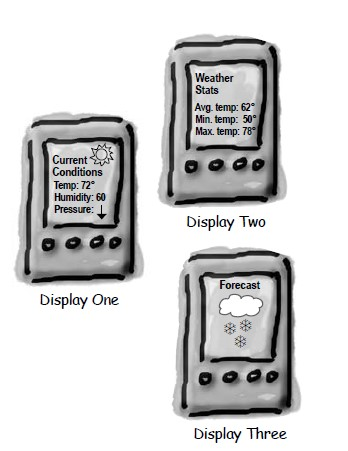

# 观察者模式
**别名**

-   Dependency
-   Publish-Subscribe

> 观察者模式好牛啊，在不同的代码层次有这不同的名称但是大同小异。
> * 在java代码层就是观察着模式
> * 在socket网络编程、IO编程中（netty、springWebFlux、sofarpc）就是Reactor模式
> * 在操作系统中就是IO多路复用的一种策略
> * 在UI框架中就是Listener，事件监听机制和响应机制
> * 在Spring框架中也有事件监听模型。
> * 在web网站开发中，被称为响应式编程。
> * 在微服务中就是注册中心的发布订阅过程
> * 在消息中间件中就是发布订阅模式。
> *

**意图**

定义对象间的一种一对多的依赖关系，当一个对象的状态发生改变时，所有依赖于它的对象都得到通知并被自动更新。


**结构**


**参与者**

Subject

-   Subject 知道它的 Observer。可以有任意多个 Observer 观察同一个 Subject。

-   提供注册和删除 Observer 的接口。

Observer

-   为那些在 Subject 发生改变时需要获得通知的对象定义一个 Update 接口。

ConcreteSubject

-   将有关状态存储各个 ConcreteObserver 对象。

-   当它的状态发生改变时，想它的各个 Observer 发出通知。

ConcreteObserver

-   维护一个指向 ConcreteSubject 对象的引用。

-   存储有关状态，这些状态应该与 ConcreteSubject 的状态保持一致。

-   实现 Observer 的更新接口以使自身状态与 ConcreteSubject 状态保持一致。

**适用性**

在以下情况下可以使用 Observer 模式：

-   当一个抽象模型有两个方面，其中一个方面依赖于另一个方面。将这二者封装在独立的对象中以使它们可以各自独立地改变和复用。

-   当对一个对象的改变需要同时改变其他对象，而不知道具体有多少对象有待改变。

-   当一个对象必须通知其他对象，而它又不能假定其他对象时谁。

**效果**

-   目标与观察者间的抽象耦合。

-   支持广播通信。

-   意外的更新。因为 Observer 并不知道其他 Observer 的存在，所以对改变 Subject
    的最终代价一无所知。

**相关模式**

-   可以使用 Mediator 模式封装复杂的更新语义，充当 Subject 与 Observer
    之间的中介者。


## Implementation

天气数据布告板会在天气信息发生改变时更新其内容，布告板有多个，并且在将来会继续增加。



```java
public interface Subject {
    void registerObserver(Observer o);

    void removeObserver(Observer o);

    void notifyObserver();
}
```

```java
public class WeatherData implements Subject {
    private List<Observer> observers;
    private float temperature;
    private float humidity;
    private float pressure;

    public WeatherData() {
        observers = new ArrayList<>();
    }

    public void setMeasurements(float temperature, float humidity, float pressure) {
        this.temperature = temperature;
        this.humidity = humidity;
        this.pressure = pressure;
        notifyObserver();
    }

    @Override
    public void registerObserver(Observer o) {
        observers.add(o);
    }

    @Override
    public void removeObserver(Observer o) {
        int i = observers.indexOf(o);
        if (i >= 0) {
            observers.remove(i);
        }
    }

    @Override
    public void notifyObserver() {
        for (Observer o : observers) {
            o.update(temperature, humidity, pressure);
        }
    }
}
```

```java
public interface Observer {
    void update(float temp, float humidity, float pressure);
}
```

```java
public class StatisticsDisplay implements Observer {

    public StatisticsDisplay(Subject weatherData) {
        weatherData.registerObserver(this);
    }

    @Override
    public void update(float temp, float humidity, float pressure) {
        System.out.println("StatisticsDisplay.update: " + temp + " " + humidity + " " + pressure);
    }
}
```

```java
public class CurrentConditionsDisplay implements Observer {

    public CurrentConditionsDisplay(Subject weatherData) {
        weatherData.registerObserver(this);
    }

    @Override
    public void update(float temp, float humidity, float pressure) {
        System.out.println("CurrentConditionsDisplay.update: " + temp + " " + humidity + " " + pressure);
    }
}
```

```java
public class WeatherStation {
    public static void main(String[] args) {
        WeatherData weatherData = new WeatherData();
        CurrentConditionsDisplay currentConditionsDisplay = new CurrentConditionsDisplay(weatherData);
        StatisticsDisplay statisticsDisplay = new StatisticsDisplay(weatherData);

        weatherData.setMeasurements(0, 0, 0);
        weatherData.setMeasurements(1, 1, 1);
    }
}
```

```html
CurrentConditionsDisplay.update: 0.0 0.0 0.0
StatisticsDisplay.update: 0.0 0.0 0.0
CurrentConditionsDisplay.update: 1.0 1.0 1.0
StatisticsDisplay.update: 1.0 1.0 1.0
```

### JDK

- [java.util.Observer](http://docs.oracle.com/javase/8/docs/api/java/util/Observer.html)
- [java.util.EventListener](http://docs.oracle.com/javase/8/docs/api/java/util/EventListener.html)
- [javax.servlet.http.HttpSessionBindingListener](http://docs.oracle.com/javaee/7/api/javax/servlet/http/HttpSessionBindingListener.html)
- [RxJava](https://github.com/ReactiveX/RxJava)
