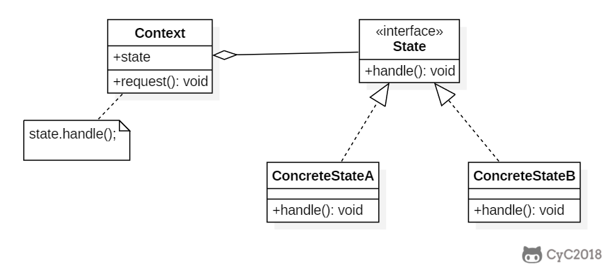
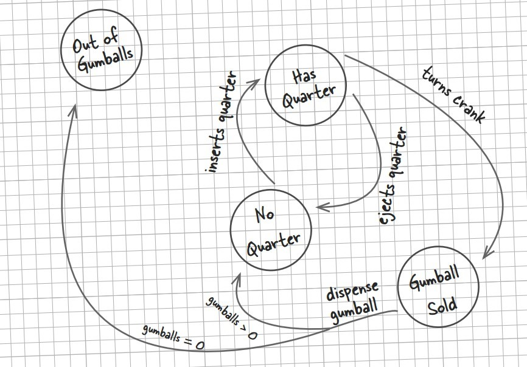

**意图**

允许一个对象在其内部状态改变时改变它的行为。对象看起来似乎修改了它的类。

**结构**



**参与者**

Context

-   定义客户感兴趣的接口。

-   维护一个 ConcreteState 子类的实例，这个实例定义当前状态。

State

-   定义一个接口以封装与 Context 的一个特定状态相关的额行为。

ConcreteState

-   每一个子类实现一个与 Context 的一个状态相关的行为。

**适用性**

在以下情况下可以使用 State 模式：

-   一个对象的行为取决于它的状态，并且它必须在运行时根据状态改变它的行为。

-   一个操作中含有庞大的多分支的条件语句，且这些分支依赖于该对象的状态。这个状态通常用一个或多个枚举常量表示。

**效果**

-   它将与特定状态相关的行为局部化。

-   它使得状态转换显式化。

-   State 对象可被共享。

**相关模式**

-   使用 Flyweight 模式共享状态对象。

-   使用 Singleton 模式实现状态对象。


### Implementation

糖果销售机有多种状态，每种状态下销售机有不同的行为，状态可以发生转移，使得销售机的行为也发生改变。


```java
public interface State {
    /**
     * 投入 25 分钱
     */
    void insertQuarter();

    /**
     * 退回 25 分钱
     */
    void ejectQuarter();

    /**
     * 转动曲柄
     */
    void turnCrank();

    /**
     * 发放糖果
     */
    void dispense();
}
```

```java
public class HasQuarterState implements State {

    private GumballMachine gumballMachine;

    public HasQuarterState(GumballMachine gumballMachine) {
        this.gumballMachine = gumballMachine;
    }

    @Override
    public void insertQuarter() {
        System.out.println("You can't insert another quarter");
    }

    @Override
    public void ejectQuarter() {
        System.out.println("Quarter returned");
        gumballMachine.setState(gumballMachine.getNoQuarterState());
    }

    @Override
    public void turnCrank() {
        System.out.println("You turned...");
        gumballMachine.setState(gumballMachine.getSoldState());
    }

    @Override
    public void dispense() {
        System.out.println("No gumball dispensed");
    }
}
```

```java
public class NoQuarterState implements State {

    GumballMachine gumballMachine;

    public NoQuarterState(GumballMachine gumballMachine) {
        this.gumballMachine = gumballMachine;
    }

    @Override
    public void insertQuarter() {
        System.out.println("You insert a quarter");
        gumballMachine.setState(gumballMachine.getHasQuarterState());
    }

    @Override
    public void ejectQuarter() {
        System.out.println("You haven't insert a quarter");
    }

    @Override
    public void turnCrank() {
        System.out.println("You turned, but there's no quarter");
    }

    @Override
    public void dispense() {
        System.out.println("You need to pay first");
    }
}
```

```java
public class SoldOutState implements State {

    GumballMachine gumballMachine;

    public SoldOutState(GumballMachine gumballMachine) {
        this.gumballMachine = gumballMachine;
    }

    @Override
    public void insertQuarter() {
        System.out.println("You can't insert a quarter, the machine is sold out");
    }

    @Override
    public void ejectQuarter() {
        System.out.println("You can't eject, you haven't inserted a quarter yet");
    }

    @Override
    public void turnCrank() {
        System.out.println("You turned, but there are no gumballs");
    }

    @Override
    public void dispense() {
        System.out.println("No gumball dispensed");
    }
}
```

```java
public class SoldState implements State {

    GumballMachine gumballMachine;

    public SoldState(GumballMachine gumballMachine) {
        this.gumballMachine = gumballMachine;
    }

    @Override
    public void insertQuarter() {
        System.out.println("Please wait, we're already giving you a gumball");
    }

    @Override
    public void ejectQuarter() {
        System.out.println("Sorry, you already turned the crank");
    }

    @Override
    public void turnCrank() {
        System.out.println("Turning twice doesn't get you another gumball!");
    }

    @Override
    public void dispense() {
        gumballMachine.releaseBall();
        if (gumballMachine.getCount() > 0) {
            gumballMachine.setState(gumballMachine.getNoQuarterState());
        } else {
            System.out.println("Oops, out of gumballs");
            gumballMachine.setState(gumballMachine.getSoldOutState());
        }
    }
}
```

```java
public class GumballMachine {

    private State soldOutState;
    private State noQuarterState;
    private State hasQuarterState;
    private State soldState;

    private State state;
    private int count = 0;

    public GumballMachine(int numberGumballs) {
        count = numberGumballs;
        soldOutState = new SoldOutState(this);
        noQuarterState = new NoQuarterState(this);
        hasQuarterState = new HasQuarterState(this);
        soldState = new SoldState(this);

        if (numberGumballs > 0) {
            state = noQuarterState;
        } else {
            state = soldOutState;
        }
    }

    public void insertQuarter() {
        state.insertQuarter();
    }

    public void ejectQuarter() {
        state.ejectQuarter();
    }

    public void turnCrank() {
        state.turnCrank();
        state.dispense();
    }

    public void setState(State state) {
        this.state = state;
    }

    public void releaseBall() {
        System.out.println("A gumball comes rolling out the slot...");
        if (count != 0) {
            count -= 1;
        }
    }

    public State getSoldOutState() {
        return soldOutState;
    }

    public State getNoQuarterState() {
        return noQuarterState;
    }

    public State getHasQuarterState() {
        return hasQuarterState;
    }

    public State getSoldState() {
        return soldState;
    }

    public int getCount() {
        return count;
    }
}
```

```java
public class Client {

    public static void main(String[] args) {
        GumballMachine gumballMachine = new GumballMachine(5);

        gumballMachine.insertQuarter();
        gumballMachine.turnCrank();

        gumballMachine.insertQuarter();
        gumballMachine.ejectQuarter();
        gumballMachine.turnCrank();

        gumballMachine.insertQuarter();
        gumballMachine.turnCrank();
        gumballMachine.insertQuarter();
        gumballMachine.turnCrank();
        gumballMachine.ejectQuarter();

        gumballMachine.insertQuarter();
        gumballMachine.insertQuarter();
        gumballMachine.turnCrank();
        gumballMachine.insertQuarter();
        gumballMachine.turnCrank();
        gumballMachine.insertQuarter();
        gumballMachine.turnCrank();
    }
}
```

```html
You insert a quarter
You turned...
A gumball comes rolling out the slot...
You insert a quarter
Quarter returned
You turned, but there's no quarter
You need to pay first
You insert a quarter
You turned...
A gumball comes rolling out the slot...
You insert a quarter
You turned...
A gumball comes rolling out the slot...
You haven't insert a quarter
You insert a quarter
You can't insert another quarter
You turned...
A gumball comes rolling out the slot...
You insert a quarter
You turned...
A gumball comes rolling out the slot...
Oops, out of gumballs
You can't insert a quarter, the machine is sold out
You turned, but there are no gumballs
No gumball dispensed
```
