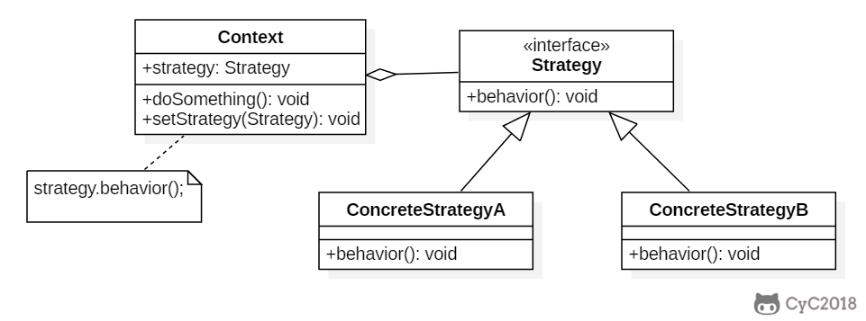

# 策略 Strategy


### **别名**

- Policy

### **意图**

定义一系列的算法，把它们一个个封装起来，并且使它们可以相互替换。使得算法可独立于使用它的客户而变化。

### **结构**



### **参与者**

Strategy

- 定义所有支持的算法的公共接口。Context 使用这个接口来调用 ConcreteStrategy
    定义的算法。

ConcreteStrategy

- 实现 Strategy 接口和具体算法。

Context

- 用一个 ConcreteStrategy 对象来配置。

- 维护一个对 Strategy 对象的引用。

- 可定义一个接口来让 Strategy 访问它的数据。

### **适用性**

在以下情况下可以使用 Strategy 模式：

- 许多相关的类仅仅是行为有异。Strategy
    提供了一种用多个行为中的一个行为来配置一个类的方法。

- 需要使用一个算法的不同变体。

- 算法使用客户不应该知道的数据。

- 一个类定义了多种行为，并且这些行为在这个类的操作中以多个条件语句的形式出现。将相关条件分支移入它们各自的
    Strategy 类中以代替。

### **缺点**

- 客户必须了解不同的 Strategy。要选择合适的 Strategy 就必须知道这些 Strategy
    有何不同。

- Strategy 和 Context 之间的通信开销。Context 可能创建一些 ConcreteStrategy
    不使用的参数。

- 增加了对象的数目。

### **效果**

- 相关算法系列。

- 一个替代继承的方法。

- 消除了一些条件语句。

- 实现的选择。相同行为的不同实现。

### **相关模式**

- 使用 Flyweight 模式实现 Strategy。

## 2 实现


设计一个鸭子，它可以动态地改变叫声。这里的算法族是鸭子的叫声行为。

```java
public interface QuackBehavior {
    void quack();
}
```

```java
public class Quack implements QuackBehavior {
    @Override
    public void quack() {
        System.out.println("quack!");
    }
}
```

```java
public class Squeak implements QuackBehavior{
    @Override
    public void quack() {
        System.out.println("squeak!");
    }
}
```

```java
public class Duck {

    private QuackBehavior quackBehavior;

    public void performQuack() {
        if (quackBehavior != null) {
            quackBehavior.quack();
        }
    }

    public void setQuackBehavior(QuackBehavior quackBehavior) {
        this.quackBehavior = quackBehavior;
    }
}
```

```java
public class Client {

    public static void main(String[] args) {
        Duck duck = new Duck();
        duck.setQuackBehavior(new Squeak());
        duck.performQuack();
        duck.setQuackBehavior(new Quack());
        duck.performQuack();
    }
}
```

```html
squeak!
quack!
```

### JDK

- java.util.Comparator#compare()
- javax.servlet.http.HttpServlet
- javax.servlet.Filter#doFilter()
