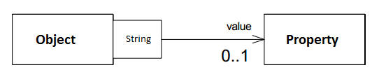

**索引**

-   别名

-   意图

-   结构

-   参与者

-   适用性

-   效果

-   实现

    -   实现方式（一）：Dynamic Property 的示例实现。

**别名**

-   Property

-   Properties

-   Property List

**意图**

使对象可以为客户提供广泛且可扩展的属性集合。

Lets an object provides a generic and extensible set of properties to clients.

**结构**

**参与者**

Object

-   目标对象可存储 Property 列表。

-   可使用不同的类型来作为 Property 的标识符，最简单的可以使用 string 类型。

Property

-   属性定义。

**适用性**

当以下情况成立时可以使用 Dynamic Property 模式：

-   当对象需要定义大量属性时。

-   当对象的属性是运行时可变时。

**效果**

-   可在运行时动态的修改对象的属性。

**实现**

**实现方式（一）：Dynamic Property 的示例实现。**

复制代码

1 namespace DynamicPropertyPattern.Implementation1 2 { 3 public class Person 4 {
5 private PropertyList \_properties = new PropertyList(null); 6 7 public
Property GetProperty(string propertyName) 8 { 9 return
\_properties.GetProperty(propertyName); 10 } 11 12 public bool
HasProperty(string propertyName) 13 { 14 return
\_properties.HasProperty(propertyName); 15 } 16 17 public void
AddProperty(string propertyName, Property property) 18 { 19
\_properties.AddProperty(propertyName, property); 20 } 21 22 public void
RemoveProperty(string propertyName) 23 { 24
\_properties.RemoveProperty(propertyName); 25 } 26 27 public
IEnumerable\<Property\> GetAllProperties() 28 { 29 return
\_properties.GetAllProperties(); 30 } 31 } 32 33 public class Property 34 { 35
public string Name { get; set; } 36 public string Value { get; set; } 37 } 38 39
public class PropertyList 40 { 41 private PropertyList \_parent; 42 private
Dictionary\<string, Property\> \_properties 43 = new Dictionary\<string,
Property\>(); 44 45 public PropertyList(PropertyList parent) 46 { 47 \_parent =
parent; 48 } 49 50 public PropertyList Parent 51 { 52 get 53 { 54 return
\_parent; 55 } 56 } 57 58 public Property GetProperty(string propertyName) 59 {
60 if (\_properties.ContainsKey(propertyName)) 61 return
\_properties[propertyName]; 62 if (_parent != null &&
\_parent.HasProperty(propertyName)) 63 return
\_parent.GetProperty(propertyName); 64 return null; 65 } 66 67 public bool
HasProperty(string propertyName) 68 { 69 return
(\_properties.ContainsKey(propertyName)) 70 \|\| (_parent != null &&
\_parent.HasProperty(propertyName)); 71 } 72 73 public void AddProperty(string
propertyName, Property property) 74 { 75 \_properties.Add(propertyName,
property); 76 } 77 78 public void RemoveProperty(string propertyName) 79 { 80
\_properties.Remove(propertyName); 81 } 82 83 public IEnumerable\<Property\>
GetAllProperties() 84 { 85 List\<Property\> properties = new List\<Property\>();
86 87 if (_parent != null) 88 properties.AddRange(\_parent.GetAllProperties());
89 90 properties.AddRange(\_properties.Values); 91 92 return properties; 93 } 94
} 95 96 public class Client 97 { 98 public void TestCase1() 99 { 100 Person
dennis = new Person(); 101 dennis.AddProperty("Contact", new Property() { Name =
"Contact", Value = "Beijing" }); 102 dennis.AddProperty("Age", new Property() {
Name = "Age", Value = "18" }); 103 dennis.AddProperty("Gender", new Property() {
Name = "Gender", Value = "Male" }); 104 105 if
(dennis.HasProperty("Contact"))106 { 107 Property property =
dennis.GetProperty("Contact");108 } 109 } 110 } 111 }
