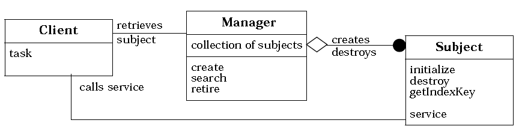
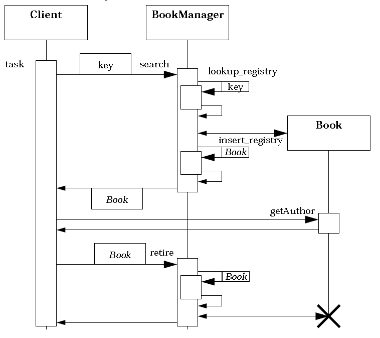

**索引**

-   意图

-   结构

-   参与者

-   适用性

-   效果

-   实现

    -   实现方式（一）：Manager 模式的示例实现。

**意图**

将对一个类的所有对象的管理封装到一个单独的管理器类中。

这使得管理职责的变化独立于类本身，并且管理器还可以为不同的类进行重用。

Encapsulates management of a class’s objects into a separate manager object.

This allows variation of management functionality independent of the class and
the manager’s reuse for different classes.

**结构**

**参与者**

Subject

-   领域对象。

-   提供 Client 需要的领域服务。

Manager

-   Manager 类是唯一负责创建和销毁 Subject 对象的类。它负责跟踪和管理 Subject
    对象。

-   典型的管理职责包括根据指定的 Key 搜索 Subject 对象。

-   因为 Subject 对 Manager 无引用，所以 Manager 可根据需要修改或子类化。

Client

-   从 Manager 对象获取 Subject 对象。

-   使用 Subject 的领域服务。

**适用性**

当以下情况成立时可以使用 Manager 模式：

-   当需要对同一个类的所有的对象进行操作时。

-   当需要按需的创建和销毁对象时。

-   当需要控制对象的生命周期时。

**效果**

-   可以对全部对象进行统计。

-   管理职责可以无依赖的变化。

-   可以按需替换管理职责。

-   管理职责可以得到重用

**实现**

**实现方式（一）：Manager 模式的示例实现。**

复制代码

1 namespace ManagerPattern.Implementation1 2 { 3 public class Book 4 { 5 public
Book(string isbn, string authors, string title) 6 { 7 this.ISBN = isbn; 8
this.Authors = authors; 9 this.Title = title;10 } 11 12 public string ISBN {
get; private set; }13 public string Authors { get; private set; }14 public
string Title { get; private set; }15 16 public string Publisher { get; set; }17
public Image Cover { get; set; }18 19 public string GetTableOfContents() 20 { 21
return "something";22 } 23 } 24 25 public class BookManager 26 { 27 private
Dictionary\<string, Book\> \_books28 = new Dictionary\<string, Book\>();29 30
public BookManager() 31 { 32 } 33 34 public Book AddBook(string isbn, string
authors, string title) 35 { 36 Book book = new Book(isbn, authors, title); 37
\_books.Add(book.ISBN, book); 38 return book; 39 } 40 41 public Book
GetBookByISBN(string isbn) 42 { 43 Book book; 44 \_books.TryGetValue(isbn, out
book); 45 return book; 46 } 47 48 public IEnumerable\<Book\>
FindBooksOfAuthor(string author) 49 { 50 return \_books.Values.Where(b =\>
b.Authors.Contains(author)); 51 } 52 } 53 54 public class Client 55 { 56 public
void TestCase1() 57 { 58 BookManager manager = new BookManager(); 59
manager.AddBook("xxxx-xxxx-xxxx", "Dennis Gao", "Good Man");60 Book book =
manager.GetBookByISBN("xxxx-xxxx-xxxx");61 book.GetTableOfContents(); 62 } 63 }
64 }

复制代码
