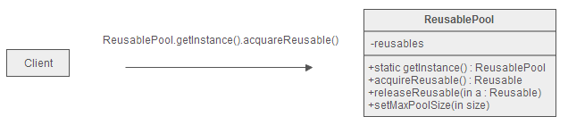

**索引**

-   意图

-   结构

-   参与者

-   适用性

-   效果

-   相关模式

-   实现

    -   实现方式（一）：实现 DatabaseConnectionPool 类。

    -   实现方式（二）：使用对象构造方法和预分配方式实现 ObjectPool 类。

**意图**

运用对象池化技术可以显著地提升性能，尤其是当对象的初始化过程代价较大或者频率较高时。

Object pooling can offer a significant performance boost; it is most effective
in situations where the cost of initializing a class instance is high, the rate
of instantiation of a class is high.

**结构**

**参与者**

Reusable

-   类的实例与其他对象进行有限时间的交互。

ReusablePool

-   管理类的实例。

Client

-   使用类的实例。

**适用性**

当以下情况成立时可以使用 Object Pool 模式：

-   类的实例可重用于交互。

-   类的实例化过程开销较大。

-   类的实例化的频率较高。

-   类参与交互的时间周期有限。

**效果**

-   节省了创建类的实例的开销。

-   节省了创建类的实例的时间。

-   存储空间随着对象的增多而增大。

**相关模式**

-   通常，可以使用 Singleton 模式实现 ReusablePool 类。

-   Factory Method 模式封装了对象的创建的过程，但其不负责管理对象。Object Pool
    负责管理对象。

**实现**

**实现方式（一）：实现 DatabaseConnectionPool 类。**

如果 Client 调用 ObjectPool 的 AcquireReusable() 方法来获取 Reusable 对象，当在
ObjectPool 中存在可用的 Reusable 对象时，其将一个 Reusable
从池中移除，然后返回该对象。如果池为空，则 ObjectPool 会创建一个新的 Reusable
对象。

复制代码

1 namespace ObjectPoolPattern.Implementation1 2 { 3 public abstract class
ObjectPool\<T\> 4 { 5 private TimeSpan \_expirationTime; 6 private
Dictionary\<T, DateTime\> \_unlocked; 7 private Dictionary\<T, DateTime\>
\_locked; 8 private readonly object \_sync = new object(); 9 10 public
ObjectPool() 11 { 12 \_expirationTime = TimeSpan.FromSeconds(30); 13 \_locked =
new Dictionary\<T, DateTime\>(); 14 \_unlocked = new Dictionary\<T,
DateTime\>(); 15 } 16 17 public ObjectPool(TimeSpan expirationTime) 18 : this()
19 { 20 \_expirationTime = expirationTime; 21 } 22 23 protected abstract T
Create(); 24 25 public abstract bool Validate(T reusable); 26 27 public abstract
void Expire(T reusable); 28 29 public T CheckOut() 30 { 31 lock (_sync) 32 { 33
T reusable = default(T); 34 35 if (\_unlocked.Count \> 0) 36 { 37 foreach (var
item in \_unlocked) 38 { 39 if ((DateTime.UtcNow - item.Value) \>
\_expirationTime) 40 { 41 // object has expired 42 \_unlocked.Remove(item.Key);
43 Expire(item.Key); 44 } 45 else 46 { 47 if (Validate(item.Key)) 48 { 49 //
find a reusable object 50 \_unlocked.Remove(item.Key); 51 \_locked.Add(item.Key,
DateTime.UtcNow); 52 reusable = item.Key; 53 break; 54 } 55 else 56 { 57 //
object failed validation 58 \_unlocked.Remove(item.Key); 59 Expire(item.Key); 60
} 61 } 62 } 63 } 64 65 // no object available, create a new one 66 if (reusable
== null) 67 { 68 reusable = Create(); 69 \_locked.Add(reusable,
DateTime.UtcNow); 70 } 71 72 return reusable; 73 } 74 } 75 76 public void
CheckIn(T reusable) 77 { 78 lock (_sync) 79 { 80 \_locked.Remove(reusable); 81
\_unlocked.Add(reusable, DateTime.UtcNow); 82 } 83 } 84 } 85 86 public class
DatabaseConnection : IDisposable 87 { 88 // do some heavy works 89 public
DatabaseConnection(string connectionString) 90 { 91 } 92 93 public bool IsOpen {
get; set; } 94 95 // release something 96 public void Dispose() 97 { 98 } 99 }
100 101 public class DatabaseConnectionPool : ObjectPool\<DatabaseConnection\>
102 { 103 private string \_connectionString; 104 105 public
DatabaseConnectionPool(string connectionString) 106 :
base(TimeSpan.FromMinutes(1))107 { 108 this.\_connectionString =
connectionString;109 } 110 111 protected override DatabaseConnection Create()
112 { 113 return new DatabaseConnection(\_connectionString); 114 } 115 116
public override void Expire(DatabaseConnection connection) 117 { 118
connection.Dispose(); 119 } 120 121 public override bool
Validate(DatabaseConnection connection) 122 { 123 return connection.IsOpen; 124
} 125 } 126 127 public class Client 128 { 129 public static void TestCase1() 130
{ 131 // Create the ConnectionPool:132 DatabaseConnectionPool pool = new
DatabaseConnectionPool( 133 "Data Source=DENNIS;Initial
Catalog=TESTDB;Integrated Security=True;");134 135 // Get a connection:136
DatabaseConnection connection = pool.CheckOut(); 137 138 // Use the
connection139 140 // Return the connection:141 pool.CheckIn(connection); 142 }
143 } 144 }

复制代码

**实现方式（二）：使用对象构造方法和预分配方式实现 ObjectPool 类。**

复制代码

1 namespace ObjectPoolPattern.Implementation2 2 { 3 /// \<summary\> 4 /// 对象池
5 /// \</summary\> 6 /// \<typeparam name="T"\>对象类型\</typeparam\> 7 public
class ObjectPool\<T\> where T : class 8 { 9 private readonly Func\<T\>
\_objectFactory; 10 private readonly ConcurrentQueue\<T\> \_queue = new
ConcurrentQueue\<T\>(); 11 12 /// \<summary\>13 /// 对象池 14 /// \</summary\>15
/// \<param name="objectFactory"\>构造缓存对象的函数\</param\>16 public
ObjectPool(Func\<T\> objectFactory) 17 { 18 \_objectFactory = objectFactory; 19
} 20 21 /// \<summary\>22 /// 构造指定数量的对象 23 /// \</summary\>24 ///
\<param name="count"\>数量\</param\>25 public void Allocate(int count) 26 { 27
for (int i = 0; i \< count; i++)28 \_queue.Enqueue(\_objectFactory()); 29 } 30
31 /// \<summary\>32 /// 缓存一个对象 33 /// \</summary\>34 /// \<param
name="obj"\>对象\</param\>35 public void Enqueue(T obj) 36 { 37
\_queue.Enqueue(obj); 38 } 39 40 /// \<summary\>41 /// 获取一个对象 42 ///
\</summary\>43 /// \<returns\>对象\</returns\>44 public T Dequeue() 45 { 46 T
obj; 47 return !\_queue.TryDequeue(out obj) ? \_objectFactory() : obj; 48 } 49 }
50 51 class Program 52 { 53 static void Main(string[] args)54 { 55 var pool =
new ObjectPool\<byte[]\>(() =\> new byte[65535]);56 pool.Allocate(1000);57 58
var buffer = pool.Dequeue(); 59 60 // .. do something here ..61 62
pool.Enqueue(buffer); 63 } 64 } 65 }

复制代码
