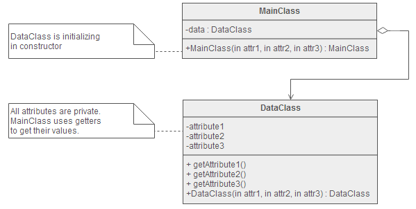

**索引**

-   意图

-   结构

-   参与者

-   适用性

-   效果

-   实现

    -   实现方式（一）：实现对初始化数据的封装。

**意图**

封装类的初始化数据，控制对类的属性的更改，并保持类数据与使用数据的方法间的隔离。

Encapsulate class data initialization, control write access to class attributes
and separate data from methods that use it.

**结构**

**参与者**

MainClass

-   根据构造函数参数列表构造 DataClass 类的实例。

DataClass

-   封装数据。

**适用性**

当以下情况成立时可以使用 Private Class Data 模式：

-   类的初始化数据是一次性的不可修改的数据。

-   需要控制对类的初始化数据的更改。

-   预防对初始化数据的不必要的更改。

**效果**

-   减少类对外暴露的属性。

-   从类中移除了对数据的写权限。

**实现**

**实现方式（一）：实现对初始化数据的封装。**

复制代码

1 namespace PrivateClassDataPattern.Implementation1 2 { 3 public class
CircleData 4 { 5 public CircleData(double radius, Color color, Point origin) 6 {
7 this.Radius = radius; 8 this.Color = color; 9 this.Origin = origin;10 } 11 12
public double Radius { get; private set; }13 public Color Color { get; private
set; }14 public Point Origin { get; private set; }15 } 16 17 public class Circle
18 { 19 private CircleData \_circleData; 20 21 public Circle(double radius,
Color color, Point origin) 22 { 23 \_circleData = new CircleData(radius, color,
origin); 24 } 25 26 public double Circumference 27 { 28 get { return 2 \*
Math.PI \* \_circleData.Radius; } 29 } 30 31 public double Diameter 32 { 33 get
{ return 2 \* \_circleData.Radius; } 34 } 35 36 public void Draw(Graphics
graphics) 37 { 38 } 39 } 40 }
