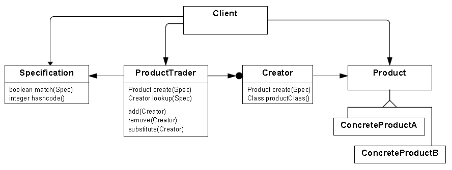
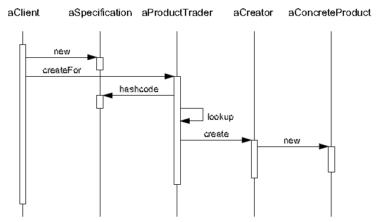

设计模式之美：Product Trader（操盘手）

**索引**

-   意图

-   结构

-   参与者

-   适用性

-   效果

-   相关模式

-   实现

-   实现方式（一）：Product Trader 的示例实现。

**意图**

使客户程序可以通过命名抽象超类和给定规约来创建对象。

Product Trader 让客户程序与 Product
类解耦，从而使得类的层级结构、框架和应用程序易于改写、配置和演进。

Let clients create objects by naming an abstract superclass and by providing a
specification.

A Product Trader decouples the client from the product and thereby eases the
adaption, configuration and evolution of class hierarchies, frameworks and
applications.

**结构**

**参与者**

Client

-   为 ConcreteProduct 类创建 Specification。

-   为 Product Trader 提供 Specification 以初始话构建过程。

Product

-   定义类层次的接口。

ConcreteProduct

-   Product 抽象类的具体类。

-   提供足够的信息以判定是否满足 Specification。

ProductTrader

-   从 Client 接收一个 ConcreteProduct 对应的 Specification。

-   映射 Specification 和 Creator。

-   提供映射配置机制。

-   调用 Creator 以生成符合 Specification 的 ConcreteProduct。

Creator

-   定义创建 ConcreteProduct 实例的接口。

-   知道如何根据 Specification 创建合适的 ConcreteProduct。

Specification

-   一个 Specification 代表着一个 ConcreteProduct 类。

-   作为映射和查询 Creator 的条件参数。

**适用性**

当以下情况成立时可以使用 Product Trader 模式：

-   当你想让客户程序完全独立于 Product 实体类的实现时。

-   你需要在运行时根据可用的规约条件动态的生成 Product 对象时。

-   你需要为给定的规约条件配置相应的 Product 类对象。

-   你需要在不影响客户代码的条件下修改和演进 Product 类的层次。

**效果**

-   Client 程序完全独立于 ConcreteProduct 类层次。

-   可以在运行时决定 Product 的具体类。

-   可以根据特定的领域对 Product 进行配置。

-   Product 类层次更易于演进。

-   衍生新的 ConcreteProduct 更加方便。

-   Product 类可以是负责的组件。

**相关模式**

-   可以尝试在 Factory Method 模式无法工作或不太适合时，尝试使用 Product
    Trader。Factory Method 常使 Product 和 Creator 之间形成循环依赖。

**实现**

**实现方式（一）：Product Trader 的示例实现。**

1 namespace ProductTraderPattern.Implementation1 2 { 3 public class
Specification 4 { 5 public string Criteria { get; set; } 6 7 public bool
IsSatisfiedBy(Product product) 8 { 9 return product.Criteria == this.Criteria;
10 } 11 12 public override int GetHashCode() 13 { 14 return
Criteria.GetHashCode(); 15 } 16 17 public override bool Equals(object obj) 18 {
19 return GetHashCode().Equals(obj.GetHashCode()); 20 } 21 } 22 23 public
abstract class Product 24 { 25 public abstract string Criteria { get; } 26 } 27
28 public class ConcreteProductA : Product 29 { 30 public override string
Criteria 31 { 32 get 33 { 34 return "SpecForConreteProductA"; 35 } 36 } 37 } 38
39 public class ConcreteProductB : Product 40 { 41 public override string
Criteria 42 { 43 get 44 { 45 return "SpecForConreteProductB"; 46 } 47 } 48 } 49
50 public abstract class ProductCreator 51 { 52 public abstract Product
Create(Specification spec); 53 } 54 55 public class ConcreteProductCreator :
ProductCreator 56 { 57 public override Product Create(Specification spec) 58 {
59 if (spec.Criteria == "SpecForConreteProductA") 60 { 61 return new
ConcreteProductA(); 62 } 63 else if (spec.Criteria == "SpecForConreteProductB")
64 { 65 return new ConcreteProductB(); 66 } 67 68 // any factory you can use
here 69 throw new NotSupportedException(); 70 } 71 } 72 73 public class
ProductTrader 74 { 75 private Dictionary\<Specification, ProductCreator\> \_dict
76 = new Dictionary\<Specification, ProductCreator\>(); 77 78 public Product
CreateFor(Specification spec) 79 { 80 ProductCreator creator =
LookupCreator(spec); 81 Product product = creator.Create(spec); 82 return
product; 83 } 84 85 public ProductCreator LookupCreator(Specification spec) 86 {
87 return \_dict[spec]; 88 } 89 90 public void AddCreator(Specification spec,
ProductCreator creator) 91 { 92 \_dict.Add(spec, creator); 93 } 94 95 public
void RemoveCreator(Specification spec, ProductCreator creator) 96 { 97
\_dict.Remove(spec); 98 } 99 100 public void SubstituteCreator(Specification
spec, ProductCreator creator) 101 { 102 \_dict[spec] = creator; 103 } 104 } 105
106 public class Client 107 { 108 public void TestCase1() 109 { 110
Specification spec1 = new Specification(); 111 spec1.Criteria =
"SpecForConreteProductA";112 113 Specification spec2 = new Specification(); 114
spec2.Criteria = "SpecForConreteProductA";115 116 ProductCreator creator = new
ConcreteProductCreator(); 117 118 ProductTrader trader = new ProductTrader();
119 trader.AddCreator(spec1, creator); 120 trader.AddCreator(spec2, creator);
121 122 Specification spec3 = new Specification(); 123 spec3.Criteria =
"SpecForConreteProductA";124 125 Product product = trader.CreateFor(spec3); 126
} 127 } 128 }
